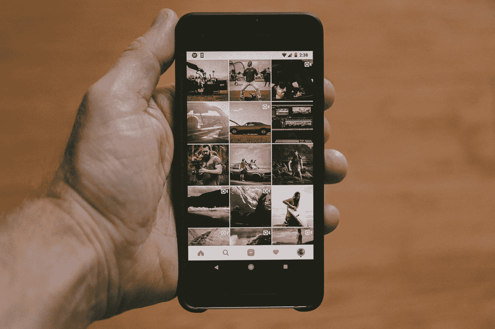

# 社交媒体:Instagram 广告的吸引力

> 原文：<https://medium.com/swlh/social-media-the-appeal-of-instagram-ads-3e5f5150d7c6>

*社交媒体是* [*发现并吸引*](http://try.alexa.com/marketing-stack/seo-tools/) *目标人群的一种可靠方式。*

Photo by [Jakob Owens](https://unsplash.com/photos/R-8Kkjaztn0?utm_source=unsplash&utm_medium=referral&utm_content=creditCopyText) on [Unsplash](https://unsplash.com/search/photos/instagram?utm_source=unsplash&utm_medium=referral&utm_content=creditCopyText)

社交媒体的本质是将有相似兴趣的人群聚集在一起，这对于试图找到并向他们知道会接受其产品或服务的受众销售产品的公司来说是天赐良机。