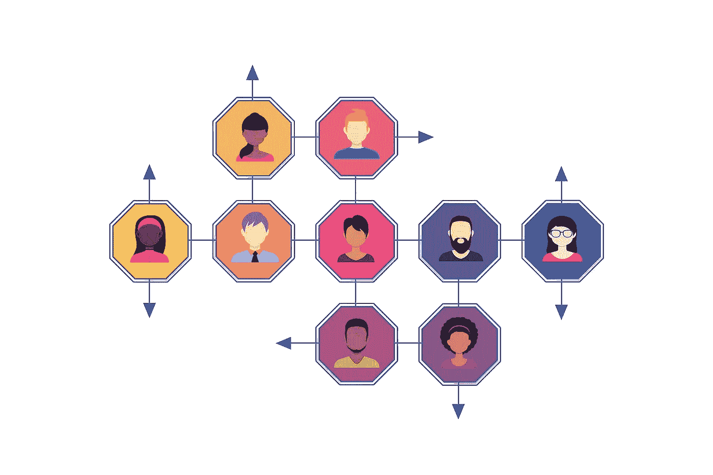

# 社会网络理论——理解创新项目的文献综述

> 原文：<https://medium.com/swlh/social-network-theory-a-literature-review-for-understanding-innovation-programs-7f1c214e9a77>

一篇关于社会网络理论主要主题的文献综述，为一篇关于社会网络理论和创业加速器的更广泛的博士论文而写。这个版本改编自为博士论文准备的文本，用于更一般的阅读。

这篇综述提供了关于社会网络理论的主要文献的概述。目的是介绍一些关键的概念，这些概念可以用来理解像加速器这样的创新项目的社会方面。

这篇综述并不旨在涵盖社交网络理论的每个部分，社交网络理论是一个庞大的学科，其重点是理解围绕创新计划建立的社交网络中影响信任、价值和知识转移的动态。

这篇关于社会网络理论的文献综述占了博士论文总综述的一半，因此它并不打算是关于这个主题的工作的详尽综述。它没有涵盖很多内容，而且它所关注的许多内容相对于其应得的关注而言都得到了简要的阐述，并将在专门讨论该主题的著作中得到体现。

如果需要的话，参考书目和参考资料可以用来超越这篇综述的狭窄焦点，进一步阅读社会网络理论。

# 1.社交网络

社会网络理论是一个大而成熟的话题，不能在这篇综述中完全涵盖。具体来说，下面讨论的 Granovetter、Burt 和 Coleman 的作品本身形成了大量的作品，并产生了更多的二次研究和分析。这篇综述将仍然限于介绍他们的核心理论，并解决一些次要的研究，以便让读者对社会网络理论有一个总体的介绍性理解，特别是对理解创新规划有影响的方面。

# 什么是社交网络？

Borgatti & Halgin (2011)观察到,“社交网络”一词已经发展到可以指从私人俱乐部到网站的任何东西，因此可能会导致一些混淆。他们将网络描述为“一组参与者或节点，以及一组特定类型的纽带……将它们连接起来。”这些纽带通过共享点连接到本身不直接链接的链接节点，这些节点是网络中的个体或行动者。与群体不同，网络没有自然边界，也不需要内部连接。随着时间的推移，网络中这些不相连的部分可以连接起来，这意味着网络是流动的，不断变化的。

# 六度，或者小世界理论

Travers 和 Milgram (1969)对社交网络的早期研究着眼于个体之间的路径长度，以及任意两个随机选择的个体相互认识的概率问题，或者在一个人链中有多少熟人可能将他们联系起来。他们继续更具体地研究由美国人组成的集群，该集群有大约 2 亿个节点，通过复杂的网络相互连接。他们假设每个人都应该通过至少一条不同长度或路径的链相互连接。

他们开始探索这一假设，试图理解任何两个给定的人之间可能的平均值和中间数。这就是著名的“六度”实验。他们让人们把写给某个人的文件传给他们认为可能与这个人更亲近的人，然后计算文件到达这个人的步骤。在评估链长度的第一个实验中，29%(296 个初始文档中的 64 个)到达了预期的人。该文件采取的平均步骤数为 5.4。

六度分离也被称为小世界现象，它描述了每个人都通过六度或更少的分离与其他人联系在一起的想法。塞巴斯蒂安·施耐特勒(Sebastian Schnettler，2009)研究了这一主题的大量工作，他追溯了从 1958 年到 2009 年的最初研究。他确定了小世界理论的三个维度；结构维度、过程维度、心理维度。

Schnettler 解释说，结构方面着眼于有多少对人是由第三个人联系在一起的，有多少对人是由 2、3、4 或更多人组成的链条联系在一起的。这一过程着眼于社会网络中的这些联系可以引发什么样的行动，以及什么形式的信息沿着链条传递；以及不同链长的功效。这着眼于网络在交流思想、创新、信息中的作用，以及不同类型和距离的关系在实现这一点中的作用。这一领域的工作探索了人们对自己的网络和更广泛的社会结构的理解，以及他们如何通过这些网络进行操纵。

Schnettler 观察到，从大型社会集群渲染小世界几乎不需要什么；只有几个人脉很广的人在网络上创造捷径。这些人被称为弱关系的桥梁，他们在更广泛的生态系统中连接子集群。

# 弱关系的力量

进一步推进小世界理论，马克·格兰诺维特在《弱联系的强度》中把网络中的连接类型，特别是那些用于跨网络传播的连接类型描述为弱联系和强联系。他将弱联系定义为比强联系或亲密朋友更不可能“社交”的联系。因此，他观察到一个熟人网络，或弱关系，将是一个低密度的网络，许多潜在的关系尚未建立。然而，一个由亲密朋友组成的紧密关系网络很可能是高度关联的，大多数人都认识对方。格拉诺维特(1973)的早期研究表明，人们更可能通过熟人(弱关系)而不是通过密友(强关系)听到新的工作机会，因为熟人更可能知道演员或他们的密友还不知道的信息。

弱联系理论是在寻找工作方面发展起来的，但在更广泛的社会网络理论中，它也描述了疾病的传播、思想的扩散和物种的进化，因此它在有机结构中无处不在(Borgatti & Halgin 2011)。

格拉诺维特探索的现实世界的对等物是一个人的概念，A，他有一个非常强大的亲密朋友网络，他们中的大多数人都和 A 一样了解对方。同时，B 有一个相当强大的亲密朋友网络。在这两个网络中，有很多重复，很少有新意。A 知道并与几个朋友分享的东西在她的网络中迅速传播，因为每个人都认识每个人。信息呈指数级传播，因为 A 对 3 个人说的话被他们分别对 3 个人说，然后又对 3 个人说。由于大多数人都有联系，信息很快就变得多余，因为每个人都已经听到了。这同样适用于 B 的网络。

当 A 和 B 相遇时，他们不仅创造了分享各自所知(无论是知识、技能还是渠道)的价值，还在两个更大但封闭的网络之间架起了一座桥梁。a 和 B 是弱关系；熟人之间很少重复他们的网络和知识(格拉诺维特 2012)，他们有潜力带来新的想法，信息，和人到自己的网络。通过这样做，他们对他人有价值，通过连接这两个网络，他们创造价值(Borgatti & Halgin 2011)。

Granovetter (1973 年，1983 年，2012 年)认为，如果人们没有弱关系网络，没有自己的亲密朋友和家人的强关系网络，他们在社会上处于不利地位。这些人无法获得他们直接网络之外的信息和知识，这可能会影响他们听到工作机会的能力(Granovetter，1973)。当应用于创新时，这意味着它们与需要解决方案的问题、问题的解决方案和机会的信息相隔离(Granovetter 2012)。

# 结构孔

Ronald Burt (1992)发展了 Granovetter 关于“弱联系强度”的原始理论(1973，1983 ),认为弱联系的真正价值在于它们在网络之间架起桥梁，从而成为这些网络之间知识、信息和价值的渠道。在 Burt 所谓的“结构性漏洞”之间架起桥梁的个人，其社会行为方式就像是在两个交易社区之间架起一座横跨河流的桥梁，因此为社区创造价值，也为他们自己创造价值。

Burt (2004)开始探索“经纪业如何提供社会资本”总结这一理论，他写道:

> “群体内部的观点和行为比群体之间的观点和行为更相似，因此跨群体联系的人更熟悉不同的思维和行为方式。跨越群体间结构性漏洞的经纪行为提供了一种以其他方式看不见的选项愿景，这是经纪行为成为社会资本的机制。”

他的研究考察了美国一家大型电子公司经理的社交网络，并得出结论，那些弥合公司网络中“结构性漏洞”的人更有可能成功，无论是在晋升和奖励方面，还是在让想法被接受而不是被驳回方面。他的假设是，站在社会网络结构漏洞附近并弥合这些漏洞的人更有可能有好想法，并从中受益，因为他们接触到不同的思维方式，因此具有更大的影响力。

考虑到 Granovetter (1973 年)，Burt (2004 年)认为，在强关系网络中，想法更加同质，因此具有弱关系并连接到其他网络的人将获得更多可变选项(不同的想法和行为)，从而综合新的想法。

Granovetter (2012)进一步解释说，两个人之间的联系越紧密，他们的社交网络就会有越多的重叠。检验这一理论，Friedkin (1980)得出结论，网络之间的本地桥梁往往是通过弱联系的人，因为强联系“鼓励三元闭合”，这意味着两个强联系的人更有可能已经知道他们的相互联系——如果 A 知道 C，B 知道 C，那么 A 和 B 也更有可能通过 C 认识彼此。

Granovetter (2012)由此得出结论，他关于弱联系重要性的论点并不意味着所有弱联系都是有价值的，只有那些充当强联系网络之间桥梁的弱联系才具有特殊价值。许多弱关系可能不会成为桥梁，因此在这种情况下没有价值，但是他断言强关系不太可能成为桥梁，大多数桥梁将是弱关系。

Borgatti & Halgin (2011)得出结论，这一概念假设，如果桥是新信息的来源，并且只有弱关系桥，那么弱关系是获得新信息的最佳途径。

Borgatti 和 Halgin 继续探索 Burt 的结构洞理论和 Granovetter 的弱关系强度理论。在结构洞理论中，他们观察到关注的焦点是个人以及他们如何与网络中的其他人联系。如果一个人连接到其他人，而这些人本身都是相互连接的，那么这些个人中的任何一个都不太可能参与还没有与网络中的其他人共享的任何新信息。然而，如果一个人连接到网络中不同的和分离的集群，那么该人将暴露于网络中其他人不可用的非冗余信息。

他们由此得出结论，获得新的、非冗余的信息使个人在更广泛的网络中更有价值，并且更有可能基于这些非冗余信息的融合和新颖使用提出好的想法。Burt (2004)将网络中有多个结构洞的人称为非冗余关系，而 Granovetter (2012)将此描述为拥有更多桥梁的人，并认为他们将被定义为弱关系。Burt 认为纽带的强度反映了非冗余的程度，随着时间的推移，一旦建立了桥梁，非冗余就会随着信息的流动而“衰减”，纽带变得更强，冗余也更多(Borgatti & Halgin 2011)。

Borgatti & Halgin (2011)将这套理论称为“流动理论”，因为它们依赖于网络的一个基本功能，该功能被描述为信息和价值的管道，通过节点之间的链接和桥梁“流动”。个人之间的信息流动受到他们彼此之间的距离、在网络中的位置以及嵌入性(他们与其他节点有多少相互联系)的影响。这将影响他们接收新奇信息的速度，以及接收的次数(冗余)。

在网络中，Borgatti & Halgin (2011)提到了国家型和事件型社会关系之间的差异。前者是非暂时性的关系类型(家庭、工作场所),可能会随着时间的推移而改变或结束，但在该时间范围内具有连续的状态。事件类型的联系是事务性的和短暂的，是两个联系参与的方式(对话、业务事务)。这些可以用一段时间内的频率、质量和结果来衡量。这两种关系都促进了节点之间的“流动”，这是思想、知识、商品等事物的传递。

Rost (2010)对上述将弱关系作为创新关键的观点提出质疑，认为弱关系没有强关系就没有价值，但强关系没有弱关系就有价值，因为强关系相互支持，并有助于实现弱关系的价值，而弱关系共同缺乏社会凝聚力和信任，无法实现其享有的非冗余信息的价值。因此，罗斯特认为，一个在核心集群中结合了紧密联系和高度封闭性以及大量与其他集群的弱桥接联系的网络是最有创造性的。在此基础上，Adler & Kwon (2002)提出“弱关系有利于成本有效地搜索可编码信息，强关系有利于复杂信息和隐性知识的转移。”

# 角色集的作用

在这种对弱关系和强关系以及人们在网络中的地位的探索中，理解他们互动的方式以及他们在这种情况下有效发挥作用所需要和发展的社交技能是有价值的。Rose Coser (1975)探讨了角色集的概念及其在现代社会个人主义发展中的地位，解释了个人如何需要将自己的行为分段以适应不同的社会情境。这种多样的社会互动形成了加速器的核心部分，这将在本文献综述的第二部分得到证明。

角色集理论探索社会互动的复杂性，取决于时间和地点，人和参与的环境。Coser 用一个医科学生的类比解释了身份和复杂“角色集”的相互作用。“医学生”是一个单一的身份，但相对于其他人来说，它有许多角色；学生对老师，医生对护士，学生对其他学生，医生对病人，以及更广泛的医疗生态系统中的一系列其他角色。

除了“角色集”，还存在“地位集”，即个人与不同地位的人交往，以及“地位序列”，即地位随着时间的推移而变化。这些概念很好地适用于初创公司，更普遍地适用于科技行业，例如，一个人从没有钱的初创公司创始人，到获得资助的初创公司创始人，被出售的初创公司，以及潜在的投资者的社会旅程。这一旅程可能会很快发生，因此角色集和状态集也会迅速变化(状态序列)。

在总结从马克思到默顿的大量社会学工作，并将其与格兰诺维特关于弱关系和强关系的工作进行比较时，科斯提到了他的短语“强关系的弱点”。她认为，在封闭的社区中，人们拥有丰富的强关系，缺乏弱关系，不会接触到许多在社会上或地位上与自己不同的人。这些是“简单”角色集和地位集的网络，几乎没有变化。这种多样性的缺乏不会产生具有社会挑战性的情况，在这种情况下，个人可以学习应对这些社会挑战的社会技能。这些经验教训对于在复杂的社会网络中周旋至关重要，尤其是在沟通身份和角色方面。

Coser (1975)观察到，当“狭隘的”一词被用来描述某人有限的思维或对思想的理解时，它是一种地理或社会分类，属于来自简单或农村社会背景的人。人们正在将智力限制与一个人缺乏更广泛的社会网络联系起来，从而导致他们有限地接触不同的、具有挑战性世界观的人。她认为，与相似的人进行普通、简单的社会互动，比调整自己的想法和应对具有不同、挑战和冲突观点的不同人群需要更少的智力努力。

Coser 文本中的一个特殊部分值得在这里引用，因为它很好地描述了当我们在加速器中指导初创公司或发展我们所谓的“社交技能”时会发生什么

> “在复杂的角色设定中，个人更容易面临不一致的期望。在这种情况下，他们需要考虑与其身份地位相关的适当行动方针。他们必须决定是严格遵守规则，还是重新解释甚至违抗规则，并根据自己的行动目的和他人的目的来权衡每个决定。这需要创新，有时是以违反习俗和等级模式的形式……这也迫使一定程度的灵活性，因为分歧是通过谈判和妥协，通过迫使每个参与者考虑到其他人的优势的社会过程来“解决的”(罗斯·科瑟 1975)

Coser 继续指出，在社交网络中，下属或社会地位低的人被期望遵守行为和社会规范。一个允许灵活性而非一致性的社会结构更加复杂，它要求个人考虑更多来自不同角色和地位的期望和反应的变量。

Coser 解释了这是如何扩展到语言使用中的，因为对自我和他人的区别的理解导致了一种认识，即需要更复杂的语言来解释思想。她认为，当我们意识到人们与我们不同时，我们必须更小心地使用语言来准确表达自己，当这适用于不同的人群时，就有进一步的压力使语言更加清晰。

她表示，这种“认知灵活性”是一种从他人的角度看待事物的能力，这种能力是建立在长期接触各种各样的人的基础上的。被困在一个密集、牢固的关系网中会抑制认知灵活性的发展。

这导致 Coser 观察到，多元化社会中的复杂社会化需要并发展想象他人视角的能力，以适应适当参与的方式，并处理这些不同方法和想法造成的潜在冲突，同时保持对自己的清晰概念。这是构建、管理复杂社交网络并从中受益的必要技能，因此是加速器的重要因素。

# 2.社会资本

本节将研究什么是社会资本，它如何在社会网络中表现出来，特别是它如何导致更高水平的信任，以及它如何影响特定社会网络结构的价值及其行为。林(1999)认为，社会资本是指个体或群体在社会网络中通过互动所获得的收益。这种资本不是经济资本或人力资本，因此作为社会网络的一部分被称为社会资本。

# 社会资本的定义

“社会资本”的含义和影响没有明确界定(Portes 2000)。因此，存在各种各样的定义，或试图界定社会资本，但对社会资本的概念没有明确的共识(bjrnskov 和 nderskov，2012 年)。

科尔曼(1988)描述了三种资本形式的相互关系。物质资本是通过将材料改造成工具来创造的，这些工具可以用来生产东西，从而创造价值。人力资本是通过教育和培训使一个人适应新的环境而创造出来的，让他们掌握新的技能和能力，以新的方式行动，从而创造价值。因此，作为这一逻辑的延伸，社会资本是人们之间关系的变化使他们能够以新的方式行动并创造价值的地方。它不如有形资本或人力资本有形，因为价值存在于人与人之间的关系中。正如物质资本和人力资本一样，社会资本有助于价值的创造，因为一个有更大信任的网络能够实现更多。

社会资本的概念有许多不同的和相关的定义和方面，其中一些概述如下，以说明关于这一主题的各种思想:

林(1999)认为“社会资本是从社会网络中嵌入的资源中获取的”，而社会资本是“对社会关系的投资，具有预期的回报”他进一步(2001)将“资本”定义为“在市场上有预期回报的资源投资。”这一理论在社会资本的背景下得到扩展，描述为“资本在社会关系中被俘获。”

科尔曼(1988)认为，社会资本的一个独特特征是，创造社会资本的人通常只获得其利益的一小部分，这导致了社会资本投资不足，因为回报显然很低。

bjrnskov 和 snderskov(2012)认为，社会资本具有潜在价值，因为它为个人提供了在其社会网络中获取信息和资源的机会。

Adler & Kwon (2002)认为，社会资本是行动者因其在社会网络中的位置而获得的资源。这可以包括市场关系、等级关系、社会关系。他们进一步讨论了社会资本实际上是否是一种资本形式，认为它是一种“长期资产”，可以通过对未来利益的预期来开发。因此，它具有并持有可以消费的价值。通过投资建立与其他网络的联系，个人和团体可以增加他们获得知识、思想、权力、资源和其他优势的机会。通过投资发展更强有力的内部关系，各集团可以提高合作创造价值的能力。

Audretsch，Aldridge 和 Sanders (2011)将社会资本定义为“个人或群体可获得的”善意，这种善意来自它给予行为者的“影响和团结”。对他们来说，社会资本存在于社会结构中，是一种可以投资的长期资产。它需要管理和维护，可以代替其他形式的资本使用。

Orlowski & Wicker (2015)指出，社会资本提高了物质和人力资本的投资回报，是一个多方面的概念。它包括作为核心要素的人(他们的网络)的连通性和信任。这种处于社会资本核心的信任可以分解为人际信任、机构信任和可信赖性。“社会资本”是指社会组织的特征，如信任、规范和网络，它们可以通过促进协调行动来提高社会效率

Davidsson & Benson (2003)观察到人力资本理论如何表明知识使人们能够更好地识别和利用新的机会，但他们对此提出质疑，认为以正规教育形式积累更多的人力资本可能会使人更加厌恶风险。他们认为，移民更多参与创业活动的一个原因是，他们的人力资本——正规教育——在新环境中没有得到同等认可，因此他们被鼓励承担更多风险。他们认为，社会资本为新生企业家提供了一个“更广阔的参考框架”,让他们可以从中开发新的想法，并有更大的能力从他们的社会网络中获取利益。

这些定义可以解释为表明社会资本存在于网络中，是网络内部和网络之间行为者相互作用的结果。它与信任紧密相连，可以反映在影响力和权力上。社会资本形成了对网络投资的回报，或网络中嵌入的资源的实现。社会资本是网络中使用的货币，是维系网络并使其有效运行的纽带。

# 信任和社会资本

信任是组织内部社会资本中的一个重要因素，它导致个体之间更大的支持与合作(Yeng，Tseng，& Wang 2015)。

科尔曼(1988)探讨了不同类型的社会结构如何以社会资本的形式促进信任。网络中“封闭”的概念定义了所有参与者在哪里相互连接。如果 A 与 B 相连，并且分别与 C 相连，那么 A 可以无视与 B 相关的规范，而 C 不会发现。如果 B 和 C 也有关联，那么 A 现在会因为伤害了 B 和 C 中的任何一个而受到 B 和 C 的制裁，因此更有可能遵守这三者都采用的规范。网络中的这种闭合称为三元闭合。

在这方面，科尔曼确定了三种形式的社会资本。义务和期望取决于社交网络中的可信度；社交网络促进信息流动的能力；以及规范和对违反这些规范的制裁。

他在新兴经济体循环信用协会的背景下讨论了这一点，在这种情况下，集团成员之间的高度“可信度”使他们能够将资金分组，并借给集团中的个人。封闭的社会结构，或者说三分封闭，很难携款潜逃；行为规范和有效的制裁，以及违反这些规范的任何人在网络中的可见性，意味着该系统运行良好，因此具有强大的社会资本。

科尔曼(1988，1990)进一步认为，社会资本在封闭的网络中得到加强，在这种网络中，规范得到理解，奖励和惩罚的社会机制到位。这导致了更大的信任。因此，在这种情况下，社会资本在不太统一的网络中更弱，因为违反规范的行为更有可能不被注意到，或者不受惩罚。科尔曼的方法将社会资本视为人们之间的关系，这种关系为其他人的行为积累了“信用单”。实际上，这是“做好事”，并期望得到回报。一个人需要信任才能相信有人会回报这样的恩惠(Rost 2010)。

Coleman (1988)将 grano vetter(1985)关于嵌入的观点解释为给予经济学家的功利主义观点一个社会方面，认为社会结构不仅仅是为单一的经济功能而形成的，还考虑了过去和未来的互动，导致信任、亲密和其他参与回报，这反过来可能影响社会网络的纯经济功能。因此，他将社会资本定义为由社会结构的某些方面组成，促进该社会结构中的行动者(无论是个人还是公司)的行动。社会资本作为一种资本形式是独特的，因为它完全存在于社会结构中，存在于网络中的行动者之间。

# 社会资本的桥梁和纽带

在这种情况下，Adler & Kwon (2002)认为,“桥接”形式的社会资本是指行动者核心网络之外的关系，或他们的外部关系，而“联结”形式的社会资本是指一个群体内的内部联系。因此，“社会资本”可以指一个行动者与其他行动者或网络之间的桥梁联系的价值。它同样可以指维系社区、社会、网络或团体的信任。

Adler & Kwon (2002)讨论了 Burt(他将社会资本定义为驻留在结构洞的桥接中)和 Coleman(他将社会资本定义为驻留在网络闭合中)的方法之间的差异，Adler & Kwon 得出结论，网络闭合和结构洞都可以根据环境创造价值，特别是行动者希望实现的目标。

Rost (2010)得出结论，Burt 和 Coleman 对社会资本的不同观点是相辅相成的，这表明将强网络联系与弱网络架构相结合的个人会产生最具创新性的解决方案。她接着指出，科尔曼和伯特对网络，尤其是对社会资本的看法不同，一个着眼于网络中个人的关系，另一个着眼于个人的位置和网络的结构。

在这种理解下，罗斯特认为强关系导致创新，因为它们成为知识识别和创新思想实现的社会机制。当这些强联系与弱网络体系结构相结合时，弱网络体系结构可以访问一些结构漏洞和足够的外围网络位置，因此可以访问桥接弱联系，这增加了信息流的好处，以及访问知识和想法。她总结道，那些拥有牢固关系、嵌入脆弱网络架构的人最有可能既有创新想法，又能够实现它们。

Granovetter (2005)通过解释社会网络导致经济结果的三个主要原因证实了这一点。首先，他认为社交网络既影响信息的流动，也影响网络中的信任，这种信任允许人们验证或限定信息。其次，他指出了社交网络在放大网络内互动和行为的奖励或惩罚方面的作用。第三，他认为信任产生于网络内部，并将“信任”定义为一种信念，即其他人的行为方式可能与其眼前的最佳利益相反，但符合网络中其他参与者的利益。

# 社会资本的价值

Orlowski & Wicker (2015)指出，定义社会资本的货币价值很困难，因为它没有公认的货币交换价值，而且通常是无形的。Audretsch 等人(2011 年)还认为，社会资本不能像其他形式的资本一样进行衡量或量化，因为它存在于关系中，所以不能由单一行为者拥有。

Adler & Kwon (2002)认为，社会资本的一个关键好处是信息，以及信息的质量、相关性和新鲜度。其他好处包括影响力、控制力和权力。这第二组好处既可以体现在那些受到多重恩惠的人身上，也可以体现在那些为了自己或他们选择支持的人的利益而影响周围人的人身上。社会资本的另一个好处可以从弥补结构漏洞的人身上看到，这样做可以发挥力量，因为他们可以选择从他们建造的桥梁中受益的人。这些形式的权力可以让集体受益，让他们更有效地“完成任务”，从而为集体创造价值。

Adler & Kwon 同意社会资本可以转化为其他形式的资本，例如利用一个人在社会网络中的地位来获得经济资本。他们观察到，经济资本最具流动性，因此最容易转化为人力资本或社会资本(例如，支付教育费用或为某人购买午餐)，而社会资本流动性最差，最难转化。没有一种简单的机制可以将社会资本转化为其他形式的资本，就像金融资本可以用来支付某些东西一样。

然而，他们认为社会资本可以作为其他形式资本的替代或补充。例如，强大的网络可以用来更快地联系人们，节省时间和金钱，并可以用来筹集金融资本，或将产品推向市场。以信任形式存在的社会资本也会影响受风险影响的事物的成本，如贷款，因为使用社会资本可以更容易地评估风险，这提供了获得关于个人或机会的更深入和更广泛的知识的能力，从而评估其风险。

Granovetter (2005)参考了 Lin (2001)对社会资本的定义，例如，潜在雇主和雇员更喜欢通过网络中的可信参与者了解对方。在这种情况下，社会网络和社会资本比招聘机构更有效，因为它们已经作为一个人更广泛的活动和互动的一部分而存在，而招聘机构将花费时间和金钱来建立这样的网络。

因此，虽然社会资本不能与其他形式的资本直接量化，但它可以转化为经济和人力资本。它也可以累积和“花费”来创造其他形式的资本。然而，社会资本存在于并产生于网络中行动者之间的联系，因此，如果没有网络环境中多个行动者的背景，社会资本就不可能存在。

# 与社会资本相关的风险

虽然社会资本迄今已在其益处的背景下进行了探索，并且作为社会网络的积极结果，它也可能具有风险和潜在的消极结果。

Adler & Kwon (2002)探讨了这些风险，他们认为这些风险主要与在网络中建立和维护社会资本的成本有关，而实现和转换社会资本是困难的。一个简单的风险是不能从投资中获得足够的回报，而且所涉及的工作会分散其他重要活动的注意力，例如赚取经济资本。

Granovetter (2005)提出的一个相关论点是，建立和维持密切的网络关系(强关系)是昂贵的，而维持弱关系更容易和更有效。由于强纽带带来冗余信息，而弱纽带带来非冗余信息，因此构建和维护一个广泛、强大的纽带网络的风险在于成本高且冗余度高。

Adler 和 Kwon 还描述了社会资本过度嵌入网络所带来的风险，这导致缺乏非冗余信息流，以及在群体层面上缺乏新思想，从而导致狭隘主义和惰性。过多的社会资本，以过于强大的网络联系为代表，也可能导致群体内的过度责任感，以及过于亲密的友谊，从而不允许更多的机会主义互动。这最终会导致腐败、阴谋论和群体的其他负面行为，过度的社会资本会导致对强关系的忠诚优先于有益行为，并超越对更广泛的弱关系群体规范的遵守。他们的结论是，过多的社会资本被视为导致过多的网络封闭，因此社会资本变得过于强大时就有风险。

Adler & Kwon 进一步解释说，具有低内部联结关系和低外部桥接关系的群体将遭受低社会资本，而那些具有高水平内部和外部联系的群体将享有强大的社会资本和相关优势。这种方法表明，社会资本风险存在于高内部联系和低外部联系的网络中，或者高外部联系和低内部联系的网络中。

他们认为，高内部链接和低外部链接的网络存在被孤立的风险，并倾向于不接收冲突的信息来源，再加上鼓励人们“循规蹈矩”而不是挑战负面行为的规范。这造成了信息泡沫、阴谋和腐败的趋势。外部联系多而内部联系少的网络面临着获得新的和相互冲突的思想的强大渠道的风险，因此具有创新的潜力，但没有内部社会资本来提供采取行动所需的信任和合作。

Adler & Kwon 的结论是，这种分析还取决于这些网络中关系的内容，其中所描述的两种趋势可能导致好或坏的结果，这取决于内部或外部关系中传播的信息以及潜在的文化。孤立的网络可以产生一种向下的力量，虚假的信息和想法不会受到挑战，从而形成一种消极的螺旋，或者它们最终可以创造一个稳定的社交平台，群体成员可以从这个平台接触到其他网络。

# 3.社交网络的行为

对社会网络结构的描述与对社会资本的理解相结合，使得对社会网络中的行为，包括社会规范，以及如何监管的研究成为可能。

# 规范

社会都有规范。它们是一群有联系的人达成一致的公认的社会规则。它们可能以法律或宪法的形式被编纂成文，但作为不成文的、甚至是潜规则产生并保持下去。规范是社会网络中行为的重要组成部分，说明了它们如何自我调节，并定义了网络中的信任和合作水平或社会资本。如上所述，在节点和三元闭包之间存在多种可能连接的密集网络中，规范更清晰，也更容易实施。信息通过这样的网络传播得更快，因此奖励和制裁，特别是在声誉方面，传播得更快更广。规范受到监督。符合规范的个人会得到网络的奖励，违背规范的个人会受到制裁。奖励和制裁的具体形式因社会或网络而异(Granovetter 2005)。

# 合作和互惠

Fowler & Christakis (2008)研究了思想和情感通过社交网络的传播。他们使用弗雷明汉心脏研究的数据，这是一项为期 20 年的纵向社会研究，旨在探索快乐是如何在社交网络中传播的。他们得出结论，幸福通过各种关系在网络中传播，它聚集在群体中，并可以通过网络延伸三度。他们继续展示了其他概念，如抑郁和孤独，也是如何通过社交网络，利用社会关系传播三度的。这为理解合作等概念如何通过网络传播提供了背景。

Harrison，Sciberras & James (2011)专门探讨了社交网络中的合作。他们对人际网络的实验表明，当个人可以预期未来直接或间接的互惠，或者意识到对不合作者的制裁时，合作是最有成效的。网络中的声誉增加了再次合作的机会，因为它增加了未来奖励或制裁的可能性。社会联系，或特定行为者在网络结构中的位置，也影响互动的概率和频率，以及信息的交换。他们发现，如果一个行为者在网络中有很高的关系，那么与他们合作更有可能得到回报，否则会受到制裁。

在他们的实验中，他们试图测试人类社会网络中的合作投资，方法是让个人执行对参与者有明显身体成本，但对网络中的另一个参与者有利的任务。他们发现，网络中的社会接近增加了合作投资，一些个体愿意为他们紧密的社会关系付出更多的努力，而不是为他们自己或他们紧密的基因关系。他们得出结论，这是因为强大的社会关系不同于强大的基因关系，而个人会期望亲戚采取行动支持他们，而非基因关系可能会希望通过过度补偿他们的支持来增加互惠的机会，因为这不是理所当然的。

通过他们的实验，Harrison 等人(2011 年)表明，人类社会网络中的社会邻近性与更简单的动物社会网络中的生物关联性表现相同，更合作的人更有可能聚集在网络中。

# 嵌入性和关系衰减

Granovetter (1985 年)提出，合作和互惠是嵌入社会网络的行为规范，新古典功利主义经济学所考察的行为和制度远非如经济学家所建议的那样是自利的和孤立于社会影响之外的，而是受到正在进行的社会关系的高度影响，因此不能独立于它们而运作。

因此，他将经济学和社会学结合起来，认为大多数行为都根植于网络之中，因此受到社会结果和相互关系的影响。特别是，他认为，从经济学角度来看，诸如努力造福他人这样的行为显然是非理性的，但从社会学角度来看，这种行为是嵌入性的一种功能，因此符合社会规范，并对地位、认可或认可等社会结果做出反应。

Burt (1999)认为，嵌入性也是网络衰退的一个因素，它描述了关系随着时间的推移而减弱和消失的趋势。他进一步观察到(2001 ),衰退的速度受到多种因素的影响，部分原因是人们通过许多第三方间接联系，或高度嵌入。他认为，建立这种亲密关系应该尽早发生，并且应该嵌入到其他类型的社会关系中，例如涉及配偶、朋友和亲戚，而不仅仅是个人，并且应该进入社交活动，而不仅仅是与话题或工作相关的活动。嵌入程度越高，衰减速度越慢。

林(1999)提供了三个进一步的理由，说明为什么嵌入社会网络的资源会产生价值。首先，它们提供了获取信息流的途径。在一个不完善的市场中，一个人在网络中的地位可以增加他们对信息的获取，而这些信息对其他人来说并不容易或很快就能获得，因此给了他们优势。其次，在社会网络中的地位可以给个人带来某种程度的权力或影响。这可能关系到其他人的决策，或者这种影响为参与者或其合作者创造更大价值的任何其他结果。第三，林指出一个演员在网络中的地位，以及他们与他人的关系如何能够使他们在他人眼中获得社会证书。这种价值来自社会网络中行动者之间的互动，因此是他们的社会资本。

# 链接互易性

到目前为止，文献已经研究了社会资本和合作之间的相互关系，表明互惠是社会网络和社会资本中的一个关键因素。Rand、Arbesman 和 Christakis (2011)认为，在进化博弈论中，互惠通常在两个参与者之间发生的背景下进行检验。在这种情况下，一个行动者可以通过合作或不基于他们之前的行动来回报另一个行动者的行动。他们认为，这一概念在群体中更难探索，但他们认为，在一个动态的社会网络中，“战略关系的形成和解除”不仅允许行为者通过同等的行动对其他人的合作或缺乏合作做出反应，而且还通过该行为者与其网络之间关系的形成或解除做出反应。

因此，如果网络中的某个行为者不合作，与他们的关系就会被解除，将他们排除在群体之外。如果一个行动者确实合作，他们的行为可以得到回报，既有互惠合作，也有在网络中形成社会联系。其结果是网络可以快速更新，可以不断引入合作者，并排除非合作者(Rand et al. 2011)。Harrison 等人(2011)认为，这解释了合作者倾向于作为链接互惠的结果而聚集。

Rand 等人描述了动态网络，在该网络中，根据行为建立和解除联系，可以放大某些行为或态度的聚集，在网络中为建设性行为创造优势。社会网络中的联系是动态的，因为它们是根据人们的行动和行为而建立和终止的，成为制裁或奖励行为的有效手段。因此，链接互惠意味着合作者的网络快速增长，而非合作者的网络相应收缩。因此，链接互惠是动态社会网络中规范被监管的手段。

# 5.概述:社会网络理论

文献综述的第一部分探讨了社会网络理论中的基本概念，并展示了价值如何以社会资本的形式存在于网络中。社会网络的行为受到这些结构的影响，并通过社会资本得到回报。特别是，在链接互惠的支持下，合作者在网络中聚集，这种联系回报了他们进一步的联系，同时驱逐了那些不合作的人，或者那些不好的人。

一个行为者在网络中的嵌入程度影响他们对信息的获取，从而影响他们的权力和影响力。所有这些都是他们从在网络中的地位和行为中获得的社会资本，但当这些利益反映在他们的商业活动中时，可以转化为经济或人力资本。

因此，社会资本可以替代其他形式的资本，因为它可以作为它在社会网络中带来的利益的结果而被转换。因此，它可以用来奖励人们，威胁退出可以用来制裁他们。

在社会网络的结构中，桥接关系提供了获取新信息和思维方式的途径，桥接关系通常是弱关系。然而，牢固的关系使人们能够有效地完成工作，并享有更大的信任，因为他们更有可能随着时间的推移回报帮助。因此，强关系和弱关系的混合创造了理想的社会结构，通过这种结构可以获得新的思想，并根据这些思想创造利益。为了在这个丰富的社会景观中周旋，个人需要复杂的角色和地位集，以便与不同于他们的人交往，并向各种其他行为者表达他们的想法。

# 6.文献学

Adler，P. S .，，Kwon，S. (2002 年)。社会资本:一个新概念的前景。管理学院评论，27(1)，17-40 页。

奥德里奇，D. B .，奥尔德里奇，T. T .，&桑德斯，M. (2011 年)。*社会资本建设与新企业形成*。国际小企业杂志，29(2)，152–169。

bjrnskov，c .和 Sø nderskov，K. M. (2013 年)。*社会资本是个好概念吗？*社会指标研究，114(3)，1225–1242。

Borgatti，S. P .，& Halgin，D. S. (2011 年)。*论网络理论*。组织科学，22，(5)，1168–1181。

D. W .布朗和 a. M .康拉德(2001 年)。格兰诺维特是对的:弱关系对当代求职的重要性。组&组织管理，26(4)，434–462。

伯特，R. S. (2004 年)。*结构洞和好点子*。美国社会学杂志，110(2)，349–399 页。

伯特，R. S. (2001 年)。*结构洞与作为社会资本的网络封闭*。《社会资本:理论与研究》一章的预印本，林楠、卡伦 s .库克和 R. S .伯特编辑。奥尔丁·德·格鲁埃特，2001 年。

伯特，R. S. (2001 年)。*依恋、腐烂、社交网络*。《组织行为杂志》上一篇文章的预印本。

伯特，R. S. (2000 年)。*社会资本的网络结构*。组织行为研究，22，345–423。

伯特，R. S. (1999 年)。*衰变函数*。社交网络的预印文章，22，1–28，(2000)。

伯特，R. S. (2002 年)。*桥梁衰变*。社交网络，24 (4)，333–363

伯特，R. S. (2003 年)。*好想法的社会起源*。工作文件。从 https://doi.org/10.1353/jhi.1997.0041[取回](https://doi.org/10.1353/jhi.1997.0041)

卡乔波，J. T .，福勒，J. H .，&克里斯塔克斯，N. a. (2009)。*人群中的孤独:大型社交网络中孤独的结构和传播*。人格与社会心理学杂志，97(6)，977–991。

北卡罗来纳州克里斯塔基斯和 J. H .福勒(2007 年)。*大型社交网络中吸烟的集体动力*。新英格兰医学杂志，358(21)，2249–58。

戴维森和霍尼格(2003 年)。*社会和人力资本在新生企业家中的作用。*商业风险杂志，18(3)，301–331 页。

Eveleens，C. P .，van rijn pery，F. J .，& Niesten，E. M. M. I. (2016 年)。*基于网络的孵化如何帮助创业绩效:基于管理理论背景的系统综述*。技术转移杂志(42)。

法尔，J. (2004 年)。社会资本:概念史。政治理论，32(1)，6–33 页。

费尔德曼博士和佐勒博士(2012 年)。*交易撮合者就位:区域创业型经济中的社会资本联系*。区域研究，46(1)，23–37 页。

菲什巴克，b .，古尔布兰森，C. a .，谭力，R. E .，米切尔，l .，&波尔齐格，硕士(2007)。寻找商业“偶像”:加速创业的新模式。从 https://doi.org/10.2139/ssrn.1001926[取回](https://doi.org/10.2139/ssrn.1001926)

J. H .福勒和 N. A .克里斯塔克斯(2010 年)。*人类社会网络中的合作行为级联*。美国国家科学院学报，107(12)，5334–5338。

J. H .福勒和 N. A .克里斯塔克斯(2009 年)。*大型社交网络中快乐的动态传播:弗雷明汉心脏研究 20 年来的纵向分析*。英国医学杂志，338，1–13。

弗里德金，N. (1980)。*grano vetter 弱束缚强度理论的结构特征检验。*社交网络，2(4)，411–422 页。

格兰诺维特，M. (1973)。弱连接的强度。美国社会学杂志，78(6)，1360-1380。

格兰诺维特，M. (1985 年)。*经济行为与社会结构:嵌入性的问题。《美国社会学杂志》,第 91 卷第 3 期，第 481-510 页。*

格兰诺维特，M. (1983 年)。弱关系的力量:网络理论再探。社会学理论，1，201–233。

Granovetter，M. (2005)。*社会结构对经济结果的影响*。《经济展望杂志》,第 19 卷第 1 期，第 33-50 页。

哈里森，f .，西伯拉斯，j .，，詹姆斯，R. (2011)。*社会关系的强度预测人类社会网络中的合作投资*。PLoS ONE，6(3)。

莱文和克罗斯(2004 年)。你可以信任的弱关系的强度:信任在有效知识转移中的中介作用。管理科学，50(11)，1477 年至 1490 年。

林，倪(1999)。*构建社会资本的网络理论*。连接，22(1)。

林，倪(2001)。*社会资本:社会结构和行为的理论*。纽约:剑桥大学出版社。

Maurer，I .，& Ebers，M. (2006 年)。*社会资本的动态及其绩效含义:生物技术初创企业的经验教训*。行政科学季刊(第 51 卷)。

约翰·穆勒(1909) *政治经济学原理及其在社会哲学中的一些应用*。朗曼格林公司

Orlowski 和 Wicker，P. (2015 年)。*社会资本的货币价值。*行为和实验经济学杂志，57，26–36。

j .帕塔宁、k .默勒、m .韦斯特伦德、r .拉贾拉和 a .拉贾拉(2008 年)。*科技型中小企业成长中的社会资本*。工业营销管理，37(5)，513–522。

波特斯(2000 年)。*社会资本的两层含义*。社会学论坛，15(1)，1–12。

Rand，D. G .，Arbesman，s .，& Christakis，N. a. (2011)。*动态社交网络促进人类实验中的合作。美国国家科学院学报，108(48)，19193–19198。*

k .罗斯特(2011 年)。*创新创造中的强力纽带*。研究政策，40(4)，588–604 页。

Schnettler，S. (2009 年)。50 年小世界研究的结构化综述。社交网络，31(3)，165–178 页。

斯皮格尔，B. (2017)。*创业生态系统的关系组织*。企业家精神:理论与实践，41(1)，49–72 页。

范多恩，G. S .，&塔博尔斯基，M. (2011 年)。*社会互动网络上广义互惠的演化。*进化，66 卷 3 期，651–664 页。

瓦茨博士(2004 年)。*“新”网络科学*。社会学年度评论，30，243–270 页。

莱特，K. B .，，米勒，C. H. (2010)。*弱关系/强关系支持网络偏好的度量*。通信专论，77(4)，500–517。

严玉凤、曾建峰、王海刚(2015)。*内部社会资本对知识共享的影响。*知识管理研究与实践，13(2)，214–224 页。

郑，徐，钟，杨，曾，王，(2012)。*社交网络中的社会影响力和传播力度。*计算机科学前沿，6(5)，611–620。

## 这篇文章发表在[《创业](https://medium.com/swlh)》上，这是 Medium 最大的创业刊物，有+445，678 人关注。

## 订阅接收[我们的头条新闻](https://growthsupply.com/the-startup-newsletter/)。

