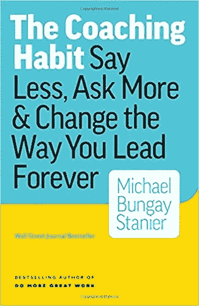

# 现代领导者的苏格拉底管理技巧

> 原文：<https://medium.com/swlh/socratic-management-techniques-for-the-modern-leader-f43d9a50caad>

## 如何让你的团队事半功倍？

我喜欢回答人们的问题。

当有人带着一个我肯定知道答案的问题来找我时，我的自我充满了一种近乎反常的快乐。我的自我所获得的快乐直接与我现在对他人运用的那种无声的力量联系在一起。

现在，你可能会不同意，认为在这个上下文中的单词 *power* 有点牵强，但是如果知识就是力量，并且有人来找我获取所述知识，那么必然是我实际上拥有所有的力量。

这不一定是件坏事。

但是如果你处于某种领导角色，这种简单的权力差异很可能会扼杀你的团队在特殊水平上发挥作用的能力。

为什么？

> 因为被训练去找经理寻求答案的团队无意中被训练成不再自己寻找答案。

从微观的日常层面来看，这没什么大不了的。总会有这样的情况，人们来寻求答案，为了时间和效率，最好只是给他们所需要的。

然而，从宏观的角度来看，这种总是马上给出答案的倾向阻碍了你的团队通过一系列可能性进行批判性思考以得出最合适的行动方案的能力。

成为一名有效的领导者绝不是成为房间里最聪明的人，或者永远知道正确的方法，甚至永远做决定…

不，有效的领导者知道他们的主要职责是帮助周围的人成长和发展技能，这样他们才能实现他们的全部潜力。

有效的领导者相信团队的协同力量。

所有这些都是说，如果你想成为一个有效的领导者，你必须学会如何培养你周围的人。

> 实现这一目标的第一步是教他们如何为自己找到答案。

为了做到这一点，我们要引导一点我们的老朋友，苏格拉底。

## **苏格拉底式教学法**

如果你不熟悉苏格拉底式教学法，这很简单:

> 你问了一堆问题。

苏格拉底式教学法是一种基于提问和回答的合作修辞形式。

> 问题是最好的老师，因为它们能激发批判性思维。

通过将批判性思维应用于一系列假设(或者说得不那么科学:一系列潜在的行动)，我们自信地通过排除过程筛选出选项。

如果你能够引导来找你寻求答案的人穿过大多数计划中固有的潜在自我消除矛盾的迷宫，那么你剩下的无疑是最佳行动方案。

好吧，我用了很多大词把一个相当简单的前提过度复杂化了。

让我再试一次。

> 使用问题从坏的选项中剔除好的选项。

真的就这么简单。

现在，对于那些喜欢行动步骤的人来说，这里有 4 个步骤可以指导你完成这个过程。

但是等等…

在我给你这些行动步骤之前，问问题的快速技巧:

> 问基于“什么”和“如何”的问题，而不是“为什么”。

这发生在潜意识层面，但你的大脑对基于*什么*和*如何*的问题的反应与对*为什么*的反应截然不同。

当你听到，*“你为什么做了这样那样的事？”你的大脑将此解读为威胁。*

这是指控。

总的来说，当我们感觉受到攻击时，我们的大脑会离开批判性思维模式。

在这种情况下，更好的回答是:*“你考虑过其他的选择吗？”*

用*什么*基础问题你个人判断不就行了。从这种压力中释放出来，你更容易进入批判性思维模式，并真正考虑导致你目前困境的一系列事件。

> 如果你想从你的问题中获得最大的收获，用*什么*或*如何*来表达，而不要用*为什么*来表达。

好了，现在我们已经说清楚了，让我们来谈谈在工作中运用苏格拉底式教学法的四个步骤。

## 追根溯源

> “对你来说，这里真正的困难是什么？”

我从 Michael Bungay Stanier 的 [**教练习惯中偷出了这个问题:少说，多问，永远改变你的领导方式**](https://amzn.to/2GDzmdO) 我绝对喜欢这个问题，因为你让其他人做所有的重活。他们挖掘自己的灰质，以找到并明确表达他们和他们想要的结果之间的障碍。

这不仅对他们有好处，对你这个绝对不想浪费时间去解决错误问题的人也有好处。

> 解决错误的问题就像当头顶上还有一根爆裂的水管时，清理浴室地板上的水坑。

治病，不治标。

问*“对你来说，这里真正的困难是什么？”让你离做出正确的诊断更近了一步。*

## 查找选项

> *“有哪些选择？”*

根据问题的不同，其他人可能甚至不知道有什么选择。在这些情况下，苏格拉底式的方法不会让你走得太远。

帮别人一个忙，扔给他们一块骨头。

给出一些选项。

这和给他们答案不一样。

毫无疑问，你可能知道选项 A、B 和 D 完全是有勇无谋的。你可以通过告诉他们“选择 C”来节省时间和精力，但是你拒绝了其他人的学习机会。

这并不是说你让他们失败，让他们开始一场徒劳的追逐。在对话的这一点上，它是关于探索和评估选项的心理练习。权衡利弊，得出最佳的行动方案。

你，栖息在你的智慧之山的顶端，可以引导他们到正确的道路上，但是你决不能把皮带套在他们的脖子上，把他们拽向答案。这是第三步的切入点。

## 3)了解选项

> “过去，我经历过这种情况…”

当在一个人面前教育选择时，就过去对你有用和没用的东西进行指导是有帮助的。

如果你想从这个练习中获得最大的收获，那么在分享了你关于某个话题的经验后，你应该接着问这个人为什么他们认为你会有这样的结果。

例如:*“我曾经尝试过这样那样的方法，结果好坏参半，因为……你认为是什么导致了这样的结果？”*

这种分享和提问的方法有一个好处，那就是提供大量相关的知识，然后其他人可以对其进行批判性的评估。

批判性评估在这里是最重要的。

**有一句名言:要学习，要回忆。**

在这种情况下，你鼓励其他人通过回忆一系列他们实际上并不参与的事件来学习。他们在运用他们的想象力来设计和预测最有可能的结果。

很难夸大这种能力的价值。如果你团队中的每个人都有能力进行这种高水平的情况分析，你将会有一个真正有效的团队。

归根结底，这不就是目标吗？

## 给个推荐，但是让他们选

> “根据你对问题的描述，我可能会尝试……但你可以自由选择对你最有意义的方案。”

该是橡胶上路的时候了。

**有效的领导归结于信任。**

你对你的团队的能力和判断力的信任。以及你的团队对你持续支持的信任。

这是没有办法的。如果你想让你的团队充分发挥他们的能力，你就必须在某个时候让他们跳出窠臼

如果你已经给他们配备了必要的工具来批判性地评估情况并得出合理的解决方案，那么你必须给他们成功的机会…

或者失败。

只有两种错误:判断和执行

其中一个是可以原谅的。另一个不是。

当你筛选了潜在的行动方案，得出了错误的方案时，判断错误就发生了。

当您未能按照预期的行动过程执行时，就会出现执行错误。

判断错误是痛苦的，但在学习过程中是意料之中的。这里重要的部分是:*评估系统是用来得出错误的判断声音的吗？*

如果是的话，你能做什么？有时候你只是简单的弄错了。

另一方面，执行错误源于糟糕的跟进。在 99.9%的情况下，执行错误是完全可以避免的。

要成为一名有效的领导者，你必须相信你的团队有能力运用批判性思维，这种思维会带来有利的结果，并支持他们，即使他们做错了。

如果不支持他们的尝试，他们很快就会因为害怕失败而停止尝试。这对任何团队来说都是一个糟糕的地方。

所以支持你的团队，给他们犯判断错误的自由，同时和他们一起努力消除执行错误。

归根结底，这是培养高效团队的途径。所以停止满足你的自我。不要急于给出答案。

下次有人向你寻求帮助时，坐下来，引导你内心的苏格拉底。

**感谢阅读。如果你喜欢这篇文章，帮我一个忙，拍一下**👏👏👏**最多 50 次！**

你的支持对我来说意味着一切！

[**点击此处参加免费的五个势力范围电子邮件课程！**](http://www.thehyperfocusedmind.com/)

## 这个故事发表在 [The Startup](https://medium.com/swlh) 上，这是 Medium 最大的企业家出版物，拥有 310，796+人。

## 在这里订阅接收[我们的头条新闻](http://growthsupply.com/the-startup-newsletter/)。

