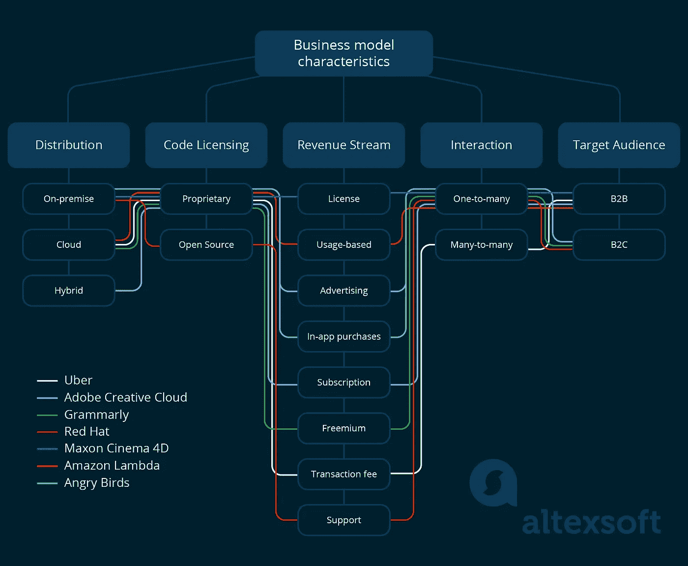
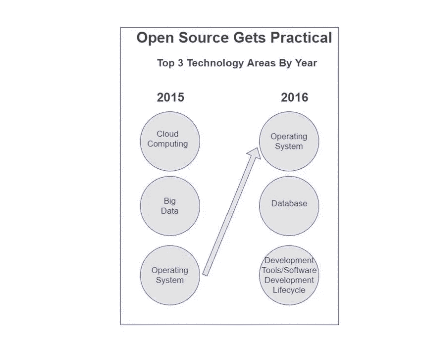
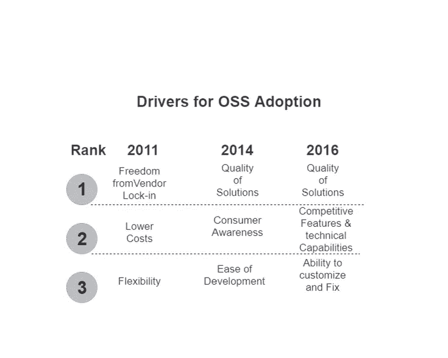
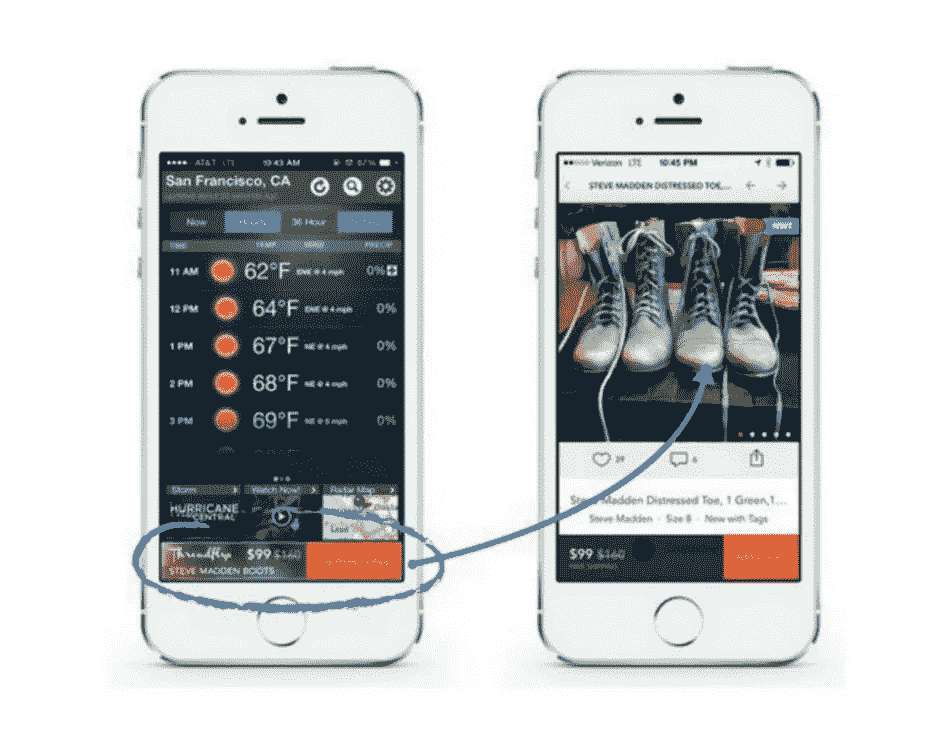
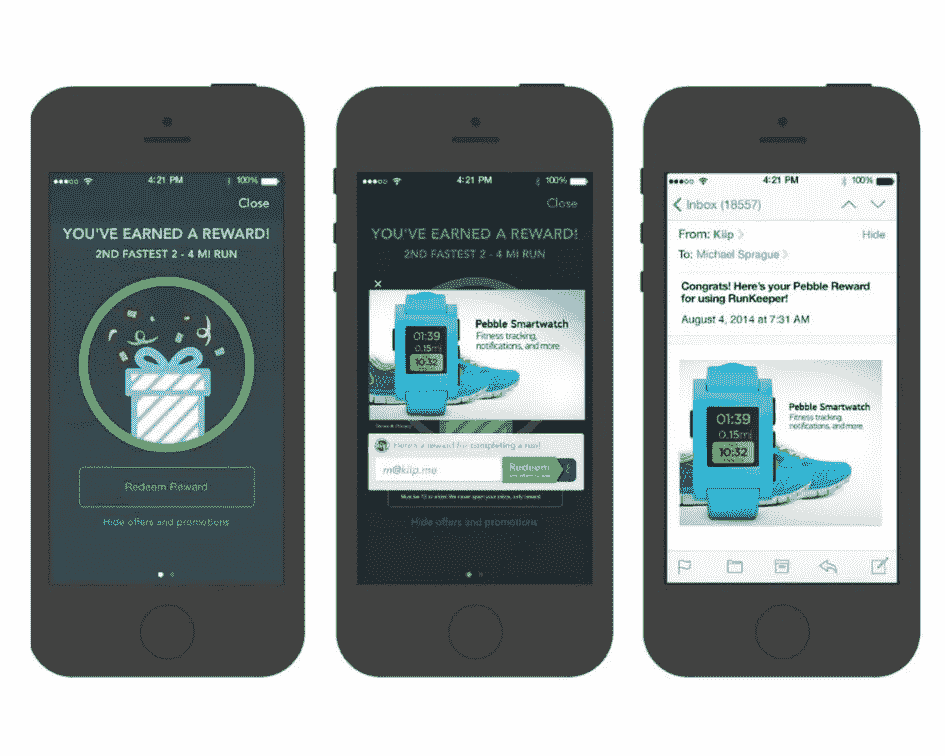
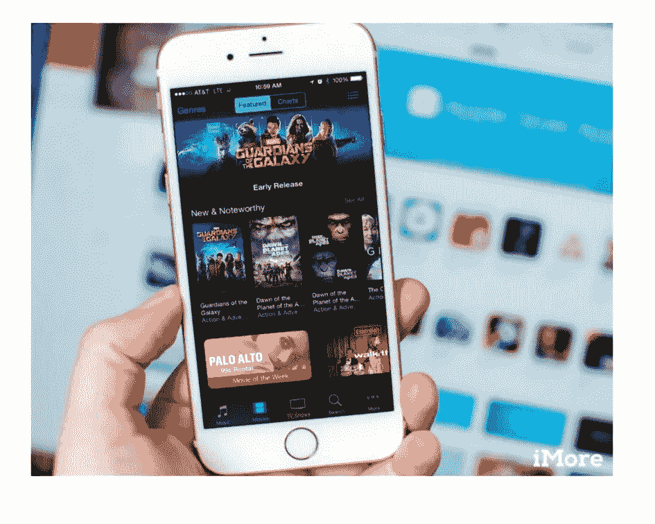
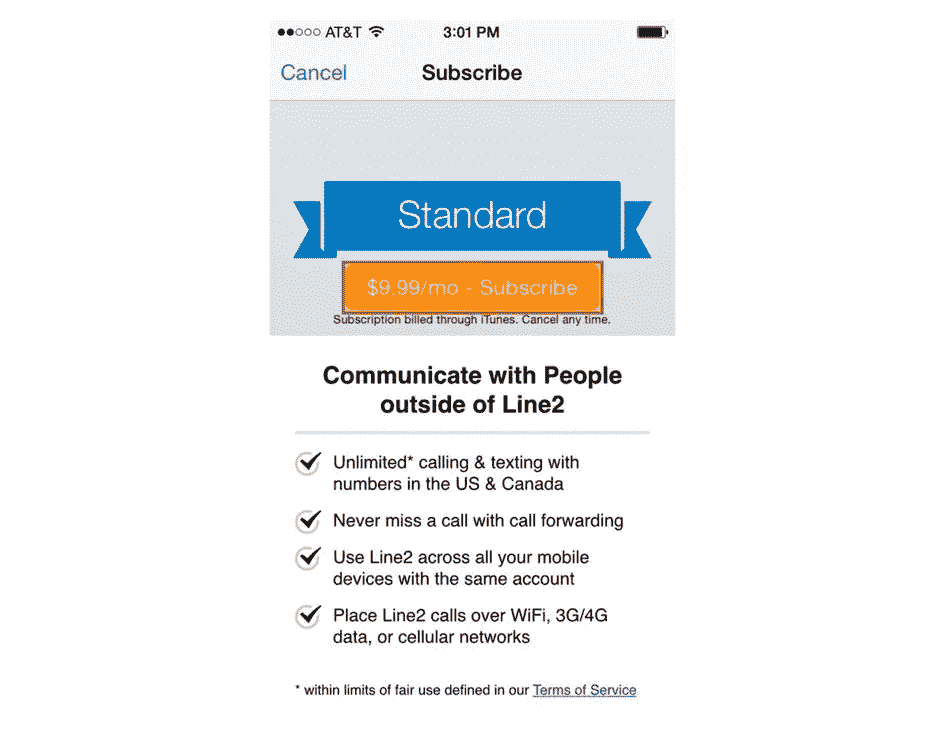
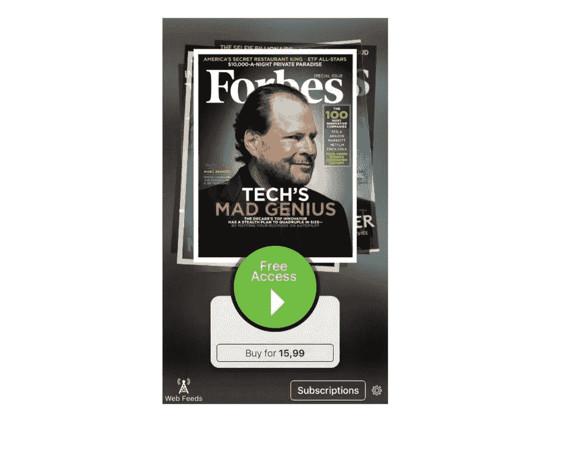
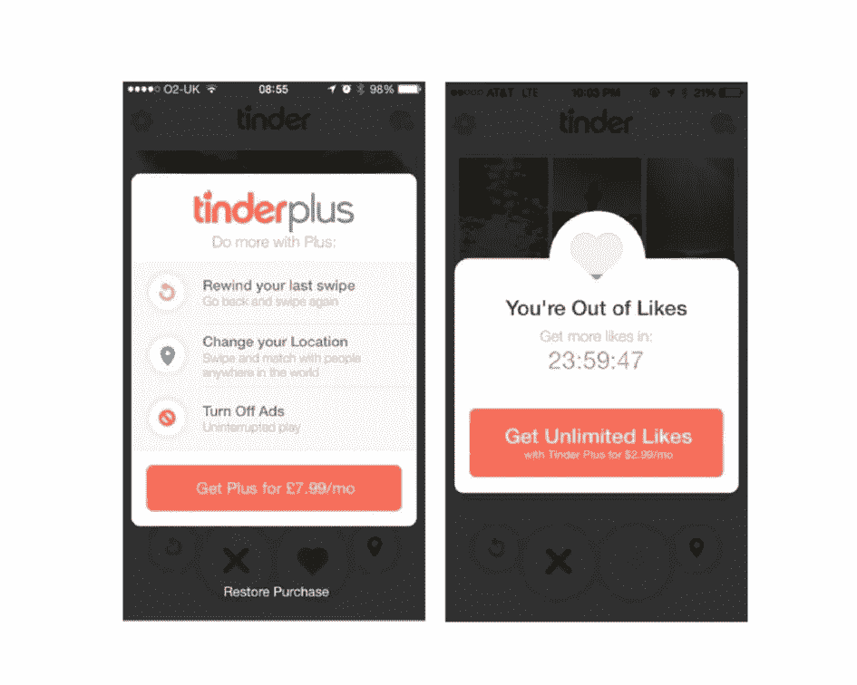
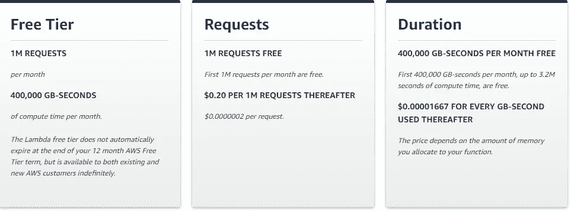

# 软件商业模式、范例、收入流以及产品、服务和平台的特征

> 原文：<https://medium.com/swlh/software-business-models-examples-revenue-streams-and-characteristics-for-products-services-437dd6847fc3>

**商业模式(BM)** 描述了一个组织如何为客户创造和交付价值。它描述了公司提供的产品或服务，以及公司获得补偿的方式——一种收入模式。由于每个商业模式都有自己的结构，每个结构都包含隐藏的优点和缺点，本文的目的是分析收入模式并讨论软件产品公司的货币化方法，以帮助您确定哪一种最适合您的产品。

# 商业模式特征

尽管该领域有大量不同的出版物，但仍然没有单一的商业模型类型分类方法和与之最匹配的收入模型。这就是为什么，我们将定义并讨论构成软件产品公司商业模型的特征，而不是试图对各种独特的模型进行分类。因此，创建一个公司的商业模式需要结合以下特征:

[**配送方式**](https://www.altexsoft.com/blog/business/software-business-models-examples-revenue-streams-and-characteristics-for-products-services-and-platforms/#distribution%20approach) 。最重要的商业模式特征是公司用来为客户提供服务或创造产品的分销方式。我们区分了三种可以使用的主要**分发方法**:**本地、云和混合。**

[**源代码许可**](https://www.altexsoft.com/blog/business/software-business-models-examples-revenue-streams-and-characteristics-for-products-services-and-platforms/#source%20code%20licensing) 。基于公司创建的源代码的许可，软件可能是**专有**或**开源**代码。

[**收入来源**](https://www.altexsoft.com/blog/business/software-business-models-examples-revenue-streams-and-characteristics-for-products-services-and-platforms/#revenue%20streams) 。软件收入流定义了公司产品和服务的支付方式。一个商业模式可以利用一个或几个收入流。例如，软件产品收入流可以包括广告收入、销售、订阅以及它们的组合。

[**商业模式互动**](https://www.altexsoft.com/blog/business/software-business-models-examples-revenue-streams-and-characteristics-for-products-services-and-platforms/#business%20model%20interaction) 。软件公司在形成其商业模式时不可避免地要在两种类型的**商业模式互动**中做出选择。它可以采取**一对多**或**多对多的形式。**前者是传统的价值交付，当一个提供商直接解决客户问题(Trello，Microsoft Office，Photoshop 等。).后者意味着一家公司创建了一个终端提供商和客户见面的平台(Airbnb、优步或 Upwork)。但下面会详细介绍。

B2C 或 B2B 市场。最终，公司必须选择销售产品或服务的目标受众，这将导致公司采取**企业对企业(B2B)** 或**企业对消费者** (B2C)的方式。B2B 意味着公司向其他企业出售服务，B2C 意味着直接向消费者出售产品或服务。

# 内部软件分发方法

本地分发方法需要在客户的内部基础设施中安装和运行软件产品，无论是单台计算机还是本地服务器。SAP、Oracle 和 Microsoft 等公司已经使用传统的分销方法很多年了。

## 传统内部软件分发方法的优点

*   内部部署允许您定制产品，使其符合客户的需求。
*   它允许通过内部网与客户的其他公司系统简单集成。
*   所有基础设施费用由一个客户支付。

## 传统内部分配方法的缺点

*   实施新的内部环境需要大量时间。
*   如果您提供公司级软件，客户必须有自己的 IT 支持人员和内部服务器硬件。
*   前两个因素可能会让潜在客户转向云竞争对手。
*   如果一个产品是通过许可模式发布的，考虑到风险，你的客户会犹豫是否在许可上进行大量的前期投资。
*   如果内部软件是定制的，那么升级会变得越来越复杂。

**例子:**微软 Office，马辰影院 4d，KMPlayer。

# 基于云的软件分发方法

基于云的分发方法的主要特点是软件运行在主机提供商或云服务中。

例如，**软件即服务(SaaS)** 是一种基于云的分发方法，提供商托管其应用程序，并通过互联网提供给客户。根据 SaaS 的方法，企业和个人不需要在自己的电脑或数据中心安装应用程序。他们可以使用网络浏览器或移动设备访问该软件。SaaS 通常通过基于期限的订阅来交付。

## 基于云的分发方法的优点

*   云产品和服务为客户提供了更快的实施时间
*   用户将能够随时随地远程访问产品和信息，只要他们有互联网连接
*   SaaS 的方法不需要用户的任何初始设置成本。客户只需要订阅并登录他们的帐户，就可以完全访问该应用程序及其更新
*   SaaS 方法让您有机会为所有客户提供相同的软件版本。这意味着您只需维护、升级、调试和提供存储支持一个版本。
*   云分发方法的主要收入来源是订阅，因此只要客户使用该软件，您就可以持续获得收入。

## 云分发方法的缺点

*   云解决方案与您的客户已经拥有的现有内部部署企业应用程序的集成之间可能存在兼容性问题。
*   您对可能发生的服务中断负全部责任。需要建立可靠的基础设施。

**例子:**亚马逊网络服务，Dropbox，网飞。

# 混合软件分发方法

一些软件公司采用混合发行方式。在这种情况下，混合是将 SaaS 解决方案与本地软件应用程序相结合的方法。因此，云驱动技术是对本地技术的补充。例如，Adobe Creative Cloud 将 Photoshop 等内部产品与图书馆、预设等其他云服务相结合。此外，内部软件会像部署在云上一样定期更新，无需客户为每个新版本的产品购买单独的许可证。随着高速互联网连接成为新的标准，混合动力车将变得越来越普遍。

实现混合部署的另一种方式是让客户在 SaaS 服务或本地解决方案之间进行选择，并在需要时提供从一种方案切换到另一种方案的机会。例如，Microsoft Outlook 可以在内部部署，但也可以在线访问。

## 混合软件分发的优势

*   它允许客户灵活地在内部数据中心和第三方云服务之间移动信息，而不会受限于特定的云提供商或他们自己的基础架构
*   用户可以利用与现有公司系统的紧密集成，并且不管他们的互联网速度如何，他们也可以轻松地传输大文件。
*   提供商可以确保本地软件的无缝更新，并在本地和云之间分发不同的功能
*   敏感或高度管控的信息(例如医疗记录)可以留在本地，而不涉及敏感数据的操作可以在云中进行

## 混合软件分发的缺点

混合方法结合并扩大了 SaaS 方法和内部部署方法的困难。

*   与纯云版本相比，内部部署的定制机会有限
*   如果可以进行定制，更新软件就成了一个关键的工程挑战
*   如果可以从 web 界面和内部界面访问软件，前端开发任务的数量会显著增加

**例子:** Adobe Creative Cloud，Salesforce，Zendesk。

# 源代码许可

软件公司可以创建**专有或开源**软件。

## 专有软件

在大多数情况下，**专有软件**不允许用户访问、修改或重用受版权保护的源代码。即使一个程序可以免费使用，它也可能有用户和第三方无法更改的专有代码。在这种情况下，用高级语言编写的代码是用机器语言汇编的，机器可以执行，但人类不可读。大多数公司使他们的软件产品成为专有的，以保护它不被复制、更改或模仿。

也有例外。有时，受版权保护的软件确实有可供用户修改的代码。

## 创建专有软件的好处

*   由于支持、错误修复、安全修复和定期升级的单一来源，用户将确信该产品将正常工作
*   软件受版权保护，可以货币化

## 专有软件的缺点

*   如“优点”一节所述，专有软件的所有者负责所有更新、定制(如果需要)和维护。与竞争供应商相比，有限的工程能力可能会减缓功能开发。
*   很多潜在客户可能负担不起专有软件
*   代码拥有组织是唯一负责查找和修复代码漏洞的组织。因此，与开源代码相比，封闭代码软件更容易受到恶意软件和攻击的攻击，在开源代码中，通过社区的努力可以更好地检测到可能的漏洞

**例子**:微软 Windows，迈克菲，iTunes。

## 开源软件

**开源软件**意味着用户免费获得软件和访问源代码。如今，越来越多的技术公司开发开源软件。[黑鸭软件](https://www.blackducksoftware.com/)，开源软件(OSS)解决方案提供商，通过最小化开源软件的风险来帮助实现价值最大化，已经披露了 [2016 年第十届开源未来年度调查](https://www.blackducksoftware.com/2016-future-of-open-source)的结果。根据这项研究，78%的受访公司在 OSS 上运行部分甚至全部业务，66%的受访公司说他们的公司为客户开发基于开源的软件。这是有史以来最高的开源软件使用率。

在下图中你可以看到操作系统、数据库和开发工具是 2016 年最热门的 OSS 领域。

*开源技术领域*

*来源:* [***黑鸭来源软件调查***](https://www.blackducksoftware.com/2016-future-of-open-source)

2016 年开源采用增长的主要驱动力是 OSS 解决方案的质量、功能支持和对定制的敏感性。

*OSS 采用的驱动因素*

*来源:* [***黑鸭来源软件调查***](https://www.blackducksoftware.com/2016-future-of-open-source)

供应商对定制、支持和维护的收费传统上是开源软件的主要公开货币化机制。开源项目的一个常见实践是当“母”公司——这是这样一个项目的主要贡献者——提供所有的支持。这包括用户支持、产品维护、托管、咨询和定义产品策略。

例如， [Jet Brains](https://www.jetbrains.com/) 为开发人员创造工具，这些工具在世界各地不同的知名公司使用，如维基百科、Salesforce 和 Pinterest。同时，JetBrains 也是开源社区的积极参与者。它有自己的开源项目，jetbraines 对非 JetBrains 开源项目做出承诺。比如 PyCharm 就是 JetBrains 开发的产品。PyCharm 是用于[计算机编程](https://en.wikipedia.org/wiki/Computer_programming)的集成开发环境(IDE)，专门针对 [Python](https://en.wikipedia.org/wiki/Python_(programming_language)) 语言。这个 IDE 有在 Apache 许可下发布的社区版和在专有许可下发布的专业版。

Kotlin、IntalliJ Platform、MPS 都是开源的 JetBrains 项目。

## 创建开源软件的好处

*   开放源码软件是展示你的产品的创新特性和技术能力以吸引更多用户的绝佳机会。
*   客户可以根据自己的需求定制产品。
*   开放源码软件是提高技术公司品牌认知度的好方法
*   如上所述，开放源码软件有漏洞的可能性较小，因为它们可以被社区检测到

## 开源软件的缺点

*   许多公司客户将努力创建选择和批准开放源代码的正式政策
*   创建开源产品需要找到额外的收入来源

**例子:** VLC，Ubuntu，Open Office。

# 收入来源

一般来说，大多数软件公司都有混合的收入流来满足不同的市场需求。下面的收入流并不是相互排斥的，所以可以混合使用多个收入流来平衡两个主要目标:获得用户和增加收入。

## 付费应用和许可证

基于许可证的收入流的概念要求供应商向客户收取一次安装软件的费用。这可能是内部产品广泛使用的最常见、最简单的货币化方法。

另一方面，有限的价格也可能成为你获得大量用户的障碍，因为有免费和开源的竞争。如果你想让人们购买你的产品，你应该向他们展示它的高价值。

在传统的内部分发方法中，使用一次性预付的永久许可费，这赋予客户无限期使用软件的权利。但是，在某些情况下，技术支持和产品更新的权利可以单独定价，尤其是专业软件。

*例如，Cinema 4d、3d 建模和动画包要求为每个新版本付费，即使客户已经为永久许可支付了全价*

**例子:**4D 电影院，ADW 发射器 EX，《我的世界》。

## 免费，带应用内广告

应用内广告可以让你通过出售应用内的广告位来赚钱。然而，这种货币化的方式将是一个聪明的选择，只有当实施是正确的，你提供相关的广告内容。你做的个性化广告越多，你从中获得的收入就越多。

**例子**:愤怒的小鸟、脸书、推特。

*应用内广告*

**赞助。**赞助是应用内广告货币化流的一个子类型。根据赞助策略，您同意成为一家广告公司的合作伙伴，该公司将为您产品的用户在您的应用程序中完成特定操作提供一些奖励。品牌和代理商付钱给你，让你成为激励系统的一部分。通过这种方式，您可以从兑换的奖励中获得一定比例的收入。同时，在你的应用中加入广告将会增加你的应用吸引用户的能力。

例如，RunKeeper 使用激励广告激励用户用他们的应用程序跟踪跑步活动。如果用户用这个应用程序跟踪他们的跑步，他们将解锁独家奖励和促销。

*在 RunKeeper 中实现的应用内赞助*

**例子:** RunKeeper，Gayot。

## 免费，带应用内购买

应用内购买意味着你的产品提供实物或虚拟商品销售。你可以出售任何东西，从衣服和食物到游戏中的货币。这种收入策略对电子商务和移动商务品牌非常有效，但对其他垂直行业也足够灵活。应用内购买货币化战略可以包括联盟计划和合作伙伴关系，作为额外的收入来源。

VSCO，来见见我。

*应用内购买*

## 捐款

订阅货币化基于订阅许可证。这意味着客户按用户付费，按月或按年付费，这样他们就可以在订阅期内使用软件。用户租用软件而不是购买。

订阅费不仅包括软件许可证，还包括支持服务和发布的软件新版本。订阅模式有几种可能的选择。

**标准订阅**。用户必须订阅才能使用该服务，并在特定期限内支付一次性入门费。

*iTunes 中的标准订阅*

**例子:**金融时报，SalesForce。

**免费试用。**用户可以在指定时间内试用产品，然后决定是否应该付费订阅。立即提供访问，但在免费试用期结束之前不会收费。

*免费试用订阅*

**例子:**网飞 Adobe Creative Cloud。

免费增值。免费增值货币化流是一种订阅子类型，代表免费和付费(高级)版本的组合。这是一项免费服务，用户可以选择付费、付费或拥有附加功能的高级版本。每个人都可以免费使用基本的产品功能，额外的功能需要付费。这种模式的主要目标是吸引人们，向他们展示你的产品可以做什么，以及他们可以从中获得的价值。免费版本的目的是提供良好的用户体验，并与客户建立关系，以便他们愿意为额外的工具付费。

*Tinder 有一个免费增值版本，可以升级以获得更广泛的功能支持*

**例子:** Grammarly，Tinder，Zapier。

订阅目标是根据长期合同留住客户，并确保每月/每周/每年的收入流。客户应在每个期限结束时续订订购许可证，否则将失去使用该软件的权利。订阅对于所有类型的数字内容都很常见:软件、游戏、报纸或流媒体。如果你运行可以限制内容的杂志、新闻或视频流媒体应用，这将是最合适的货币化手段。

有时，订阅可以与基于使用的付费相结合。例如，MailChimp 建议基于订阅的支付，但其类型取决于你在邮件活动中接触的人数以及你每月发送的电子邮件数量。

## 基于使用的许可证

基于使用的许可证通常用于 B2B 产品。这意味着客户订阅基于某种消费标准的“现收现付”许可证，只为他们使用的东西付费。该指标可以与不同的使用方面相关联，例如注册、登记、购买、课程完成、证书完成、特许经营地点，甚至登录系统。

例如，软件开发的 PaaS 服务 Amazon Lambda 每月提供多达 100 万个免费请求，然后该公司对每个请求收费，或者根据用户消耗的内存量收费。

*基于使用的许可证 Lambda 亚马逊网络服务*

**例子:**亚马逊 Lambda，MailChimp(现收现付计划)，Shutterstock。

## 交易费用

交易费系统是一种公司根据促成或执行交易的数量收取佣金的系统。交易费的金额可以是百分比，也可以是固定费用。这种模式对提供商来说是最有用的，因为在他们从市场中获得一些价值之前，他们不需要支付任何费用。另一方面，市场从通过平台传递的所有价值中分得一杯羹。这种收入流需要使用市场或服务的参与受众，因为当更多的人使用它们时，商品或服务变得更有价值。从交易费收入流中预测货币化收入很容易。

**例子** : Airbnb，优步，易贝。

## 企业服务、支持和咨询的额外费用

这是一种收入流，包括为企业客户提供特殊服务而获得额外费用。这类公司对软件产品有特殊要求，需要专门为他们定制。著名的开源软件公司 [Red Hat](https://www.redhat.com/en) 和 Hortonworks 利用支持和咨询服务作为他们的主要盈利来源。

# 商业模式互动

概括地说，有两种类型的商业模式交互可以用来建立你的业务:**一对多商业模式交互**和**多对多商业模式交互。**

**一对多商业模式互动**其中公司创造产品和服务，开发和改进它们，并销售给客户。大多数电子商务商店和软件产品都是根据这种价值模式运作的。

**示例:** Adobe Creative Cloud、Buzzsumo、Microsoft Office、Gmail

**多对多的商业模式交互**允许一组用户(生产者)在平台上创造和消费价值，供另一组用户(消费者)消费。

**例子:**维基百科、优步、全球速卖通、谷歌搜索引擎

这两种类型有着根本不同的创造产品的策略。一对多业务模型交互方法要求公司在生产产品时只考虑最终消费者。相反，多对多价值模型要求同时关注生产者和消费者。例如，YouTube 需要为制作者(YouTube 上的视频托管)和消费者(视频观看)构建工具。

每个模型都有自己的策略。在一对多业务模型交互的情况下，用户与创建的软件进行交互。所以，产品本身是有价值的。多对多业务模型交互允许用户使用公司创建的软件进行交互。因此，除非产品周围有一个生产者和消费者群体，否则产品就没有价值。

# 结束语

随着高速互联网连接在全球变得普遍，不同的商业和收入模式融合在一起。正如 Adobe Creative Cloud 产品所证明的那样，本地软件现在可以与云 SaaS 相结合，并在订阅的基础上工作。因此，商业模式在选择收入来源方面不会有太多限制。但是市场的性质和客户的期望也在变化。在为你的企业选择商业模式特征和收入来源时，应该记住哪些细节？

1.  免费增值服务的激增。由于 B2C 和 B2B 领域的竞争非常激烈，用户希望免费获得核心功能，否则他们会考虑竞争对手。因此，该产品应该为大众消费者提供非常独特的体验和服务，仅通过许可证或订阅进行分发。例如，媒体和娱乐业因为每部电影或视频游戏都被期望提供独特的体验而保持增长。生活方式管理、时间管理和消息应用就不一样了。
2.  **企业部门的云激增。** [企业移动性](https://www.altexsoft.com/blog/cloud/five-components-of-enterprise-mobility-strategy/#utm_source=MediumCom&utm_medium=referral)和 BYOD(自带设备)趋势在企业领域已经变得很普遍。人们倾向于在任何设备上使用他们的公司软件，将工作和休闲生活方式融合在一起。让 B2B 和企业软件云可访问不再是一个定局。
3.  **个性化和精准广告定位。应用程序中的广告还没有普及，但是销售广告空间是不够的。用户希望看到基于他们之前与网络互动的个性化广告。虽然让你自己的广告个性化是昂贵的，但使用谷歌的 AdSense 是一个很好的选择，可以让广告对客户更有价值。**

最终，货币化和商业模式策略应该在确定目标客户期望的优先级后进行配置。精益创业方法，如[创建 MVP](https://www.altexsoft.com/blog/business/minimum-viable-product-types-methods-and-building-stages/#utm_source=MediumCom&utm_medium=referral) 将有助于评估初始假设，包括那些与收入流相关的假设。

***喜欢这个故事吗？为我们鼓掌，让更多的人可以找到它！👏***
原载于 AltexSoft 的博客:*[*软件商业模式、范例、收入流以及产品、服务和平台的特点*](https://www.altexsoft.com/blog/business/software-business-models-examples-revenue-streams-and-characteristics-for-products-services-and-platforms/#utm_source=MediumCom&utm_medium=referral)*

****

## **这个故事发表在 [The Startup](https://medium.com/swlh) 上，这是 Medium 最大的创业刊物，拥有 297，332+人关注。**

## **在这里订阅接收[我们的头条新闻](http://growthsupply.com/the-startup-newsletter/)。**

****