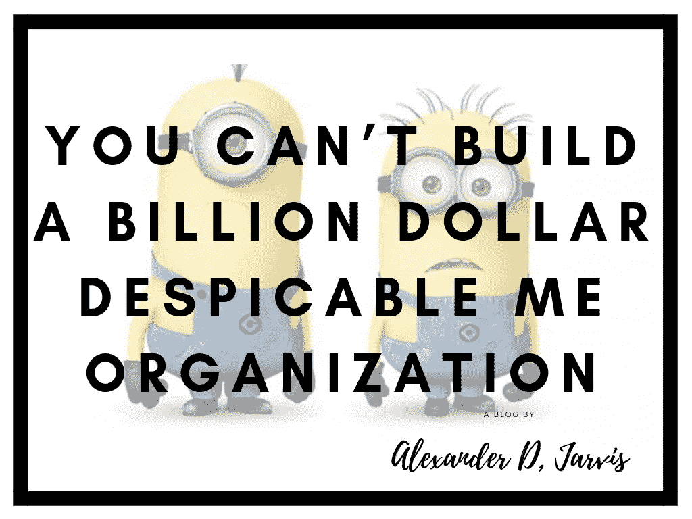
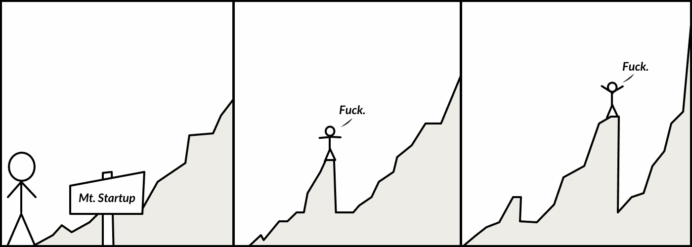

# 单身创业者不好。你不可能建立一个十亿美元的卑鄙的我创业公司

> 原文：<https://medium.com/swlh/sole-founders-are-bad-you-cant-build-a-billion-dollar-despicable-me-startup-80a52e5ec539>

*TL；博士:与联合创始人团队相比，单独创始人面临着一场艰苦的战斗。而如果你是独家创始人，还是需要一个团队；光有奴才是不够的。*

大家都看过*卑鄙的我*。一部人人都喜欢的黄色独眼小黄人的爆笑电影。我喜欢那些胡言乱语，厚脸皮的猴子！Evil Inc .的组织设计极其扁平化；格鲁被一群黄色小喽啰和他密不透风的武器和战争机器包围了。

不知何故，他几乎能够实现相当不可思议的事情，开发古怪的技术等等。但这是卡通世界，现实世界不是那样的。

我今天和我的一个风投朋友聊天，我们在讨论一家他想投资的公司。它是由一个像野兽一样忙碌的唯一创始人经营的，但当涉及到聪明的东西时，创始人被挖掘出来-一切都取决于他。

在 FB 的一次聊天中，我的朋友说了一些我认为发人深省的话:

> 你不能建立一个十亿美元的卑鄙的我组织。你需要真正的天赋，但对他来说，问题是他在所有事情的关键路径上，没有带宽做任何事情。

如果你是单身创始人。再读一遍。这就是一些风投对你的看法，但既然你不了解他们，他们就不会告诉你。他们会告诉我…也许我会告诉你。

这是一个复制/粘贴报价。

创始人在一次电话中讽刺地告诉我“*只有我和 35 个跟班*”。他知道，风投也知道。是格鲁和 35 个奴才。

增加联合创始人很难，需要很多时间，但如果你没有一个强大的基础，你将继续挣扎。没有可以帮助你的人，你怎么能期望进入规模化？阅读[创业和扩大规模:经营 10 人和 100 人的企业](https://www.alexanderjarvis.com/2018/08/27/startups-and-scale-ups-running-10-and-100-person-scale-up-business/)。

我们将讨论一个强大的联合创建团队的重要性。这可能看起来很明显，但是这个错误是经常犯的，而且最基本的是最经常被忽略的。

## 做唯一创始人有什么好处吗？

当然，如果你能以某种方式做到这一点，那么作为一名唯一的创始人可能会有很多好处。只是……有风险。当你已经有一大笔现金，能够支付起薪，而不是向“联合创始人”支付高额股权时，这种事情就更有意义了。

## 作为唯一的创始人，谁做得好？

一个成功的独资创始人的例子是什么？

你听说过亚马逊吗？是的，杰兹·贝佐斯是唯一的创始人。但是其他的呢？我整理了一份清单。

*   伯克希尔·哈撒韦公司(Berkshire Hathaway):1962 年的沃伦·巴菲特(算是吧，他买下了它)
*   Dropbox:2007 年的德鲁·休斯顿(有一个联合创始人，因为保罗·格拉厄姆不让他在没有联合创始人的情况下进入 YCom)
*   **脸书**:马克·扎克伯格，2004 年
*   **火眼**:2004 年的阿沙尔·阿兹
*   **福特:**1903 年的亨利·福特
*   Github:2008 年的汤姆·普雷斯顿-沃纳
*   **薄荷**:2006 年的亚伦·帕兹
*   **奥拉**:2010 年巴维什·阿格瓦尔
*   甲骨文:拉里·埃里森在 1977 年
*   **卵石**:2012 年埃里克·米基科夫斯基
*   丰富的鱼:2003 年的马库斯·弗伦德
*   **保时捷:**1931 年的费迪南德·保时捷
*   **科尼赛克:**克里斯蒂安·冯·科尼赛克 1994 年
*   零售商编号:2006 年开特·坎宁安
*   现在服役:弗雷德·乐迪在 2003 年
*   **太空 X**:2002 年的埃隆·马斯克
*   **铃木:**1909 年的铃木稻夫
*   **特斯拉**:2003 年的埃隆·马斯克
*   Tumblr:2007 年的戴维·卡普
*   维特鲁伊:2006 年的雷吉·布拉德福德

我错过了什么吗？请在评论中告诉我！]

好的，但是，你需要在这里比较苹果和苹果。嘿，亚历克斯，杰夫做到了，我也能！你父母给了你多少钱来资助公司运营？杰夫在这里得到了很多人得不到的帮助。大多数创始人都破产了，没有银勺子。

另一方面，像 Markus Frind 这样的人只是作为一个单独的开发人员努力了多年，并取得了成功。是的，有例外，但也仅此而已。

现在，让我们来深入探讨一下作为唯一创始人的好处的一些关键点。

## 文化

**你形成了文化**

> 澳大利亚人和一罐酸奶有什么区别？
> 把一罐酸奶放在阳光下晒 200 年，它会发展出一种文化。

这是一个老笑话，但它说得有道理。每个公司都像酸奶一样，发展自己的文化。

如果你想出现在自己的办公室，并喜欢在那里工作，你需要把公司文化发展成你想要的样子。不管怎样，你将拥有一种文化——让它成为一种好的文化。有趣的是，很少有人真正思考这个问题。许多人知道，但“太忙”。

你看重什么特质？你想避免哪些会让你发疯的特征？我努力工作，并期望其他人也能如此。作为唯一的创始人，最大的好处就是一切都取决于你自己。如果你愿意，你可以把你的文化塑造成你想要的样子。没有其他人可以决定。

如果你有一个不认同同样道德规范的联合创始人，你会很快变得相当恼火。他们会影响你的文化，可能会形成派系(想想雅各布和爱德华团队……)。如果你整个周末都在办公室，而他们在海边，你不会允许事情继续下去，对吗？

你雇佣员工，他们会复制你的行为。团队跟随领导者，如果只有一个领导者，并且他们努力工作，那么你最终会拥有一个努力工作的文化(如果你雇佣正确的话)。多位创始人最终会得到一个混合的结果。

## 执行

**你可以迅速做出决定**

创业公司依靠快速的决策和执行而茁壮成长。你没有盈利，所以你是“违约死亡”，争分夺秒地获得盈利或筹集新一轮资金。一个人可以很快地打电话。

我总是建议由一位首席执行官来领导并做出最终决定，其他所有创始人都需要对此保持冷静。正如芬兰的一位创始人在其他创始人面前对我说的那样:“*这是一个独裁国家，而不是一个民主国家”。*问题是，并不是所有人都同意这一点，也不是所有人都这么认为。当你是唯一的创始人时，你甚至不需要进行这种讨论。

值得注意的是，在那家公司，他们都互相信任。每个人都有自己的责任范围。首席执行官只在需要的时候对重要的事情做最后的决定。不是所有的决定。

当我还是风投的时候，我喜欢问的一个问题是“*谁是首席执行官*？”如果他们盯着对方，我知道他们还没有谈过。这是一面红旗。这也让我笑了，因为我知道。我喜欢问这些问题来取乐，看看事情是否变得尴尬，以此来娱乐自己。

每一个人，即使是大体一致的人，也会有略微不同的愿景和优先事项。初创公司总是有最后期限，需要做出决定。虽然没有人以建设性的方式对你进行第二次猜测，但你可以打个电话，然后执行。

但是，在没有联合创始人的情况下，在你雇佣一些白发苍苍的人之前，你如何获得洞察力呢？在没有其他聪明的联合创始人的情况下，单独创始人往往会从顾问那里汲取灵感，然后决定该做什么。显然，没有人总是对的，但是做了总比完美好。比其他任何事情更快扼杀创业的是缓慢而糟糕的决策。

**你被迫学习更多的东西**

当你的创业公司在运作，你在成长，在整个过程中你学到了很多，也成长了很多，这是令人难以置信的。唯一的创始人最终要对所有事情负责，而不仅仅是你擅长或喜欢的部分。筹资、会计、销售、市场营销、人力资源、运营，你都需要参与。每当有问题时，没有其他人来处理。照照镜子伙计，是你！

很明显，你一开始会非常艰难，因为你没有一个技能互补的联合创始人团队，但你要么沉下去，要么游下去，你会学到很多东西。

**你可以更容易地雇佣和解雇适合你公司的人才**

当你创办一家公司时，你需要一名营销人员、销售人员、程序员和首席执行官。一开始，拥有一个能让系统运行的开发人员是很棒的，但是这个人能适应新的挑战吗？不总是。

更换创始人是一件糟糕的事情，而且几乎总是会变得一团糟。如果你有更少的创始人，随着公司规模的扩大，这些人的问题就更少了，因为他们不必站在一边，不知道他们应该做什么，因为你现在有一个 CMO 在做他们以前做的营销职能。你可能会发现，当你有很多创始人都希望成为某个领域的领导者时，你很难引进更有经验的人才。

来吧，让我们坦诚相待。很少有公司的创始人是一个或多个 AAA 级人士。

## 稳定性

**你不会和自己分手**

创始人破产是真实的。我知道这种情况发生过几次，这是一个巨大的痛苦。不管是什么原因，事情变得政治化了，暗箭伤人开始了，员工们不喜欢这样。没有任何联合创始人意味着你不必担心这一点。

现实是，你可能会和朋友一起创业。当事情进展顺利的时候，那是很棒的。然后在一两年或考验和磨难后，事情开始变糟，争吵开始，手指变得尖锐，指责被分配。你开始想，这个人没有我想的那么聪明，或者没有我努力……为什么我要和他们一起做这些？

由此带来的后果相当严重。如果你正在建立一个风投支持的企业，风投们会失去信心，你下一轮的机会会越来越小。随着环境变得有毒，员工将开始寻找工作。

过了一会儿，我才意识到我的情绪对整个办公室的影响有多大。我开始让自己带着微笑走进办公室，即使我心情不好(或者宿醉)。你应该读一读这篇关于微笑重要性的简短博客:[这是一个让首席执行官们的生产率提高了三倍的古怪的迪斯尼把戏(微笑)。](https://www.alexanderjarvis.com/2014/08/20/this-one-weird-disney-trick-for-ceos-tripled-productivity-smile/)

我永远不会和朋友一起创业，除非他们已经做了很多创业，没有什么是私人的，应该永远是生意。

## 金融的

你会得到更多的股权，因为你不会一开始就放弃大量股权。

如果你认为天使轮或种子期的稀释是痛苦的，想想来自联合创始人的稀释。你可能在和另一位联合创始人谈论 50%的股份，对吗？那太多了。如果你们有三个人，你们大概有 30%。

当你是唯一的创始人时，股权稀释对筹资来说就不是问题了。如果你在天使投资和种子投资中损失惨重，那么你在首轮融资中不会受到太大的负面影响，因为你仍将拥有公司的一半股份。你也有动力，因为你有很大的股份。如果有很多创始人就不会这样了。你也可以在融资轮不被稀释，但谁会计划高度稀释呢？是啊，没人。

## 为什么单身创业者不好

所以我们已经讨论了单独行动的好处，但实际上，最好有一个团队。现在就找出原因。

## 执行

**一切的关键路径**

在引言中，我提到了一位朋友的话，他感叹早期阶段的唯一创始人正处于一切事情的关键路径上(T2)。有趣的是，我听到创始人和风投都说了些什么……你知道吗，他们都知道这些问题？VC 知道创始人被卡了，创始人也知道每次有事情需要查，他都要去做。他讨厌它，但是他没有时间去修理它。当你试图扩大一家公司的规模，却没有一个能干的管理层时，这是一个巨大的挑战。

你也许能理解我在说什么，但除非你亲身经历过，否则你不会理解。这就像警句如'*招慢，炒快*'一样。你已经读了一百遍了，但是你不会按照学到的去做。你需要雇用一些营销经理，所以你就这么做，然后你被烧伤，然后你就像'*不要再做那种狗屎事情了*。

这位创始人知道他需要一个能负责各个部门的团队，但他太忙了，没时间雇佣他们。这种情况什么时候会改变？不会的。

如果他有聪明的合伙人，比如说 3 个。会有三倍的智囊团。不要低估让一家初创公司赚到足够的钱来雇佣有能力的人有多难。你牺牲的权益是值得的，因为它给了你一个离开地面和逃离速度的机会。

我在“优点”部分提到了快速决策的好处。是的，理论上你可以很快做出决定，但是你能做出多少决定呢？有决策疲劳这种东西，当你变得更大时，你只能在足够详细的情况下做出明智的决定。

**你不可能独自做出更好的决策，更快地达到正确的结果**

只要你有聪明的头脑，三个臭皮匠胜过一个诸葛亮。

当你有一个来自不同地方的智囊团时，前景是相当不可思议的。与兴趣和观点大相径庭的人讨论你应该做什么，会产生你通常不会想到的结果。

只要你的联合创始人很聪明，并且从不同于你自己的角度处理问题，通过辩论，你会做出更好的决定。

不同的观点甚至可以应用到创业上。我正在和一个美国的增长黑客一起建立一些公司。他喜欢一个想法，因为他可以在 FB 上“瞄准”他们。我喜欢它，因为我考虑度量标准；CAC，LTV 和回报时间。从单位经济学的角度了解业务运作，我们会有一个较低的 CAC 是很酷的。我们找到了一个负责技术方面的人。我只知道一点点技术和营销方面的东西，但是当一个人是老板并且知道更多的时候，那真的很酷。我只是不用担心这个。

尽早弄清楚你是否在做正确的事情是很棒的；我想快点失败。快速执行，因为总体而言你很棒，这让你走上了一条快速成长的道路。

**有效的领导更容易**

你的公司越大，你的团队就越大(除非你是 Whatsapp)。你的团队越大，你花在“工作”上的时间就越少，花在管理人员上的时间就越多。看看这些博客初创公司[和扩大规模:运行 10 人和 100 人的初创公司](https://www.alexanderjarvis.com/2018/08/27/startups-and-scale-ups-running-10-and-100-person-scale-up-business/)。

当你是一名独立创始人时，你很可能必须激励每个人，阐明你的愿景和战略，并与每个部门充分打交道，以帮助他们。如果有多个创始人，你可以分散负担。

每个人总是在筹款，这需要很多时间！你的首席执行官应该在 6 个月内筹集资金，在结束前什么都不用做…只是，谁来继续管理这艘船呢？如果你有多位创始人，有人可以掌握市场营销，确保你在成长，技术和产品在运输，以及公司做的其他事情。

一天中没有足够的时间，让自己太累是危险的。一个协同的创始团队利用各自的优势，可以做更多的事情。

## 情绪稳定

**只是更好玩而已**

开公司，各种孤独，黑暗，扭曲。当你独自一人，日子艰难时，好吧，我不想谈论那些试图超越自己的朋友。

没有抑郁到想自杀的人是不够努力，或者很幸运他们是个例外。心理健康谈得还不够。

共同创始人就像婚姻，只是你不能真的离婚。当它起作用时，稀释是值得的。能够面对压力和挑战进行交流是非常有价值的。

**肩膀可以依靠**

没有人喜欢被人哭诉；)废话总是要发生的。如果你倒下了，会有人站出来。这就是创业生活:

大多数创业公司需要很长时间才能盈利。总有一天你会掏出你的信用卡来发工资，最好有三张信用卡来付账！

**假期是可能的**

创业是马拉松，不是短跑。你不想筋疲力尽。当英雄没有好下场。当有其他人像你一样投入时，很高兴知道你“可以”去度假，世界不会燃烧。

不幸的是，我们每个人都会“结婚”。你真的可以做这样的事情。每个人都有自己的想法；).

## 筹款

**多个创始人更容易获得资助**

老实说，风投讨厌单独创始人。重读整个关键路径的事情！

投资者在投资什么？一个团队，你的公司。他们不是在投资一个想法，因为这个想法会随着时间的推移而变化，或者你只是简单地转向。成名前读过[。15 创业成名](https://www.alexanderjarvis.com/2018/05/14/before-they-were-famous-15-startup-pivot-to-fame/)

除了被车撞之外，一个创始人有很大的风险。创业就是难。多位创始人拥有不同的技能、经验和关系网。当动力下降时，一个人可以把另一个人拉起来，这样你就能做出更好的决定。这是许多小事情，但它们累积起来会增加你成功的机会(这是很低的)。

**更好的决策**

当然，你需要让人们接受新的想法，这可能很难，但这很好。来自一个人的想法很少得到充分的发展。不同的观点可能非常有益。我喜欢提出一个新的想法，并把它传递给人们。通常他们不喜欢它，但他们触及的东西给了我一个更好的主意。

这听起来可能很无聊，但是在你的团队中有“无聊”的人是有好处的。我说的无聊是指操作型的人。他们的思维超级务实。有疯狂、令人敬畏的想法当然很好，但它们也需要可行。所以在派对游行上撒尿省去了你在白日梦上浪费的精力。

## 为什么风投喜欢多个创始人

> 挑选优秀的联合创始人。联合创始人对于创业公司来说就像位置对于房地产一样重要。你可以改变房子的任何东西，除了它的位置。在一家初创公司，你可以很容易地改变你的想法，但改变你的联合创始人是很难的。创业公司的成功几乎总是由其创始人决定的。— [保罗·格拉厄姆](http://www.paulgraham.com/13sentences.html)

我已经解决了这个问题，所以我不打算重复这个观点。这是你只需要相信我的话的事情之一，风投强烈偏好团队。我可以写各种奇特的东西来解释原因，但这毫无意义。就像[风投不会签 NDA](https://www.alexanderjarvis.com/2016/06/29/non-disclosure-agreements-nda-startup-fundraising-dont-matter-dont-ask/)一样，他们不喜欢单身创始人。你是否同意是没有实际意义的。不要在这个问题上和我争论，因为这毫无意义。

如果你是个十足的老板，你当然可以为所欲为，风投也会砸钱给你，但那是超级 duper 的稀罕事。

## 拥有相同技能的创始人

具有讽刺意味的是，我刚刚在我的实时聊天"*上被一位创始人问到，我能找到一位拥有相同技能的创始人吗*？我们都是商务人士。”所以思想应该解决这个问题。

号码

是的，当然，好的商人是好的商人，但是你难道不想要一个在你有缺陷的事情上完全是老板的人吗？理想情况下，你希望有一个首席执行官、CMO 和首席技术官。我认为那是最好的混合。是的…我知道为每个盒子找三个很棒的人很难。但那是你的工作。你到底想不想发财？

你应该看看我不久前做的关于可投资创始团队的介绍:[可投资创始创业团队](https://www.alexanderjarvis.com/2015/05/05/investible-founding-startup-teams/)

## 有没有创始人太多这种事？

是的，确实有，但是有些人认为太多的东西实际上是可行的

多名创始人的主要问题是，比如说 5 名创始人之间的交流更加复杂。一对一的关系很多，创始人少。这导致了迷你帮派和大量的通信开销。

最后，创始人越多，一个人离开公司的可能性就越大。脸书有爱德华多·萨维林，Youtube 有贾韦德·卡里姆(他上过斯坦福)。当一个创始人退出或被免职时，这会损害士气，你可能会有大量的股权从你的资本表中消失，而这些股权本来可以以更有成效的方式使用(特别是如果你没有一个合适的创始人协议的话！).

*   Housing.com 一开始有 12 位创始人。在某一点上，他们被认为是下一个大事情，但它演变成了一个总的狗屎表演。创始人的数量显然不是问题所在，问题在于他们是白痴。另一位印度首席执行官对他们没有什么好评价。
*   芬兰的沃尔特并不是非常出名。其中一个创始人是 Slush 的创始人，你可能听说过。他们有 7 个创始人。他们没有爆炸。)
*   Excite 有 5 个创始人。Excite 在 90 年代末成为第四大最受欢迎的网站，所以这可能是一个很大的数字，但他们也在 2001 年破产了，所以也许 5 不是？
*   接下来，你有 4 的 Twitter。如果你读过《孵化 Twitter 》,它详细描述了 Twitter 从 2006 年到 2013 年的崛起和发展，你就会知道我在说什么。他们在领导力方面有一大堆问题，其中一些问题来自于这样一个事实，即四个独立的人(诺亚、杰克、Ev、比兹)可以自称为联合创始人，甚至是谁提出了这个想法

## 什么是理想的设置？

我会长话短说:

*   3 名联合创始人(非唯一创始人)
*   1 名首席执行官负责业务和销售，1 名 CMO 负责营销，1 名首席技术官负责编码
*   建立一个独裁政权。今天每个人负责自己的部门日，但重要的时候首席执行官会做最后的决定
*   4-7 年的归属和一年的悬崖。天使名单有 7 年了
*   平等的利害关系(假设每个人都有同等的能力和意识)

## 如何找到联合创始人

这真的很难，一直有人问我。有一个简单的答案，但你不会喜欢它。

> 你已经认识这些人了，他们在你的关系网中。

你需要有和人们一起工作的经历，才能知道他们在好的和坏的情况下会如何反应，以及他们的动机是什么。和你在 Reddit 上找到的人一起工作就像是在乡下的一场枪战婚礼。叶哈哈！你想和伯莎结婚吗？

你需要利用你的关系网。如果你没有人脉，那么你就需要投入工作，打造一个。

## 关于唯一创始人的结论

作为唯一的创始人，你可以让事情运转起来，只是要困难得多。如果可以，我会走共同创业的路线。

如果你能找到好的合伙人，但你选择不找，为什么？如果你不想应对联合创始人对你的挑战，那么更有可能的是，你不知道如何论证你的观点，通常缺乏逻辑和数据来支持你的观点，这也不好。当你扩大规模时，你将无法应付你雇佣的高级管理人员。他们会放弃你的。

分享成功胜过百分之百的失败。有一群摇滚明星和你一样致力于成功，你的创业成功的可能性会成倍增加。

你有多少个共同创始人不会决定你的成功，那些人是谁，以及这些关系有多大的协同作用。有三个笨蛋创始人是笨蛋爆炸的开始。

比尔·盖茨有保罗·艾伦，拉里·佩奇有谢尔盖·布林，史蒂夫·乔布斯有史蒂夫·沃兹尼亚克。你想要谁？

我是一名首席执行官教练，帮助创始人起步、扩大规模和学习。如果我能帮到你，请在这里联系我。

*最初发表于。*

## 这篇文章发表在[《创业](https://medium.com/swlh)》上，这是 Medium 最大的创业刊物，有+386，607 人关注。

## 在这里订阅接收[我们的头条新闻](http://growthsupply.com/the-startup-newsletter/)。

