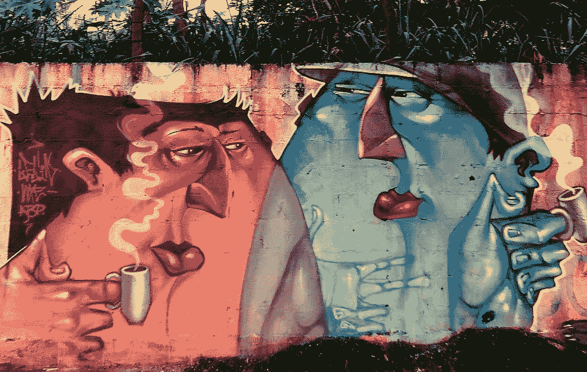

# 有些人不喜欢你

> 原文：<https://medium.com/swlh/some-people-dont-like-you-fd93d45920e>

## 服务姿态

# **有些人不喜欢你**

在我们的一生中，总会有人进进出出，不管你多么努力，不管你为他们和其他人做了多少好事，他们就是不喜欢你。

他们不喜欢你，不喜欢你这个人和你做的事情。他们不感兴趣，坚持自己的方式，沉浸在恐惧和不安全感中；被愤世嫉俗和怜悯驱动的权利感所消耗，被自我、个人骄傲和他们的快乐中心对他们的所有渴望所驱使。但是我们不可能取悦所有人，也许更好的问题是为什么我们要取悦任何人，尤其是他们？

它们也是我们将来需要做更多、更关心、更努力工作、成为更好的人的动力；把我们和他们分开。我们采取行动和做出艰难决定的原因是为了他人的利益，那些无法衡量的事情，那些不需要衡量的事情。

它们是我们做工作和研究的原因，是我们知道我们在谈论什么，是我们理解他人的原则、来源和观点的原因，是我们拒绝接受我们自己的生活和我们的主张中任何不“例外”的东西的原因。因为如果我们这样做，我们知道我们不是他们。为此我们心存感激。

感谢你成为我们不该成为的一切。告诉我们应该避免什么，激励我们做得更好，为了我们自己和他人。谢谢你。

让他们是对的，只在必要的时候证明他们是错的，并且经常走正道。但是要保持足够近的距离，以获得保持你的相对感和动力所需的最小有效剂量。否则，就让他们浪费别人的时间和精力。你有更重要的事情要做和创造。

正确和不错误是有区别的，后者体现了对我们生活中的原则和概念的难以置信的移情理解，并象征着这些原则和概念。我可能不对，但我不认为我错了。

# 服务的姿态

与其一直问我们想要什么或渴望成为什么，也许我们应该问更多我们必须给予什么，我们如何才能最好地服务他人，或者我们代表、支持和延续我们的存在。更像是一种服务的姿态。

给我们提供的机会和经历，我们如何去创造和过一个更像是我们在这个世界上寻求的美好或改变的象征的生活。

做一个不仅仅是某个人或某个身体的人。通过他们交流和展示的信息来支持和激励他人成为某人或某个人的人。

在时间中留下持久的印象或涟漪，不是我们做了什么或完成了什么，而是我们为谁服务以及服务到什么程度。

衡量的不是商品和经验的收集、消费或积累，而是我们一路走来受到了什么和世卫组织的启发，我们如何和为什么生活，以及我们所传达的信息。

我们很可能是我们自己最伟大的创造，我们最好奇的实验和我们最大的机会。我们是我们与世界分享的信息，我们的行动是，其他人的看法是，我们服务的人是信使。

# 今天的垃圾想法

从我混乱的头脑到你的…

训练你的注意力
如果你从不集中或关注消极的想法，你可以训练你的大脑停止产生它们，因为产生它们是浪费时间和精力。你想训练自己注意的思维类型有哪些？我:热情、好奇心、以积极进取的方式质疑假设、为他人服务的姿态、感恩、馈赠/帮助和个人联系、接触和欣赏。
优先优化个人能量。简化是交流，是生产输出的最优化。

质疑你的幸福
我们应该毫不犹豫地改变我们对什么让我们幸福的看法，因为我们很可能对现实的潜在本质完全错误。所以，选择一个有效的错觉。我们真的没有自己想象的那么了解自己，更不用说未来的自己了。开心点，提振你的能量。其他的都可以等。

业绩谎言
业绩不是增长的指标，而是过去增长的可衡量标志。相反，边缘的失败和不适更符合成长的活跃性。变得不舒服。必要时稍后再执行，但不要让(错误解读)现在的执行扼杀了以后的成长和进步。

去源头
你永远不要想通过人去联系，永远要去源头，如果有必要的话，就去想办法从源头去获取。它节省了很多未来的时间、精力和困惑，并建立了信任和一定程度的承诺。你也可以直接知道他们的意图是不是真的，这是无价的。

## 这个故事发表在 [The Startup](https://medium.com/swlh) 上，这是 Medium 最大的企业家出版物，拥有 285，454+人。

## 在这里订阅接收[我们的头条新闻](http://growthsupply.com/the-startup-newsletter/)。

