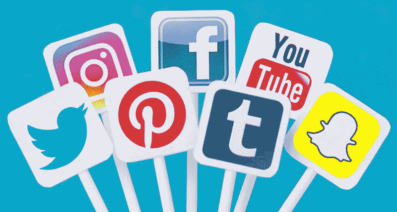

# 一些社会媒体，有人知道吗？

> 原文：<https://medium.com/swlh/some-so-showoff-cial-media-anyone-b42aa1f9a18f>

## 那是双关语。社交媒体，炫耀，懂吗？

Courtesy : [https://www.adlibbing.org/2018/02/12/4-lessons-from-top-social-media-publishers/](https://www.adlibbing.org/2018/02/12/4-lessons-from-top-social-media-publishers/)

我希望你过得很好，你的工作很好，你的家庭很好，你的配偶没有生你的气，你的女朋友还在和你说话，你的狗还在对你吠叫。

哦，等等，我真的希望你的脸书帖子得到足够多的喜欢，因为男孩，如果他们没有，那将是一个失望。这就是社交媒体的全部意义，对吗？将人们聚集在一起，创造并提供新闻*(假新闻)*，建立想法*(错误的)*，发展关系*(哦，别让我开始谈论这个)*。

You’re already ugly, John! Now don’t make me hate dogs.

没有抱歉。我知道这有点咄咄逼人*(还是搞笑？你说)*。但是，你必须承认，社交媒体现在已经远远超越了它的理念，那就是把人们聚集在一起。我的意思是，它仍然在那里，但它被超过 10 层的关于我不想知道的人们生活的具体材料所覆盖。

Perfectly worded. Courtesy : [https://singlegirlsurvival.wordpress.com/2012/07/18/seven-deadly-sins-of-facebook/rottenecards_64761643_x2hydp44j7](https://singlegirlsurvival.wordpress.com/2012/07/18/seven-deadly-sins-of-facebook/rottenecards_64761643_x2hydp44j7/)

这到底是怎么回事？被人群接受是人类的一种心理需求吗？哦，等等，是的。我就直说了吧，尽管我花了几个小时在脸书和 Instagram 上，试图表现得很酷，很老练，以增加我的喜欢和粉丝，但随着我的进步，我知道这一切都毫无意义。

我的意思是，公司现在使用脸书档案来分析他们员工的社会商数。但是后来剑桥分析公司使用了它，一些被泄露了，大数据丑闻就是这样。

> 社交商数不是必须通过一些预先编写的计算机程序来分析的东西。出去问问他/她的邻居。他们会给你最准确的社会商数。

## 社交媒体的有效性取决于它的局限性。想想看——如果你，只有你能看到你的帖子积累了多少赞，你真的会费心去提升它吗？

Almost the same case here, except that we PROVIDE them data. Look, he’s probably laughing at your picture from two years ago. Or mine. Shit. Courtesy : [https://depositphotos.com/179286330/stock-illustration-computer-hacker-thief.html](https://depositphotos.com/179286330/stock-illustration-computer-hacker-thief.html)

不要误解我的意思，我是整个社交媒体概念的超级粉丝，以及它如何以多种方式帮助人们。我们有这样的企业，它们的起步和繁荣仅仅是因为它们从社交媒体账户和页面上获得了大量的宣传。但是效用应该是有限的吧？脸书，或者更好地说， ***为什么*** 脸书甚至会试图在我们不知道的情况下，制造算法来捕捉和分析个人数据？

让每个人都知道你生活中发生的每一件事的发展中的文化，只是让陌生人真正了解你是谁，以及你是如何生活的。陌生人在这里，是大公司，像在线购物门户网站，像亚马逊。我确定他们只是用它来做营销(确定？ ***确定？*** *)* 并且为他们的顾客提供更好的、个性化的购物体验，但是只要想想当这些数据到达真正的坏人手中时会做什么。

> **小心。数据可以杀人。**
> 
> 不，只是开玩笑。数据只能严重伤害你。

就我个人而言，我一年多前就停止使用脸书了(不过我仍然活跃在 Instagram 和 WhatsApp 上，据我所知，这两家网站都属于脸书)。我不希望你们这样做，但我会严格建议你们三思而后行，考虑你们发布的内容和所有细节，以及一个陌生人能从你们的个人资料中读到多少关于你们的信息。这很糟糕，伙计们，相信我，因为我知道你已经无法和所有你已经认识的人打交道，为什么还要邀请网络陌生人加入仇恨池呢？

各位，这是怎么回事？准备好展现自然的你。不要把自己*动物化*(也不是一个真实的词)。为你是谁而自豪，并接受它。努力让自己被看到，被听到，不是靠排名算法，而是通过人。

> 与人交往。与人交谈。喜欢人。评论人(小心那里)。这就是社交的精神。当物理和地理界限阻碍交流时，就转向社交媒体。

打电话给他们，而不是 pinging 他们。向他们扔雪球，而不是戳他们。 ***讲道理，讲道理，讲道理。***

## 在你离开之前，

如果这篇文章让你微笑或思考(或两者都有)，请点击

巴顿，这真的会激励我写更多。如果你喜欢这篇文章(只有在你喜欢的情况下)，请分享这篇文章，也许你的朋友也会喜欢。:)如果你想要更多这种的，请跟我来。

# 恭喜各位，下次见。

## 这个故事发表在 [The Startup](https://medium.com/swlh) 上，这是 Medium 最大的创业刊物，拥有 324，834+人关注。

## 在这里订阅接收[我们的头条新闻](http://growthsupply.com/the-startup-newsletter/)。

