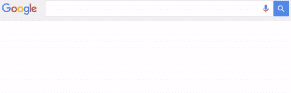

# 对电视未来的一些思考

> 原文：<https://medium.com/swlh/some-thoughts-on-the-future-of-tv-c1e527558f78>

自从六个月前加入一家媒体公司以来，我花了很多时间思考和与人们谈论电视正在发生的事情以及它的发展方向。同样的话题不断出现。

随着我听到更多关于这些话题的观点，我开始形成自己的观点(或者至少挑选出我最喜欢的辩论方)。有些是基于良好的对话，有些是基于当今构建/发展联网电视和虚拟现实产品的现实，有些是基于我们在其他媒体上看到的东西(例如音乐)或其他平台(例如手机)。

所以，没有特定的顺序，一些想法:

# **用户体验**

八个月前，蒂姆·库克说“电视的未来是应用。”

那又怎样？从电视频道到 app 意味着什么？

一个变革性的暗示是:开发者现在可以建立观众观看节目的环境。这与传统电视有着根本的不同，传统电视中每个频道的设计和功能本质上都是一样的。传统电视频道的用户体验限于(1)调谐和(2)观看。理论上，应用程序的用户体验是无限的。

HBO Go 应用程序可以不同于 Showtime Anytime 应用程序，HBO 永远不会不同于 Showtime。

既然电视体验*可以*不同，那么关于*如何*和*为什么*它们应该不同就有了很好的争论。最终目标是让观众尽可能地无摩擦、愉快和投入地观看内容。

但人们对观众希望如何体验点播流媒体服务意见不一。我听过的三种最常见的观点是:

1.  像网飞一样:每个人都知道并使用网飞。让你的服务看起来像网飞，你会没事的。
2.  *做成(有线)电视*:大家都知道有线电视。最顺畅的观看体验是当一个节目开始自动为观众播放时，就像调到传统的电视频道一样。浏览网飞风格的缩略图实际上是一种很难决定要看什么的方式。因此，点播是一个功能，但“播放什么”应该是默认界面。
3.  *让它像一个应用*:每个流媒体服务都应该为其特定的内容和使用案例而设计。作为比较，我可以通过许多不同的应用程序在手机上阅读同一篇文章——*《纽约时报》*应用程序有某种感觉， *Flipboard* 有某种感觉， *Nuzzel* 有某种感觉， *Pocket* 有某种感觉，当然还有 *Medium* 有某种感觉。它们以不同的方式组织和显示内容。他们以不同的方式搭载用户。它们在内容和其他用户的管理、保存、消费和参与方面有不同的功能。为什么？因为它们都在为不同的价值主张和使用案例优化用户体验。随着更多流媒体服务的推出，更多的使用案例和价值主张将会出现，反过来，用户体验的多样性也将会出现。

想到电视的未来，我不禁同意上面的第三点。有创造力的人倾向于利用新的创造空间和机会。有比调台观看更好的电视体验。而且有比搜索、浏览缩略图、观看更好的 VOD 体验。

但我们还没有到那一步，因为这些互联电视平台还处于早期阶段，每个人都还在试图抢占房地产:作为第一个纪录片流媒体服务、第一个动漫流媒体服务或第一个自然流媒体服务，从长远来看可能非常有价值。因此，如今市场速度比用户体验更重要。这一点——再加上上面观点 1 的流行程度——就是为什么今天所有的流媒体服务看起来基本上都一样。

同样的事情发生在 2012 年，当时每个企业都觉醒了，需要从桌面迁移到移动设备。*我们只需要一个 app！*很快，你所有的竞争对手也都有了应用，而且看起来都一样。*我们需要最好的 app！*

一个自然流媒体服务应该可以让你探索全球，或者无缝地阅读维基百科上关于鲸鱼的文章。烹饪流媒体服务应该可以帮助你建立一个购物清单，并自动保存到你的手机上。DIY 流媒体服务应该让你订购一套用品。NBA 流媒体服务应该让你选择你想听的播音员，或者和朋友一起录制自己的节目。未来的电视用户体验将更加多样、精彩和个性化。

注意:这并不是说伟大的内容不是王道。确实是。而内容低劣的流媒体服务也不会被出色的用户体验所拯救。但很快，每个拥有内容的人都将拥有不动产，一切都将与其他一切竞争(就像今天的电视频道一样)，最佳用户体验将成为竞争差异化的重要来源。

# **平台碎片**

如今，联网电视开发商面临的一个主要挑战是平台碎片化。这使它成为人们经常谈论的话题。

你可以提出一个合理的理由，即为了实现当今显著的国际增长，OTT 服务应该在(排名不分先后)Apple TV、Android TV、Amazon Fire TV、三星和 LG 智能电视、Roku、Xbox、Playstation 以及 web 和移动/平板电脑上可用。虽然将一个应用程序移植到另一个平台有一些捷径和效率，但其中许多设备需要定制开发。

如果你没算的话，那就是 9 个平台:/

作为开发人员，有两种主要的方法来处理平台碎片化:对冲你的赌注(为所有 9 个平台构建，在一个衰落的平台上花费更多的钱和风险浪费时间)或下注(为少数关键平台构建，花费更少和风险不在早期的关键平台上)。

*打个赌*方法的一个典型假设是，当前的分裂状态不能持续。平台位于客户和开发者之间。为了吸引顾客，一个平台需要提供所有最好的和最新的服务/节目。为了吸引开发者，平台需要向最大数量的潜在客户提供分销服务。第二十二条军规。

在某些时候，天平会倾斜，开发者会涌向某个特定的平台。如果移动的历史可以作为参考，人们可以合理地猜测 Roku 和三星都将采用 Android TV 作为首选操作系统，以吸引更多的开发者(进而吸引更多的客户)。

值得一提的是，我不认为平台碎片化的现状能够持续下去。我不知道电视的最终结局是 Android 还是苹果，但这是一个很好的赌注，我认为更少的碎片化对开发者和客户都是一件好事。

# **捆绑**

关于电视未来的最流行的争论之一是关于电视捆绑的未来。

摘自[打卡投资的一篇大文章](https://punchcardresearch.com/2015/07/15/discovery-communications-the-uncertain-future-of-pay-tv/):

> 付费电视行业的第三个特征是大捆绑……拥有必要杠杆的聚合器能够迫使分销商在一个大捆绑中同时获得他们最受欢迎的频道和最不受欢迎的频道……大捆绑的结果是每个订户都在交叉补贴其他人的观看偏好。
> 
> [随着时间的推移]大包变得越来越臃肿。大多数消费者只观看他们收到的频道的一小部分。他们平均每个家庭现在能收到 189 个电视频道，看 17 个。这导致沮丧和寻找更便宜的替代品。

将这种挫折感与广为人知的削减开支的增加结合起来，你就会看到一个伟大的解绑:这是一个世界的大门，在这个世界中，消费者可以挑选少量的流媒体服务来按菜单订购。一切随选。只有你想要的内容，没有你不需要的渠道。让自由主宰一切。

非捆绑世界的问题在于，对终端用户来说，它非常昂贵。同样，来自 Punchcard:

> 如果你试图在点菜的基础上从可用的服务中组装自己的捆绑包，在这里添加 7 美元的订阅和在那里添加 15 美元的服务很快就会变得昂贵。今天，按菜单选择的 17 频道捆绑包的价格可能高达 200 频道捆绑包的价格。

因此，把我加入到预测伟大的拆分之后将会是伟大的重新捆绑(或者可能被重新捆绑所取代)的人的名单中，在重新捆绑中，消费者能够以比单独购买每一项服务更低的价格从分发平台购买视频点播服务/频道包。

你可以从亚马逊的流媒体合作伙伴计划中看到这方面的早期迹象。Hulu 也刚刚宣布了捆绑 Showtime 的免费试用版。这些发行商就是看门人(和时代华纳有线、维珍传媒等方式一样。是有线捆绑的看门人)并且持有向观众可扩展分发的密钥。

亚马逊。YouTube。Hulu。付费电视提供商。智能电视制造商。Snapchat？看看谁会在大重组中成为看门人将会非常有趣。

# **加成场景:VR**

来自 [Benedict Evans](http://ben-evans.com/benedictevans/2016/4/13/the-vr-idea-maze) :

> 最近有人说，只是稍微有点轻率，你可以把世界分成认为 VR 是未来的一部分的人和还没有试玩的人。

有了演示，我可以肯定地说，虚拟现实是未来的一部分，更重要的是，是电视未来的一部分。

但我也知道一些人已经有了演示，他们说虚拟现实是一个新奇的东西，不会成为主流的内容平台(例如，对于非游戏玩家)。

这种论点通常基于某种类型的虚拟现实体验，这是当今大多数早期/实验性虚拟现实内容的典型特征。本内容重点介绍*沉浸*:戴上这个耳机，你就在水下/太空/沙漠/维斯特洛了。事实证明，*本身就是*的一点新鲜感，很快就会变得乏味。

但是 VR 内容的未来不仅仅是沉浸感。虚拟现实内容的未来和其他平台(戏剧、书籍、广播、电视)一样:伟大的故事讲述。为了参与并保持参与，我们需要了解我们在哪里，我们要去哪里(或者我们将去哪里)。

在虚拟现实中讲故事更有冲击力，更有吸引力，并将成为真正的互动。很难想象这怎么会不是电视未来的一部分。更有可能的是，这将是媒体最激动人心和最具变革性的发展之一。

好了，就这些了(目前)。我没有去脸书和推特，但我绝对相信它们都是电视未来的一部分(特别是体育直播和赛事直播)。

几年后回过头来看看这一切是如何进行的会很有趣。

如果你想和我们一起在 Blue Ant Media 开发 OTT/VR 产品，请联系我。

不是我的主意。这来自于[比尔·西蒙斯](https://medium.com/u/d12f1fa3c010?source=post_page-----c1e527558f78--------------------------------)和[克里斯·萨卡](https://medium.com/u/bf63a099047?source=post_page-----c1e527558f78--------------------------------)之间的精彩播客对话。这里强烈推荐收听。