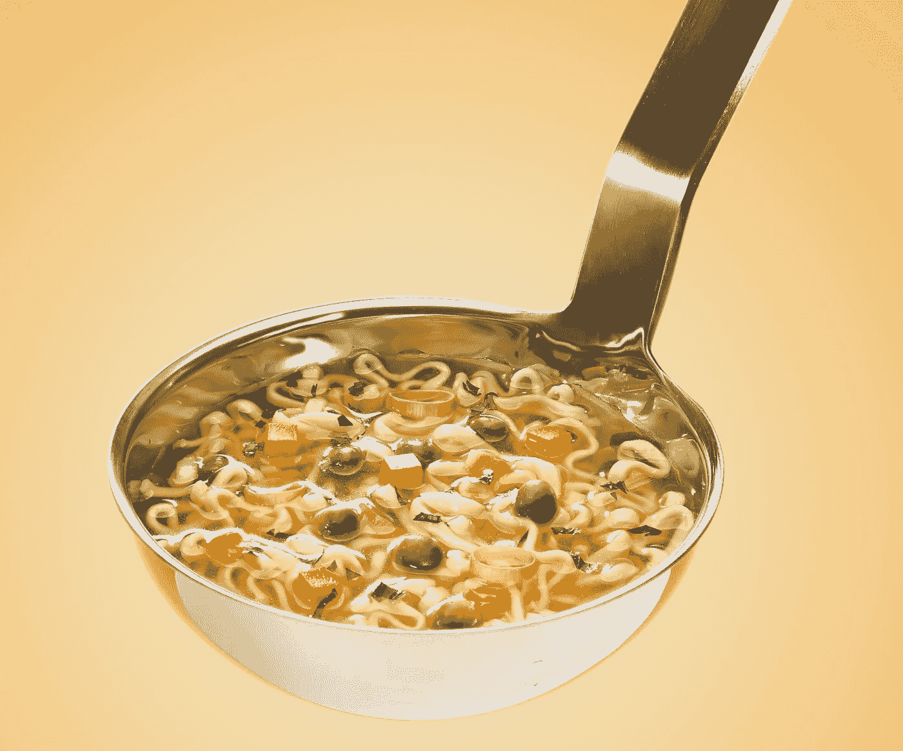

# 汤倒了！疲惫的品牌如何通过故事恢复活力

> 原文：<https://medium.com/swlh/soups-down-how-tired-brands-can-refresh-through-story-2c1e9bbdf790>

扎克里·维克斯

[价值 45 亿美元的美国罐装汤行业自 2012 年](https://money.cnn.com/2018/02/16/news/companies/campbell-soup/index.html)以来一直表现平平，而占据 40%市场份额的坎贝尔公司就是这种平淡的代表。多年来，该公司一直试图在尊重延续了 150 年的传统和现代化需求之间寻求平衡。这种平衡很难找到。

现代消费者比以往任何时候都更加注重健康。认识到这一点，金宝汤努力超越罐装汤——正如欧睿信息咨询公司分析师 Jared Koerten 所描述的，“加工食品的缩影”。他们从 Bolthouse Farms 和 Garden Fresh Gourmet 购买了健康产品系列，以扩大他们的产品，但没过多久，当他们未能增加销售额时，公司决定出售这两种产品。

如果今天的消费者如此关心他们的健康，那么为什么金宝汤针对主要市场的有益健康的产品会失败呢？

这种产品扩张失败了，因为坎贝尔突然转向营养不符合他们的品牌故事。他们对健康的拥抱在原则上并不是一个坏主意，但在实践中，这听起来不真实。人们很快看清了他们的做法的真实面目:分诊是为了在厨房配餐间重新获得突出地位，并增加利润——而消费者并不买账。

这是所有行业的许多品牌都面临的一个挑战:一家公司如何在保持其良好的身份的同时继续保持相关性？一个历史悠久的品牌如何在展望未来的同时尊重传统？

答案是:为了让一个品牌*超越时间*，他们需要投资一个*永恒的故事*。

坎贝尔关注的是他们故事的“内容”，而不是“原因”这不是关于产品——低钠汤或低糖饮料——而是关于它在情感上向消费者表达了什么。购买者希望产品或服务能够改善他们的生活，让他们成为最好的自己——无论是健康的汤，对跑步者膝盖影响较小的跑步机，还是让小企业主更高效、更有组织、更赚钱的软件。

金宝汤的故事是关于*团聚*。这个想法已经被描绘在该公司的广告[时间](http://www.retroarama.com/2011/11/fall-leaves-campbell-soup-ad-1949.html)和[时间](https://www.youtube.com/watch?v=I4vF-Xy-KFs)和[时间](https://www.youtube.com/watch?v=98TPINdTgek)中，再次代表了那个特定时刻的家庭，这在很大程度上被代表为白色郊区。在坎贝尔存在的 150 年里，“家庭”的定义一直保持相对不变，直到最近几十年。现在，“家庭”已经变得更加多样化和包容——2015 年，坎贝尔公司成功地拥抱了现代家庭，拍摄了一部真实生活中的已婚同性恋夫妇和他们的儿子的广告。

这则广告以一种相关的方式触及了坎贝尔故事的“为什么”:这种汤不是因为它的味道或低钠或方便而被宣传的。相反，它是一个家庭共度时光的工具。以他们的特别版星球大战为主题的罐子作为挂钩，广告回想起达斯·维德的经典台词(“我是你的父亲。”)开启了一场重要的对话，对抗关于什么是“正常家庭”的偏见，并倡导包容。

该广告仍然忠实于金宝汤的历史品牌，为家庭聚会提供经典美食——在亲人的舒适中享受舒适的食物——同时以真实和进步的方式拥抱家庭活力。虽然坎贝尔似乎仍在自我反省，但这次广告活动表明，他们现在正朝着正确的方向前进。

其他历史悠久的品牌通过使用一个令人信服的故事，成功地在不损害传统的情况下更新了自己，这个故事植根于使它们最初突出的东西。

乐高成立于 1932 年，在 1998 年之前从未亏损。到 2003 年，它已经负债 8 亿美元。但到 2015 年，乐高超过法拉利成为世界上最强大的品牌。那么，到底哪里出了问题，乐高的转变是如何成为公司历史上最伟大的转变之一的呢？

与坎贝尔的失误类似，乐高以不真实的方式扩张[——通过珠宝、服装、视频游戏公司，甚至主题公园。这些偏离了乐高的核心故事:促进创造性的体验。在最艰难的时刻，他们放弃了附属产品，将主题公园出售给了英国公司 Merlin Entertainments，这是一个他们没有专业知识的市场，当公园在第一年出现数百万美元的亏损时就表明了这一点。乐高又回到了他们的基本积木:砖块本身。他们利用它来配合他们的创意故事，鼓励消费者在社交媒体上和通过](https://www.businessinsider.com/legos-turnaround-strategy-2015-5?r=UK&IR=T)[众包比赛](https://digit.hbs.org/submission/lego-ideas-crowdsourcing-the-next-big-hit/)分享创作。

因此，2014 年的这部电影与之前的冒险不同，因为它是情感驱动的，植根于正义与邪恶的永恒故事。虽然《T4》被认为是优秀的品牌内容，但乐高并不是电影的主角，引人入胜的故事才是，乐高只是电影中的角色，对儿童和成人都有吸引力。以前在砖块之外的冒险失败了，乐高在这个电影系列中取得了成功，因为与过去的项目不同，他们把创意交给了懂电影的专家——华纳兄弟和好莱坞资深人士菲利普·a·洛德和克里斯多福·罗柏·米勒。

乐高没有操纵他们的产品来强行适应潮流和其他零售空间的“是什么”，而是利用了他们的“为什么”——它的砖块在服务于它可以展现的无限可能性方面的简单潜力。在这样做的过程中，他们将自己的创新产品从任何流行趋势或热门电影的次要产品重新定义为个人创造力和启蒙的载体。砖块不仅仅是一个有趣的玩具，它还是一个帮助使用者发挥最大潜能的工具。今天，乐高被谷歌、美国国家航空航天局、丰田和可口可乐等大公司用于团队建设、解决问题和头脑风暴，也用于学术上的讲故事、科学和建筑设计。

21 世纪初，Old Spice 发现自己陷入了类似的困境。此时，他们的市场已经发生了变化——年轻男性越来越关注他们的个人打扮，从而产生了对新型男性沐浴露和喷雾的需求。

像 Axe 这样的公司以前卫、现代的吸引力瞄准了这一人群，进一步疏远了 Old Spice 及其近 80 年的老品牌，这个品牌已经被视为过时、不酷，是特别严肃的祖父们的选择。结果，老香料眼睁睁地看着它的利润和市场份额减少。

但是在 2010 年，Old Spice 的销售额增长了 60 %,比前一年翻了一番。不久之后，他们成为了一个类别的领导者。那么是什么改变了呢？

品牌设计咨询机构 Method，Inc .的负责人马克·西勒姆(Marc Shillum)说:“老香料没有改变它的标志，它改变的是体验。如果他们的品牌与严肃的祖父联系在一起——他们以自己的方式传统上被视为有男子气概的男人——那么 Old Spice 的更名，通过吸引年轻观众的讽刺和讽刺，颂扬了所有的*男人。通过荒谬的广告宣传，比如男人在爬山时完成商业交易、喝醉的马人、字面上的保龄球汉堡，老香料评论了社会对男性气概的荒谬定义。他们的口号是:“相信你的气味”增强了自信，让男人随心所欲，同时减少对汗水和气味的担心。*

虽然他们的态度发生了变化，但 Old Spice 的产品相对保持不变——这留住了他们的老观众，他们更看重经典、优质的香味，而不是商业广告。就这样，老香料成了每个男人的*香水。*

A&W 餐馆曾被《大西洋月刊》评为“将于 2012 年消亡的十大品牌”然而，该公司在 2019 年迎来了 100 岁生日。该公司的品牌感觉有一个世纪的历史——它是复古的，战前的，比它的主要竞争对手麦当劳、汉堡王和温迪快餐还早。这种怀旧的氛围，很像可口可乐的独特配方，可以追溯到一个更简单的时代。

2013 年，为了避免进一步陷入困境，A&W 对其食品产品进行了战略调整，以更好地体现这一品牌故事。他们开始使用手工裹面包屑的鸡块代替冷冻油炸产品，以及不含激素的 100%全牛肉热狗和汉堡。他们还更换了碳酸苏打机和调味苏打糖浆，并回到了他们 1919 年的配方。

这些产品质量的提高在情感上引起了消费者的共鸣，他们希望有健康意识的食品不受工厂化农场或可疑餐厅做法的污染，比如麦当劳使用的“[粉红色粘液](https://www.huffingtonpost.com/entry/abc-pink-slime-court_us_58d27adae4b02d33b7473d17)”这与坎贝尔、麦当劳和其他竞争对手不同，因为 A & W 通过改变他们的核心产品做出了真正的承诺，而不是提供利基产品或“健康选择”他们做的方式不包括味道和质量。

最重要的是，通过这些改变，A&W 能够更好地体现他们讲述了近一个世纪的故事。你可以在任何地方买到普通的根啤，但是如果你想要最好的，你可以买*原装的* : A & W。简单的时间是通过简单的产品传达的——在食品行业，*简单的*意味着更少的加工成分和消费者不会发音的合成化学物质。该公司接受了他们品牌的怀旧风格，并将其与产品质量联系起来，讲述了一个故事，其中原创意味着产品最纯净、最新鲜、最清爽的版本。

随着市场的变化和消费者的演变，品牌最终会疲惫不堪。为了保持相关性，公司不应该投资偏离其品牌根本“为什么”的战略。相反，通过投资一个永恒的、令人信服的故事，在情感上与消费者、客户或服务用户产生共鸣，公司将*超越时间*——将他们的故事更新到当前时刻，同时保持植根于最初使他们成功的核心价值观。

扎卡里·维克斯是沃顿 *的合伙人。无论你讲故事的需求是什么，沃顿都可以帮助你。* [*阅读我们的广泛指南*](http://brandstory.wodenworks.com/) *了解如何精心组织您的叙述，或者给我们发电子邮件至*[*connect@wodenworks.com*](mailto:connect@wodenworks.com)*讨论我们如何帮助讲述您的故事。*

## 这篇文章发表在 [The Startup](https://medium.com/swlh) 上，这是 Medium 最大的创业刊物，拥有+ 373，071 读者。

## 在这里订阅接收[我们的头条新闻](http://growthsupply.com/the-startup-newsletter/)。

