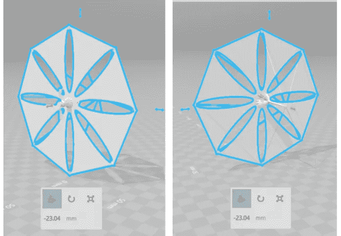

# 航天公司 101:基础，重点和要点

> 原文：<https://medium.com/swlh/space-company-101-basics-focus-and-the-essentials-45df590ffb12>

# 由 [1](https://medium.com/u/4fb2aa542c6a#x1) ]

薄纱技术可以在这方面带来一场革命。Gossamers 重量轻，薄，可以在发射时压缩成一个更小的包。目前的研究重点是利用这些薄纱设计模块化结构，机器人或宇航员可以轻松组装这些结构，以建造太阳能电池板、天基雷达甚至未来的栖息地。由于其尺寸和重量，这将把任务成本削减到现在的 1/10，并有可能为我们提供一个可配置的空间架构。[ [2](#x2) ][ [3](#x3)

薄纱也有可能减少航天器的燃料重量。这些薄纱可以用来设计太阳帆，它将利用反射表面的光子压力推动航天器。这种帆放置在离太阳 1 个天文单位的地方，理想情况下可以承受 9.126 的压力

2.航天器离太阳越近，压力越大。这意味着我们可以在不使用任何燃料或电力的情况下获得一些推进力。此外，这种航天器的寿命也会特别长。因此，建立这样的技术可以大大提高你的公司的财务状况。但是建造这些是工程上最大的挑战之一。总质量和帆尺寸的临界比(用表示)需要尽可能小，以获得最大效率。目前，它处于 50-80 克/平方米的范围内，但预计将降至 20 克/平方米。[ [5](#x5)

*Figure 1: A 3D concept of a solar sail. The front view is represented in the left while the back view is shown in the right.[*[*6*](#i1)*](modified)*

此外，全新的材料可以用来减轻航天器的干重。目前，我们在航天器中使用先进的碳纤维增强体，这已经使我们的太空之旅更加安全和具有成本效益。但是现在随着纳米技术的蓬勃发展，新的候选技术被提出来取代它。一个可能的例子是碳纳米管。它们被认为是迄今为止发现的抗拉强度最高的材料之一，而且重量很轻。经测试，多壁碳纳米管的拉伸强度为 63 吉帕斯卡，远远高于碳纤维复合材料和不锈钢。[ [7](#x6) ][ [8](#x7) ]

更快的航天器:我们的目标是在宇宙中越走越远，为了更有效地做到这一点，我们需要更快的航天器，能够在很短的时间内穿越很长的距离。世界上最快的航天器记录目前由太阳神 2 号航天器保持，它的日心速度为每小时 252792 公里。但是对于一个深空任务来说，即使这个速度也是相当慢的。因此，你和你公司的研发可以专注于提高未来航天器的速度(以及燃料效率，这是相当明显的),并可以开创首次深空任务。

建造更快的航天器的范围是巨大的，因为甚至考虑星际旅行所需的研究和成就都还没有达到。有一些理论和实践上的建议，但还没有任何东西变成现实。使用一系列受控核爆炸来推进航天器的建议是最受欢迎的一种。与目前的发动机相比，这种发动机将能够提供非常高的比冲和功率，理论平均速度可达每小时 72，000，000 公里。[ [10](#x9) ][ [11](#x10)

太空旅游:太空工业中另一个令人兴奋的项目是太空旅游。通过建造低成本的航天器和负担得起的发射系统，你的公司可以带着平民进入地球轨道。这个概念只被俄罗斯航天局测试过，但是前景非常好。研究预测，到 2030 年，低地球轨道旅游业每年将稳步增长 18%-26%。[ [12](#a2)

开一家轨道连锁酒店也是一个不错的主意，所需的技术也不太难，因为比起类似地球的环境(需要产生人造重力)，客人更喜欢待在零重力环境中。但到了 2030 年，在轨道交通区域运营的酒店将多达 100 家。为了给你的客人带来不同的体验，你可以在极地轨道上建立一些高级酒店，为他们提供壮观的地球景观。

*Figure 2: View of the moon setting over the Pacific ocean as seen from the International Space Station. Many of such views will be the prime attraction for future space tourists.[*[*13*](#i2)*]*

**空间挖掘:**空间的丰富程度是无法想象的。这里有丰富的各种自然资源，如果能够适当和定期地开采，它们可以获得真正的利润。近地小行星最适合这种采矿项目。[ [14](#a3) ]对 162173 Ryugu 这一近地天体的开采可产生高达 300.7 亿美元的利润。还需要记住的是，估算是基于当前可用的技术，如果使用更复杂的技术，甚至可以产生更大的利润。

太空能源:人类人口在稳步增长，对能源的需求也在稳步增长。很快，我们将面临能源短缺，这就是你们公司发挥作用的地方。地球表面只接收到非常少量的太阳能，因为大部分太阳能要么被反射，要么被吸收。但是放置在地球静止轨道上的太阳能电池板可能是可再生能源领域的一场革命。放置在这种轨道上的面板可以直接从阳光中发电，然后通过无线方式传输电力。[ [16](#a5)

# 市场调查

虽然这里列出的所有想法(我相信你也想到了一些更好的概念)都很吸引人，但在你全力以赴之前，你需要对你的竞争对手进行彻底的市场调查。找出你的竞争对手提供什么，他们的哪些服务是优秀的，他们的缺点是什么。一旦你正确地做到了这一点，你将很容易发现你的公司必须关注的地方，以及你永远不应该犯的错误。此外，如果可能的话，接触你的潜在客户，了解他们真正想要的和需要的。

# 反馈和原型

下一个但也是最重要的部分是与你信任的人讨论你的想法，这些人实际上正在前沿研究领域工作。他们可以是同事、朋友、大学教授，甚至是家庭朋友，只要他们的知识焦点与你的想法相关。愉快地接受所有的批评，并在你认为合适的情况下做出任何改进。

下一部分是构建和测试一个原型。但是在一些项目中，可能无法实际创建原型。在这种情况下，你可以设计一个计算机模拟来展示你的想法是如何工作的，并在所有可能的场景中进行测试。

# 提供资金

接下来是最后，但可能是最棘手的部分。在项目的最初开发阶段，一家航天公司可能需要不止一次而是多次的巨额投资。然而，你可以从多种选择中寻求初始资助，但很少有人能给你这么大一笔钱。接触当地天使投资者是必须的。你也可以联系一些知名的公司投资者，但在此之前，要确保你的陈述和想法足以打动他们。如果你的公司着眼于可再生能源的未来，一些政府还会提供一些投资或税收优惠。如果你需要的启动资金很少，不要犹豫去银行贷款。

# 包扎

如果你设法遵循所有这些步骤，并设法获得适当的资金，那么可能性是无限的。不管公司盈利多少，也不管它经营多少不同的部门，一定要维护公司的核心价值观和目标。谁知道呢，也许在接下来的几年里，你的公司将彻底改变我们思考甚至梦想太空的方式。

# 文献学

1.火箭制造材料 II。宇航学 6，14–15(1936)。

2.戈萨默空间结构小组。IEEE 航空航天会议论文集。№03 8652)8 号(2003 年)。

3.Chmielewski，a .和 Jenkins，C. Gossamer 航天器。自然与工程中的柔顺结构 20，203–243(2005)。

4.太空航行。(戈登和裂口，1993 年)。

5.空间太阳帆和其他大型薄纱结构的超轻型可展开吊杆。《航天学报》68，984–992(2011 年)。

6.太阳帆概念 2。Nasa3d.arc.nasa.gov(2014 年)。在

7.余，男；劳瑞，O；戴尔，MJ；莫洛尼，K；凯莉，TF；鲁夫水库。“拉伸载荷下多壁碳纳米管的强度和断裂机理”。科学。287(5453): 637–640 (2000).

8.美国国家航空航天局——超级宇宙飞船的合适材料。Nasa.gov(2002 年)。在

9.《太阳的新视野:卫星图像和业余观测指南》(天文学家的宇宙)。37(施普林格柏林海德堡，2012 年)

10.美国宇航局。核脉冲飞行器研究简要报告。(美国航天局，1964 年)。在

11.星际运输。今日物理学 21，41–45(1968)。

12.2030 年的太空旅游业。空间 2000 595–597(2000 年)。doi:10.1061/40479(204)72

13.国际空间站远征 34 号机组人员。(2013).在

14.开采近地小行星的技术和经济可行性。航天学报 41，637-647(1997 年)。

15.小行星数据库和采矿排名。Asterank.com(2018 年)。在

16.无线电力传输的机会之窗。AIP 会议论文集 324，(1995)。

德班苏·巴塔查亚

嗨，你好！我是德班苏，今年 21 岁。我在加尔各答大学迪纳班杜安德鲁斯学院学习物理。我喜欢太空，喜欢在晴朗的日子看天空。我的其他爱好包括编码、足球、听轻音乐和读故事书。

**社交媒体链接:**

**https://www.facebook.com/debansu.bhattacharya.79**脸书

**推特:**https://twitter.com/ThePhyTraveller

**中等:**https://medium.com/@iamjeet05

指南:

— — — — — — — — — — — — — — — — — — — — — — — — — — — —

Tafheem 是一名太空爱好者，在太空生物学领域工作，正在研究外层空间的自我维持环境。他和一个充满活力的研究团队一起，正在建立一个空间学习平台。此外，他还致力于在各种印度学校创建首个针对特定主题的互动教育游戏模块。

[https://www.linkedin.com/in/tafheemmasudi](https://www.linkedin.com/in/tafheemmasudi/)/

 [## 塔菲姆·艾哈迈德·马苏迪

### 塔菲姆·艾哈迈德·马苏迪在脸书。加入脸书，与塔菲姆·艾哈迈德·马苏迪和其他你可能认识的人联系…

www.facebook.com](https://www.facebook.com/tafheemmasudi)  [## 塔菲姆·马苏迪(@塔菲玛苏迪)|推特

### 塔菲姆·马苏迪的最新推文(@ tafheemmasudi)。想成为科学家。印度本加卢鲁

twitter.com](https://twitter.com/tafheemmasudi) 

T2 博士苏肯特·库拉纳经营着一个学术研究实验室和几家科技公司。他也是著名的艺术家、作家和演说家。你可以在 www.brainnart.com 的[或 www.dataisnotjustdata.com 的](http://www.brainnart.com)或[了解更多关于 Sukant 的信息，如果你希望为公益事业从事区块链、生物医学研究、神经科学、可持续发展、人工智能或数据科学项目，你可以在 skgroup.iiserk@gmail.com 联系他，或者通过 linkedin 的](http://www.dataisnotjustdata.com)[https://www.linkedin.com/in/sukant-khurana-755a2343/](https://www.linkedin.com/in/sukant-khurana-755a2343/)联系他。

这里有两个关于 Sukant 的小纪录片和一个关于他的公民科学努力的 TEDx 视频。

## 这个故事发表在 [The Startup](https://medium.com/swlh) 上，这是 Medium 最大的创业刊物，拥有 328，729+人关注。

## 在此订阅接收[我们的头条新闻](http://growthsupply.com/the-startup-newsletter/)。

