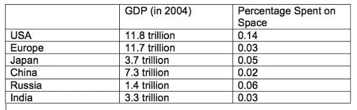

# 空间探索

> 原文：<https://medium.com/swlh/space-exploration-64b8d9b1919b>

# 作者如来·库马尔

## 由[塔菲姆·艾哈迈德·马苏迪](https://medium.com/u/4b43edc4cafd?source=post_page-----64b8d9b1919b--------------------------------)和[苏坎特·库拉纳](https://medium.com/u/6d41261644a8?source=post_page-----64b8d9b1919b--------------------------------)指导

人类被驱使去探索未知，发现新世界。我们渴望突破我们的科学知识和技术极限。几个世纪以来，探索和挑战我们所知的界限和我们去过的地方的无形愿望给我们的社会带来了好处。

**什么是太空探索？人类对太空的兴趣是普遍而持久的，自古以来他们就梦想着太空飞行。**

太空探索是通过载人和不载人的宇宙飞船探索地球大气层以外的宇宙，并利用由此获得的信息增加对宇宙的了解，造福人类。

历史
几个世纪前，中国人将火箭用于庆祝和军事目的，然而在 20 世纪后半叶，火箭被开发出来，其强大的力量足以克服重力，并达到可以为人类探索太空打开空间的轨道速度。

第一颗美国卫星“探索者 1 号”于 1958 年 1 月 31 日进入轨道。1961 年，艾伦·谢泼德成为第一个飞入太空的美国人。

1962 年 2 月 20 日，约翰·格里恩的历史性飞行使他成为第一个绕地球飞行的美国人。

1969 年 7 月 20 日，宇航员尼尔·阿姆斯特朗登上月球，迈出了“人类的一大步”。从 1969 年到 1972 年，阿波罗计划进行了六次探月任务。

到 20 世纪 70 年代初，轨道通信和导航卫星已被日常使用，水手号宇宙飞船正在轨道上运行并绘制火星表面。到 20 世纪 90 年代末，旅行者号飞船已经发回了木星和土星、它们的光环和卫星的详细图像。

美国的第一个空间站“天空实验室”是 20 世纪 70 年代人类太空飞行的亮点，阿波罗联盟号试验项目也是如此，它是世界上第一个国际载人(美国和俄罗斯)太空任务

**太空探索的阶段**

历史学家区分了三个伟大的探索时代:
1) **发现时代**15、16 世纪与航海家亨利王子、哥伦布、麦哲伦等欧洲探险家有关。
2) **第二个时代**(18 世纪和 19 世纪)，以进一步的地理探索为特征，如库克船长的航海，这是由科学革命支撑和推动的。第三个时代从国际地球物理年和人造卫星开始，主要与太空探索有关，但也与南极和海洋有关。

**太空生活**

从临床角度来看，生物航天学和空间医学研究表明，人类可以在空间生存，在空间工作，并在另一个天体表面执行复杂的科学任务。在 60 年代短期飞行目标呈指数增长之后，过去的 40 年集中于发展载人航天的长期飞行能力。美国和俄罗斯的许多专家都希望将人类送上更远的太阳系。为了让这一愿景成为现实，人类对太空的适应必须经过数月而非数天的研究。俄罗斯礼炮系列空间站和美国航天局强调未来十年载人航天飞行的天空实验室方案被用来评估人类在微重力环境下长期生活和工作的能力。这两个项目都提供了与空间医学相关的空间生理学的基本数据，但它们也证明了在新一代空间站上执行长期任务的需要。
加拿大航天局(CSA)的研究人员与多伦多加拿大国防研究与发展中心的 DCS 专家合作，作为美国航天局支持的三个研究点之一，参与开发新的预呼吸协议，用于为从国际空间站进行太空行走做准备。这导致国际伙伴广泛认可加拿大在生命科学和空间医学研究方面的专长，这种专长一直延续到国际空间站利用的现阶段。

**什么是航天医学？**

空间医学可以定义为在局部和微重力环境下提供医疗保健的医学实践领域。护理范围不仅涉及空间疾病和损伤的预防、诊断和治疗，还涉及飞行前的医疗选择和调理以及飞行后的康复。商业空间业务的扩展包括 SFP 和在亚轨道和轨道飞行中乘坐商业航天器的潜在职业宇航员，这给空间医学界带来了许多潜在的问题。为了支持 2004 年商业航天发射修正法案，FAA 发布了一系列对商业航天器上的机组人员和 SFP 的要求。

**为什么是航天医学？**

尽管有严格的筛选计划，但国际空间站工作人员人数的增加，加上长期任务和 SFP 飞行频率的增加，表明在轨医疗事件的频率可能会增加。虽然这些事件中的大多数包括空间适应综合征、晕动病、背痛、肌肉骨骼问题和睡眠中断，但存在更重大的医疗事件的可能性。因此，在过去十年中，人们对开发和测试创新的诊断和治疗方法产生了相当大的兴趣并开展了大量研究，这种兴趣和研究将在整个国际空间站使用过程中持续下去。

**当前型号**

目前在国际空间站上提供医疗保健的范例是基于专门的机组医疗官员，他们利用机组医疗保健系统的资源来预防、诊断和治疗在轨医疗事件。国际空间站上有许多综合医疗包，用于治疗探险飞行综合医疗小组医疗行动清单中概述的在空间出现的常见医疗问题。在某些情况下，CMO 是一名医生，但在大多数情况下，他们是机组人员，接受了额外的医疗培训，为任务做准备。CMO 通过语音/视频私人医疗会议在飞行外科医生的指导下提供医疗服务。这种方法在管理发生在空间的医疗事件方面极为有效。
以目前的技术，其他诊断成像(DI)技术在太空中的使用并不实际。进一步研究诊断超声的作用和开发替代性诊断超声技术与未来低地球轨道以外的探索能力同等重要。过去的研究工作侧重于了解对微重力的生理适应，并开发了一系列预防对策，导致进一步的工作，将继续改进这种预防策略。然而，还需要大量的临床研究。

**需要做什么？**

人类空间飞行的未来可能包括增加低地球轨道的可进入性和利用，以进行商业投资，并继续使用国际空间站，最终过渡到可能涉及重返月球或火星任务的探索任务。进一步发展针对特定任务的医疗能力的需要包括讨论“待命战斗”能力的需要和利用“装载并出发”的方法返回地球进行明确的医疗护理之间的平衡。目前在轨医疗保健的方法是将两种方法结合起来使用，既有即时的临床护理，又有紧急或突发脱轨和着陆的可能性，以获得明确的医疗保健。随着人类进入更远的太空，医疗中止返回地球的情况变得不太实际，在某些时候会过渡到继续飞往目的地。这就提出了一些问题，如确定适当的护理水平，向地球传输更长信号对机组人员自主性的影响，以及新技术在任务不同阶段提供医疗保健方面将发挥的作用。

太空医学的未来。

下一个十年为进一步的基础设施服务研究提供了一个机会，以开发新的诊断和治疗能力，评估新技术和评价 CMO 技能保留和及时培训的战略。除了为商业空间综合体开发机载临床护理外，这项研究对于准备低地球轨道以外的探索级任务也很重要。基于为商业远洋航行提供船上医疗保健的地面方法，商业空间综合体很可能会有船上诊所，由医生或其他医疗保健专业人员提供临床护理。未来几十年，商业太空旅行的发展将把太空医学的范围从政府支持的载人航天扩展到民用航天领域。虽然政府和商业团体的载人航天飞行目标不同，但在开发预防和治疗飞行中疾病和损伤的最佳方法方面，航天医学从业者将有共同的兴趣。

**为什么要进行太空探索？？**

**它让人们更多地了解宇宙。**

它创造了大量的就业机会。

它可以为许多问题提供解决方案
(除了收集有关外太空的信息，许多太空探索项目也被用来解决困扰现代社会的一些问题。例如，一些项目帮助科学家更多地了解地球大气层，并知道如何更好地预测天气和自然灾害。与此同时，其他人则专注于寻找能够支持人类生活的行星，这可能是解决地球人口增长的办法。)

**它为先进技术铺平了道路。**

1.GPS 技术

2.乳腺癌测试成像

3.基于美国宇航局航天飞机主发动机燃油泵设计的人工心脏泵，补充左心室的心脏泵送能力

4.聚四氟乙烯涂层玻璃纤维是 20 世纪 70 年代开发的一种新的宇航员宇航服面料，已经被用作建筑物和体育场的永久性屋顶材料。

**太空探索的弊端**

这是一项耗资巨大的努力(2005 年，美国宇航局的预算为 162 亿美元；这不仅包括载人航天部门，还包括其他工程项目，以及由美国国家航空航天局资助的科学。2005 年的联邦总支出预算约为 2 万亿美元(20000 亿美元)，使美国宇航局的份额占预算的 0.8%。

**有可能把有害元素带回地球。**

**导致太空污染。**

**对宇航员构成风险。不可否认，太空探索让宇航员的生命处于危险之中。事实上，这些年来发生了许多事故，造成了无数的伤亡。即使任务并不总是以灾难告终，它们仍然会使宇航员面临广泛的健康问题。研究表明，长时间处于失重状态会严重影响一个人的心血管和肌肉骨骼系统，使他容易患各种疾病。暴露于太空中存在的高能电离宇宙射线会导致癌症的发生。**

**结论**

太空探索是整个人类最大的成就之一，它为多年来更深入的科学理解和许多技术进步铺平了道路。很多人认为我们应该放弃太空探索，很大程度上是因为成本(这很昂贵——美国宇航局每年花费大约 160 亿美元)。但是花在太空探索上的钱并没有模糊地漂向银河系。它创造新的技术和产品，以及新的就业机会和业务。所以，也许没有唐你也能活下去，但你会放弃你的电脑、你车里的 GPS 导航系统或你的手机吗？就在未来几年内，太空计划预计将提高我们对太阳能发电、低温技术和机器人技术的认识，预计这些技术将在医疗保健、能源和环境、日常技术和许多其他领域带来巨大进步。但是，不可否认，它也有几个弊端，这就是为什么政府和科学家应该尽快找到利弊之间的平衡。

参考资料:

丹尼尔·布尔斯廷的《发现者》(1983)，尤其是第 186-201 页。

链接 MM. In:水星计划 NASASP- 4003 中的空间医学。链接 MM，编辑。DC 华盛顿:美国航天局科学和技术信息办公室；1965.b.

约翰斯顿 RS，迪特林洛杉矶，贝里加州。载于:阿波罗的生物医学成果。约翰斯顿遥感，迪特林洛杉矶，贝里加州，编辑。DC 华盛顿:美国航天局科学和技术信息办公室；1975.C

天空实验室生命科学研讨会会议录，第 2 卷，1974 年 8 月 27-29 日。美国德克萨斯州休斯顿:1974 年。

[Sawin CF. Biomedical](https://www.ncbi.nlm.nih.gov/pubmed/10206938) 为支持持续时间延长的轨道飞行器医疗项目而进行的调查。航空航天环境。1999 年 2 月；70(2):169–180

www.nasa.gov/

斯捷潘尼克 PC，拉姆昌达尼老，琼斯 JA。宇航员的急性尿潴留。航空航天环境。2007 年 4 月；78(4 补):A5–A8[【考研】](https://www.ncbi.nlm.nih.gov/pubmed/17511293)

太空飞行的生物医学挑战。一年医学回顾。2003;54:245–256

— — — — — — — — — — — — — — — — — — — — — — — — — — —

你好！我是如来·库马尔，

一名计算机科学专业的本科生，在 NIIT 大学攻读工程技术，目前是三年级学生。我在兰契的布里奇福德学校上学。一个认真、注重细节、好奇的人，目标是利用他的分析、领导和沟通技能，同时使组织受益并获得一些宝贵的经验。

我精通各种编程语言。目前正在使用 Python 研究文本摘要的方法。

此外，积极参与大学社区联系计划:教育社会弱势群体。

领英:[https://www.linkedin.com/in/tathagat-kumar-776a0314a/](https://www.linkedin.com/in/tathagat-kumar-776a0314a/)

脸书:https://www.facebook.com/kumar.tathagat

数字组合:【https://tathagatkumar4.wixsite.com/tathagat 

— -

— — — — — — — — — — — — -

Tafheem 是一名太空爱好者，在太空生物学领域工作，正在研究外层空间的自我维持环境。他和一个充满活力的研究团队一起，正在建立一个空间学习平台。此外，他还致力于在各种印度学校创建首个针对特定主题的互动教育游戏模块。

https://www.linkedin.com/in/tafheemmasudi/

 [## 塔菲姆·艾哈迈德·马苏迪

### 塔菲姆·艾哈迈德·马苏迪在脸书。加入脸书，与塔菲姆·艾哈迈德·马苏迪和其他你可能认识的人联系…

www.facebook.com](https://www.facebook.com/tafheemmasudi)  [## 塔菲姆·马苏迪(@塔菲玛苏迪)|推特

### 塔菲姆·马苏迪的最新推文(@ tafheemmasudi)。想成为科学家。印度本加卢鲁

twitter.com](https://twitter.com/tafheemmasudi) 

Sukant Khurana 博士经营着一个学术研究实验室和几家科技公司。他也是著名的艺术家、作家和演说家。你可以在 www.brainnart.com[或 www.dataisnotjustdata.com](http://www.brainnart.com)了解更多关于苏坎特的信息，如果你希望从事区块链、生物医学研究、神经科学、可持续发展、人工智能或数据科学公益项目，你可以在 skgroup.iiserk@gmail.com 联系他，或者通过 LinkedIn[https://www.linkedin.com/in/sukant-khurana-755a2343/](https://www.linkedin.com/in/sukant-khurana-755a2343/)联系他。

这里有两个关于 Sukant 的小纪录片和一个关于他的公民科学努力的 TEDx 视频。

## 这篇文章发表在 [The Startup](https://medium.com/swlh) 上，这是 Medium 最大的创业刊物，有 320，131+人关注。

## 在这里订阅接收[我们的头条新闻](http://growthsupply.com/the-startup-newsletter/)。

