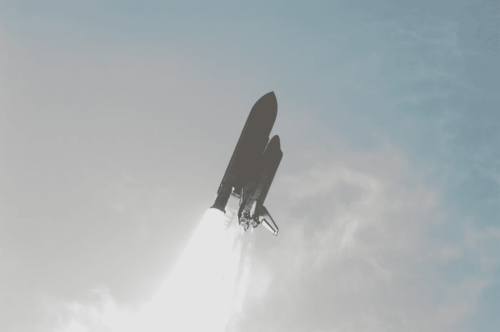

# 航天飞机和瓦片丢失

> 原文：<https://medium.com/swlh/space-shuttles-and-tile-loss-f95653fd0df4>

## 令人震惊的常见组合

The Shuttle Endeavour is pictured here as it entered its roll program during launch of STS-118\. Picture- NASA

2007 年 8 月 8 日，奋进号航天飞机搭载七名机组人员进入轨道，执行国际空间站组装任务。STS-118 的发射看起来像航天飞机计划中的许多其他发射，它的任务是另一次前往国际空间站。到目前为止，一切顺利。

工作人员中有芭芭拉·摩根，她是最初被“教师”接纳的一名教师…