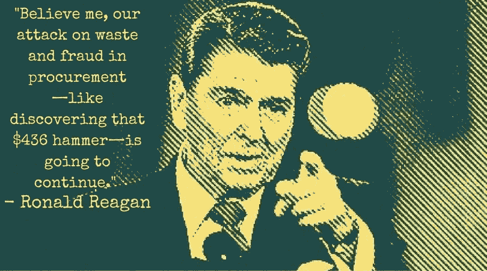
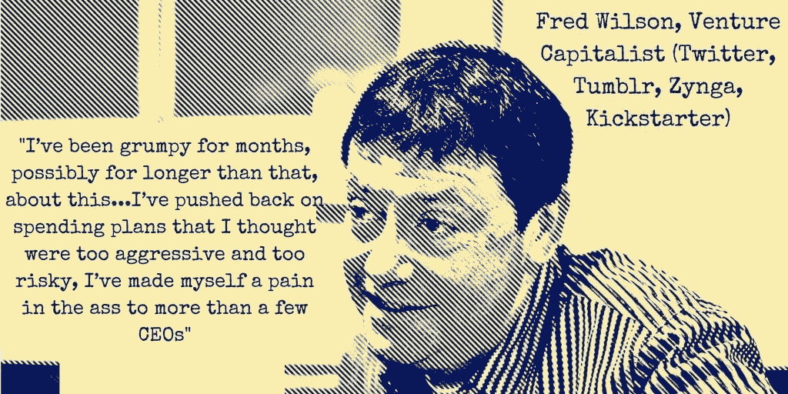

# 消费文化有望成为美国企业界最热门词汇。意思是这样的。

> 原文：<https://medium.com/swlh/spend-culture-is-poised-to-be-hottest-buzzword-in-corporate-america-heres-what-it-means-38a2262fb429>

[***由尼坦纳朗***](https://www.linkedin.com/in/nitant-narang-49446014/)

# 这一切都始于一把价值 436 美元的羊角锤

这是 1985 年，罗纳德·里根——美国第 40 任总统，里根经济学(Reaganomics)的设计师，里根经济学是一套同名的自由市场政策，为 20 世纪 80 年代的经济复兴和随后几十年的科技繁荣奠定了基础——被警告说，国防部(DoD)进行的一项采购交易出现了一桩轰动的丑闻。

争论的焦点是据称购买了一把[436 美元的羊角锤](http://www.apnewsarchive.com/1985/Reagan-Says-Pentagon-Didn-t-Buy-$400-Hammer/id-e1f0fe8dc2cd7c275f9fea1966e644c9)，以及一份同样定价过高的采购清单，包括国防部的[间接支出](http://blog.procurify.com/2012/12/17/direct-goods-vs-indirect-goods/)。白宫正准备迎接媒体的一个重要日子，记者和摄影师们互相攀附着质问政府。

在对全国的讲话中，里根向美国人民保证:“相信我，我们对采购中的浪费和欺诈的攻击——就像发现 436 美元的锤子——将继续下去。”随之而来的是愤怒的专栏和报纸专栏对丑闻的猛烈抨击，迫使里根成立了一个特别委员会来审查采购过程。

一把价值 436 美元的羊角锤、一台价值 7622 美元的咖啡机、一个价值 640 美元的马桶座圈和一个价值 659 美元的烟灰缸让整个国家意识到了无计划无节制消费的危险。

# 快进了 31 年

我们在 2016 年；技术已经成为我们生存的要素，就像空气一样；数十亿美元正被投入到人类的智慧、企业和想象力上；事实上，历史上从未有过一个想法如此容易跨越思想和现实之间的鸿沟。

然而，一些问题仍然存在。据报道，今年 3 月，一家估值超过 160 亿美元的公司在意识到其支出失控后，将利润预期下调了 78%。作为纠正，首席执行官建议他的员工改变公司*的消费文化*。这位首席执行官的公司是世界上最有价值的初创公司之一，他提供了一些明智的建议来实现更好的消费文化——比如提醒员工确保在不使用时关灯，或者鼓励高管在点昂贵的饭菜时表现出更多的克制。

对于一家数十亿美元的公司来说，它在尖端技术上运营，拥有企业家只能梦想的所有资源和资本，它解决无节制支出的办法需要不仅仅是关于节俭美德的家长式陈词滥调。然而，所有公司都无法避免不受控制的支出，也不知道如何应对——在各行各业，财务报告在季度末带来惊喜后，CFO 和 CPO 都被解雇了。正如令人好奇的 436 美元羊角锤案例所显示的那样，这种惊人的超支模式通常反映在公司的间接支出中，或者换句话说，不增加企业底线的商品支出，如维修设备、购买办公用品和其他类型的服务。由于间接支出仅被视为公司支出的次要组成部分，因此它对公司财务的影响往往会被大多数公司忽视，尽管它占公司采购的近 80%。

# 流程驱动型和前瞻性

事实上，错误不在于不受控制的支出——它在于没有认识到公司没有一个*过程*来控制他们的支出。

[继续阅读……](http://blog.procurify.com/2016/09/19/spend-culture/)