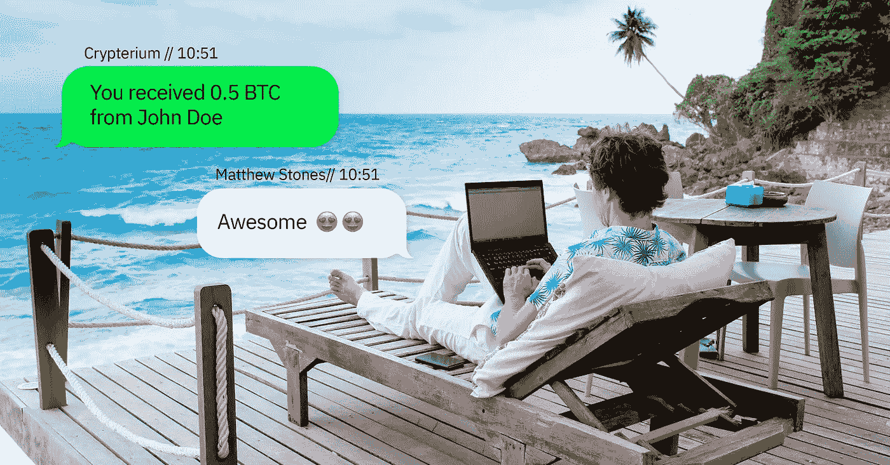
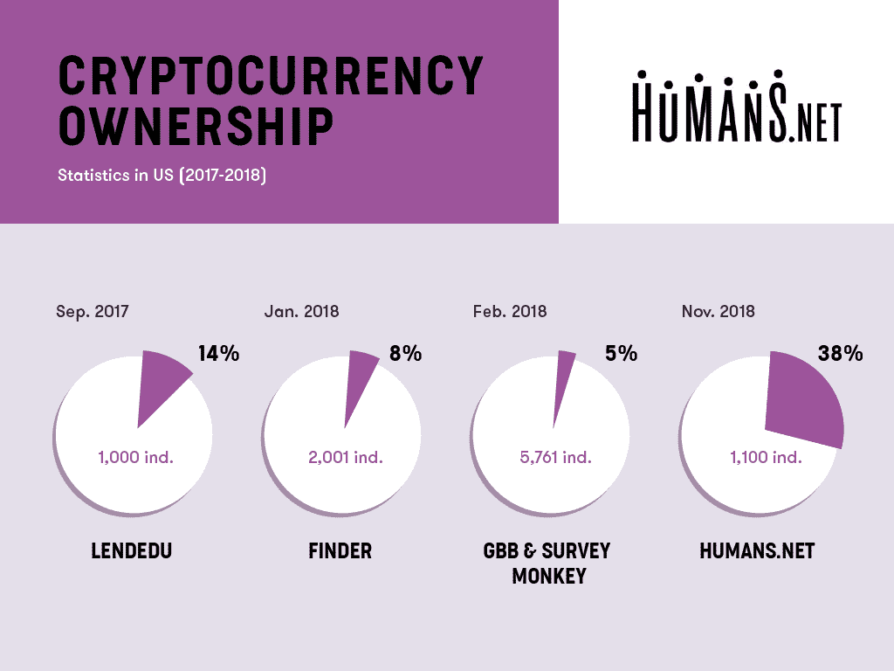

# 在巴厘岛消费比特币

> 原文：<https://medium.com/swlh/spending-bitcoins-in-bali-9d0c8aaeff7>

你有没有想过住在某个太平洋岛屿的别墅里，每天早上去海滩，拥有一份梦想中的工作，并以一种全球通用的货币获得报酬？你并不孤单。根据 humans.net 招聘平台 *进行的一项调查* [*，29%的自由职业者宁愿在加密领域获得报酬，也不愿在传统系统和银行工作。*](https://news.bitcoin.com/the-daily-29-of-freelancers-want-to-be-paid-in-crypto-asian-exchanges-fake-volume/)

该平台已经委托对美国自由职业者的支付偏好进行了一项调查。Humans.net 调查了 1100 名美国公民，以确定他们接受比特币或替代币支付的可能性，18%的受访者表示明显倾向于数字货币支付而不是法定货币支付。被询问的人中有自雇的专业人士，如设计师、教师和开发人员。我知道你在想什么，当我们坐在办公室时，这些人正在泰国或(插入你最喜欢的度假目的地)享受阳光，但他们仍然在抱怨什么。事实是，不仅仅是自由职业者喜欢在加密中获得报酬的想法。

除了希望在加密中获得报酬，许多自由职业者正在定期使用加密货币。根据另一项 Humans.net 调查，在接受调查的 1100 人中，他们都是在美国生活和工作的自由职业者，经常或定期使用 crypto，相比之下，24%的人以前从未听说过它。41%的人以前从未使用过 crypto，显然，这个数字包括了从未听说过它的人。人们认为国际支付和缺乏中介是加密货币的优势。

如上表所示，加密所有权和自由职业者的关系有点不稳定。这些数字与比特币价格或任何市场状况之间没有关联，这可能只是不同的调查方法。

在加勒比群岛中部的一些岛屿上，人们整天在 MacBooks 上工作，他们的抱怨还没有结束。自由职业者同意，现在在区块链没有足够的自由职业者友好的选择。没错，比特币基地不是新的贝宝，比特币和币安也不是。

目前，自由职业者有几种选择来获得他们的报酬。如上所述，这些平台包括 PayPal 和 QIWI 等在线金融科技平台，西联汇款等汇款平台和银行电汇。Crypterium 的应用程序有可能增加以加密方式支付给自由职业者的报酬比例。

其他选项可能会很慢，也不总是可靠——Crypterium 的[解决方案](https://www.youtube.com/watch?v=ps5g2Bikz4Y&feature=youtu.be)是让用户有机会在几秒钟内将钱汇往他们想去的任何地方。这是巴厘岛海滩常客的最佳选择。

## 关于地下室

  C   Crypterium 正在开发一个移动应用程序，将加密货币变成你可以像使用现金一样轻松消费的货币。在世界各地购物，在任何 NFC 终端或通过扫描二维码用硬币和代币支付。在网上商店购物，支付您的账单，或者只是在几秒钟内跨境汇款，可靠且只需几分之一便士。

加入我们的 [**电报新闻频道**](https://t.me/crypterium_en) 或其他社交媒体，保持更新！

[**网站**](http://crypterium.com)**๏**[**电报**](https://t.me/crypterium)**๏**[**脸书**](https://www.facebook.com/pg/crypterium.org)**๏**[**推特**](https://twitter.com/crypterium)**๏**[**bitcointalk**](https://bitcointalk.org/index.php?topic=2214098.0)****************

********

## ****这篇文章发表在 [The Startup](https://medium.com/swlh) 上，这是 Medium 最大的创业刊物，有+396，714 人关注。****

## ****订阅接收[我们的头条](http://growthsupply.com/the-startup-newsletter/)。****

********