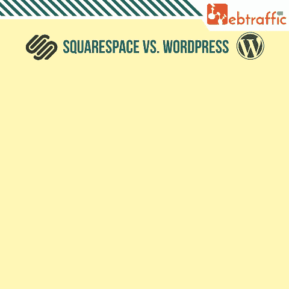
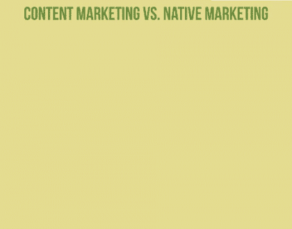
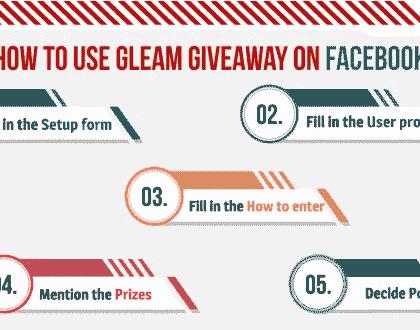

# Squarespace vs. WordPress

> 原文：<https://medium.com/swlh/squarespace-vs-wordpress-e761325b6905>

世界上有各种各样的内容管理系统。在创建网站时，选择内容管理系统是必要的。比较著名的有 WordPress、Joomla、Magento、Drupal 等。现在，也有很多关于 Squarespace 的商业广告，它现在越来越受欢迎。由于 WordPress 是所有平台中最著名的，而 Squarespace 现在也加入了竞争，我们将提供两者之间的比较，这样到本文结束时，你就会对使用哪个平台有一个清晰的概念。但是在我们进入技术细节之前，让我们先了解一下这两个平台。

# wordpress 软件

WordPress 于 2003 年推出。大多数网站都是由 WordPress 创建的。据说它是所有网站中最著名的，拥有超过 6000 万个网站。它以其提供的众多插件和特性而闻名。我们稍后将详细讨论这一点。

# 方形空间

Squarespace 成立于 2003 年，并于 2004 年推出。这是一个 CMS 平台，托管，域名注册，商业平台和网站建设者。我们将在下面更详细地介绍它的功能和定价。

## 现在让我们比较一下这两个系统，并记下它们的特点。

WORDPRESS:T1

WordPress 是一个强大的平台，有相当多的决策。学徒级客户和推进级客户都可以使用这个平台。WordPress 也可以用来创建一个博客或者一个非常专业的网站

尽管它确实是一个本能的、简单易用的平台，但学习和适应的期望还是很小的。有许多术语、短语和想法可以让自己熟悉，例如插件、主题、标签、帖子和页面等的使用。

对于初学者来说，有一个默认的 WordPress 文章编辑器，使用起来非常简单。它为不太高级的用户提供了一个可视化编辑器和一个纯文本编辑器。例如，包括智能物质在内的图片、录音和声音都被大大简化了。

尽管对吸收信息有轻微的期望，但大多数客户很快就适应了。尽管如此，仍有空间降低这个阶段的难度和对学习者的要求。

**平方空间:**

相比之下，Squarespace 不会伴随过多的决策。尽管如此，这种决策的缺失使得它非常简单明了。事实上，即使是最优秀的新手也能快速地编写内容并分发出去。

包括图片、录音和声音文档没有 WordPress 复杂。对于从未在网站上工作过的初学者来说，创建页面和帖子是非常容易的。

**WordPress 是一个免费的网站，可以构建和下载许多免费的主题和插件。对于一个在人们面前可见的网站，你必须托管它，并支付托管和维护你的网站的费用。费用将取决于你选择的主机提供商和方案。**

****平方空间****

**在 Squarespace 上建立一个网站有两种不同的定价。他们的个人计划是 16 澳元，提供无限的页面创建、博客、无限的带宽，并且只允许两个贡献者。他们还提供 24×7 客户服务和 SSL 安全，以及每年收费的免费自定义域。具有此计划的网站也是移动优化的，提供强大的网站指标。**

**该商业计划是一个 25 美元，提供上述所有功能。这里的区别是，你可以添加无限的贡献者到网站。它提供的附加功能是促销弹出窗口、完全集成的电子商务、移动信息栏、高级块，以及允许销售无限产品和接受捐赠的集成等。**

****WordPress 的真正能量在于它的适应性。人们可以很容易地给 WordPress 站点添加新的功能，比如社交分享插件、会员插件等等。你可以用 WordPress 创建任何你能想到的网站。****

****此外，有大量的免费和付费主题可供你的网站使用。它有你需要制作的任何类型的网站的主题。****

****安装和使用它们也非常容易。****

******平方空间:******

****与 WordPress 相比，Squarespace 的模板数量非常有限。Squarespace falls 在这方面确实落后了。****

****插件也非常有限，人们只能使用内置的。对于你来说，通过引入一个外部插件来扩展你的网站的有用性是一个不那么费力的方法。****

****然而，选择也不是很多，而且完全受到限制。****

****记者:T7****

****WordPress 的数据可移植性非常容易。人们可以很容易地将数据从一个内容管理系统转移到另一个系统。还有一个选项可以用来备份你用过的文件、主题和插件。最好的部分是，你也可以改变你的托管计划或供应商没有任何损害。他们传输数据的工具都是内置的。****

******方形空间:******

****在数据可移植性方面，Squarespace 也有所欠缺。它的导出功能非常有限。您不能导出所有的内容，但只能导出一部分。可以导出的特定部分是博客文章、图库和页面。其他部分，如视频，文本，音频或产品页面将被限制出口。****

****WORDPRESS:T11****

****WordPress 使你能够协调和利用任何你需要的分期付款处理器或阶段。这些插件使你能够毫不费力地与比特币、贝宝、Payoneer、Stripe、Skrill、2Checkout 甚至谷歌 Checkout 进行协调。****

****他们提供了许多 WordPress 插件，可以让你更容易地创建一个电子商务网站。****

******平方空间:******

****同样，Squarespace 在电子商务方面的选择非常有限。Squarespace 只能与仅限于少数国家的 Stripe 协调。此外，它们允许您在网站上使用有限的产品。****

## ****结论:****

****如你所见，WordPress 比 Squarespace 拥有更多的功能、主题和插件。尽管 Squarespace 有可承受的价格计划，有自己的托管平台和域名注册，但它在设计、主题和插件方面仍有所欠缺。****

****对于那些用途有限的小目的地来说，Squarespace 可能是一个不错的选择。此外，Squarespace 在撰写帖子时稍微方便了一些。除此之外，WordPress 在每一种可以想象的使用情况下都会避开 Squarespace。****

****阅读我们的其他指南关于 [**离页 SEO**](http://www.webtraffic.agency/2017/09/need-know-about-off-page-seo/) 和 [**本地 SEO**](http://www.webtraffic.agency/2017/09/a-guide-to-local-search-engine-optimization/) 。****

********

****2018 年 1 月 10 日****

********

****2018 年 1 月 8 日****

********

****2017 年 12 月 27 日****

*****原载于 2018 年 1 月 11 日*[*www . web traffic . agency*](http://www.webtraffic.agency/2018/01/squarespace-vs-wordpress/)*。\*****

********

## ****这个故事发表在 [The Startup](https://medium.com/swlh) 上，这是 Medium 最大的企业家出版物，拥有 283，454+人。****

## ****在这里订阅接收[我们的头条新闻](http://growthsupply.com/the-startup-newsletter/)。****

********