# 站在巨人的肩膀上:年轻的创新领导者如何回馈

> 原文：<https://medium.com/swlh/standing-on-the-shoulders-of-giants-how-young-innovation-leaders-give-back-94602ccf5edb>

> "如果说我看得更远，那是因为我站在巨人的肩膀上." *—艾萨克·牛顿*

几年前，我在 Kairos Society 负责招募和支持一个由 1200 多名成功的千禧一代企业家组成的社区。前 25 家凯罗斯公司总共筹集了超过 5 亿美元的投资资本，市值超过 30 亿美元。每年，Kairos 都会邀请他们的全球社区参加在纽约证券交易所举行的独家峰会，这些初创公司将与有影响力的政府领导人、投资者和财富 500 强的高管进行交流。手头有这么多资源，我很好奇在这样一个强大的峰会上，这些年轻的企业家认为他们最有影响力的时刻是什么。

我本以为他们会分享遇到投资者、名人或财富 500 强(Fortune 500)首席执行官的故事，但相反，他们大多会提到他们与另一位年轻企业家就他们目前面临的障碍或挑战进行的令人瞠目结舌的对话。正是年轻创业者之间的**相互指导和知识交流**——他们可以很好地相处——使得他们的峰会经历如此宝贵。

众所周知，在一些世界上最成功的创始人背后，你会发现伟大的导师。马克·扎克伯格得到了史蒂夫·乔布斯的指导，杰克·多西得到了慈善家雷·钱伯斯的指导，销售团队的马克·贝尼奥夫得到了甲骨文公司首席执行官拉里·埃里森的指导，微软的比尔·盖茨和保罗·艾伦得到了个人电脑发明者埃德·罗伯茨的指导。

> 每个伟大的梦想家在人生的某个阶段都会有一个导师，而导师被认为是建立一个成功的创业公司的重要基础。

自从在凯罗斯工作以来，我为联合国、财富 500 强公司和欧洲议会寻找创业公司。如今，许多受益于导师的年轻企业家已经准备好回报他们所获得的东西，他们明白在创业初期，导师和可信的指导是多么重要。

在见识了社区内知识传递的力量后，我参与创立了[欧盟 50 强导师项目](http://www.eutop50.eu)。我们精心挑选了 18 位欧洲创新领袖，基于他们在商业和社会中产生有影响力的创新的创业经验，以及他们回馈社会的愿望。

> 如果你是总部在欧洲的种子期创业公司创始人，你现在可以使用下面的链接[申请欧盟 50 强竞赛](https://www.f6s.com/eutop502018/apply)！

启动仪式将于 2018 年 11 月 26 日至 27 日在布鲁塞尔的欧洲议会举行，届时你将在欧洲创新峰会期间推介你的企业，随后将开展一项导师计划，在为期六个月的时间里，导师将每月通过 Skype 与他们的学员联系一小时。

# **欧洲年轻的创新领袖:**

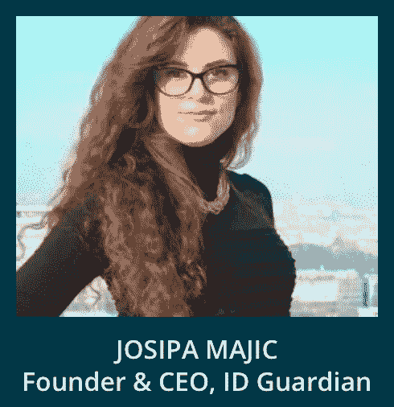

**Josipa Majic** 是 ID Guardian 的创始人兼首席执行官，ID Guardian 是一家总部位于伦敦的公司，在萨格勒布和帕洛阿尔托设有办事处，该公司分析生物数据，并开发带有生物传感器的智能设备。ID Guardian 最终帮助世界各地的个人和公司以无缝和无障碍的方式照顾他们的整体健康和福祉。Josipa 是 ID Guardian 产品和整体战略背后的主要远见者，负责与全球财富 100 强客户建立成功的客户关系。她被《时代》杂志评为年度十大最具创新性产品的发明者。约西帕是全球企业家峰会期间一个小组的主题发言人，与奥巴马总统一起出现在英国广播公司、福克斯新闻频道、华尔街日报、福布斯、美国有线电视新闻网和许多其他媒体上。

在这里申请接受约西帕·马吉克[的指导](https://www.f6s.com/eutop502018/apply)

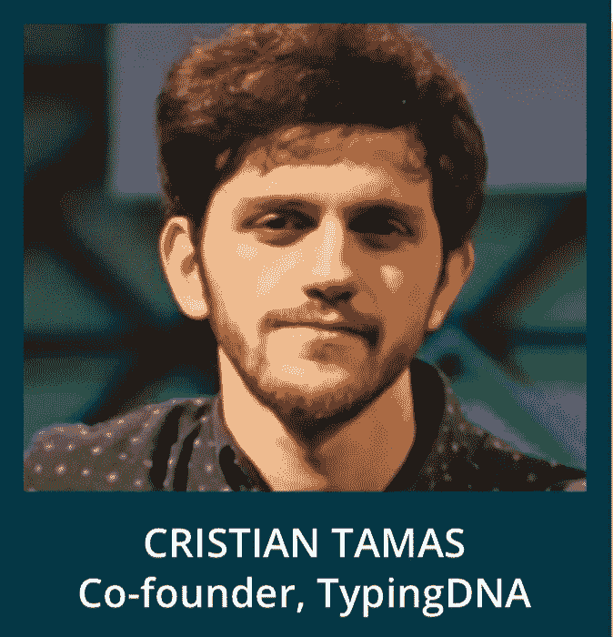

克里斯蒂安·塔马斯是 TypingDNA 公司的联合创始人& CMO，该公司旨在保护所有基于人们键盘输入方式的在线账户。TypingDNA 结合了人工智能和行为生物识别技术，作为一种识别验证工具，准确率高达 99%。

由于超过一半的数据泄露是由弱密码和被盗密码直接导致的，TypingDNA 为多用户案例(如金融和医疗保健)提供了破坏性的解决方案，防止了身份盗窃。TypingDNA 在产品搜索中赢得了当天的产品，并被 Disrupt100 选为影响、改变或创造新的全球市场的潜在颠覆者。

在这里申请接受克里斯蒂安·塔马斯[的指导](https://www.f6s.com/eutop502018/apply)

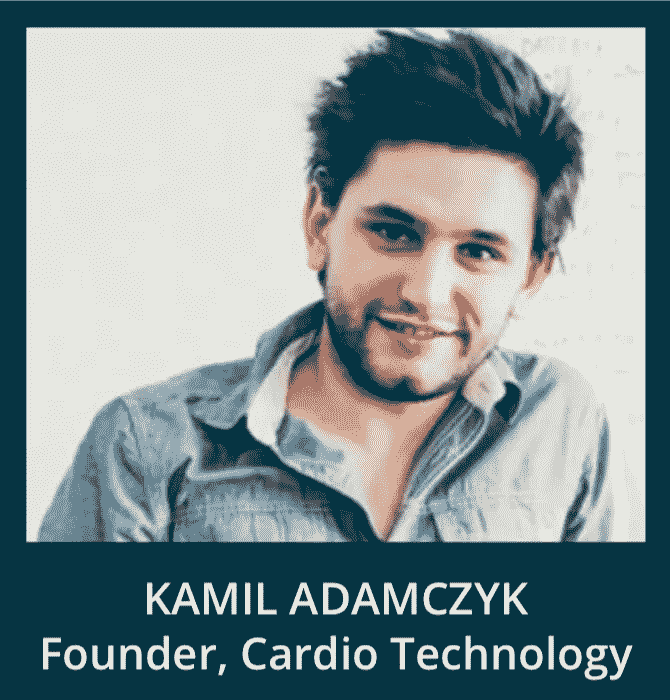

Kamil Adamczyk 是一名医学博士，也是 Cardio Technology 公司的创始人，该公司致力于一个肿瘤项目，致力于帮助患有恶性脑瘤的患者。在 Cardio Technology，他们为他们提供了一种大脑植入物，可以在不伤害健康大脑的情况下破坏癌细胞。

此前 Kamil 是 Inteliclinic 的首席执行官，该公司赢得了 LeWeb Paris startup competition 的最佳初创公司奖，并被 HealthXL 选为最佳睡眠初创公司。在德克萨斯州奥斯汀举行的 SXSW 大会上，Inteliclinic 获得了 Neuroon 最具创新性产品一等奖。

在这里申请接受卡米尔·亚当奇克[的指导](https://www.f6s.com/eutop502018/apply)

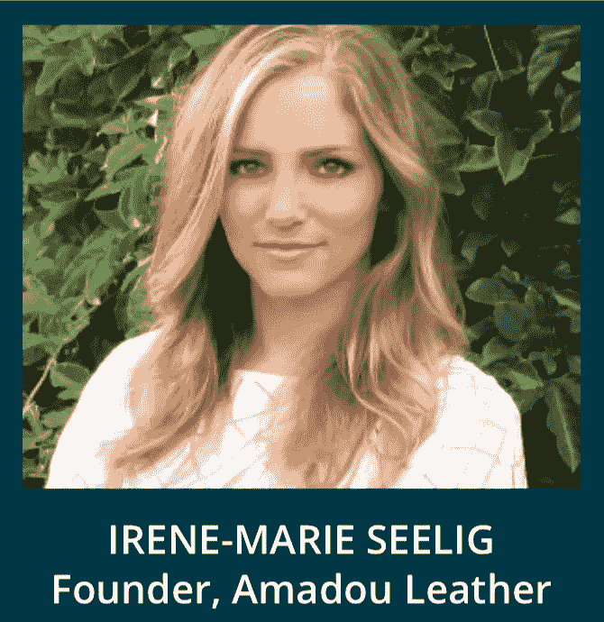

**Irene-Marie Seelig** 是消费品行业循环、可持续和下一代制造创新的先驱。2017 年，艾琳通过她的创业公司“创造明天的产品”获得了福布斯 30 岁以下奖，她的创业公司用蘑菇代替动物皮制造了一种素食皮革替代品。她参与了 Plug and Play 的 Fashion for Good accelerator，并因此获得了 2016 年开云可持续时尚创新奖。此外，Irene 是施华洛世奇的创新开发经理，管理着价值 1500 万欧元的产品组合，领导着一个由设计师、材料科学家和工程师组成的团队，从构思到推出，为他们的 B2B 客户将新的创新产品商业化。在施华洛世奇任职之前，Irene 曾在斯特拉·麦卡特尼的全球营销和企业社会责任团队工作，领导所有内部和外部数字平台的产品营销战略开发。

Irene 在欧洲、英国和美国生活和工作，重塑我们制造、使用和处理产品的方式。Irene 对循环经济和下一代制造充满热情，致力于颠覆和重塑消费品行业以推动清洁增长，她作为顾问、导师和客座讲师为全球各种组织做出了贡献。

在这里申请艾琳-玛丽·西利格[的指导](https://www.f6s.com/eutop502018/apply)

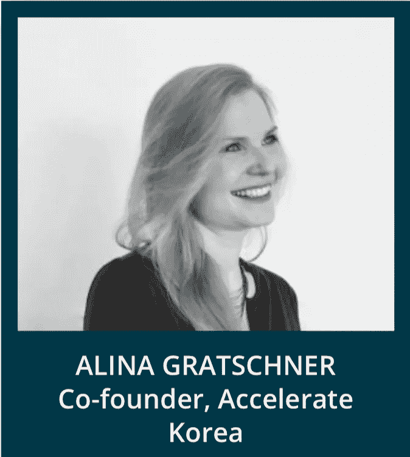

**Alina Gratschner** 在欧洲、美国、非洲和亚洲各地生活和工作，积极参与连接和开发各大洲的创新生态系统。Alina 是“加速韩国”的管理合伙人和联合创始人，专注于与公共和私营部门合作的跨境孵化和加速项目。她对指数级和颠覆性技术塑造我们的未来和推动经济发展充满热情，并作为顾问、客座讲师和导师为各种组织做出贡献。

在这里申请接受 Alina Gratschner [的指导](https://www.f6s.com/eutop502018/apply)

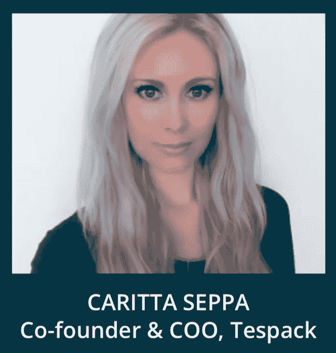

Caritta Seppa 是首席运营官和 Tespack 的联合创始人，Tespack 是一家专注于移动能源的公司，其客户和合作伙伴包括沃达丰、国际计划和救助儿童会。Caritta 被福布斯 2018 年 30 岁以下 30 岁以下欧洲入围为重塑世界的年轻创新者之一，她被选为 2018 年一个年轻世界峰会的一个年轻世界青年领袖和代表发言人之一，这是未来青年领袖的领先峰会，也聚集了世界各地的国家元首。卡丽塔入选安永会计师事务所 2018 年可穿戴设备百强女性和 2017 年获奖女企业家之一。Caritta 热衷于技术和赋权他人，是有抱负的年轻企业家和学生的导师和顾问。Caritta 是 2018 年利马首届女性科技论坛的联合组织者之一，也是她与 Techstars 共同组织的巴伦西亚首届女性科技日活动的女性科技跟踪负责人。

在这里申请得到卡丽塔·塞帕[的指导](https://www.f6s.com/eutop502018/apply)

**卡洛斯·李·桑多斯**是 HypeLabs 的联合创始人&首席执行官，hype labs 是一家开发网状网络软件的公司，该软件允许任何设备——从移动设备到桌面设备到物联网设备——即使在没有互联网连接的情况下也能安全连接。该公司是 AngelPad 的校友，并与电信领域的一些最大的公司合作和投资，即德国电信、爱立信、NovaBase 等。

Carlos 从 14 岁开始从事 IT 工作，早年曾是 IT 团队经理，在接下来的几年里，他为 IBM、BPI Bank、Santander、Zon 电信和 Glintt 等公司提供帮助和工作。凭借计算机科学背景，他的创业技能得到了 Thiel Fellowship Summit，Inc .杂志、圣加仑大学和 Kairos Society 等组织的认可。如今，他担任首席执行官，并指导各种各样的初创公司参加全球多个加速项目。

在这里申请接受卡洛斯·李·桑多斯[的指导](https://www.f6s.com/eutop502018/apply)

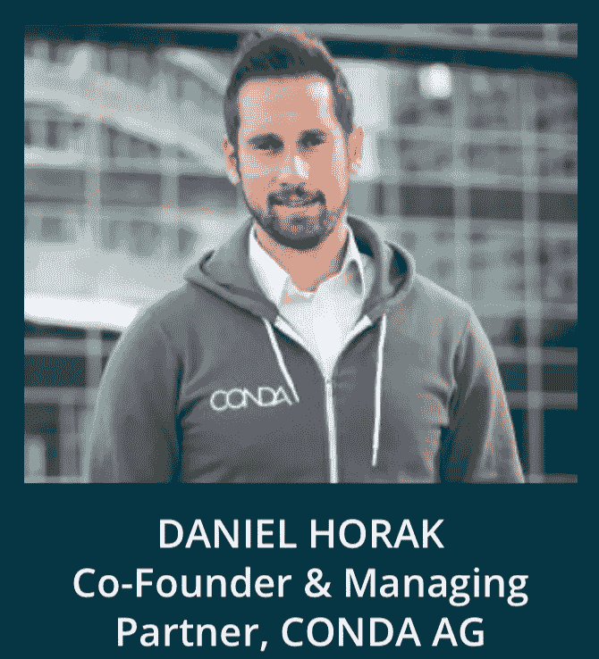

**Daniel Horak** 是 CONDA 的联合创始人，CONDA 是中东欧地区最大的大众投资平台之一，为 110 多个项目筹集了近 3000 万欧元。CONDA 社区由超过 30，000 名投资者组成。

康达目前正在为证券和股票代币发行建立一个全球生态系统(CRWD 网络)——构建未来的金融市场。作为康达的联合创始人和管理合伙人，丹尼尔·霍拉克是营销和销售领域的驱动力。他还是奥地利创业公司的董事会成员，并担任商业规划和早期融资的讲师。丹尼尔是福布斯 30 岁以下，经验丰富的演讲者，也是另类融资和众筹领域几本书的合著者。

在此申请接受丹尼尔·霍拉克的指导

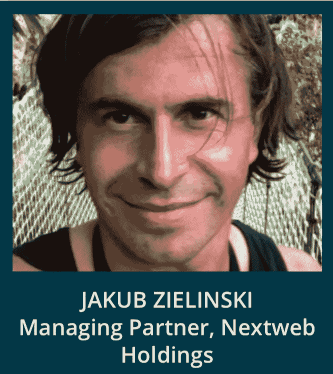

**雅各布·齐林斯基**是一位连续的互联网企业家、投资者和 Nextweb 控股公司的管理合伙人。他在媒体、广告和数字健康领域创办了几家成功的初创公司，拥有超过 2000 万独立用户。

此前，Jakub 曾在大型国际媒体公司担任首席数字官，负责 20 多个国家的在线运营。

在这里申请接受雅各布·齐林斯基[的指导](https://www.f6s.com/eutop502018/apply)

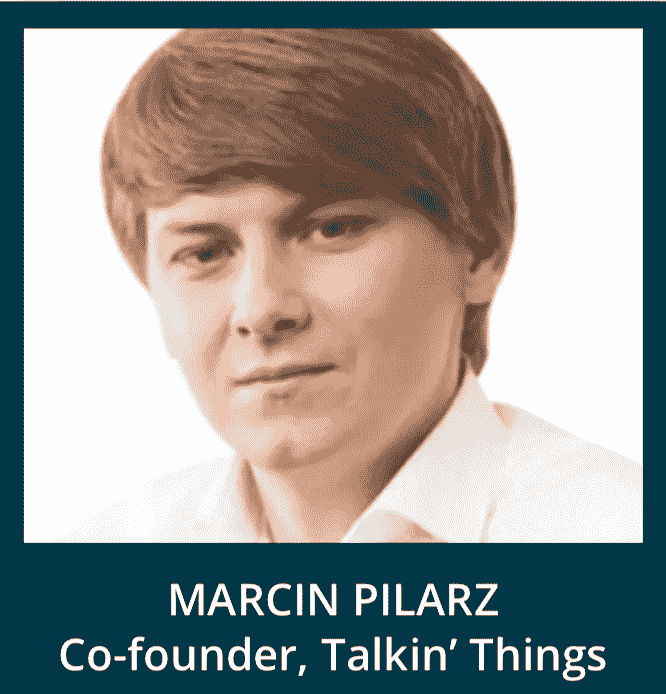

Marcin Pilarz 是 Talkin ' Things 的联合创始人。Talkin ' Things 是为物联网提供智能包装解决方案的领导者，长期以来一直与财富 500 强公司合作，提供定义智能包装市场趋势的创新解决方案。

Talkin ' Things 是世界上唯一一家提供真正的端到端解决方案的提供商，提供可定制的技术、软件、硬件和营销创意。Talkin ' Things 拥有 20 多项正在申请的专利，并在一年内将 15 亿个标签推向市场，重塑了客户体验。

在这里申请接受 Marcin Pilarz [的指导](https://www.f6s.com/eutop502018/apply)

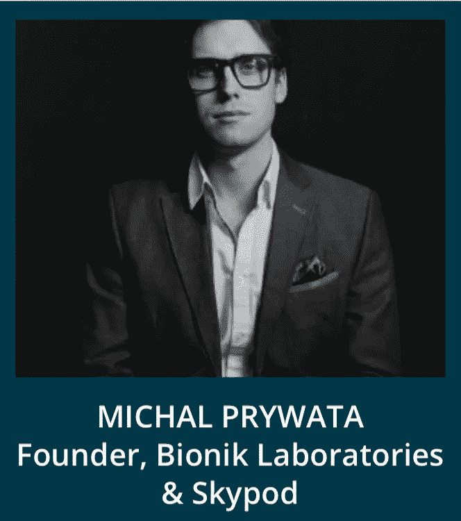

**Michal Prywata** 是一位先驱发明家，专注于创造对人类有重大影响的技术，并为股东创造长期财富。作为一名经验丰富的企业高管，他已经筹集了 5000 多万美元。

作为机器人、航空航天和人工智能领域的技术和商业领袖，Michal 是 Bionik Laboratories 的创始人，bio Nik Laboratories 是一家高度创新的机器人公司，产品销往全球超过 25 个国家。他也是 Skypod Aerospace 的创始人，该公司专注于创新的军用和民用垂直起降飞机。

在此申请接受 Michal Prywata [的指导](https://www.f6s.com/eutop502018/apply)

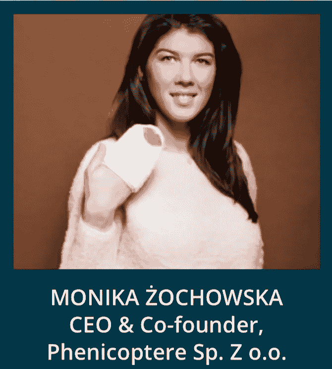

莫妮卡·żochowska 是凤凰公司的联合创始人兼首席执行官。Z o.o .是一家总部设在华沙的公司，业务遍及 60 多个国家。莫妮卡在化妆品行业创造了 GLOV 品牌下的颠覆性产品，彻底改变了日常卸妆。这个想法就是只用清水卸妆，简化了传统的卸妆流程。Monika 是 Phenicoptere 产品和整体战略背后的主要远见卓识者，并获得了许多奖项，其中包括她被 EY 评为年度企业家，被 BRIEF 评为最具创造力的企业家，她还被 succes pisanyszminką(与福布斯合作)评为 2016 年年度女企业家。除了在 Phenicoptere 工作，Monika 还经营着一家钻石咨询公司，是 HRD 认证的钻石分级师。在此之前，她在安特卫普钻石区为 Boulle Rough Diamonds 工作了 2 年，担任开发超豪华钻石珠宝品牌的营销经理。莫妮卡一直生活在佛罗里达州杰克逊维尔、巴伦西亚、安特卫普、布鲁塞尔、巴黎、伦敦、迪拜、华沙。

在这里申请得到莫妮卡·佐乔斯卡[的指导](https://www.f6s.com/eutop502018/apply)

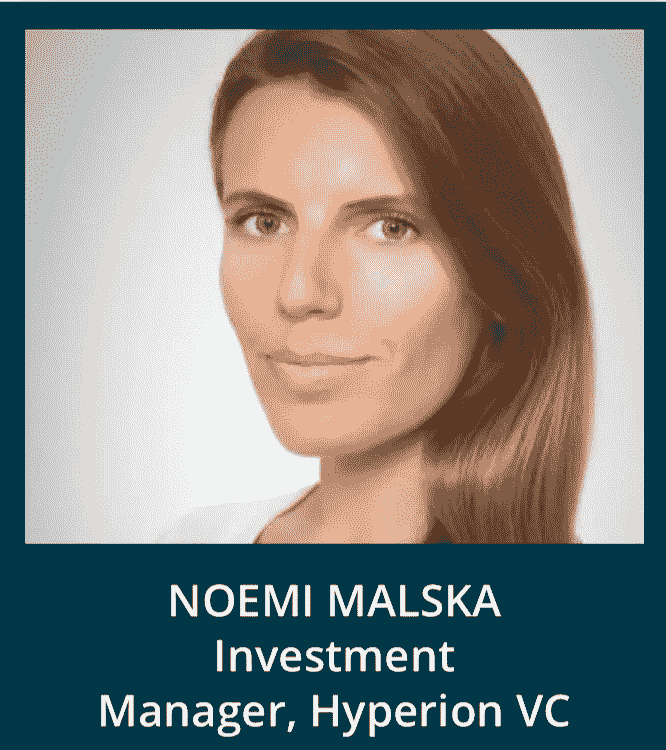

**诺埃米·马尔斯卡**在以色列的以色列商会联合会工作期间积累了国际商务经验。后来，她以分析师的身份加入了一家风险投资基金，然后她成为了一家投资组合公司首席运营官管理委员会的成员，目前，她是另一家风险投资公司的投资经理。她还是一家与网络安全部门相关的公司的监事会主席。因此，诺埃米对初创企业/投资者圈子中的每个利益相关者都有自己的看法。她对新技术领域的业务发展感兴趣，如网络安全、金融科技、太空。诺埃米正在练习八支瑜伽，她声称这对生活的许多方面都有积极的影响。

在这里申请接受诺埃米·马尔斯卡[的指导](https://www.f6s.com/eutop502018/apply)

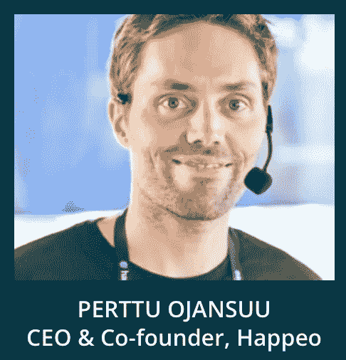

**Perttu Ojansuu** ，首席执行官&Happeo 的联合创始人，Happeo 是领先的企业数字工作场所平台，拥有 220，000 多名用户和€800 万美元的资金。此前，Perttu 成立了 Gapps Ltd，这是芬兰最大的谷歌云经销商。

在此申请接受 Perttu Ojansuu [的指导](https://www.f6s.com/eutop502018/apply)

**Sarah Al-Hussaini** 是 Ultimate.ai 的首席运营官。Ultimate.ai 由 Techstars 提供支持，总部位于赫尔辛基和柏林，帮助欧洲企业扩展其客户服务。

它们为包括 Salesforce、微软、SAP 和 Genesys 在内的一些全球最大的联络中心提供商提供支持。

在这里申请接受萨拉·阿尔·胡赛尼的指导

**汤姆·查曼**是 KOMPAS 的联合创始人兼首席执行官，KOMPAS 是一家专注于移动领域人工智能的深度科技公司。他是一位经验丰富的创始人，以前退出过，曾与专注于理解和分析数据的技术公司合作。

2016 年，汤姆做了一个关于人工智能和“技术未来”的 TEDx 演讲，并被公认为行业领导者，他在世界移动通信大会和 Visa Futures 等活动中发表了演讲。Tom 就深度技术及其对社会的影响为政府和机构提供建议，被公认为深度技术领域的领先影响者，并被商会命名为创新和技术的未来代表。最近，他被列入 30 个南部的 30 个权力名单。

在这里申请接受汤姆·查曼[的指导](https://www.f6s.com/eutop502018/apply)

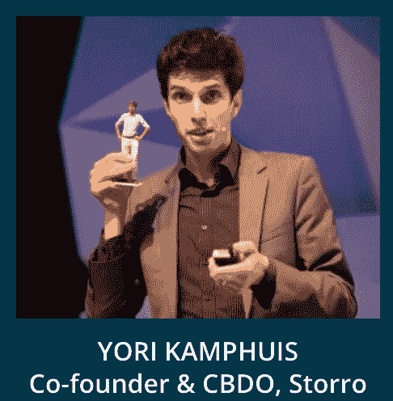

尤里·坎普赫伊斯热衷于创造一个更安全的世界。他是 Storro 的联合创始人和 CBDO，Storro 是一个点对点的区块链应用程序，可以让您轻松创建安全的协作空间。独一无二的是，您的共享数据并不存储在某个第三方或我们的云中，而是物理分布在您指定的项目成员中。

StartupDelta 在 2018 年将 Yori 列入了“未来创客 50”(toekomstmaker 50)，根据 Vrij Nederland 的说法，他是荷兰“101 位最有趣的技术专家，发明家和修补匠”(又名书呆子)之一，并在 2013 年当选为年度未来学家。Yori 是阿姆斯特丹枢纽的全球塑造者，与世界经济论坛相连。

在这里申请接受尤里·坎普赫伊斯[的指导](https://www.f6s.com/eutop502018/apply)

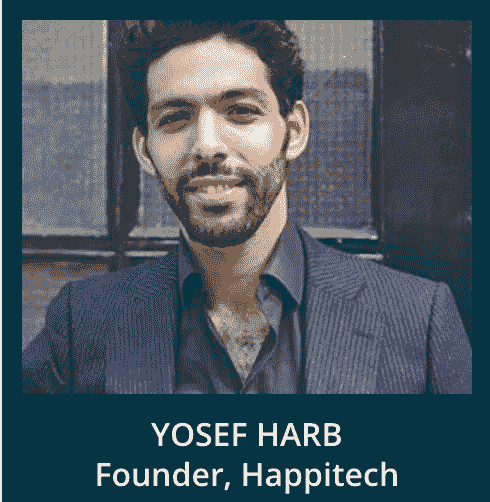

Yosef Harb 是 Happitech 公司的创始人，该公司使用智能手机摄像头测量心律失常，无需额外的硬件。被德勤和荷兰奇点大学评为最具颠覆性的医疗创新，并在主题演讲中得到苹果公司首席执行官蒂姆·库克的认可。

在这里申请接受约瑟夫·哈勃[的指导](https://www.f6s.com/eutop502018/apply)

有关该计划的更多信息，请访问 www.eutop50.eu 或发送电子邮件至 Karolina@ glowfly.eu

## 这篇文章发表在 [The Startup](https://medium.com/swlh) 上，这是 Medium 最大的创业刊物，拥有+ 380，756 名读者。

## 在这里订阅接收[我们的头条新闻](http://growthsupply.com/the-startup-newsletter/)。

