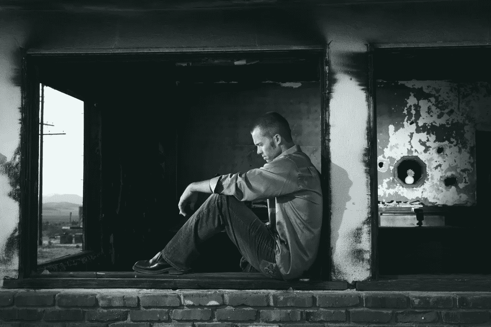

# 开始利用信仰的力量

> 原文：<https://medium.com/swlh/start-leveraging-the-power-of-faith-5299e387351e>

几天前，我坐在伦敦的一张长椅上吃午餐，想着自己的事情，这时我用眼角的余光看到一个无家可归的人自发地单膝跪在人行道上。

他向漫不经心路过的游客乞讨，请他们拿出几个便士，双手张开成杯状，期待着会有人递给他什么。

这位游客从旁边走过，没有理睬他，好像他是一个幽灵，很快就会消失在一股烟雾中。

## 我观察着这一奇观，感到一股情感的源泉涌了出来。

想象一下，走到拥挤的街道中间，单膝跪地，向那些视你如无物的人乞求零钱。

我想，重复这样做会削弱你的自尊、自重和自我意识。然而，这个人不需要做自我肯定，不需要过一个自尊的周末，也不需要相信自己。这仅仅是为了生存，事实上，这是他那天吃饭的唯一方法。

## 当自尊与生存站在一起时，它必须被抛到窗外。

当他完成他的乞讨表演时，他看向他的下一个观众，那些无辜地坐在长凳上吃盒装三明治和咖啡的人。

这包括我。

这个人看了看我们的区域，然后尽可能快地拖着脚步走了过去，因为这样可以让他接触到新的客户群。他开始向坐在旁边长椅上的每个人伸出手，一些人站起来，在他们的口袋里沙沙作响，拿出他们的零钱，其他人盯着天空，好像这个人不存在。

## 然后他拖着脚走到我坐的地方，站在我面前，就像他对其他人做的那样。

我准备了一些硬币，后悔没有多买一个三明治，因为这个地区有太多无家可归的人。

除了我，这个人做了一些不同的事情；他专注地看了我一会儿。

## 这里有一个人想参与一些谈话。

如果是这样，我想，他一定会通灵，他来对地方了。我每天都在倾听人们的声音，以此来改变或优化他们生活的某个方面，但如果这个人想问改变他生活的方法，我需要一根魔杖和一个奇迹。

我静静地站着，期待着他的提问。他想知道如何重新站起来吗？

一点也不，这个问题有不同的语气。

## 他目不转睛地盯着我，眼睛睁得大大的，试图从他的嘴里说出来。

“你崇拜什么地方？”他急切地问道。

我被这个问题吓了一跳。

他等了一会儿，然后继续下一部分的询问。
“清真寺、教堂、寺庙、犹太教堂？”

我静静地站着，他等着，不知道他的问题会引向哪里。

他继续说；
“你知道我在过斋月。”

谢天谢地，我当时没有给他三明治。

“犹太教堂，”我回答道，话终于从我的嘴里溜了出来，不知道我会得到回报。

他等了一会儿，站在我面前，而我稳稳地坐在板凳上，我抬头看着他等待复出。当他站在太阳的正前方时，后面明亮的光线就像一个光环围绕着他，这完全适合我们正在进行的对话。这就像有我自己的先知在身边。

## 在他说出至理名言之前，他进一步思考了一下。

“无论你向哪个神祈祷，我都想保佑你的家人和孩子。记住，当你祈祷的时候，为你自己祈祷，你决定如何祈祷，别人怎么想并不重要。”

没有比这更明智的话了。

在过去的几年里，我一直与我的宗教有着动荡的关系，而我最近学到的一个真理是与我选择拥有的上帝/精神源头建立一种关系。基于真正连接我的东西，听到他的话触动了我的一部分，我仍然理解这一点。

他继续说；“你信仰什么宗教并不重要，我们都是上帝的孩子，我们都是一样的，我们必须停止分裂，开始团结起来，彼此和睦相处。”

这个无家可归的人用他冒出来的简单话语表达出的意义，比所有世界领导人的总和还要多。

## 没有自我，没有权力，只有爱。

一个无家可归的人，穿着破旧的鞋子，穿着脏兮兮的衬衫，向周围的人乞讨，却仍然表现出信仰，甚至想要祝福任何人，这让我无法理解。我给他的只是一些零钱和一会儿的交谈，然而他仍然能够祝福我，仍然坚持爱和人类的共性是我所不能理解的。

不管他把谁当成他的导师，我都想和他谈谈。

这怎么可能呢？

没有得到我们想要的工作或我们渴望的关系让我们陷入困境，然而这个男人表现出了对信仰的联系和对更高存在的信仰，这值得一枚荣誉勋章。

事实上，我们站在大理石拱门纪念碑前，我想为他举行一个仪式，拿起一枚荣誉勋章，别在他破旧衬衫的翻领上。他活该。

## 我可以想象我们最大的恐惧之一是我们最终会无家可归。

像这个人一样走在街上乞讨，看着游客兴奋地走向购物中心、酒店、咖啡馆，知道他甚至不能被允许进入这些地方，更不用说在里面买东西了。

然而他没有愤怒、沮丧或恼怒，尽管我毫不怀疑他的这一部分会在他陷入无法控制的深渊时显露出来。

而是伸出手来祝福我，中止他生活中的绝望，甚至不在乎比较我们两个的现实。因为我们的现实不同；他站在我面前，除了一只张开的手拿着几个硬币什么都没有，相比之下，我坐在一个长凳上，拿着一个真正的手提包和几个购物袋。我们消除了我们之间的隔阂，专注于我们共同拥有的东西——信念。

当我们遇到困难和挫折时，我们坚持的信念。不管这种信念看起来像什么，它仍然是一个锚，让我们牢牢地停泊在岸边，而不是在生活的惊涛骇浪中飘忽不定。

反思自己的人生；你如何对可能发生的事情表现出更大的信心？你需要更多的投降吗，你需要放下控制吗，或者你仅仅需要知道这一切都会过去吗？

## 如果这篇文章引起了你的共鸣，你可以在我的新书[中阅读更多类似的章节，这本书现在已经在亚马逊上出售。](https://www.amazon.co.uk/Look-Inside-Seeking-Start-Living/dp/1781332959)

 [## 首页|米歇尔·阿提亚斯生活蔻驰&演讲者

### 我的方法是量身定制的，以结合教练，深入的心态工作和生活设计，出生…

www.micheleattiascoaching.com](http://www.micheleattiascoaching.com/) 

## 这个故事发表在[的创业](https://medium.com/swlh)上，这是 Medium 最大的创业刊物，有 328，729+人关注。

## 订阅接收[我们的头条新闻](http://growthsupply.com/the-startup-newsletter/)。

