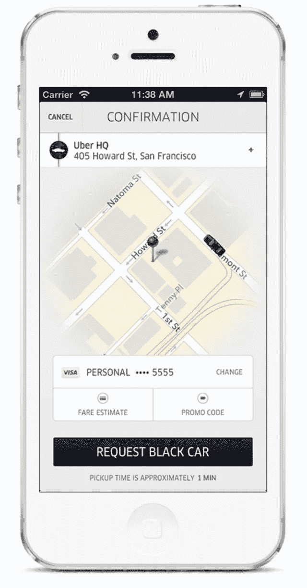
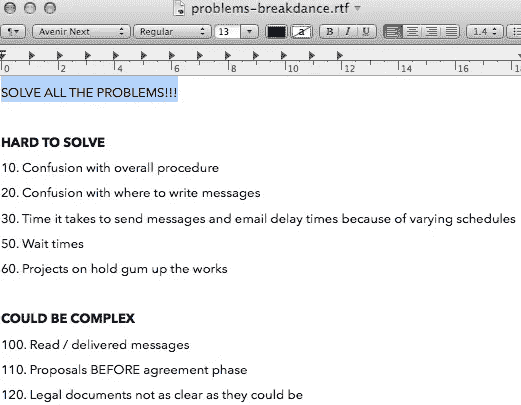

# 从问题开始。不是解决方案。

> 原文：<https://medium.com/swlh/start-with-problems-not-solutions-8521c53264b2>

## 没问题？没有产品。

[unsplash.com/photos/fMD_Cru6OTk](https://unsplash.com/photos/fMD_Cru6OTk)

*这是第二部分的* [*一个 6 部分系列*](/@mikaelcho/every-mistake-we-made-building-the-last-version-of-our-product-7b086cb8ae77#.69ascbcw8) *在这里，我们分享了我们的产品在船员进入建设的一切。隐私见鬼去吧。建筑队在公众面前不仅仅充满了荣耀。它充满了我们在创造产品时所面临的挣扎和怀疑。*

寻找问题的产品。

很多产品都落入的陷阱。人们实际上并不需要你正在建造的东西。

如果一个产品不能解决一个问题，没人会在意。

这就是为什么当我们开始 Crew 时，我们关注的第一件事是确保我们正在解决一个问题，[即使我们的产品是原始的](http://blog.pickcrew.com/from-a-mailchimp-email-and-wufoo-form-to-25k-in-3-months/)，许多事情是手工完成的，而不是用技术。

为了帮助我们深入了解什么可行，什么不可行，我们来看看 3 个主要信号:

**1。数据** —显示人们如何使用 Crew
**2 的数字。客户输入** —使用 Crew
**3 后来自客户的电子邮件、电话或建议。直觉**——当我们使用 Crew 时，我们有什么感觉？我们认为哪些地方需要改进？

我们的主要关注点之一是查看发布项目的工作人员的重复使用。

我们希望我们的产品非常有用，以至于我们的成员不只是使用我们一次，而是每次都需要创造性的工作。

# 体验=多个“惊喜时刻”

## (不止一个)

想想你第一次使用一个伟大的产品。

可能感觉是为你设计的。你想做的每一个动作都是正确的。你的感官(视觉、触觉、听觉)与产品协调一致。

你在使用它的时候可能会说“哇”。

那个产品在情感层面上触动了你，你会记住它。你分享了。你想再次使用它。

我知道这可能是一个令人厌倦的例子，但我第一次使用优步时就感受到了这种积极的情绪。优步的应用程序将你与司机联系起来，在你的城市里四处走动。

起初，使用优步似乎并不比叫出租车好多少。但是，优步粘性的诀窍不仅仅是一个，而是多个“哇时刻”，这使得它比叫出租车好得多。

我第一次使用优步时，有 4 个明显的“惊喜时刻”:

## 1.我怎么知道现在是否有出租车？

优步在地图上给你看你周围的出租车。

## 2.我的司机什么时候会出现？

优步向您展示了您的司机所在位置的地图，以及预计到达时间

## 3.我的司机接受信用卡还是我需要现金？

优步用你的信用卡连接。

## 4.我应该给什么小费？

优步会自动包含您设置的小费。

优步将多个“惊喜时刻”融入产品的方式是他们的系统如此强大的原因之一。

与打车相比，每多一个“惊喜时刻”，你使用优步应用的几率就会增加。

然而，在你的产品中创造多个“惊喜时刻”的挑战之一是它们需要时间来构建。优步花了一年时间来开发他们的第一个应用程序，并在一个城市推出。

你需要有耐心，愿意在一个问题上全力以赴，以创造一个值得多次“惊叹时刻”的体验当你可能没有所有的信号来表明你所建立的是正确的事情时，创造正确的体验是有风险的。但这是打造差异化产品之路的一部分。一开始你不会有所有的答案。

为了降低风险，你可以从关注一两个主要的“惊喜时刻”开始。

这可能不足以创造你所追求的完整体验，但随着你建立更多的体验并且[寻求达到与那个“哇时刻”相同的质量水平](https://pickcrew.com/how-to-build-an-online-business/balance-design-and-launching-early/)，你的产品将会越来越接近你所追求的。

这就是我们所做的。

我们关注的第一个“惊喜时刻”是帮助你在一天内找到一个经过审查的合格的设计师/开发人员。

即使对于像脸书和谷歌这样最好的技术公司来说，找到合适的设计师和开发人员也很难。因为软件正成为几乎每一个企业的需求，软件工程师和设计师的供给正使需求曲线陷入一个循环。

在 Crew，我们发现在一天之内找到合适的设计师会为我们 25%的客户创造一个“惊喜时刻”。在一个项目与设计师/开发商匹配后，我们帮助管理项目和付款，但不是在质量层面上创造多个“哇时刻”。还没有。

为了找到我们需要改进的地方，我们用我们的 3 个信号(指标、客户输入和我们的直觉)列出了一长串问题。

当定义要构建什么时，通常最好从挑选出要关注的正确问题开始，而不要太沉迷于解决方案。

我们如何解决这些问题可以有成千上万种不同的方法。

现在，把问题写下来是重点。我们可以稍后定义潜在的解决方案。

在这次会议之前，我们每个人花了一周时间，从不同的角度列出了一长串问题:

[安格斯](https://twitter.com/angusw) —工程

[基里尔](https://twitter.com/kirillz) —设计

[Steph](https://twitter.com/stephliverani) —客户满意度

[米凯尔](https://twitter.com/MikaelCho) —高水平

安格斯把问题从定义明确、容易做的问题分解为未定义、需要讨论的问题(难以解决意味着需要讨论):

我们的计划是，Angus 和我们的产品团队将从底层(明确定义的任务)开始开发，而 Kirill、Steph 和我将在开发开始前处理需要进一步完善的高层问题。

我们将朝着中间的方向努力。当我们定义难以解决的问题时，当需要构建的内容变得更加清晰时，那些项目将下降到明显的修复，我们可以构建它们。

难题不是坏事。如果你构建得好，难题可能是让你的客户“惊叹”的最好机会。

问题越大，机会越大。

# 建筑工人在公共场合

隐私见鬼去吧。《公众中的建筑工人》是一系列 6 篇关于产品设计哲学和我们在设计自己的产品时所面临的斗争的短文。可以在 [*剧组后台博客*](http://backstage.crew.co/building-in-public/) *上阅读正版，在路上启发版。*

## 1.[我们都在销售经验](/@mikaelcho/were-all-selling-an-experience-fac3a7732efb#.zdof1aul0)

## 2.你在这里

## 3.[约束，不是障碍](/@mikaelcho/constraints-not-barriers-84629bf49ce2#.f3q9we4s7)

## 4.[多问问题](/@mikaelcho/you-can-never-ask-too-many-questions-6d9926988f82#.ynoz2zshy)

## 5.[剖析一个主页](/@mikaelcho/anatomy-of-a-homepage-redesign-9d911e832c4b#.lhlspqtoa)

## 6.[旅程比目的地更重要:设计最佳入职流程](/@mikaelcho/the-journey-is-as-important-as-the-destination-ddc598989eaf#.ddxqmqyga)

# 又及:新成员

我们最近在 Crew 为我们的产品的一个全新版本再次经历了这个过程。你可以在这里阅读全部内容。

