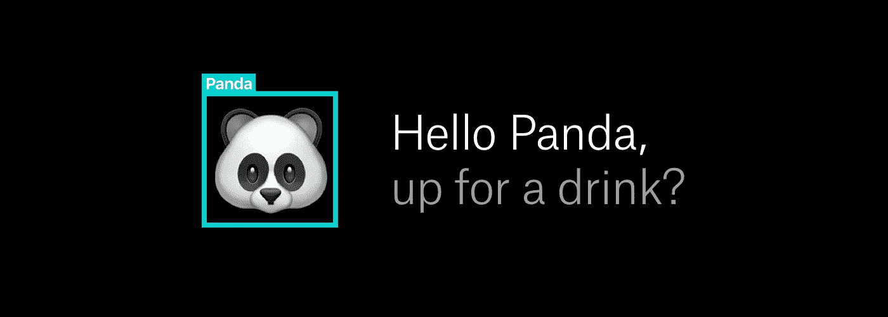
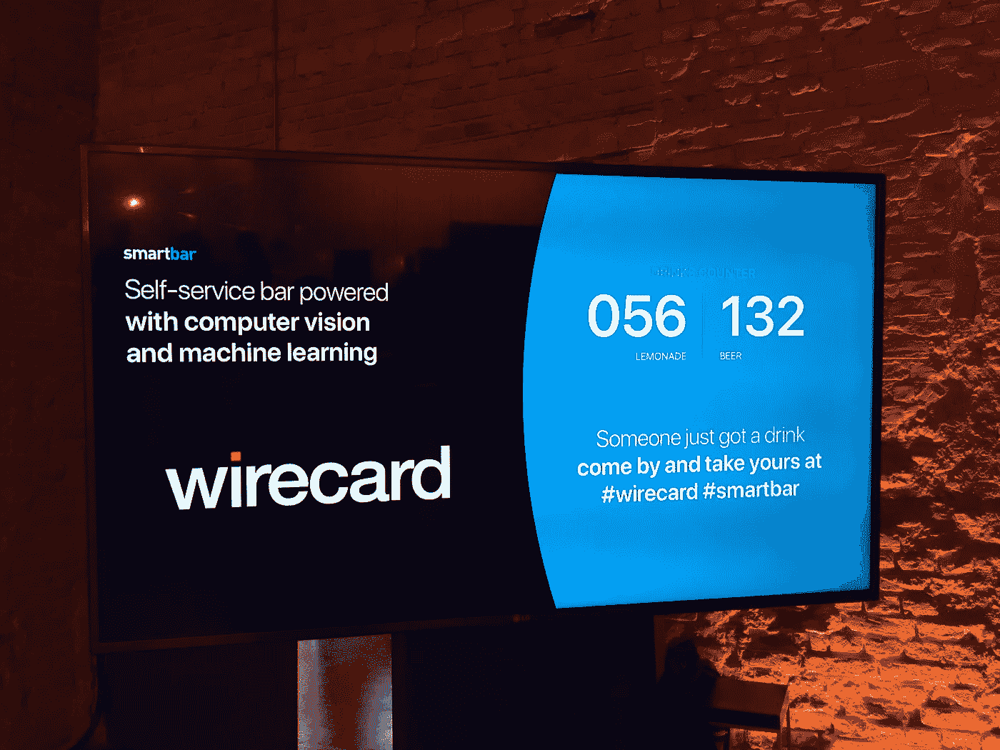
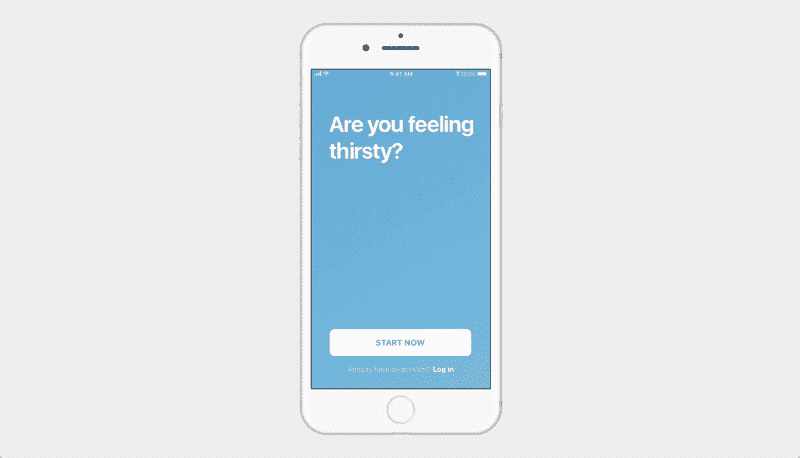
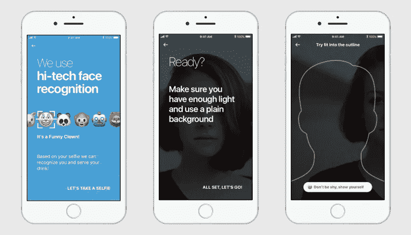
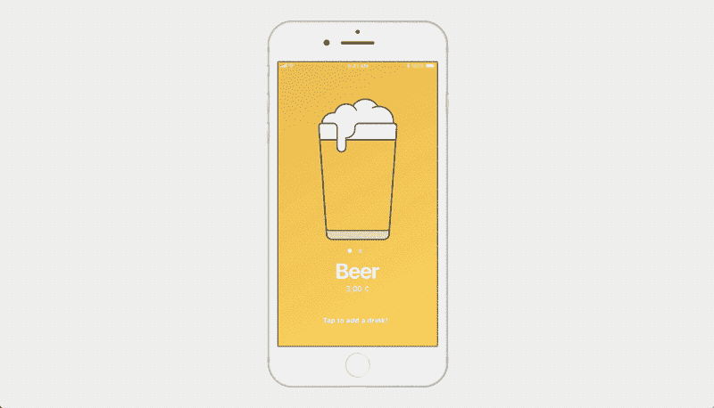
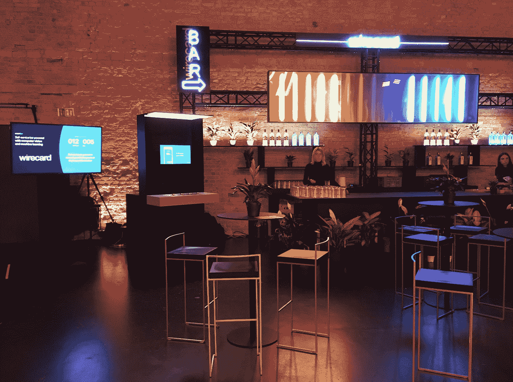

# 从底部开始，现在有啤酒

> 原文：<https://medium.com/swlh/started-from-the-bottom-now-theres-beer-15ff4e2a4be4>

## 当啤酒遇上机器学习

去酒吧而不需要为了得到你的饮料而努力，这不是很酷吗？有了 SmartBar，我们就能以聪明的方式为您解渴。你只需要用 app 自拍，我们就能认出你，给你倒饮料。这就是我们最新的 Wirecard 项目结合我们非常喜欢的两件事的地方:啤酒和机器学习。

# 生物识别支付

Wirecard 和 YND 一直在金融科技行业的创新项目上合作。他们让我们先睹为快，看到了一个仍在开发中的产品，真是太好了。

它由一个小巧的硬件组件组成，包含生物识别身份识别、产品检测和行为分析技术，可以嵌入到您的下一个物联网项目中，以实现无缝支付体验。它包含一些重要的计算能力、预先开发的高级神经网络和集成的 ML 技术，以便实现支付领域的下一件大事——安全结账，而无需您掏出钱包，甚至无需与收银员交谈！

我们带着这个坏男孩兜了一圈，用它组装了一台独一无二的啤酒自动售货机。

结果是这样的:

# 现成的知识

看起来很整洁，对吧？但我敢打赌，你一定想知道这台神奇机器背后的技术是什么。

1.  首先，你在一个配套的应用程序上自拍，然后照片被输入系统供参考，并分析所谓的地标(眼睛、眉毛、鼻子、下颌线和其他特定面部特征的位置)。
2.  使用基于机器学习的模型来执行面部标志的分析/识别，该模型已经在公开可用的名人和流行人物的照片上进行了训练。在某些时候，系统能够自己识别熟悉的面孔，你只需要纠正结果来改进模型。
3.  根据(平均)界标位置，创建描述给定人的唯一“向量”,该向量基本上包含界标相对于彼此的距离/比例。
4.  这些向量最终(以一种*非常*加密的方式)出现在芯片上，连接到啤酒自动售货机的摄像机上，摄像机的位置是记录人们站在机器前时的面部表情。
5.  当人们靠近机器时，芯片上会应用相同的模型来分析每个视频帧(实时)，并检测视频帧中出现的人脸(带有地标)。
6.  将这些向量与系统中登记的人的自拍中安全存储的向量进行比较。如果向量之间的差异相对较小，那么可以安全地假设视频帧中的人脸与数据库中的人的自拍相匹配。

Live drinks counter

视频帧分析、人脸识别和人脸检测的整个过程计算量很大。它过去需要非常强大的机器(具有多个内核),以便每秒可以处理几个帧。将所有这些处理能力集成在一个芯片上简直是一个奇迹。直到最近，高端游戏显卡使用的 GPU 的发展才使这成为可能(*好吧，不仅如此，想到在《使命召唤》上花费的时间终于有了回报，真是太好了！*)。

机器学习方面并不是 SmartBar 唯一的酷功能。由于定制的 BottomsUp 啤酒分配系统，它还允许自动起草。您只需按下分配槽上的杯子(它会以与您订单匹配的颜色亮起)，然后它会自动从底部装满。这将加快工作进度，同时为多人提供服务也变得更加容易。

# 让表情符号来说话

现在我们已经讨论了技术方面，是时候开始考虑我们想要的应用程序的外观和身份了。在这个项目中，我们希望通过一种有趣、随意的方式来展示人脸识别技术，让它变得更加平易近人。整个系统背后的技术非常复杂，但我们不希望使用该应用程序的人被它淹没。我们需要让用户进入系统，并以一种简单的方式解释购买流程，这样他们就会很想尝试一下。事实上，我们使用他/她的形象不应该是可怕的，并阻止人们尝试。最后，如果有人想喝一杯，那就要快！因此，我们的目的是让酒吧的结账过程天衣无缝，这意味着我们必须防止用户犯错，比如在光线不好的情况下自拍。

**我们是这样做的:**

*   我们在入职时采用了 Wirecard 的配色方案和大字体，使应用程序看起来友好但可靠。
*   使用表情符号是打破僵局和快速传达信息的好方法。
*   当然，最重要的部分是自拍。首先，我们必须向用户解释为什么我们需要它(因为大多数人还不习惯用他们的脸“付款”)。然后，我们必须确保用户拍下一张清晰的照片，让我们以后能够认出他。

毕竟，入职是一个可视化的过程，所以在这种情况下使用表情符号更有意义。动画吸引了用户的注意力，同时在变暗的相机图像上直接显示自拍说明。

对于演示，我们决定为用户提供两种选择:啤酒或柠檬水。我们选择了一个更吸引人的购买流程，而不是一个有项目可供选择的网格，同时仍然保持它非常简单。滑动以在饮料之间切换，轻按以选择并确认订单。*等着瞧*！

# SmartBar 上线

因此，一旦桶被冷却，屏幕被连接起来，是时候在 DLD 柏林大揭露第一个原型。Wirecard 拥有自己的空间，人们可以在会谈间隙进行交流，并在 SmartBar 下单购买饮料。

那么，下一步是什么？如果你没有机会在 DLD 尝试 SmartBar，它将于 2018 年 3 月在柏林 ITB 设立，提供更多饮料。

[我们](https://ynd.co/)也知道 Wirecard 正在努力完成其最新产品，并允许支持更复杂的用例，如产品&客户行为检测等。敬请关注！

这篇文章由尼基·杰基·戴尔芬撰写，他是**的内容负责人。需要一些脑力吗？如果您对您的技术项目有任何疑问，请随时通过 hello@ynd.co 联系我们。**

**

**All set up & waiting for the crowds**

**

## *这个故事发表在 [The Startup](https://medium.com/swlh) 上，这是 Medium 最大的企业家出版物，拥有 293，189+人。*

## *在这里订阅接收[我们的头条新闻](http://growthsupply.com/the-startup-newsletter/)。*

**