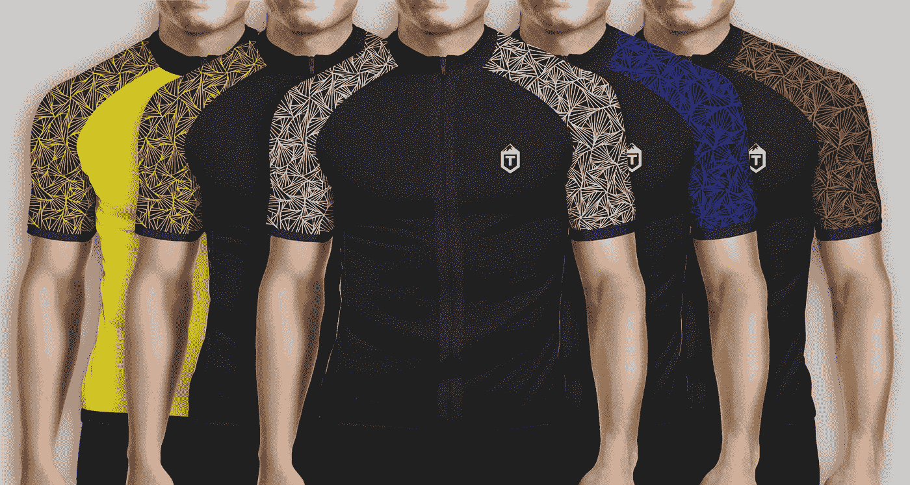

# 创立一个自行车品牌

> 原文：<https://medium.com/swlh/starting-a-cycling-brand-7755ed546f75>

如果你在社交媒体上认识或关注我，你可能已经注意到或对持续不断的 [T Cycling](https://tcycling.com) 帖子感到有点恼火。这不是我范博英一个新的品牌，其实，我想是的，唯一不同的是，T 自行车是我的品牌。这是我很久以前就想做的事情，但是我从来没有后悔去做。

**所以我决定给自己设定几个截止日期:**
——两个月设计五套完整的骑行装备，包括制作样品
——两个月建立品牌的社交追随者
——在 Kickstarter 上发起一个活动，让公司免于负债(在上述活动之后准备两周)
——四周在活动进行期间建立在线商店

# 为什么要创办骑行品牌？

我个人发现很难找到从设计角度看有吸引力的自行车服装。我遇到的许多品牌要么追求平淡无奇的设计风格，要么过于花哨。不要误会我；一些品牌有非常实用的服装，我们必须记住，无论我们设计什么，首先要满足骑自行车的人的需求。

我想创立一个品牌的另一个原因是，我觉得我们正处于自行车运动的一个时期，有些定价让 70%喜欢穿这些产品的骑行者买不起。从我对制造商的研究中，我发现生产高性能和功能性的自行车服装是完全可能的，但没有通常随之而来的巨大成本。

我是一名开发者/设计师，对摄影也有浓厚的兴趣，这一背景非常适合我创立一个品牌。这意味着我可以在建立品牌的同时保持最低的成本。

# 你是如何建立社交追随者的？

这比我想象的要简单得多。从最初的研究中，很容易看出 Instagram 将是推动我努力的最佳平台。骑自行车在那里和推特一样受欢迎，不同的是在推特上被大众看到是非常非常困难的。

在整个设计过程中，我做的主要事情是将有趣的图片直接发布到社交媒体上，让人们对我的创作感兴趣。关键字研究给了我一些标签，我应该用在我的照片上，让最广泛的自行车和铁人三项爱好者看到它们。我一直保留着这个建筑，然后在活动开始的前一周，我发起了一个活动来收集早起鸟邮件列表。这转化了我在 Instagram 上大约 10%的粉丝，这非常令人愉快，对竞选活动有很大帮助。

# 为什么选择 Kickstarter？

将一个新品牌推向市场的营销活动要花很多钱。它们很容易就能达到数百万英镑，而我们根本没有预算独自将我们的产品成功送到自行车手和铁人三项运动员手中。不仅如此，你还必须有很好的人脉，以获得足够的兴趣来写关于你的产品的文章，让它在 Google / Bing 中的搜索能力自然提升。

Kickstarter 可能是世界上最大的众筹平台，在英国我们也有 IndieGoGo，但不幸的是它没有 Kickstarter 的影响力。此外，我注意到它的搜索算法和项目发现与 Kickstarter 不在一个联盟。不仅如此，人们还对它建立了信任，认为它是一个平台，他们更愿意为一个产品、品牌或创意投资。以上所有这些都使得我们可以毫不费力地利用这个平台开展我们的活动。

# 竞选进行得怎么样？

一个词可以概括，“难以置信。”当这只是一个想法时，我从不相信会有如此积极的回应。在 24 小时内，我们几乎粉碎了我们的目标，它只是从那里建立。感谢《骑行周刊》选择了我们的活动并写了一篇关于我们的文章，这对我们帮助很大。铁人三项世界也发现了我们的 Tri 套装设计，我很高兴，我觉得 Tri 套装的大部分设计都很沉闷，没有生命，作为一个身体意识的人，如果没有设计帮助你感觉更好，他们不是最愉快的。

在活动结束时，我们已经远远超出了我认为的一个很少甚至没有营销预算的小公司的可能。事实上，我认为我在社交媒体活动上总共只花了 100 英镑，其余的都是通过口口相传或跑腿寻找我认为会对我正在打造的品牌感兴趣的自行车手团体和俱乐部。我们超过了最初目标的 600%,这是一个很大的进步，并再次肯定了我的信念，人们会支持这个品牌和我的设计选择。

# 接下来呢？

关于品牌还有很多事情要做，首先也是最重要的是，我们正在集中精力制造我们的产品，这样我们就可以尽快把它们发送给我们的支持者。这也让我们可以在网上商店进货，同时我们还可以发送样品给媒体或我们目前正在计划的赠品。

由于制造过程也在进行中，这让我开始更多地考虑业务的未来以及我计划将它带到哪里。我目前正在寻找国外和英国的经销商。如果你知道或者有任何你认为我们应该知道的细节，请把我们的细节传递给他们或者把他们的细节发给我，这样我就有希望联系他们。

我们希望与全球各地的独立商店合作，共同销售我们的产品。我们设计了一个定价策略，我们认为这使我们成为一个非常容易被当地自行车商店购买的品牌。如果您对库存感兴趣，请与我们联系，我们希望收到您的来信。

如果你没有看到我在过去一个月里的最新推文，我们已经开始了一项“品牌大使”活动，与热衷于建立社区的热情自行车爱好者联系起来。这让他们有机会获得免费装备，以帮助他们的自行车事业或爱好。这也让他们有机会为 T Cycling 网站写一些在他们的地区发生的关于自行车和运动的令人兴奋的事情。我们正努力推广我们品牌的社区元素，希望以此将我们与大多数其他品牌区分开来。

*这是最初贴在我博客上的*[*【www.michaeltempest.com】*](http://www.michaeltempest.com)