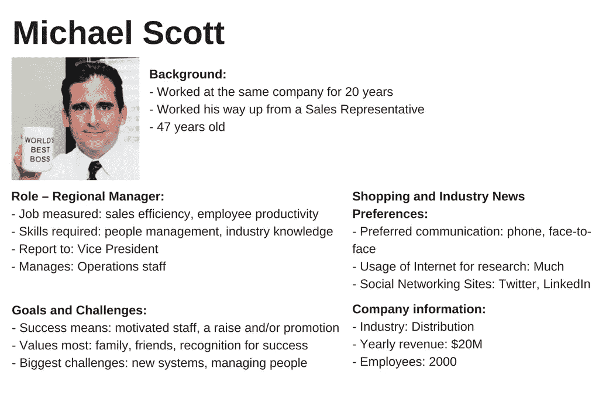
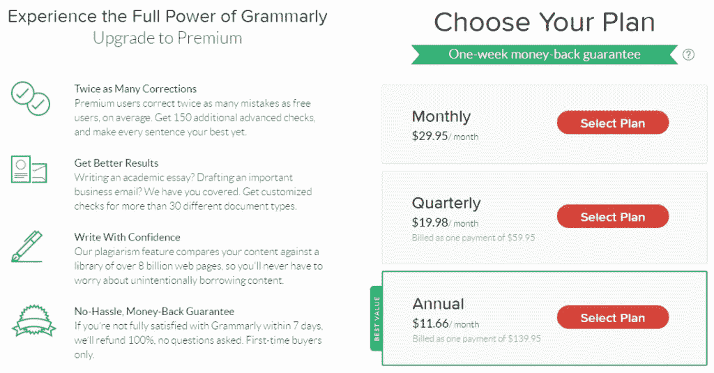
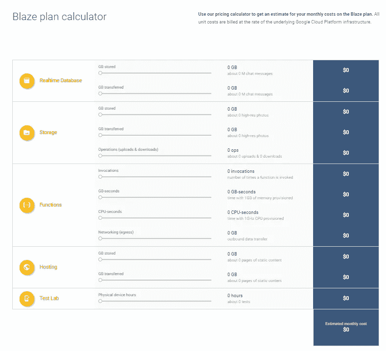
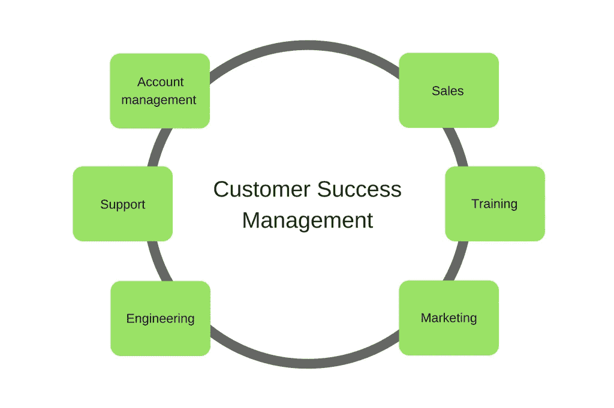
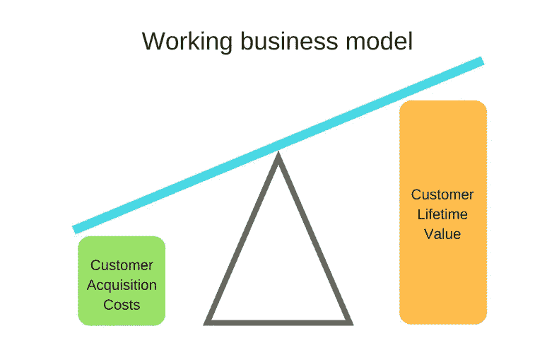
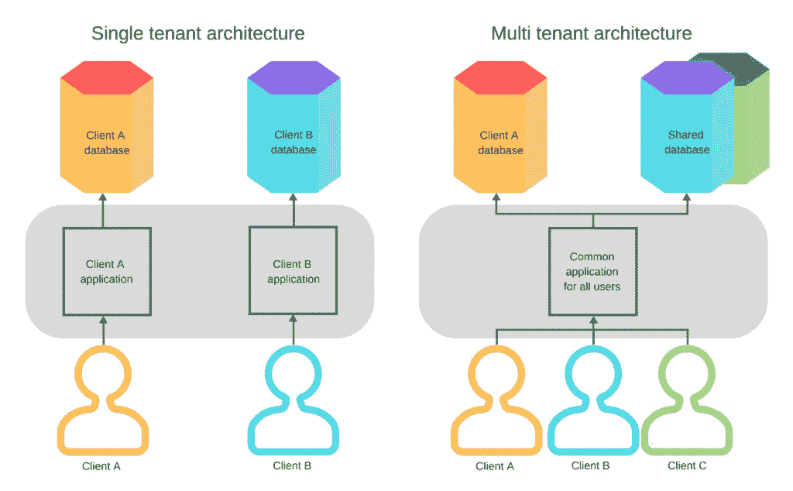
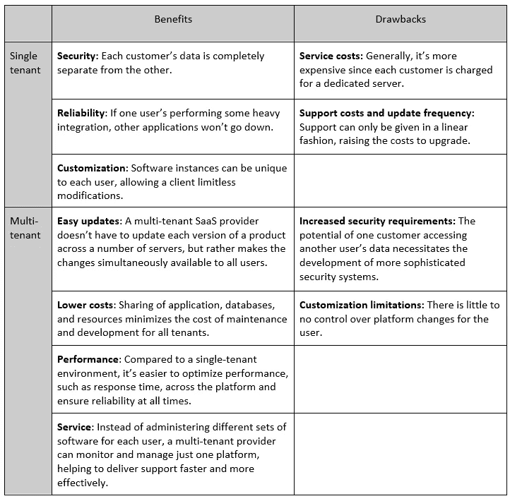

# 在 SaaS 创业:迈向成功的 9 个步骤

> 原文：<https://medium.com/swlh/starting-a-saas-business-9-steps-towards-success-f084a41e8240>

你还记得过去的美好时光吗？就在几年前，迁移到云可能会带来吹嘘的竞争优势。如今，基于云的软件是工作流程中一个基本的、可预测的部分。

软件即服务(SaaS)是一种由第三方供应商托管的软件交付模式，与内部解决方案不同，它允许用户通过互联网访问产品。以下是这两种方法之间的一些其他关键差异:

1.  SaaS 使用按需使用模式，允许低起点。如果您想获得本地服务，通常需要预先支付软件、定制和相关基础设施的费用。
2.  云产品的用户只需几次点击和合理的成本变化，就可以扩大和缩小资源。如果客户正在快速增长，他们不需要本地模式的大量基础架构投资来处理负载。
3.  SaaS 的消费者不必使用他们内部的 IT 资源或雇佣全职的 IT 专家；供应商提供所有硬件和实施服务，并提供托管和客户支持。
4.  SaaS 应用程序通常只有一个版本，这就是为什么更新会自动在所有用户组中实现。

如您所见，对于客户来说，SaaS 是避免复杂的应用程序和数据库管理工作的完美解决方案。除此之外，他们只需要购买他们当前需要的服务。对于 SaaS 企业本身而言，这种交付模式意味着简化的部署和更低的客户获取成本——您的主要客户会坚持很长一段时间，所有客户都可以获得相同产品版本的支持。

据估计，到 2020 年 [*对 SaaS 的需求只会继续增加，73%的组织*](https://www.bettercloud.com/monitor/state-of-the-saas-powered-workplace-report/) 在 SaaS 运行其核心业务流程。不幸的是，对于一家 SaaS 企业来说，保持运营并实现其期望和必要的收入是一项挑战，这并不奇怪。这就是为什么我们分析了 SaaS 初创公司和老牌供应商遇到的主要陷阱。今天，我们将开出一些处方，告诉你如何治愈最常见的 SaaS 病。我们走吧。

# 1.创建买家角色

如果你的目标受众是“任何对你的产品感兴趣的人”，你的收购策略和定价模式就有失败的风险。因此，考虑购买者角色是建立 SaaS 的第一步。

买家角色是一个多才多艺的用户，有实际的目标、动机、职业和一长串你通过研究开发的功能。

*买家角色简介*

一个企业，尤其是一个发展中的企业，如何从其潜在客户的详细资料中获益？

首先，通过建立人物角色的需求和痛点，你可以清楚地了解你的市场目前缺少什么类型的产品或服务，这将有助于指定你的利基，并提供客户愿意支付的解决方案。

其次，一个经过仔细考虑的购买者角色可以促进对你的客户的更好理解，帮助定制你的内容和文档，并且发现哪些特性对用户最有价值。

如果你的 SaaS 公司还处于构思阶段，你可以从根据你设计的人物角色采访你的潜在客户开始。然后，为了确保你的人物角色已经被正确地创建并评估反馈，你可以建立一个[最小可行产品(MVP)](https://www.altexsoft.com/blog/business/minimum-viable-product-types-methods-and-building-stages/#utm_source=MediumCom&utm_medium=referral) 。一个 MVP 是一个产品，它有足够的功能来传递核心价值，并发现你的想法是否至少值得实现。通过测试你的假设和评估反应，你可以得到有价值的反馈。

如果你的 SaaS 产品已经被足够多的客户使用，但是你仍然没有一个买家角色，有一些问题可以帮助你定义它。通常，在创建买家角色时，问问自己他们的基本背景。这些是需要考虑的问题:

1.  **背景**:你的客户人口统计数据是什么(年龄、地点、性别等)。)?
2.  **与贵公司的关系**:您目前的客户是如何了解贵公司的，为什么他们更喜欢贵公司的产品？
3.  做出选择:他们在哪里搜索评论(YouTube、问朋友、论坛)？

如果你的 SaaS 解决方案是针对企业的，请注意，你要与之交流的人在办公室工作，并且有特定的职业需求和目标。所以，还要考虑:

1.  公司:你客户的公司有多大？是什么行业的？
2.  **工作中**:他们在工作日中遇到的典型职责和挑战是什么？
3.  **工作优先级**:哪些软件特性对他们最有价值，哪些不值得花力气去开发？

如果你正在建立一个 B2C 解决方案，考虑你现有客户的日常生活以及他们的个人和家庭环境:

1.  **生活优先事项**:他们生活中最优先考虑的是什么(社交生活、财务稳定、健康)？
2.  他们会如何使用你的产品？独自在家还是与家人/朋友分享？

根据你的业务，你可以有任意多的人物角色，但是不要害怕从一两个开始。

# 2.考虑合适的定价策略

一旦你了解了你的顾客，你就可以相应地给你的产品定价。

有几种类型的定价策略:

## 统一定价

这是你能有的最简单的定价计划。一个产品，一套功能，一个价格。这种模式不同于内部部署软件的唯一方式是它使用订阅费。

尽管很简单，看起来也很方便，但你很少会在 SaaS 的供应商中看到统一价格。猜猜为什么！它不允许他们针对多个买家角色，将他们限制在人口统计、预算和公司规模的狭窄范围内。

[*语法上*](http://www.grammarly.com/‎) *的保费计划是 SaaS 少有的统一费率定价案例之一*

## 基于使用的定价

这种模式对于基于基础设施的 SaaS 产品来说是最常见的，这些产品与云计算、支付和数据服务配合使用——基本上是在用户必须为存储、数据或交易量付费的时候。

*Google*[*Firebase*](https://firebase.google.com/pricing/)*Blaze plan 允许用户获得他们每月费用的估计*

这种策略的主要缺点是您的收入和客户的成本不可预测。然而，许多数据使用或存储需求有限的小型企业和初创公司将能够使用您的服务，并且只为他们获得的服务付费。

## 分级定价

这种策略是最常用的一种，而且理由很充分。它允许供应商提供多种不同价格和功能的包。分级定价不仅能吸引多个买家角色，还能为已经超出当前计划的客户提供机会。

另一种普遍采用的方法是免费增值，这是一种分层策略，基本层是免费的。

[*HubSpot*](https://www.hubspot.com/pricing/marketing#?currency=USD) *的营销软件按照分层法定价*

以下是创建分级定价包的一些技巧:

1.  让它物有所值。让用户从升级到更高级别的计划中获得显著优势，并且在支付更多费用后不会感到被敲竹杠。
2.  把标准定得高一些。你的顶层应该提供额外的附加价值，而中间层通常是你的核心价值所在。你从中获得大部分收入。
3.  做好测试的准备。在决定最畅销的套装之前，你可能需要测试不同的价位和功能。
4.  定义角色。每一层扮演什么角色？吸引新客户、优化收入或设定参考点。
5.  每个人都有一个买家角色。确保你了解用户愿意选择的每个套餐。

将用户限制在一定数量的功能上，会促使他们升级到更大的功能集。然而，可能很难创造真正公平的定价。注意不要把你的主要好处放在最便宜的套餐里，消除升级的需要。

# 3.关注用户体验和客户服务

一开始，鼓励用户在他们的圈子里分享经验是至关重要的。你必须给人留下第一印象，而且应该是好的。但是你的第一张专辑不会完美无瑕。软件会滞后，会有一些 bug，UX 的一些决策在面对残酷的世界后会暴露出它们的弱点。

你可以做以下事情来打破僵局，留住早期用户:

## 在发布前消除关键错误

你的产品有一些问题是正常的。所以，要透明。及时发现问题并推出改进措施。令人欣慰的是，大多数开发团队现在都致力于敏捷方法，应该能够足够快地迭代。不要忘记通知用户修复，让他们感到被关心。

## 练习友好入职

许多公司过于关注获取客户，却忘记了为无缝入职铺平道路。你的用户需要一个向导来理解如何让你的产品为他们服务。发送欢迎邮件，提供详细的教程，指派私人助理——这些都被认为是简单而古老的礼仪。顺利的开始是通往成功的旅程。

## 你不能过度沟通

您的业务可能正在增长，您的用户对平稳的入职体验感到满意，但如果您不定期与客户沟通，他们会毫不犹豫地离开您，转向新的供应商。如果你和客户建立了持久的关系，他们就很难打破和你的关系。征求建议和持续的反馈不仅有助于加强联系，还能提供有价值的见解，让你可以用来进一步改善产品和用户体验。

# 4.采用 SaaS 特有的营销技巧

很难为一个不断变化、没有实体存在的东西做广告。在 SaaS 模式中，出色的产品和优质的服务是成功营销战略的基础。除了标准的营销工具和方法，让我们来看看 SaaS 特有的、被证明有效的做法。

## 每个人都喜欢免费试用

对于愿意付费的用户来说，免费试用并不是免费使用你的产品的机会，而是一个在实践中了解它的基本功能并理解它对他们的组织有多大价值的机会。我们上面提到的免费增值定价计划可以成为入职、进行客户研究以及在热门线索成为客户之前与其建立关系的良好起点。

## 告诉朋友

“每一次客户互动都是一次营销机会。如果你在客户服务方面做得更好，人们就更有可能推荐你。”表示 [*斯图尔特·巴特菲尔德*](http://www.fastcompany.com/3041905/slacks-founder-on-how-they-became-a-1-billion-company-in-two-years) ，一个懈怠的创始人。

不要低估文字的影响力，创建自己的客户推荐计划。在一个完美的世界里，客户告诉他们的朋友使用你的服务只是因为它很好，但在现实中，即使是高增长的公司也会想办法获得更多的推荐。以下是有效的推荐计划的建议:

*   为他们写一封推荐信。自动填写你的读者经常访问的电子邮件和所有社交媒体网站的推荐文本。
*   解释程序是如何工作的。人们通常不喜欢提及产品，因为他们不确定它意味着什么。提供清晰、循序渐进的文档，说明它是如何工作的，以及他们将获得什么回报。
*   **提供更多。**人们通常不喜欢提及产品，因为他们不确定它意味着什么。提供清晰、循序渐进的文档，说明它是如何工作的，以及他们将获得什么回报。
*   **奖励双方。**向朋友提供折扣。用户可能会因为帮助朋友而感觉更好，甚至可能在注册和入职过程中帮他们一把。

## 每个人都写作

在 SaaS 社区引发热议的常见策略是写你的成长故事。或者研究你的目标受众的痛点，并在一系列博客文章中清除它们。

看看 [*Kissmetrics*](https://www.kissmetrics.com/) 以及他们如何利用自己的内容为广大受众服务。如果你想学习如何在提供价值和教育的同时始终如一地提及产品，请访问 [*Zendesk 的博客*](https://www.zendesk.com/blog/) 。另一个很好的例子——[*Buffer*](https://buffer.com/)*——深入到与他们专业直接相关的指南中。*

# *5.引入客户成功管理(CSM)部门*

*[*根据 Gainsight*](http://www.gainsight.com/guides/the-essential-guide-to-customer-success/) 的说法，客户成功是对客户“健康状况”的实时可见性，它由使用数据和上下文输入的组合来表示。*

*该术语通常归于 Salesforce，基于这样一种理念，即与您的产品进行交互对用户来说是如此积极和有利可图，以至于它会以不同方式增加用户参与度和忠诚度，甚至鼓励追加销售所提供的服务。有效的 CSM 策略应该激励客户分享他们的成功故事，并鼓励更多的人尝试你的服务。它通常被定义为市场营销、销售、培训和客户服务的组合。*

**

**客户成功管理是许多组织功能的组合**

*引入一个新部门来做其他部门已经在做的事情有意义吗？理论上，如果你销售一种产品，而且效果很好，你就不需要客户成功团队。但在现实中，你总是需要在销售点和产品功能之间建立额外的联系。那就是 CSM 住的地方。*

*以下是支撑任何客户成功战略的三点:*

## *交付超出预期*

*即使这需要更多的时间和资源，实现超出预期也应该是 CSM 职责的一个重要方面。用户指望你的产品来帮助他们解决重要的问题，你的客户成功团队的成员应该预见到实现的承诺。在为不同类型的客户准备内容时要格外小心:组织网络研讨会和演示来教育和培养成功。在帮助了一个客户之后，不要只是忘记它，而是在几个星期后带着一封电子邮件回来“嘿，我们前一段时间给了你建议。有效果吗？”*

## *用 CSM 浸透你的公司文化*

*客户成功团队成员应该在你公司的各个部门开展工作——为了你的客户，他们应该被授权这样做。CSM 不应该是孤立的，应该鼓励其他团队帮助解决客户问题。*

## *关注客户的指标*

*CSM 应该关注客户最重要的目标，这样他们就可以根据他们的指标来发现客户的进展情况。当你帮助客户成长并实现内部目标时，你公司的产品成为客户保持率的发电机，对客户来说是不可替代的。*

*例如，考虑扩展收入—来自现有客户的新收入的百分比。看到他们多久升级到更高层次的计划将有助于您确定您的客户如何随着您的产品增长，或者他们是否增长。另一个有用的指标可能是净推广者分数:询问你的用户有多大可能向朋友或同事推荐你的产品，并从推广者中减去诋毁者的百分比。这有助于预测客户忠诚度，并表明有多少人会逗留更长时间。*

# *6.提前规划第三方集成*

*关于网络，你应该记住的一件主要事情是，你的客户以前就在那里，他们一直在使用广泛的服务。在无处不在的连接世界中，与你的角色经常使用的服务的不良集成可能是你的 SaaS 计划的死刑判决。客户可能会认为将他们的数据迁移到您的平台过于繁琐，甚至不敢尝试。这不仅限于与谷歌日历同步和添加社交媒体按钮。*

*那么，需要考虑的要点是什么呢？*

## *管理数据同步*

*许多有利可图的 SaaS 应用蓬勃发展，因为它们只是在多个数据源的结合上构建系统。例如，如果您的服务面向企业用户，并且需要与您客户的客户群一起运营，那么使用 Salesforce 或其他目标 CRM APIs 来支持无缝的客户群导入是合理的。这里有一个来自旅游科技行业的例子: [*TripHobo*](https://www.triphobo.com/) ，这是一个旅行管理服务，我们在 [*我们的旅游科技故事*](https://www.altexsoft.com/blog/business/travel-tech-potential-5-opportunities/#utm_source=MediumCom&utm_medium=referral) 中提到过，它与 Airbnb 集成，允许用户直接从那里添加住宿选项。*

## *简化数据导入*

*有时 API 支持的集成根本不是一个选项。如果您的目标受众正在使用 Excel 存储他们的数据，但他们需要您的服务以某种方式处理它，不要让他们在导入文件之前将文件转换为 CSV。您应该考虑您的客户可能在您的服务中使用的所有数据格式，以使他们的生活更轻松。这也意味着额外的工程工作，以支持特定格式的工作，如 PDF 或解压缩 ZIP 存档，以支持批量上传(如果需要)。*

## *考虑做一个浏览器扩展*

*浏览器仍然是你的用户与网络的主要接触点。很可能在评估客户拥有的主要数据源时，您最终会意识到没有单一的数据集。用户可能需要偶尔使用多个信息源。与数十种甚至数百种服务的交叉集成也是不可能的。有时服务本身没有 API 来允许数据导入。浏览器扩展通过将您的产品放在手边来解决这些问题。前面提到的语法检查器有自己的浏览器扩展，可以将检查器添加到 web 上的大多数文本字段中。或者 [*CleverStaff*](https://cleverstaff.net/) ，一个申请人跟踪系统，使用浏览器扩展让客户直接从 LinkedIn 上传候选人资料到系统，而不需要实际与它集成。*

*当用户的主要接触点是移动网络时，这变得更加棘手，因为这些浏览器扩展在这里不起作用。 [*移动优先战略*](https://www.altexsoft.com/blog/business/how-to-be-mobile-first-company/#utm_source=MediumCom&utm_medium=referral) 可能是你最好的战略赌注:先打造一个 app，然后再为其他平台规模化。另一种方法是逐步建立一个包罗万象的服务，就像 [*1Password*](https://1password.com/) 所做的那样。他们的解决方案为用户必须登录的每个资源生成不同的安全密码，并自动应用这些密码。如今，1Password 涵盖了所有主流操作系统，包括移动和桌面。*

## *研究您的客户已经使用的服务的 SDK*

*如果你的服务面向企业客户，他们很可能使用另一个 SaaS 基础设施来管理他们的数据和运营。如果你计划成为这个生态系统的一部分，根据特定的指导方针制作你的产品是值得考虑的。最明智的做法是研究你想成为哪种生态系统的一部分，并与这些生态系统的建议相匹配。例如，微软支持广泛的 [*设备和应用管理软件*](https://www.microsoft.com/en-us/cloud-platform/mobile-device-management) 。要将您的服务集成到 Microsoft 框架中，必须符合特定的身份验证标准，或者使用 Microsoft 提供和推荐的 SDK 工具进行开发。*

*好消息是，在大多数情况下，您可以让您的产品同时符合许多生态系统的标准，以实现更大的用户覆盖范围。*

## *仔细决定你的付款方式*

*如今，支付整合已经很普遍了。支付系统为它们的 API 提供了高质量的支持，通常集成多种支付选项只是一个小工程。然而，令人沮丧的是，许多 SaaS 供应商仍然依赖少数系统，而不是接受新的现实。通过深入研究你的观众人口统计和他们的反馈，你将能够发现他们想要的和感到安全的最常见的支付选项。有些人只是觉得用比特币或贝宝比给你他们的主要银行卡信息更舒服。当你询问卡号和 CVV 时，你可以百分百安全，但是很难战胜普遍的焦虑。*

# *7.了解你的衡量标准*

*SaaS 模型需要一种特定的方法来衡量和理解推动 SaaS 成功的关键变量。*

*这是因为每家 SaaS 企业在最初几年都遭受了损失。购买成本是立即承担的，但收入要等到很久以后，从长远来看，因为客户每月都要为服务付费。如果你不明白这一点，你可能会放弃得太早，并在你的业务开始增长时踩下刹车。由于亏损，通常很难看出企业是否可行，也很难向投资者证明继续经营是明智的。这就是分析用来衡量成功的地方。*

## *平衡客户获取和终身价值*

*首先，我们必须衡量客户获取成本(CAC)。这个变量本身并不能告诉我们是否花了太多的钱，以及我们是否会获得投资回报。这就是为什么我们还需要计算客户终身价值(LTV)。一般来说，如果 LTV 是 CAC 的 3 倍或更多，这是一个好迹象，表明商业模式正在发挥作用。也就是说，每一位顾客花 1 美元购买它们，就应该付给你 3 美元。*

**

*如果 LTV 小于 CAC，就说明失衡了，这意味着公司花在获取客户上的钱比它在客户一生中创造的利润还多。这在早期阶段是好的，但是一旦你的平台获得一些牵引力，就应该引起警惕了。出现这种情况的可能原因可能是 a)不良的定价策略；b)低效的收购策略；c)客户在收回购买成本之前就离开了。在最初几年，增加 LTV 的建议策略是获得尽可能多的客户，然后通过留住他们来保持健康的平衡。*

## *考虑流失率*

*然后，我们需要考虑新客户的流失情况。如果流失率等于新客户率，这意味着增长开始，然后停止。为了克服客户流失，以更快的速度增加更多的客户，然后在客户成功团队的帮助下留住他们。*

*有两种类型的流失:客户流失和收入流失。客户流失衡量的是您的客户取消订阅的比率。收入流失显示由于退订造成的经常性收入损失。然而，客户流失并不总是等于收入流失，这是由于不同的订阅计划和向客户追加销售更高的套餐。计算流失率的目标不仅仅是知道数字，而是理解为什么会发生流失率。结合并检查具有相似属性的客户，以找出是什么触发了一个结果。*

## *想想比林斯*

*衡量 SaaS 公司成长的另一个很好的指标是看营业收入。*

*当客户承诺向你的公司投资并签订合同时，他们已经预订了你的服务，但还没有付款。一旦提供了服务，您将在订阅的整个生命周期内按比例确认这笔钱，并将每月将这笔钱的一部分确认为收入。*

*现在，计费是指您实际收取客户款项的时间——如果他们提前几个月付款，则在预订时，或者在您成功提供服务后，例如，如果您有净 30 个付款期限，则在供应后 30 天。*

*借助比林斯来评估一家 SaaS 公司的健康状况，比单纯看收入要好。由于 SaaS 公司收入的经常性，您的业务可能会在很长一段时间内显示稳定的收入(虽然您可能只是在查看您已签署的预订，但没有钱会进入您的银行帐户)，这可能会使业务看起来比实际情况更健康。*

*你可以为你的 SaaS 业务跟踪几十个指标。但在现实生活中，你可能会关注一些实际上帮助你了解你的公司正在发生什么的事情。一定要测试，直到你找到最适合你的。*

# *8.采用多租户架构*

*在为他们的服务选择架构模式时，SaaS 供应商通常可以在多租户和单租户风格之间进行选择。两者的区别在于公司在同一个软件上分享数据的方式。单租户似乎更具可定制性，每个客户都有自己的应用程序实例，这些实例是单独存储和支持的。多租户将每个用户应用程序存储在一个共享数据库中，这产生了它自己的优势。我们已经在下面的图片中说明了不同之处。*

**

*让我们看看每种方法最有价值的优点、缺点和用例。*

**

*尽管每种方法各有利弊，但大多数 SaaS 公司都是多租户的。由于可扩展性和成本效益，多租户是大多数 SaaS 企业的发展方向。此外，SaaS 供应商希望为那些没有时间或资金来构建特定产品以满足其需求的客户提供服务，这就是多租户与 SaaS 环境的关联之处。*

# *9.提供离线展示的可能性*

*在持续连接的时代，人们很容易忽视离线访问的需求。*

*[*根据 IDC*](https://kapost-files-prod.s3.amazonaws.com/published/54ef73ef2592468e25000438/idc-devops-and-the-cost-of-downtime-fortune-1000-best-practice-metrics-quantified.pdf) 的数据，对于财富 1000 强企业，每年计划外应用程序宕机的平均总成本为 12.5-25 亿美元。越来越多的企业依赖 SaaS 进行其重要运营，停机的可能性使他们订阅高级软件包，以确保离线使用的同步。此外，企业采用的企业移动性的增长迫使人们在旅途中工作。因此，他们至少应该能够访问他们当前正在处理的数据。更不用说很多用户纠结于不稳定的 Wi-Fi。*

*那么如何保证线下接触到你的客户呢？*

*   ***将离线模式设为默认模式。**添加自动或手动更新功能，以便在连接可用的情况下同步文档。*
*   ***在本地存储离线时添加的信息。**一旦连接恢复，就可以同步数据。*
*   ***使编辑和删除现有信息成为可能。**允许用户通过选择文档的最新版本并替换旧版本来解决冲突。*
*   ***提供导出功能。**让用户在停机时下载重要文件。*

# *底线*

*经常性和可预测收入的承诺吸引了许多人来到 SaaS，但伴随这种商业模式而来的典型斗争可能会令人沮丧和沮丧。这就是为什么意识到并准备好可能的障碍是很重要的。关键的一步是采用 SaaS 特有的做法来建立一家盈利的公司。*

*所以，我们来总结一下。客户成功不仅仅是销售和支持的另一个名称。此外，您无法用传统的指标来评估您的业务有多健康。如果您想降低开发成本并毫不费力地推出更新，请选择多租户架构。最后，创造一个买家角色，甚至两个。*

*让我们知道在建立或发展你的 SaaS 业务方面，你有哪些痛点。了解 AltexSoft 如何帮助 Merlot Aero 增强其 SaaS 产品的功能。*

****原载于 AltexSoft 的博客:*** [***创业 SaaS:迈向成功的 9 个步骤***](https://www.altexsoft.com/blog/business/starting-a-saas-business-9-steps-towards-success/#utm_source=MediumCom&utm_medium=referral)*

****

## **这个故事发表在 [The Startup](https://medium.com/swlh) 上，这是 Medium 最大的企业家出版物，拥有 292，582+人。**

## **在这里订阅接收[我们的头条新闻](http://growthsupply.com/the-startup-newsletter/)。**

****