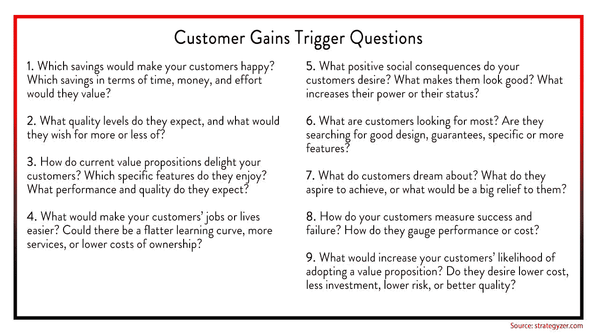

# 启动商业计划:我们如何做市场调查不失败的指南

> 原文：<https://medium.com/swlh/startup-business-plan-market-research-f5470b196fee>

> 本文由 [Ezetech](https://eze.tech/) 的运营主管 Oleksii Shevchenko[撰写。最初发表在我们的](https://eze.tech/author/oleksii-shevchenko/)[博客](https://eze.tech/blog/startup-business-plan/)上，并与媒体社区分享。

如果这听起来很熟悉的话，那就告诉我们:你正围坐在一起，喝着咖啡，也许正在和一个朋友(潜在的未来联合创始人)聊天，然后你突然想到了一个好主意——闪电般地想到了一个应用程序！它很有价值，很实用，而且很容易(或者你是这么认为的)推向市场。你开始在脑海中构思创业计划。

是啊，也许需要一秒钟。是的，你所知道的是，这可能是一个令人兴奋的，激动人心的，并有可能改变生活的机会。直到后来你才会忘记的是，你必须创业的想法充满了压力、长时间的工作、事后批评和焦虑——如果你没有为自己的创业制定一个合适的商业计划。

首先，在你进一步发展之前，你应该验证你的创业想法。找到你的市场，问基本问题，做广泛的市场调查。这将揭示无穷无尽的有价值的信息，反过来，解释为什么你的项目以前没有做过。

如果以前有人做过，并且在创新和/或对迭代的改进方面，你几乎没有什么可以提供的，那么你可能需要重新考虑你已经想到了什么。如果以前没有这样做过，你需要把所有这些作为一种表达可识别的、有形的和可销售的价值的方式:你的创业想法给世界带来了什么价值？

# 定义你的想法的商业价值

## **价值的概念**

价值是一件有趣的事情；在不同的时间，对不同的人来说，它意味着不同的东西，一个和另一个变化一样多。更复杂的是，它的定义在不同的领域有所不同。

但是对于企业家来说，将价值视为市场的结缔组织是有用的；企业和消费者走到一起，都在寻求价值。因此，让我们将价值视为特定业务的背景。

你可以想象为什么它会不断变化，不是吗？商业环境、消费者偏好、社会趋势、环境问题、经济因素——所有这些都在不断变化，不断改变着人们的价值观。

## **解决问题的价值**

思考市场的另一个有用的抽象概念是解决问题的概念。在商学院，学生们被教授一种范式，这种范式打破了企业如何与经营环境(市场)互动的价值概念。

基本思想是，企业的存在是为了在这种良性循环中创造、提出、交付和获取价值，这种良性循环对企业和消费者都有利。事情发生的方式？解决问题。

哪里有价值被创造，哪里就有问题被解决。在商业中，问题越相关，解决方案创造的价值就越多。

好了，脱离抽象，回到现实！我们来复习一下商业中的一些问题和相应的解决方法。看看你能否发现一个模式。

## **值为解**

***问题:*** o 从 A 点到 B 点你需要知道你在哪里，有一张地图，并设法优化你的旅行到最短的距离——而不必沿途停下来问路。
***解决方案:*** 谷歌地图

***问题:*** 有些你家里需要的东西，你可以花一个短途旅行去弄。但是其他的可能需要更多的思考，比较购物，和比你一天准备好的更多的时间。通常情况下，你整个周末都在开车从一家商店到另一家商店。
***解:*** 亚马逊 Prime

***问题:*** 你饿了，家里没有现成的东西做饭，即使有，也没有精力或耐心花时间做饭。与此同时，你不太确定你想吃什么，你不仅不想花太多时间弄清楚，而且不想花太多时间去搜寻所有必要的联系信息，打电话，打电话，然后在电话上读取你的信用卡。
***解决:*** 无缝

***图案？所有这些解决方案现在都以非常方便的应用程序形式出现，现在我们都知道应用程序有多受欢迎。会不会是因为他们在解决相关的问题——有些问题直到他们解决了，我们才知道自己有问题？***

# 确认机会:这是一个值得确认的机会吗？

一个创业公司并不仅仅存在于企业家的头脑中。初创公司存在于客户和潜在客户的视野中。

所以，如果会有人购买或使用你的产品，你需要尽可能地了解这些人，从这些人那里，为了这些人。

你的企业的生死取决于他们对产品或服务的接受度。你越早了解你的顾客，你就能越快适应并更好地为他们服务。

## **定义客户工作**

OBS 描述的是你的客户在工作或生活中试图完成的事情。客户工作可以是他们试图执行和完成的任务，他们试图解决的问题，或者他们试图满足的需求。

使用以下触发性问题来帮助您思考不同的潜在客户工作:

客户工作通常依赖于执行它们的特定环境。例如，你应该理解和孩子一起去看电影和和你的伴侣一起去的区别，为了舒适在家吃饭和为了审美和体验价值在餐馆提前预定桌子。

你在提问中引入的变化越多，你就离客户越近。

## **找到客户痛点**

在你理解了如何改善你的客户群的生活之后，你需要理解这些不便的根源；找到真正困扰他们的问题。

了解你的目标受众的主要恐惧会让你深入了解为什么客户可能会或者已经放弃你的产品。为了确定它们，你可以问自己这样的问题:

最终，你会了解到顾客在购买前、购买中和购买后的烦恼。

利用这些知识，你可以克服购买者的主要障碍，以及其他任何阻碍你决定购买你的产品或服务的障碍。

## **查看客户收益**

对每个人来说，好处很可能是不同的。有些人想省钱，有些人想节省时间，甚至有些人在没有额外奖励的情况下，看不到购买你的产品或服务的价值。

要了解如何满足你的潜在客户或顾客，你需要了解什么样的动机会激励他们考虑购买，而你不必强迫他们购买。为此，你需要“活在你客户的身体里”,像他们一样行动，至少花一天时间在他们的环境中，进入他们的大脑。

你已经到了吗？太棒了。现在问自己这些问题:

试着非常具体地描述收益，这样你就可以把它们与痛苦和工作区别开来。当您了解客户如何准确衡量这些收益时，您可以在您的价值主张中设计更好的收益创造者。

## **创建客户档案**

一旦你完成了初步的市场调查，收集了一些初步的市场数据，并开始至少初步了解了你的目标市场的概况，是时候深入挖掘了——是时候开始从客户角色的角度思考并创建你理想的客户概况了。

所以，想知道如何定义你的创业目标受众？

您应该使用从问卷调查中获得的所有信息，将这些信息综合成关键的见解(收益、困难和客户工作)，并将其全部汇集到一个地方—使用此画布作为您的客户档案数据。但是请记住:一个客户，一个档案。

这个人物角色应该是你真实的潜在客户的形象，所以尽可能让它真实。从一开始，这将让你了解如何向顾客展示你的产品。

然后，你可以深入地创建一个更广泛的档案，其中包括年龄、性别、教育水平和收入等硬因素，以及气质、敏感性或好奇心等软因素。不要忘记考虑他们去过的地方，读过的书，看过的电影，以及任何其他你可以加入的文化影响。

所有这些将有助于您在未来制定沟通策略，并验证您的真实客户。

## **创建价值地图**

A 在你总结了客户所有可能的痛苦和收获之后，是时候考虑如何让他们满意了。这被称为“价值图”，在这里你可以包括你可以向你的潜在客户提出的任何建议，以消除他们对你的产品的任何疑虑。

价值地图以一种更加结构化和详细的方式描述了您的业务模型中特定价值主张的特征。它将你的价值主张分解为产品和服务、止痛药和收益创造者。专注于一个特定客户群的一个价值图客户，并为不同的价值主张制作新的价值图。

## **价值主张设计**

T 价值地图和客户档案有助于评估过程，帮助识别客户面临的各种问题，这些问题会影响您的价值主张的设计。

基于不同的需求，不同的客户可能会有不同的问题，有时很难满足所有的需求。但是，解决所有这些问题是很重要的，因为产品提供的选择越多，就会吸引越多的顾客。

使用价值主张画布作为起点，走出去调查您的假设。问问自己是否真的明白哪些工作对客户来说很重要，相关的痛苦和收获是什么。测试看看你关于你的产品和服务将如何减轻痛苦和创造收益的假设是否真的有效。

# 做市场调查

所以当你完成了所有的价值设计准备后，现在如果是关于解决问题。有抱负的企业家如何确定他/她的应用创意是否解决了一个值得解决的问题——也就是说，一个与他们旨在服务的市场相关的问题？

这就是市场调研过程的切入点。

那么，什么是市场调研，为什么要做呢？基本上，你对市场上正在发生的事情有了一种感觉——人们真正重视什么，以及什么样的问题没有解决方案。

重点不是确认你的直觉。相反，你希望尽可能客观。通过使用不同的市场研究方法，尽可能多地收集信息，以确认你的价值观念与市场相符。

警告:一旦你开始为你的应用程序创意调查市场，你可能会遇到不愉快的观察，其他企业家已经在做了。不要气馁！竞争只是意味着你的想法确实是一个推动价值的相关机会。不断思考，你可能会发现一些你的竞争对手忽略的东西。

看看那些已经在你的领域做一些事情的人。如果你发现你的竞争对手拥有和你一样的受众，看看他们和你交流的方式。这将帮助你确定写什么，如何写，或者不写，这将是一个发现你如何脱颖而出的不可思议的方法。但那是以后的事了。

就目前而言，问正确的问题最有帮助，因为这是会见潜在客户并获得你作为一名企业家一直在思考的答案的正确时机:他们真的需要我的产品吗？

## **借助调查验证问题**

O 启动一家初创公司的步骤之一是在[开发 MVP](https://eze.tech/mvp-development/) 之前验证问题。

为什么每天都有这么多的创业公司推出，而成功的却如此之少，原因在于做点什么并不困难。很难理解是否有人需要它。

所以，你必须验证这个问题。

当你已经推出了一个原型，你应该从你的目标受众那里得到关于你提供的产品或服务的意见。当然，你能得到的最好的反馈是面对面的，但是如果你的产品现在只是一个想法，那么最好尽可能多的得到反馈。

***怎么得到的？深入采访和调查。***

> 专业建议:永远不要问你妈妈你的想法。最好的反馈是最有用的反馈，你会从你不认识的人那里得到。要做到这一点，你需要匿名，不提及你的想法，只问一些暗示性的问题，以获得更长的答案，而不是简单的是或否的答案。

此类调查可以通过 [Google Forms](https://gsuite.google.com/intl/en_ie/products/forms/?utm_source=google&utm_medium=cpc&utm_campaign=emea-ua-all-en-dr-bkws-all-all-trial-e-t2-1003964&utm_content=text-ad-none-none-DEV_c-CRE_167132276307-ADGP_Desk%2BTab%20%7C%20AW%20SEM%20%7C%20BKWS%20~%20EXA_M:1_UA_EN_Forms_misc-KWID_43700016230711881-kwd-10647024857-userloc_9061015&utm_term=KW_google%20forms-ST_google%20forms&gclid=Cj0KCQiA_JTUBRD4ARIsAL7_VeWcCZ5QUhG0ZcfuPkdWKMsjhORPCTZdZ8xzuEZl0MqXnjclx07TE9QaAvaAEALw_wcB&gclsrc=aw.ds&dclid=CLmcjJ2DqNkCFUiXGAodSZICyA) 、 [Survey monkey、](https://www.surveymonkey.com/) [Survey.io](https://survey.io/) 、 [Typeform](https://www.typeform.com/) 等方式进行。使用这些工具，以及你的问题的答案，你可能会得到你所希望的最公平的答案，反过来，你会更好地了解你的应用程序是否和你的潜在客户相关。

他们还可以帮助扩大目标受众，因为每个人都有自己的需求，这可能会让你感到惊讶。除此之外，它可以促使你进一步思考如何最好地改进产品，以及你可能会添加什么功能。

但是明白这一点很重要:你得到的答案从一开始就是最珍贵的东西。永远不要低估市场调研对创业公司的重要性，要深入了解你的目标受众的需求。

**你能从调查中获得什么信息？**

*   问题是否大到足以让潜在客户去思考它所解决的问题(当然，最好是在产品本身的帮助下)；
*   有助于解决问题的所需功能；
*   潜在客户愿意为解决这个问题支付多少钱。

**分析完这些信息后，您可以:**

1.  避免把全世界的时间和金钱都花在开发没人要的产品上(除了你)。
    建立一家企业可能需要大量的时间和金钱，但花时间进行调查可以让你避免花更多的时间和金钱去开发一个没人想要的产品。
2.  **获得开发更有价值产品的见解。**
    只需与潜在客户沟通，你就能准确了解痛点所在，并开发出更有价值的产品
3.  **获取创业公司的新想法。**
    因为为什么不？想法越多，机会就越多！

问正确的问题是验证问题的机会，也是了解是否、在哪里、何时以及谁需要你的产品的机会。它让你离开始发展你的[мVP](https://eze.tech/blog/what-is-a-minimum-viable-product-mvp/)更近了一步！

**还有问题吗？欢迎在下面评论提问！**

想了解更多关于企业家的有趣文章，请注册我们的机器人。

# 别忘了给我们你的👏下面！

## 这篇文章发表在 [The Startup](https://medium.com/swlh) 上，这是 Medium 最大的创业刊物，拥有+366，291 名读者。

## 在此订阅接收[我们的头条新闻](http://growthsupply.com/the-startup-newsletter/)。

