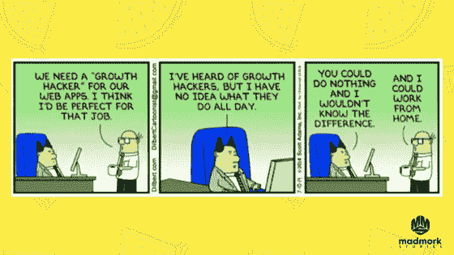
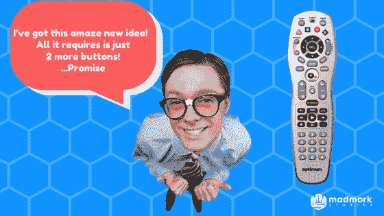
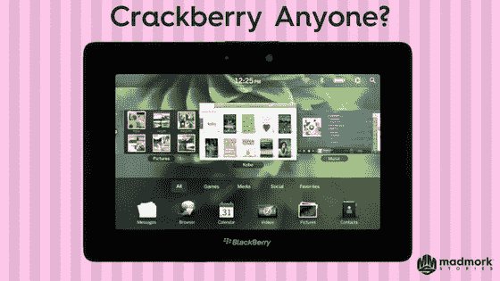
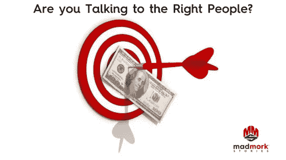

# 创业崩溃:这是营销，笨蛋。

> 原文：<https://medium.com/swlh/startup-crashes-its-the-marketing-stupid-8506032e4afc>

Dilbert is a registered trademark of Andrew McNeely Publishing, all rights reserved

创业公司和科技公司一直都在崩溃和毁灭。这就是快速发展的技术的本质。但通常，崩溃是由于一个单一的、重复的错误:糟糕的、不存在的或草率的营销。作为一名一直与初创公司 CMO 的副总裁一起工作的商业/高管教练，我在我工作过的几乎所有公司中都看到了这个问题。这不是因为初创公司缺乏人才，尽管有些公司在营销方面投资不足，也不是因为营销人员一无所知，尽管显然有些人可能如此。这更多是由于创业公司和科技公司如何广泛地定义营销在他们公司中的作用。

**营销的真正作用。**

西北大学的著名营销教授菲利普·科特勒被许多人认为是营销大师之一，他这样定义营销:

*“营销是探索、创造和传递价值以满足目标市场需求并获取利润的科学和艺术。营销识别未满足的需求和愿望。它定义、衡量和量化了已识别市场的规模和利润潜力。”*

另一个著名的营销者，杰罗姆麦卡锡发展了今天广为人知的经典营销的 4p。这些是**产品、地点、价格和促销**。

4P 及其标准应用的缺乏，是许多科技营销错误的根源。从组织上来说，技术产品通常由产品管理/工程团队所有(在早期公司中，由 CEO /创始人所有)。Place，更普遍的说法是 distribution，通常归业务开发和销售部门所有。价格归销售部门或产品管理部门所有。这就给营销人员留下了…你猜是“促销”这里更普遍的说法是广告或增长黑客。我并不是说营销应该拥有以上所有的东西。所需的复杂性和技能太多了，你无法改变科技公司的经营文化。然而，如果营销没有深入到业务的所有这些方面，可能会导致产品不适合市场，浪费营销资金来获得错误的消费者，品牌侵蚀和利润下降。让我们依次来看一下其中的每一项:

**产品**

我经常看到初创公司失败，因为创始人在寻找市场时开发了很酷的技术。发生这种情况是因为你有非常聪明的技术团队，他们喜欢制作很酷的东西，但他们离消费者或客户不够近，无法了解他们实际上在解决什么问题，或者这些人是否真的需要这项技术(Oculus 或谷歌眼镜有印象吗？).我既有谷歌 Daydream 耳机，也有 Gear VR。在过去的 6 个月里，他们一直坐在我的衣柜里收集灰尘。我从来不用它们。我真的不需要它们。它们并没有真正解决我的迫切需求/问题。当我环顾四周，没有人真正谈论今天的虚拟现实。除了一些例外，这个市场并没有像计划的那样真正启动。为什么？没有什么大问题需要解决。还没有真正的杀手级用例。 ***(微博本)***

当营销不涉及产品时，你会遇到的另一个问题是“功能蔓延”。我经常看到伟大的产品充斥着大量的酷功能，最终真的损害了最终用户的体验。Whatsapp、Instagram 或亚马逊 Echo 等产品之所以伟大，并不全是因为它们的酷功能。而是他们实际上解决了一个现实问题，而且做得极其轻松( ***Tweet This)*** )。阿根廷人有一句谚语，叫做“A prueba de boludos”翻译成外国佬的话就是“白痴证明”产品(无论是 B2B 还是 B2C)往往过于复杂，缺乏清晰的教程或入门知识，并且/或者不能直接解决特定的需求。结果是:这种很酷的技术使用起来非常复杂，以至于消费者只能绝望地放弃。*经验法则，尤其是在 B2C 业务中，是为最小公分母而构建，然后随着时间的推移而改进。毕竟，你上一次爱上你的有线电视遥控器是什么时候？* ***(微博本)***

**营销如何帮助产品**

将产品与市场紧密结合并避免功能蔓延的关键是让产品团队和营销团队从产品概念到发布的整个过程中通力合作。不要造一个产品，把它扔过墙，还指望营销“获取用户”。对我有用的是我简单称之为 D2 的东西；“活力二人组”。这两个人是项目经理(产品经理)和 PMM(产品营销经理)，他们从一开始就一起开发产品。项目经理开发 PRD(产品需求文档),并与工程部门一起构建、测试和迭代产品，而 PMM 的角色是关注市场、消费者和竞争，并确保 1。)我们正在解决一个真正紧迫的需求。我们可以区分当前的产品和 3)。当我们准备好发布时，我们有一个可靠的上市计划。好的 PMM 既有足够的技术来理解产品是如何制造的，又有足够的商业头脑来理解商业的经济性，以及在哪里有机会对产品进行独特的定位以获得竞争优势。这种结构在游戏(工作室负责人+ PMM)和谷歌(项目经理+PMM)都适用。如果你有兴趣了解更多关于产品营销以及它如何与产品一起工作，你可以在这里查看我的完整帖子。

**地点**

更普遍的说法是分配。分销可以成就或毁灭一个产品。不管是硬件还是软件。*你可以拥有世界上最好的产品，但如果你的竞争对手拥有稍弱的产品，但供应更广泛，你很可能会失去* ***(Tweet This)*** 。当我 90 年代在百事可乐工作时(是的，完全是和我自己约会)，可口可乐打败我们的一个重要原因不是广告，而是因为他们有更好的分销渠道。业内的笑话是，你可以在世界各地找到比饮用水更容易的可乐。可悲的是，这在统计上也是事实(讽刺的是，他们也卖很多瓶装水)。

*分销可以成就你的事业，也可以毁掉你的事业。可口可乐统治了 120 多年，因为今天它比饮用水更容易获得。这可不是开玩笑的。* ***(推特本)。***

科技领域也是如此。你必须在你的顾客在的地方，甚至在他们不在的地方。消费者看到你越多，你的品牌“回忆”就越多(即他们在考虑购买时首先想到的品牌)。Twitter 和脸书并不仅仅是因为他们的产品和病毒式传播而变得庞大。他们之所以成功，是因为你在任何地方都能“看到”他们。它们由 100，000 个第三方品牌在其网站、应用程序和媒体上发布。实际上，它们的普遍存在反映了它们的分布。这是无处不在的力量。自 19 世纪 90 年代以来，可口可乐和百事可乐在软饮料市场上享受着双头垄断，这主要是由于分销而不仅仅是广告。

**营销如何帮助分销**

打开分销渠道的关键是确定你所有可能的分销渠道:例如，用户/客户在哪里可以找到我的产品，并根据他们自己独特的特点找出如何营销。一旦你建立了不同的渠道或合作伙伴，市场营销通常会与你的业务拓展团队一起制定渠道营销计划。这就是营销——专为该渠道的需求量身定制的营销计划。这里有一个例子。当我管理 Google Play 营销时，我们的一个项目叫做“Google Play 自带”这是一个针对手机供应商和运营商的计划，我们向他们提供程序、资产和工具，以向用户传达 Android 设备带有 Google play 内容。目标是确保考虑 Android 的消费者不会因为 Android 缺乏内容而购买 iPhone。因此，我们开发了该计划，为这些渠道合作伙伴提供资产和计划，以帮助向潜在用户传达这一信息。

这类计划中最著名的一个是英特尔著名的 Intel Inside 活动(1995 年开发)。它不仅帮助用户了解什么是处理器以及它为什么重要，更重要的是，它告诉用户为什么他们应该只考虑运行英特尔处理器的电脑。它还让数百万用户看到了英特尔品牌，否则他们永远也不会听说过它。

**价格——给我钱！**

通常情况下，销售或高级管理领域的有效定价可以大幅提高盈利能力，延长产品生命周期，并摧毁竞争。

定价错误也会对你的销售产生巨大的影响。2011 年，黑莓推出了他们的首款平板电脑:Playbook。除了有一个与产品无关的可怕的名字(他们几乎没有游戏或娱乐内容，并且针对企业主)，他们最初将设备定价为 499 美元至 699 美元，与市场领导者 iPad 的价格相同。结果是令人沮丧的失败。它应该是直观的。毕竟，我为什么要从一家对平板电脑知之甚少的公司购买同等价格、内容更少的劣质产品呢？黑莓的失宠有很多因素，但一个很大的因素是营销或营销的缺失。

在考虑定价时，另一件要考虑的事情是你的商业模式。早在 2005 年，当我开始从事手机游戏工作时，最大的挑战之一是，我们实际上要求消费者支付 4-5 美元来体验他们从未体验过的东西。消费者，尤其是在考虑新产品和服务时，通常会犹豫是否要为他们从未体验过的东西付钱。在 glu mobile，我们通过提供 java 游戏的 Try-b4-u-buy 版本解决了这个问题。几年后，这最终演变成免费的 2 人游戏，这是现在的标准，并帮助涡轮增压整个行业。多年来，阻碍移动游戏产业发展的不仅仅是低劣的发行，还有糟糕的定价。一旦游戏变得可以免费玩，一个不下载它们的重要理由突然消失了，市场爆炸了。

**营销和定价**

让我们回到充满活力的二人组——D2。理想情况下，拥有你的产品的项目经理和 PMM 都应该有一个定价策略，不仅仅是为了发布，而是在你发布产品之前的整个生命周期。这种定价策略应该反映出竞争格局、新功能的引入(以及你是否会对它们收费)以及为新产品铺平道路的产品淘汰计划。在硅谷，团队不仅在定价上花费的时间不足，而且他们经常会对产品定价过低(我们的竞争对手定价为 X，所以我们应该定价为 X-1)，或者无法确定应该证明更高定价合理的功能。定价不仅对盈利能力很重要，而且作为感知品牌价值/实力的指标也很重要。

假设你将你的公司定位为 X 空间的“市场领导者”。如果你的定价和其他人的一样，这意味着什么？它说你没有足够的信心来收取更多的费用。如果你没有足够的信心为它收取更多的费用，那么它真的比外面的好吗？有可能，但这不是你的客户会问的问题。

营销团队需要评估作为定价函数的销售和数量如何随时间变化。他们应该着眼于针对一年中特定时间的一次性促销活动，并且应该在产品被淘汰时计划降价，在产品增加有价值的功能时计划涨价。最后，如果你销售的是实物产品，你的营销团队应该与销售团队合作，根据不同的渠道来寻找价格歧视的机会。有没有注意到一罐可口可乐(或百事可乐)在餐馆比在加油站贵？这是有原因的。

**最后但并非最不重要的推广(又名广告、增长黑客、UA)**

广告仍然是营销团队的核心职能。但问题在于:它不像过去那样有效了——尤其是在千禧一代中。为什么？有太多的噪音和太多支离破碎的频道可供选择。太多的广告，太少的时间，再加上消费者和客户往往懒惰，通常不理性(如果你不相信这一点，请阅读丹·艾瑞里的书“可预测的非理性”)。消费者正在过滤掉所有的噪音，并根据其他东西(朋友、最新的时尚、他们以前用过的东西、想到的第一件事等等)来做出购买决定。).就连谷歌也在 2015 年承认，可能高达 50%的 Adwords 点击是偶然的。

在 B2B 方面，许多客户表示，他们实际上更愿意从他们信任的公司购买产品和服务，并“帮助”他们开展业务。B2B 的翻译是更加关注内容营销和开发材料，这些材料实际上教会客户一些有助于他们业务的东西，而不是试图向他们出售一些东西。内容营销已经风靡一时，越来越多的营销人员发现，这是建立关系的最友好、阻力最小的途径，最终会转化为更大的销售额和更长的保留时间。

理解广告的关键很简单:广告是一个过程，是一个旅程。我经常用一个框架来帮助解释这个旅程 **ALTR:** 意识、受欢迎程度、尝试、重复。在技术领域，我看到的主要问题是太多公司只关注第一步(认知)和第四步(重复)。*这就是为什么创业营销经常有点像糟糕的性爱:它从一个吻开始，直接进入性爱，没有任何前戏。* ***(微博本)。消费者，尤其是那些没听说过你的产品的人，需要前戏，所以要习惯它，并且做得正确。在消费者购买你的产品之前，他们必须听说过它(对于新产品，经验法则是他们通常需要接触广告 8-12 次才能回忆起它)。一旦他们听说了它，他们需要“喜欢它”或接受它，作为他们可能购买的其他产品中考虑的一部分。第三，他们必须尝试，通常是以一种尽可能无风险和无痛的方式。他们可能会购买或尝试，但这并不意味着他们会坚持下去。营销人员的经验法则是，你已经拥有的客户总是比你必须获得的新客户更有价值。这就是为什么许多风投如此强调留住人才。在脸书以 5-7 美元获得一个用户是一回事，但 30 天后失去 92%的用户是另一回事。***

**你的营销团队在广告方面应该做些什么**

优秀的营销人员会制定广告策略，利用上述消费者旅程的每个阶段。根据每个阶段的目标，成功的营销策略会有不同的信息、不同的创意应用和不同的广告渠道。流程的每一步都应该根据自己的度量标准进行测量和评估。例如，认知度应该根据辅助品牌认知度与非辅助品牌认知度、网站访问量、分享、帖子等来衡量。试用可以通过注册免费试用或购买产品样品的消费者/客户数量以及他们使用产品的持续时间来衡量，而留存则是消费者在首次购买后继续购买和使用产品的时间。

不同的广告策略需要根据你的目标用户在消费过程中的位置来使用。广告牌或展示广告可能有利于提高知名度，但不利于试用。重新定位对已经在考虑你的产品的消费者有效，但对已经在使用的消费者无效。博客文章、白皮书和网络研讨会只有在客户旅程中的正确时间点为正确的受众量身定制的内容才会有效。如果你正在写关于你的产品特性的文章，并期望得到线索，那么你只是在浪费按键。

好消息是什么？要改善硅谷的科技营销，还有很多事情要做。硅谷正以多种方式在许多不同行业构建消费者和企业产品的未来。更好的营销会带来更好的产品，为正确的受众解决问题，以正确的价格提供正确的信息，在消费者期望产品出现的任何地方都可以买到。现在是在硅谷做营销人员的好时机(如果你脸皮厚的话)，营销从来没有像今天这样重要。营销人员应该抓住这个机会，而首席执行官和风投应该鼓励他们的营销和产品团队在实际推出产品之前更紧密地合作。消费者、科技公司和投资者将因此受益匪浅。

疯狂默克

## 这个故事发表在 [The Startup](https://medium.com/swlh) 上，这是 Medium 最大的企业家出版物，拥有 275，554+人。

## 订阅接收[我们的头条](http://growthsupply.com/the-startup-newsletter/)。

