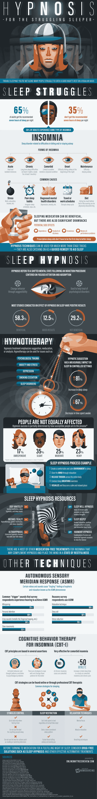

# 初创企业创始人:是时候让你的生活回到掌控之中了

> 原文：<https://medium.com/swlh/startup-founders-its-time-to-get-your-life-back-under-control-30250f61a6af>

## 怎么会？去睡觉吧。

我曾经听人说过，成为一名初创公司的创始人就像骑着一头狮子——你周围的每个人都对你骑着一头狮子印象深刻，他们都在说这有多酷，你有多勇敢，但你自己却在想我骑着一头狮子！我是怎么上这只狮子的？

Credit: [The Psychological Price of Entrepreneurship](https://www.inc.com/magazine/201309/jessica-bruder/psychological-price-of-entrepreneurship.html)

当你开始创业时，很容易让你的生活远离你。也许你工作时间很长，给员工而不是自己发工资，通宵达旦地确保你能与全球的客户交流。

不知不觉中，你就成了大多数——65%——每晚睡眠时间达不到建议的 7 小时以上的人。更重要的是，由于我们现在对技术的严重依赖，科学家们说我们现在需要 8.5 小时的睡眠来弥补我们紧张的状态。初创企业创始人的压力和他们来的时候一样大。

所以事情是这样的。你需要多睡觉。你需要睡得更好。你需要想出如何在一整天的工作后关闭你的大脑，让你的睡眠真正得到休息。了解更多关于睡眠催眠以及它如何帮助忙碌的创业者获得他们需要的休息。

## 这个故事发表在[的创业](https://medium.com/swlh)上，这是 Medium 最大的创业刊物，有 340，876+人关注。

## 订阅接收[我们的头条新闻](http://growthsupply.com/the-startup-newsletter/)。

