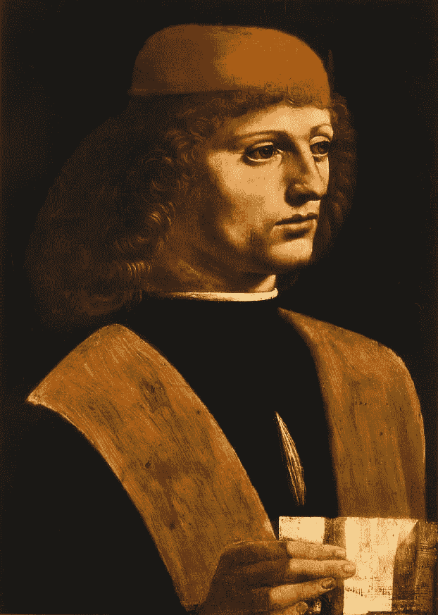
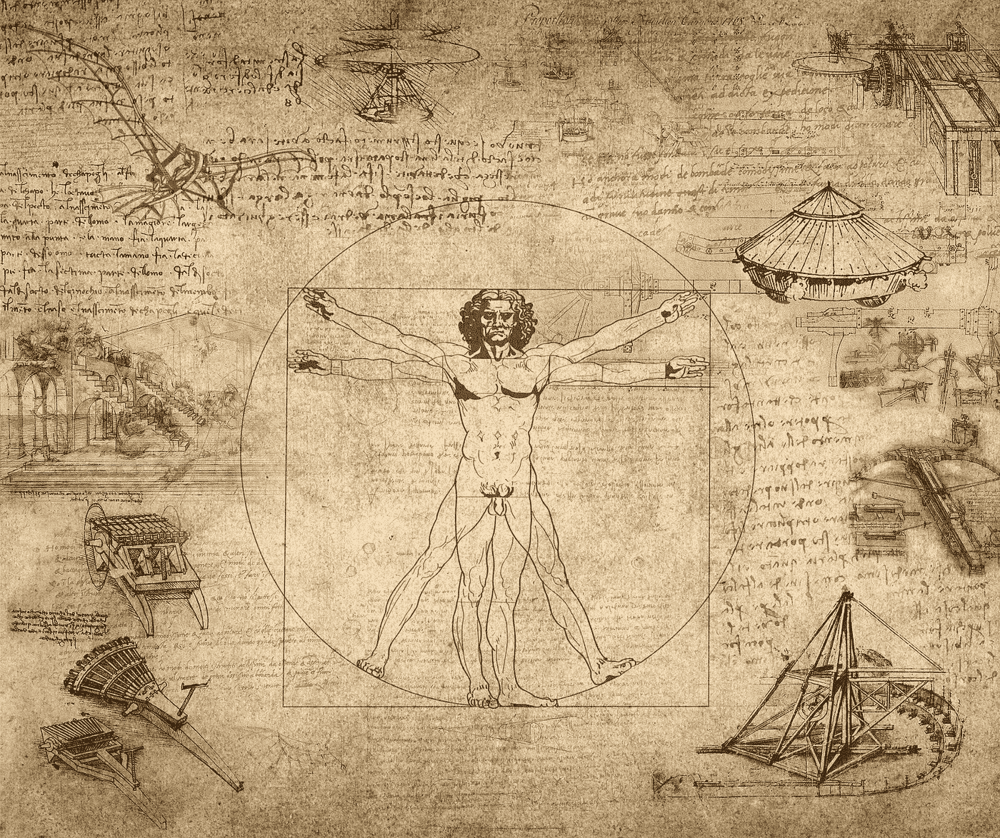
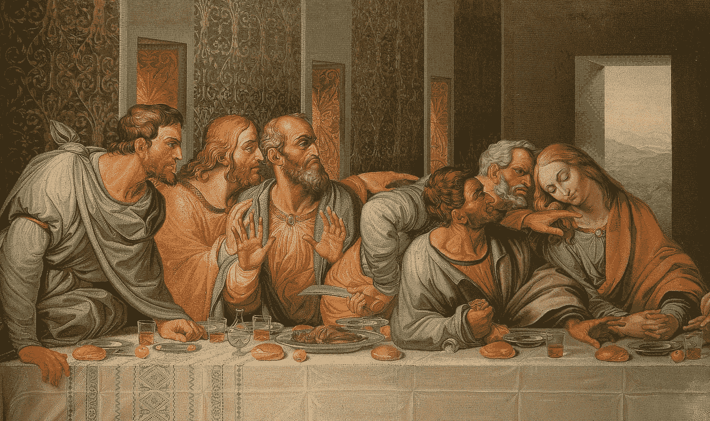
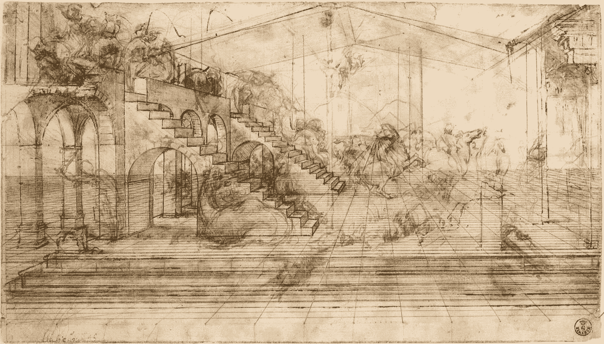
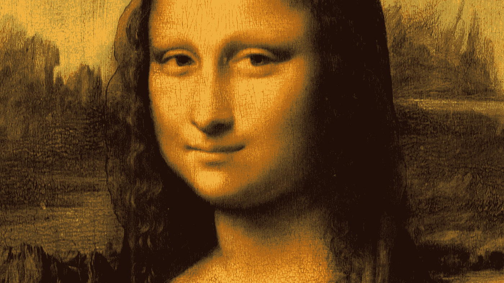
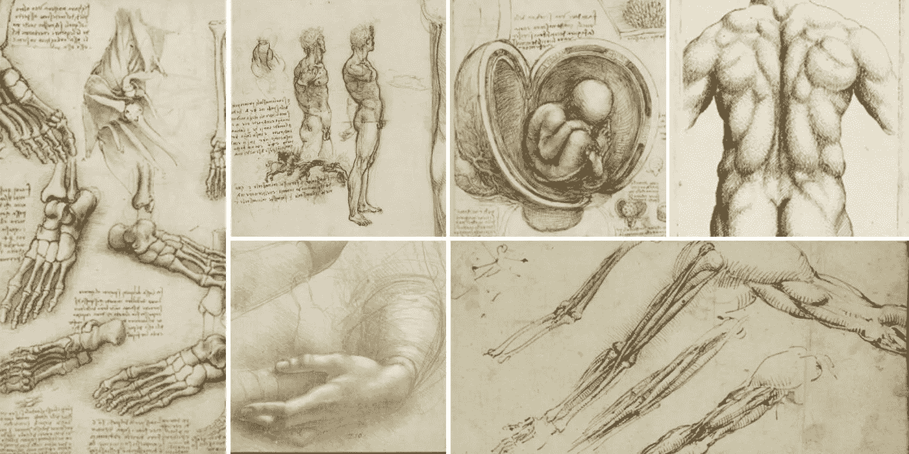
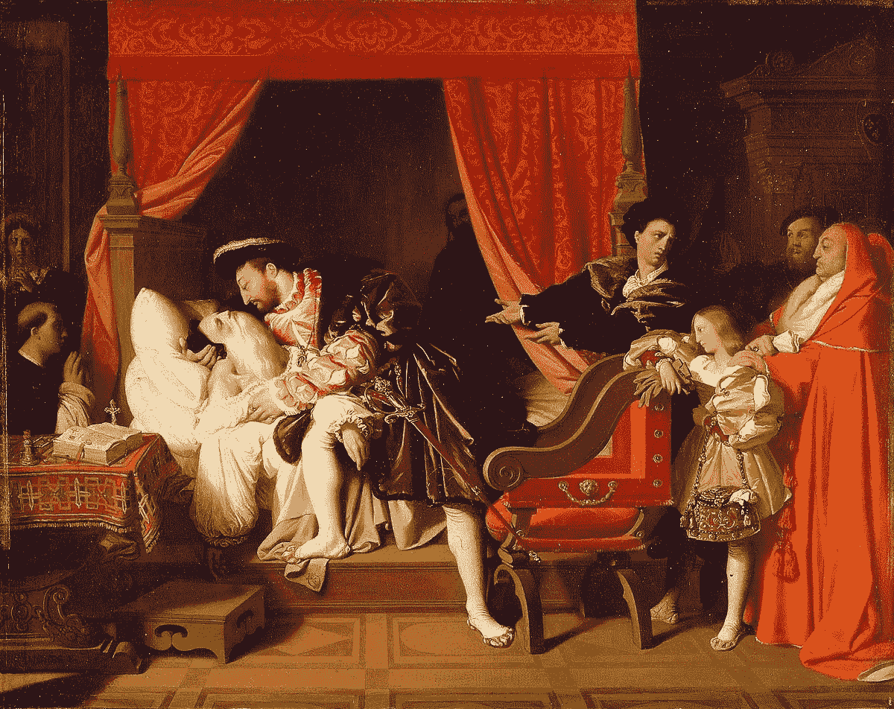

# 创业的历史教训:达芬奇

> 原文：<https://medium.com/swlh/startup-lessons-from-history-leonardo-da-vinci-47ed68ebea03>

我是一个刚起步的人，喜欢阅读历史，花很多时间思考…嗯，东西。这个正在进行的系列是对历史可以教给我们的关于创业和生活本身的探索和致敬。

当你想到天才这个词时，除了埃隆·马斯克和阿尔伯特·爱因斯坦，你会想到谁？大多数人会回答达芬奇。让我们来看看他独特的、创造性的教导有多少能被翻译成现代的内容。

未来的来源，从事实到历史小说，可能包括著名的将军、哲学家、政治家和一大堆罗马人。

这些帖子又长又丰富。所以享受它吧，就像一瓶好酒。给自己倒一杯。不要只是为了消费而喝酒。尝几口，想想味道。慢慢来。啃一些奶酪。与朋友分享。也许不要一次喝完一整瓶。将此加入书签，稍后再回来看。它能保存很久。

如果你真的想营造一种良好的氛围，放一些佛罗伦萨作曲家 Giovanni Palestrina [的古典乐作为背景音乐。](https://www.youtube.com/watch?v=BRfF7W4El60)

Possible self-portrait, named The Musician, painted by Leonardo Da Vinci.

# 莱昂纳多·达芬奇

除了他著名的创作天才之外，列奥纳多当然可以成为有史以来最有趣的人。他生活在历史上的一个黄金时代，文艺复兴时期，他就在这场运动的中心，佛罗伦萨。莱昂纳多是一个富有的官僚的私生子，但通过他惊人的作品和包括王子和国王在内的强大的资助人，他成为了当地的名人。他们的支持使他的无限思维从剥人尸体的嘴唇到发明新的战争武器，以及啄木鸟舌头的构造。

作为一个年轻的达芬奇自信的例子，下面是他简历的第 11 项，发给一个潜在的捐助者:

> *“同样在绘画方面，我可以做任何可能的事情。”*

这是一种与众不同的思想，努力接受包括拉丁语和数学在内的正规教育，总是被未来分散了注意力，但却坚持不懈地探索自己知识和能力的极限。最初的文艺复兴时期的人，莱昂纳多在他最后也是最亲密的恩人法国国王的保护下，在他的床边放着未完成的《蒙娜丽莎》,在那幅画上工作了仅仅 20 年后，老去了。完美主义者甚至没有开始描述莱昂纳多。

幸运的是，列奥纳多的大部分笔记保存至今。与此同时，以我们这个时代的天才史蒂夫·乔布斯的传记而闻名的作家，也发表了一篇对列奥纳多·达·芬奇生平的全面审视。

所以，回到你的椅子上，喝一杯好茶，让我们从那边得到一些明智的建议。

## "永动的投机者们，你们在这一探索中创造了多少虚幻的幻想！"

…创新与投机之间的一线之隔。

高度自信和厚脸皮对所有创始人来说都是强制性的，但什么时候过了头呢？多少个“不”就足以让你从雄心勃勃、有远见变成……嗯，好吧，好吧。一个有用的工具是寻求用户反馈而不是投资者反馈。后者可能永远不需要赢得，但在某些时候你会需要用户和顾客。所以，早点去找他们寻求认可，让投资者的无弹之身从你的盔甲上弹开。

## "在数学不能应用的科学中，没有确定性."

…什么是真实的，什么是虚构的。

“科学”这个词有一个相当宽松的定义，正如我们众所周知的那样，即使是统计数据也可以成为你的真理的工具，而不是绝对的真理。有什么绝对的真理可以被发现吗？有没有一个通用的废话过滤器？最接近的可能是第一原则，比如从一个客观可证实的事实来建立你的叙述，而不是你或其他人已经做出的假设。通常是数学或物理性质的东西，而不是哲学或宗教的。一旦你开始思考，你听到的几乎没有一个是基于第一原则的，这很可怕。我们这一代还有一个严格遵循基本原则的天才:埃隆·马斯克。

## “如果你希望对物体的形状有一个很好的认识，就从它们的细节开始，直到你在记忆中把第一个很好地固定下来，再进行第二步。”

…高耸塔楼的坚实基础上。

不要把这篇文章变成另一篇关于埃隆的无聊的长篇大论，他关于建立知识的观点普遍适用。把知识想象成一棵树。你不能真正理解边缘，叶子，直到你经历了理解核心，主干的运动。你从树根到树干到树枝再到树叶。没有别的办法，如果你真的想明白一件事。我相信你的想象力可以看到这是如何应用到你的业务的许多方面，以及你已经走了无数的捷径。追根溯源，为未来的稳定增长做准备，永远都不晚。

## "关于马，我什么也不说，因为我知道时局不好。"

…关于正确与正义。

达·芬奇花了几年时间制作世界上最大的马的青铜雕像。其他艺术家认为这是不可能的，因为铸造如此大型雕塑的技术还不存在。列奥纳多没有制作青铜艺术品的经验，但是他很快发明了必要的工具和工艺。经典狮子座，真的。不幸的是，这个项目因战争而中断，所有的材料都丢失了。这深深刺痛了他，因为莱昂纳多有点爱炫耀，他肯定计划向世界展示他有多棒。然而，他知道在战争时期，人们不会抱怨完成艺术品这样的小事。

我们都有这样的时刻，但你必须选择何时将你的“政治资本”花在联合创始人、合伙人、客户和投资者身上。默默承受你的委屈，不要变得难以忍受。

## 虽然人类的聪明才智可以做出各种各样的发明，但它永远不会设计出比大自然更美丽、更简单、更直接的发明，因为在大自然的发明中，没有什么是缺乏的，也没有什么是多余的

…自然选择的力量。

如果可能的话，不要刻意去违背自然规律。你正在谈判的新伙伴关系感觉不对劲？也许这是不自然的。拥有所有技能但你的直觉说不的新员工？相信你的直觉，它在数百万年的进化中被磨练是有原因的。只有自然的东西才会持久。至少对大自然来说是这样的。

The iconic Vitruvian Man is just one of 10 ideas Leonardo has captured on this single sheet of his notebook. Paper was expensive, so Leonardo was efficient with the material, but unable to limit his flow of ideas.

## "不要让任何不是数学家的人阅读我的作品."

…拥抱你内心的极客。

伟大的事情从来不会来自被所有人接受或喜爱。

## "亚历山大和亚里士多德是彼此的老师."

…关于导师。

在当今世界，导师制很少像教科书上的例子那样奏效。列奥纳多注意到年轻的马其顿王子同样指导着当时最伟大的老师。人们可以通过教学平等地学习。

## "正如度过美好的一天会带来幸福的睡眠一样，过好的生活会带来幸福的死亡。"

…在后悔的力量下。

莱昂纳多并没有过着传统的生活。艺术家。工程师。发明家。他有许多职业，通常是同时从事。他最后的笔记和未完成的作品开始于他晚年去世的那一天。他没有像他父亲一样成为公证人。“良好就业”的定义可以有多种形式，但你需要做出的关键选择是用你自己的方式来定义它。

## “既然我找不到特别有用或令人愉快的主题——因为在我之前来的人已经把每一个有用或必要的主题据为己有——我就必须像一个穷人那样，最后来到集市，除了把其他买主已经看过的东西都拿走，没有拿走，而是因为它们的价值较低而被拒绝。”

…在人群中寻找机会。

就像列奥纳多头脑中的知识市场一样，也许你会觉得所有的好主意都已经被提出来了。处理这个问题的一个更好的方法是你适合做什么样的想法。那是什么意思？它意味着你愿意投入多年的时间和注意力，而不是因为无聊而放弃什么想法？激情好，执念更好。不太可能有很多其他人 a)有同样的想法 b)对此充满热情 c)越过 a 和 b 去真正做些什么。

The other famous Leonardo painting is Milan’s pride, The Last Supper. Besides the evocative scene, it was a masterpiece in perspective, as seen in the distances between the lively characters and the doorways fading towards the window.

## “我完全意识到，不是一个文人，某些放肆的人会认为他们可能合理地责怪我；声称我不是一个文人。愚蠢的乡亲！”

…关于资格。

以前的读者可能会注意到，我并不热衷于那些花哨的学位，主要是因为我自己也拿到了一个，而且花了将近 7 年的时间。幸运的是，这里没有创业学校，也没有创业所需的认证委员会。在许多目前被颠覆的行业中，最好的公司都是由外来者创立的。没有资格可以成为巨大的优势，你不会被行业惯例和传统限制你的思维！

## 那些热衷于实践而没有知识的人就像一个水手进入一艘没有舵和指南针的船，他永远不能确定他是否在前进。

…快速移动和打破东西。

著名的脸书格言激励了一代黑客去做大事。然而，正如我们所知，脸书已经向前迈进，并引入了“稳定”这样的黑客诅咒词。呸。然而，即使在新企业的早期阶段，你也必须考虑你的基础是什么。与其每周黑新平台，不如黑功能。否则，您将最终得到大量令人惊奇的、有些随意的东西，这些东西没有主干、过程或可伸缩性可言。

## “青年应该首先学会透视，然后是物体的比例。然后他可能会复制一些好的主人，让自己习惯于良好的形式。然后从自然出发，通过实践来证实他所学到的规则。然后看一段时间各种大师的作品。然后养成把他的艺术付诸实践和工作的习惯。”

…正确做事的正确顺序。

世界上到处都是表格。有些是武断的，是由传统强制执行的，有些是由简单的常识决定的。要做一些史诗般的事情，你必须学习基础知识。抄袭别人来引导自己。先向别人学习。只有这样，你才能超越和创新。学习规则，然后打破它们。

## “熟悉肌腱、肌肉和腱的性质的画家，会非常清楚地知道，在给一个肢体运动时，有多少和哪些肌腱引起它；和肌肉，肿胀，导致肌肉的收缩；和支撑所述肌肉的肌腱，这些肌腱扩展成最薄的软骨

…关于工艺。

你只是从记忆的模式中画出肌肉，还是运用你对肌肉工作的知识来呈现现实？你在乎的是结果，还是过程更重要？这些都是创始团队和早期员工决定的文化决策。记住，结果不可避免地会有所不同，但过程是你可以控制的。你所控制的是你自己的。

This sketch for The Adoration of The Magi shows the meticulous preparation by Leonardo in setting consistent perspective across the entire scene. This shows us an amazing connection between the beauty of art and the precision of science.

## 为了使身体的健康不伤害心灵的健康，画家或制图员必须保持孤独，特别是当他专心致志于那些不断浮现在他眼前的研究和思考时，这些研究和思考能给记忆提供良好的素材。

…在适当的关注水平上。

如果你有一个单独的目标要实现，让自己沉浸其中。你希望你的工作材料被很好地储存在记忆中。当你有一个单一的焦点时，创新更容易。这也适用于你的团队。如果你想创造一些新奇的东西，不要雇佣临时工和临时工。如果你想变得了不起，就不要外包。随着承诺而来的是反思。随着反思而来的是顿悟时刻。

## “我自己已经证明这是一个不小的使用，当在黑暗的床上，回忆以前研究的形式的外部细节，或其他值得注意的事情通过微妙的猜测；这当然是一个令人钦佩的练习，和有用的印象事物的记忆。”

…再次聚焦。

如果你做了很多事情，空闲的时候你的头脑会在很多事情上徘徊。如果你非常专注地做一件事，你的大脑会在休息和闲暇时探索这个奇异的话题。平庸的想法来自白板和电话会议。好主意来自健身房、公园、沙发和床。

Leonardo’s most famous creation, The Mona Lisa, was by his bedside upon his death, still unfinished after 20 years of minute additions and tweaks of thousands of individual paint strokes.

## "他是一个不擅长他的老师的穷弟子."

…关于为增长而招聘。

如果你有能力的话，永远不要为一个角色招聘。为发展而雇佣。假设人们能应付这种情况，以及将来会发生的任何情况。雇佣你遇到的最好的人，而不是你迫切需要的人。环境会改变，从长远来看，最优秀的人总是会超越别人。

## “我忍不住提到这些戒律中的一个新的研究装置，虽然它可能看起来微不足道，几乎可笑，但在唤起心灵的各种发明是非常有用的。这是，当你看着一面墙上有污点，或石头的混合物，如果你不得不设计一些场景，你可能会发现各种景观的相似之处，用山脉，河流，岩石，树木，平原，宽阔的山谷和丘陵各种各样的安排来美化；或者你可能再次看到战斗和行动中的人物；或者奇怪的面孔和服装，以及无穷无尽的各种各样的物体，你可以把它们简化成完整的、画得很好的形式。这些困惑地出现在这样的墙上，就像钟声，你可以找到任何你选择想象的名字或单词。”

…关于给想象留有余地。

不要总是急于找到显而易见的解决办法。显而易见的解决方案永远不会让你领先，因为如果它们对你来说是显而易见的，对其他人来说也是显而易见的。尽可能寻找人迹罕至的道路。苍天不负苦心人。盯着墙壁，发现您的新平台架构。听钟声发明你的新产品名称。如果所有这些都失败了，开始每天冥想练习。给你的大脑空间去探索你想象中的角落和缝隙。

Leonardo spent years studying cadavers in the mortuary to learn about the body. There were no textbooks on human anatomy at the time, so Leonardo may have well been the foremost expert in the world on this topic, among many others.

## "人类身上的公平会消逝，但艺术不会."

…时尚和趋势。

什么时候跟风是明智的？你应该把你的职业生涯奉献给密码，因为媒体正在炒作它吗？诀窍是认识到持久力。如果你绝对相信 crypto 将以某种形式一直存在，那么是的，它可能是一个很好的职业重点。这可能不会在短期内得到回报，你可能会后悔，但随着时间的推移，成为一名先锋并经历失败本身就变得很有价值。当然，前提是你不赶下一个潮流！

## "鄙视绘画的人既不热爱哲学，也不热爱自然."

…认识到你领域之外的伟大。

这是一个个人观察，但是生活中有单一焦点的人很少有创造力。我说的不是奉献。你可以成为伟大的艺术家、运动员或商人。但是如果你只关心一件事，而拒绝从其他领域获取灵感或影响，你就是在限制你的创造力。大多数伟大的艺术、文学甚至科学作品都来源于其他行业。爱因斯坦著名地宣称通过他的小提琴音乐找到了相对论的直觉。

Leonardo being held at his death bed by his beloved patron, the king of France.

> *“汤要凉了”*

最后一条记录，他死的那天早上，1519 年。

达芬奇
1452–1519

# 阅读书籍

1.  [达芬奇](https://amzn.to/2HrEXow)作者沃尔特·伊萨克森
2.  达芬奇的笔记本

# 前几集你可以看看

 [## 创业的历史教训:马库斯·奥勒留

### 我是一个刚起步的人，喜欢阅读历史，花很多时间思考…嗯，东西。这个正在进行的…

medium.com](/@akiranin/startup-lessons-from-history-marcus-aurelius-aa36384bff37)  [## 创业的历史教训:塞内卡

### 我是一个喜欢阅读历史和思考事物的创业者。这一系列是对历史可以…

medium.com](/@akiranin/startup-lessons-from-history-seneca-aa4107723231)  [## 历史的教训:武藏

### 我是一个创业的人，很少活在当下。我讨厌新闻。是大脑污染让原创没有了空间…

medium.com](/@akiranin/startup-lessons-from-history-musashi-11e2490d1ea1) 

# 更多内容即将推出…

如果您希望在添加下一集时收到通知，请务必滚动到顶部的**关注**我。

感谢阅读，
Aki

这里有最喜欢的一句话吗？还有其他我应该报道的历史人物吗？请**分享**让我们也能受益。

## 这篇文章发表在 [The Startup](https://medium.com/swlh) 上，这是 Medium 最大的创业刊物，拥有 339，876+的读者。

## 在此订阅接收[我们的头条新闻](http://growthsupply.com/the-startup-newsletter/)。

