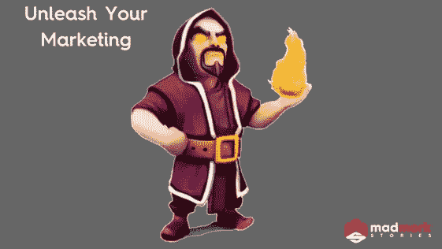

# 创业经验教训:雇用 CMO 第 1 部分。

> 原文：<https://medium.com/swlh/startup-lessons-hiring-a-cmo-part-1-fe0c9968860d>

为你的初创公司聘请首席营销官(CMO)可能是你作为首席执行官所做的最重要的决定之一。正确的 CMO 可以建立一个世界一流的营销团队，不仅可以帮助你以更低的成本获得更多的客户，还可以提高你的公司的知名度和品牌价值，这在几个月或几年前是不可想象的。

然而，现实是，尽管 CMO 的角色很重要，但它经常被误解，首席执行官，尤其是第一次创业的人，通常要么在错误的时间雇佣了 CMO，要么雇佣了错误的人。

**从“为什么”开始**

你真的需要一个 CMO 吗？或者你可以简单地雇佣一个副总裁或营销 SVP。当我回顾我的职业生涯时，在我四次成为 CMO 的时候，只有两次我要去的组织需要这个角色。以下是你可能需要 CMO 的一些原因:

1.**你已经达到了你的最大能力水平:**我见过那些经营营销多年的首席执行官或首席运营官，他们在开始时通常能够成功。但是随着你的成长，营销变得非常复杂，你可能会发现现有的营销团队(通常 6 -15 人)没有足够的时间或者问你一些你没有好答案的问题。此外，副总裁级别的人可能不具备管理或扩展团队的经验或技能。你只是需要一个更有经验的人，他以前做过这方面的工作。

2.**团队告诉你他们需要更多的领导力:**优秀的人通常知道他们什么时候需要领导力，并且足够清醒地知道他们什么时候力不从心。你可能有 1-2 个主管级别的人开始告诉你他们需要更多的领导，并对这个人在团队中可能做的事情提出建议。他们会到达一个点，他们需要一个可以向他们学习的人，而你现在公司里没有这样的人。或者，也许你的销售团队告诉你，营销不再削减它或竞争对手(见下文)做得更多。

3.**你的竞争对手正在吃你的营销午餐:**你知道，或者可能认为，你有更好的产品，但你的竞争对手正在赢得更多的交易，获得更多的媒体报道，增长更快，推出创新的合作伙伴关系或做电视/广告牌广告。我已经说过一次又一次了，但是拥有最好的产品并不意味着你就赢了。伟大的营销人员实际上可以创造一种感觉，即他们的产品几乎一样好，在一个普通人时间越来越少、选择越来越多的世界里，感觉很重要。如果你被鞭打了，那是时候扯平了。

4.**你的故事烂透了:**人类是有感情的生物。人们希望获得灵感、娱乐和快乐。然而， [**科技公司在将他们的技术翻译成人类语言方面尤其困难**](https://www.madmork.com/single-post/2017/05/29/Less-Tech-More-Heroes-Slaying-Dragons-Please) 。如果你在办公室里走来走去，问 10 个人如何用不超过 25 个词来描述你为谁服务以及你是如何做到的，他们要么不能，要么他们都说了不同的话，想象一下你的潜在客户会听到什么。在这种情况下，你可能需要一个讲故事的 CMO(见下文)。

5.**数据致死:**市场营销中有大量的数据点需要衡量。从明显的每次下载成本或每次引导成本到净推广者得分([**【NPS】**](https://www.madmork.com/single-post/2018/02/01/NPS---What-it-is-and-why-Marketers-and-Founders-should-Track-it))、b [**rand 认知度、品牌回忆、**](https://www.madmork.com/single-post/2017/07/14/How-do-you-measure-Brand-Health) 和 Voice 份额(SOV)。如果你被数据淹没，不确定你需要跟踪哪些数据点，你的市场营销的复杂性可能会达到需要一个定量 CMO 的程度(见下文)。

6.**大爆炸预算:**你已经建立了清晰而一致的产品市场契合度，多年来一直在很好地扩大业务，而且 **m** 可能你刚刚完成了新一轮融资。你意识到为了实现明年的目标，你需要在营销上花费 2000 万美元。当你达到这些类型的营销支出水平时，你需要确保你有适当的营销领导力、高超的跟踪和衡量能力，并利用正确的信息关注 [**正确的目标受众**](https://www.madmork.com/single-post/2018/03/01/Stop-Wasting-your-Marketing-Dollars) 。当你考虑到在某些情况下，花在营销上的每一美元中有 0.42 美元是用于工具和衡量的(在我们生活的复杂世界中，这种情况正在可悲地发生)，你需要一个知道自己在做什么的人来掌舵。

7.**组织噩梦:**在营销的早期，你或者更多的初级营销人员，通常可以管理复杂性。但是，随着你的业务增长，竞争开始出现，预算增加，你的营销组织变得更加复杂。当你从几个人管理增长型营销、公关和促销，突然需要一个内容营销总监、设计师、内容编辑、多个产品营销经理和一个品牌管理团队时，显然你需要有人来组织事情。

**说书人与宽客**

恭喜你，你发现你需要一个 CMO。根据我的经验，你雇佣的 CMO 类型实际上取决于你所在的行业类型和你的组织真正需要什么。

一般来说，我把 CMO 的分为两类。

**说书人:**说书人是编织伟大故事的大师，也是战略家。他们直觉地知道客户想要什么，并且有诀窍去理解到底谁应该是受众，以及如何创造一个故事，不仅抓住他们的注意力，而且吸引他们尝试/购买你的产品。说书人通常非常有创造力，外向，可能有很好的舞台表现力。他们可以是鼓舞人心的领导者，也可以是公司了不起的代言人。这些类型的 CMO 的甜蜜点通常是 B2C 企业和企业的重点是更多的品牌，内容营销，公关和高调营销计划(视频广告活动，事件，合作伙伴关系，电视，广告牌)。这些类型的 CMO 的缺点是，它们可能需要相当大的营销资源才能有效(在人力和资本方面)。

宽客:宽客是表演忍者。他们生活和呼吸着数字，通常具有高度的分析能力。定量分析师通常有产品或增长市场营销的背景，甚至可能来自产品管理背景。他们不仅有建立和管理大规模增长团队的经验，而且非常熟悉衡量营销活动所需的所有跟踪和分析工具，以及同类最佳的 CRM 工具(Salesforce、Marketo、Pardot、Hubspot)。一个好的定量分析师也知道所有的部分是如何组合在一起的，他有经验并有能力创造销售线索生成“引擎”,在这个引擎中，内容、增长型营销、数据科学和 PR 一起产生一个良性循环的伟大内容，推动销售线索、知名度和 PR 集于一身。

向导:好的，我知道我说了典型的 CMO 分为两个阶段。如你所料，巫师是两全其美的人。这些家伙是极其罕见的 T2 T3。奇才不仅能够看到全局并编织一个故事，而且善于理解绩效营销如何捕捉并大规模传递这个故事，不仅在情感上与客户联系起来，而且以对公司经济有利的方式这样做。这些人通常在非常多样化的环境中工作过，涉及 B2B 和 B2C 产品和服务。

**好的，我应该雇佣什么？**

首先，你需要为你的企业雇佣合适的 CMO。如果你处在一个竞争激烈的环境中，你在努力让别人听到你的声音，而你的价值主张似乎没有引起共鸣，你可能需要一个讲故事的人。如果你的业务很大一部分是简单的内容驱动的潜在客户生成，并且具有很高的可测量性，那么 Quant 可能是更好的选择。

然而，在寻找 CMO 时，重要的不是寻找一个向导，而是找到适合你的企业的合适人选，并确保无论你是雇佣一个讲故事的人还是一个定量分析师，你要雇佣的人要么有，要么有意愿雇佣一个可靠的第二人选，在他们缺乏经验的领域补充他们。

以我的经验来看，一个优秀的 CMO，无论是讲故事的还是定量分析师，通常都会坚守自己的舒适区，但也会在自己的弱点周围聚集一些恭维自己的强者。因此，如果你雇佣一个讲故事的人，你需要确保这个人有一个出色的副总裁或客户获取/增长总监。如果你雇佣一个定量分析师，你会希望他们有一个强有力的副总裁或品牌营销总监(以及一个优秀的公关/沟通总监)。

无论如何，在整个面试过程中，你需要了解你的候选人是否对以下团队的结构、每个团队的工作以及如何让他们一起工作有充分的理解和意见:

**增长营销:**团队管理您的绩效渠道，负责管理您的绩效预算、跟踪、分析和计算客户获取成本(CAC)、终身价值(LTV)、客户流失等。该团队的任务是管理漏斗的“顶端”(即获得新客户),并为您的产品/服务创造一个基本的认知水平。他们还可能负责采购和管理第三方分析工具。

**客户关系管理(CRM):** 客户关系管理团队的任务就是让您的客户沿着漏斗向下移动，要么到达您的客户代表吸引他们的位置，要么到达他们尝试或购买您的产品的位置。CRM 团队使用电子邮件、重新定位和通知等工具来保持客户向漏斗下方移动，并保持现有客户的参与。

**品牌营销:**该团队开发您的品牌定位，拥有您的 [**品牌圣经**](https://www.madmork.com/single-post/2017/05/11/Why-every-startup-needs-a-Brand-Bible) 和 [**品牌金字塔**](https://www.madmork.com/single-post/brandpyramid) ，为品牌活动创造营销资产，并帮助开发您的品牌/公司的整体故事。品牌团队也可能拥有自己的设计资源来创建网页、视频、横幅或与内容营销团队共享这些资源(见下文)。他们还拥有你所有的 [**品牌指标**并管理从事品牌相关项目的供应商。](https://www.madmork.com/single-post/2017/07/14/How-do-you-measure-Brand-Health)

**产品营销:**PMM 团队与您的产品管理团队并肩工作，帮助开发竞争分析、go 2 市场计划、领导市场研究计划(与 Insights 团队——见下文)、制定产品定位/信息，并与品牌团队合作创建引人注目的产品营销材料(视频、网页、演示、手册)。关于什么是产品营销以及他们如何与产品合作的完整描述，请看我的帖子 [**这里**](https://www.madmork.com/single-post/2017/10/12/Product-Marketing---What-it-is-What-it-does-Why-you-need) 。

**内容营销:**这个团队帮助制定编辑策略，包括你应该创建什么类型的内容、多久创建一次、由谁创建以及如何发布。我通常建议这个团队或者有一个 SEO 专家，或者与他密切合作，以确保你创建的所有内容都是 SEO 优化的。CM 团队与增长和 CRM 团队密切合作，为他们提供合适的内容，以优化客户在您的漏斗中的旅程。

营销传播(markoms):markoms 通常包括公共关系(PR)和社交媒体。这个团队的任务是使用“自有频道”(即免费频道)与媒体和公众沟通。他们与内容营销(他们实际上提供了很多内容)和品牌密切合作。在首席执行官是一个强有力的公共演说家、前营销人员或与媒体有密切关系的组织中，公共关系团队可能直接向首席执行官报告。

**见解:**泛指我所在的较大的、公开上市的消费品公司。insights 团队专注于所有事情的研究。这包括定量(投票/调查)和定性(焦点小组)研究、数据分析、竞争研究(与产品营销一起)、品牌跟踪(与品牌团队一起)和净推介值(同样，与产品营销团队一起)。他们还管理从事市场研究的第三方供应商(Nielsen、Qualtrics、Survey Monkey、Survata ),还可能与增长团队推荐的分析供应商合作。

**合作关系:**这个团队专注于与其他有共同利益的公司建立营销合作关系。例如，一家 SaaS 公司可能会选择一家研究公司来帮助他们做一些研究，写一份白皮书，然后联合辛迪加产生的新闻。良好的伙伴关系团队可以达成交易，以增加分销或广告覆盖范围。好的一面是，有时这些伙伴关系也会带来很好的公关机会。

拥有合适的 CMO 可以成就或毁灭你的创业。这不仅是一个成本高昂的职位(25 万美元+基本工资+奖金+0.50%-1.25%的股权)，而且作为高管团队的一员，CMO 通常在战略和产品方向上有很大的发言权(考虑到他们从客户和市场获得的数据)，而且可能是你公司的形象代言人，或者公众形象代言人之一。

因此，要雇佣合适的 CMO，你需要确保在合适的时间、出于合适的原因雇佣他们，并且在头脑中有合适的形象。之后，一切都是关于耐心、勤奋和让他们进门。这是一个很大的进步，可以让你的创业达到一个全新的水平。

下周，我将告诉你如何找到适合你企业的 CMO，以及在面试过程中你应该问他们什么。

狩猎愉快！

帕特里克·疯子·默克

营销蔻驰&首席说书人

## 这篇文章发表在 [The Startup](https://medium.com/swlh) 上，这是 Medium 最大的创业刊物，有 308，471+人关注。

## 在这里订阅接收[我们的头条新闻](http://growthsupply.com/the-startup-newsletter/)。

