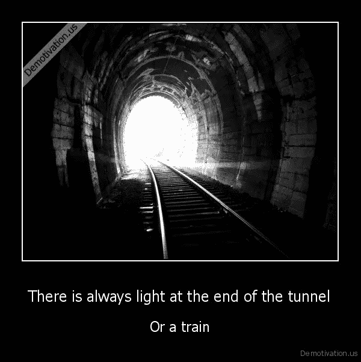

# 创业生活:结构、可预测性和积极的人生观..还是没有？

> 原文：<https://medium.com/swlh/startup-life-structure-predictability-and-positive-life-view-or-not-83bd59a54c5c>

作为一名初创公司的联合创始人，我每天早上醒来都有一种可怕的恐惧。不知何故，我内心的某些东西掩盖了恐惧，给了我一个积极的视角，迎接一天的结束、一周的结束、一季度的结束、一年的结束。

这种感觉刺激了我的行动，塑造了我的逻辑:它是改变我的分析机器过滤生活方式的基石。

我知道它不是什么，但我无法定义它是什么。不是盲目的信任；不是对美好世界的天真信仰；不迷信的观点认为，当你想要什么东西时，宇宙与我合谋，因为我有我的宇宙份额与我合谋**对抗**，统计证明，因为我记录和跟踪我生活中的许多事情，数据不会说谎或扭曲现实。

这种燃料驱使我走上一条为看不见的未来构建模式和导航结构的道路——就像沙漠中的一个疯子，他对自己的海市蜃楼有着明确的目标。

你可以与之比较的最接近的词是**信仰**，其细微差别更倾向于信任，而不是神圣的、宗教性的陈述。

在这种状态下，我对自己的未来和计划、建设、承诺有一种错误的授权和控制感。我构建简单的预测模式，比如今晚或周末做某事的程序，或者夏天的旅行，或者更复杂的模式，比如时间管理、现金流预测应用程序、向他人承诺部分沙漠的初创公司，甚至更大胆的模式，比如与我的妻子一起建立生活、收养小狗、生孩子——向未知领域的巨大飞跃。

对于一个对一天或一个月的结束没有这种积极感觉的人，一个不能欺骗他/她自己他们的生活掌握在他们手中的人来说，这一切看起来如何？如果你不能控制任何事情，为什么要计划一切？

根据定义，我生活在一个精神分裂的框架中，既知道生活是不可预测的，又坚信我可以预测它。在这种情况下，软件将不再工作。

但是，如果一个人不真正相信结果的可能性，他怎么能操作和努力去做任何事情呢？这就像坐你的车去兜风，完全知道你可能会在旅途中死去——你还会这样做吗？

除了哲学含义，我想知道是什么为你，一个阅读这篇文章的人，创造了盲目、天真、傲慢的信念，认为你可以控制将要发生的事情，并带着这种希望开始努力实现最有可能完全超出逻辑控制的结果？

## 这篇文章发表在《T4》杂志《创业》(The Startup)上，这是 Medium 最大的创业刊物，有 312，596 人关注。

## 在这里订阅接收[我们的头条新闻](http://growthsupply.com/the-startup-newsletter/)。

