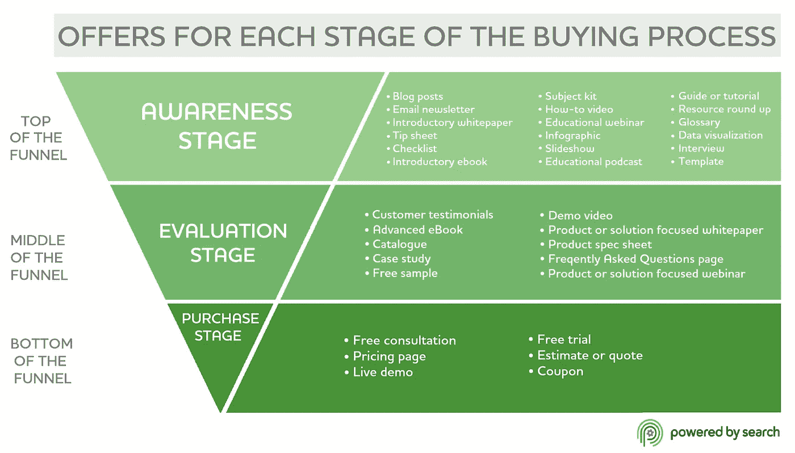

# 在风险投资的 SaaS 度过的 1000 天中的 10 堂创业营销课

> 原文：<https://medium.com/swlh/startup-marketing-lessons-e06135e62254>

我最近结束了在社交媒体分析行业的一家风险投资创业公司做营销的三年经历。

这是一个竞争异常激烈的世界，只有顶级玩家(或者如果幸运的话，前 2 名或前 3 名)才能获得所有的价值。你要么快速成长，要么慢慢死去。压力在于让人们兴奋地谈论你的产品，访问你的网站，并转化为付费客户。

大多数创业公司面临的主要问题是营销和开拓利基市场的能力，找到并留住付费客户。即使有一流的开发团队和一流的产品，如果没有优秀的营销和销售团队，你的创业公司可能无法成长或生存。

我希望这篇文章和我的创业营销课程能对你的旅程有所帮助。我们开始吧。

# 在你有一个产品或想法之前，就开始扩大你的受众

在你有一个成品之前，甚至在你有一个想要建立的好主意之前，你就应该开始推广你自己，建立你的观众群。不要等到你发布了一个产品之后才开始培养你的受众。

**大多数第一次开发人员实际上忽略了营销。**他们忘记了吸引人们看一眼他们创造的东西的挑战。至少在他们看到他们的第一个项目在发布后的几个小时内就崩溃了。

我见过很多次，开发人员花了无数的时间来开发一个东西，不声不响地发布它，然后试图通过在[独立黑客](https://www.indiehackers.com/)或[黑客新闻](https://news.ycombinator.com/)上问营销问题来搞清楚如何推广它。不要犯那个错误。

# 我如何开始建立一个观众群？

在你的域名上创建一个网站，并开始发布关于你所知道的事情的精彩内容(甚至是你正在研究或试图了解的事情)。内容会帮助你被发现，建立你的权威和影响力。

**不要陷入理想主义的开发者陷阱，想要从头开始构建。使用类似 WordPress 的东西，通过一两个插件，你可以在一两天内完成一个伟大的网站、博客甚至 MVP，而不是花一两个月的时间从头开始。这段时间最好花在建立一个听众群和与你试图服务的人交谈上。**

这就是为什么内容是你最好的营销赌注:

*   对于初创公司来说，传统的公关和获得媒体提及并没有那么高效和划算。成为新的[沃比·帕克](https://www.inc.com/magazine/201805/tom-foster/direct-consumer-brands-middleman-warby-parker.html)很难。
*   **在谷歌和脸书**上做付费广告很好，如果你负担得起并且有时间尝试的话，但这不是长久之计。一旦你停止支付，它就停止产生结果。影响者营销也是如此。
*   另一方面，内容营销很容易开始(你可以简单地自己制作内容)，如果做得好，可以在工作完成后的几个月甚至几年内持续产生价值。内容可以是博客帖子、YouTube 视频、播客和直播流。这取决于什么最适合你(以及你的目标受众)。

这些努力意味着，当你有了一个你想让所有人都知道的成品时，你会有人对你大喊大叫。你的第一批顾客会通过你的内容找到你。

当你带着你的追随者踏上你的创始人之旅时，建立一个观众群甚至可以帮助你决定创造什么样的产品，并获得很好的反馈。

# 请访问者注册一个邮件列表，跟踪你的旅程

你需要一种可靠的方式来接触你正在培养的观众。这样你就可以告诉他们什么时候有大事，比如你准备好为顾客开门了。

社交媒体绝对不是一个非常可靠的沟通渠道。由于不同的算法，**你很少能让超过 10%的观众看到你在脸书、Twitter、Instagram、LinkedIn 和其他网站上发布的任何消息。**

[邮件营销不一样](https://howtomakemyblog.com/email-marketing/)。这是一个非常低技术和灵活的媒体。这是非常个人化的，比社交媒体有更高的影响力。你完全拥有自己的邮件列表，所以你可以选择不同的电子邮件提供商，甚至可以自己管理它。MailChimp 是建立数据库和运行邮件列表的一个很好的起点。

立即开始扩大邮件列表。即使有了成品也要继续种植。

大多数发现你的创业公司的人并不准备立即购买。他们需要时间，可能只在未来需要你的产品。**您添加到邮件列表中的每个新电子邮件地址对您或您的销售团队来说都是一个新的线索和新的潜在客户**。

你有许多不同的工具(和 [WordPress 插件](https://howtomakemyblog.com/best-wordpress-plugins/))，允许你在你的内容上插入各种行动号召，要求人们注册来听你的。同样，这不是你想花时间从零开始建立自己的东西。

这也是一件你可以尝试很多的事情，试图找到最好的副本，最好的报价和你的行动号召的最佳位置。

我反对那些在你进入一个网站时就占据大部分屏幕的预先的和侵入性的弹出广告。

另一方面，我很乐意尝试根据用户在网站停留的时间、访问者向下滚动页面的深度来显示消息，甚至显示退出意图的消息，看看它们会带来什么结果。

# 习惯被忽视(但不要惊慌)

习惯被忽略。你在某件事情上投入了大量的时间和精力，不管是一件产品还是一篇博文。你把它放生到野外，却得不到任何反馈。

没有电子邮件回复，没有评论，没有回应或注册。你可能只会在这里或那里看到一些喜欢。或者你妈妈的评论。

网络和社交媒体充满了潜伏者。互联网是人们加入社区和被动观察的好地方。**没有回应或互动的义务。** 90%的用户是从不贡献的潜伏者，9%贡献很少，1%占了几乎所有的行动。

几乎可以肯定，关注你的人比你在参与人数中看到的要多，所以一定要小心，继续推进你的项目。

# 了解你试图接触的观众

这些天很难得到任何关注。有太多的内容，每个人都有太多的选择去做他们想花时间做的事情。

在开始制作实际内容之前，你最好花些时间考虑一下你的内容策略。

这有助于你**像你试图接触的观众一样思考**，你有类似的经历，处于类似的位置，你可以站在他们的立场上。考虑你的目标受众:

*   他们是谁？
*   他们在哪里度过网上时光？
*   他们想得到什么问题的答案？
*   他们面临什么问题？
*   他们的痛点是什么？

这不仅会帮助你[获得大量的内容创意来创建](https://howtomakemyblog.com/post-ideas/)，还会帮助你创建更有针对性和更有效的内容，从而为你和你的企业带来更多好处。

# 发布内容进行排名，获得浏览量和分享

你真的需要努力弄清楚什么能让你在拥挤的世界中脱颖而出。是什么让你不同于你所在行业的其他网站。看一个话题的普通角度，已经没有任何真正的兴趣了。你应该在一个角上加一个角。

*   能不能**让无聊的概念变得刺激**？
*   你**能不能把复杂的事情变简单**？
*   你能**让恐吓的解决方案变得没有痛苦吗**？
*   你会去世界上的每个国家旅行并分享你的旅程吗？
*   你会每个月都想出一个新的创业点子，并教人们如何去做吗？
*   你会公开制作你的应用程序并在直播中播放吗？

这可能需要很长时间，并且可能需要大量的测试和实验。

以下是一些关于内容的想法:

*   **谈谈你作为开发人员或创始人的日常工作。**与观众分享你的旅程。你将如何打造你的产品、管理你的团队或你的公司？你正在采取什么行动来发展你的业务？什么在起作用？什么没用？未来有什么打算？
*   **使用 [Ubersuggest](https://neilpatel.com/ubersuggest/) 和[答公众](https://answerthepublic.com/)等工具看搜索趋势**。人们在谷歌上搜索什么与你的行业和你非常了解的事情相关？你能通过创造一些比他们目前在谷歌搜索结果中找到的更好的内容来回答他们的问题吗？
*   **确定哪种类型的搜索短语和问题** [**您的竞争对手在**](https://howtomakemyblog.com/competitive-analysis/) 中排名最高，看看您如何通过创建更好的内容来整合这些短语和问题。
*   看看你所在的行业目前有哪些真正有效的方法。没有理由去尝试和重新发明轮子。使用 [BuzzSumo](https://buzzsumo.com/) 等工具研究社交媒体中分享最多的相关内容，或者找到最适合竞争公司的内容。这可以让你知道人们想要什么，并给你一个工作主题列表。
*   **发表原创研究。**看看你能接触到而别人不能接触到的数据。做调查。使用行业数据。甚至谷歌趋势或关键词趋势。找到处理所有数据的新方法，并创建一些有趣的数据驱动的内容。
*   **免费工具是你主要产品的延伸，也能创造奇迹**获得链接和社交媒体分享。考虑一下你是否有可能开放你产品的一部分给所有人免费使用，或者甚至创造一个新的迷你工具。我们取得了很多成功，这些都被媒体报道了。
*   **和你的客户支持谈谈，看看他们最常问的问题是什么**或者用户最纠结的话题是什么。

# 发布销售你产品的内容

你的内容营销的目标是推动品牌知名度和业务增长。这不仅意味着发布内容和增加流量，还意味着将博客访问者转化为订户、潜在客户和付费客户。

这和带动病毒式流量不一定一样。更少但更有针对性的访问者比大量不相关的人要好得多，这些人会在几秒钟内访问并返回。记住这一点。这是质量胜于数量。

*   关注**[**购买过程从认知到购买**](https://howtomakemyblog.com/content-strategy/) **的不同阶段。****
*   ****为每个阶段创造内容**，教育你的潜在客户，启发潜在客户你与竞争对手的不同之处，并向他们销售你的产品。**
*   ****创建包含最佳实践、逐步说明、案例研究以及与其他工具的比较**的内容。**

****

**Image source: [powered by search](https://www.poweredbysearch.com/blog/connecting-content-marketing-to-buying-process/)**

**不要忘记也要瞄准新获得的客户，帮助他们从你的产品中获得最大价值。当收购如此困难时，限制客户流失并尽可能长久地留住你的客户是非常重要的。**

# **“博客和祈祷”不起作用。主动宣传你的工作**

**你不能只是发布内容，然后期望人们找到你。不是这样的。你需要有一个营销策略，在你发布一个新的内容后做好准备，以提高知名度和流量。**

**这并不意味着只是从你的推特个人资料上发一条推文。现有社交平台上的有机机会几乎不存在。别理他们。请改为这样做:**

*   **联系所有发布了与你的产品相关的不同工具、应用或资源页面的网站。向他们介绍你的产品，让他们试用(可能是免费试用，甚至是免费订阅)，并最终将它添加到他们的列表中。使用谷歌来查找这些不同的列表，方法是搜索你的广泛主题，并添加关键词，如“工具”、“应用”、“评论”、“资源”和“链接”。**
*   ****探索不同的小众社区**(小众网站、Reddit、脸书小组、Slack 小组、论坛等等)，加入对话，随时待命，分享你的知识，告诉人们你正在做的内容。**
*   **还可以访问允许你**提交你的产品或者允许其他人评论产品的网站**，比如 [G2 Crowd](https://www.g2crowd.com/) 、 [Product Hunt](https://www.producthunt.com/) 和 [Siftery](https://siftery.com/) 。在你的特定行业也会有一些类似的网站。**

# **将你的内容整合到已建立的网站上**

**将你的内容整合到拥有更广泛读者基础的更大、更成熟的网站，在几个方面对你有利。你在对你的工作感兴趣的大量观众面前传达你的信息。**

**这将导致品牌知名度和你的权威的增加。它可能会给你的网站带来一些点击和访问，给你的邮件列表带来一些订阅者，或者给你的社交媒体带来一些追随者。**

**在更大的网站上被提及的最大长期好处是**你建立了权威和到你的域名的链接**。**

**这将导致[你的内容在更广泛的长尾关键词中排名更高](https://howtomakemyblog.com/wordpress-seo/)，这将把你介绍给新的人，其中一些人也会决定加入你的邮件列表。**

# **寻找内容的最受欢迎的网站**

**这里是我推广我的内容的地方。这些可以被认为是唾手可得的成果，是你拓展工作的一个很好的起点。**

*   **独立黑客— [投稿](https://www.indiehackers.com/contribute)**
*   **LinkedIn 发布网— [如何提交你的帖子](https://www.linkedin.com/post/new)**
*   **商业 2 社区— [成为贡献者](https://www.business2community.com/become-a-contributor)**
*   **商业内幕— [如何投稿](https://www.businessinsider.com/contribute-to-business-insider)**
*   **BuzzFeed —提交[你的社区帖子](https://cms.buzzfeed.com/)**
*   **Entrepreneur.com—[成为撰稿人](https://www.entrepreneur.com/page/236106)**
*   **《快速公司》—[投稿指南](https://www.fastcompany.com/3008467/guidelines-submitting-contributed-articles-fast-company-and-tips-getting-published)**
*   **福布斯— [提交文章](https://www.forbes.com/sites/realspin/2014/02/03/submitting-an-article-to-forbes-opinion/)**
*   **哈佛商业评论— [投稿指南](https://hbr.org/guidelines-for-authors)**
*   **《赫芬顿邮报》——[提交你的观点](https://docs.google.com/forms/d/e/1FAIpQLScrz0kcSTcl6MrGJF-13l2MMSZJ3BBZtt6_znfxb4FwMLQiSQ/viewform)**
*   **Inc .杂志— [为 Inc](https://www.inc.com/columnist-proposal-pitch-form.html) 供稿**
*   **Mashable — [提交新闻](https://mashable.com/submit/)**
*   **Moz — [YouMoz 社区指南](https://moz.com/posts/ugc_guidelines)**
*   **《纽约时报》——如何[提交评论文章](https://www.nytimes.com/content/help/site/editorial/op-ed/op-ed.html?_r=0)**
*   **今日社交媒体— [如何发布](https://www.socialmediatoday.com/contribute/)**
*   **TechCrunch — [提交您的帖子](https://techcrunch.com/pages/contact-us/)**
*   **读写— [投稿指南](https://readwrite.com/contributor-guidelines/)**
*   **SitePoint — [为我们写](https://www.sitepoint.com/write-for-us/)**
*   **社交媒体审查员— [为我们撰写](https://www.socialmediaexaminer.com/writers/)**
*   **杰夫·布拉斯— [指南](https://www.jeffbullas.com/writing-process-guidelines/)**

# **最受欢迎的媒体出版物欢迎投稿**

*   **拥有近 50 万用户的任务。以下是[提交指南](/the-mission/submission-guidelines-1502f1e04f5d)**
*   ****freeCodeCamp** 拥有近 50 万用户。这里是[怎么贴那里](https://medium.freecodecamp.org/how-to-get-published-in-the-freecodecamp-medium-publication-9b342a22400e)**
*   ****黑客正午**拥有超过 30 万订阅用户。以下是如何[提交帖子](https://hackernoon.com/about)**
*   ****订户超过 30 万的初创公司**。以下是如何[提交您的故事](/swlh/step-1-please-fill-out-the-form-below-c354ca4bad31)**
*   ****更好的人类**拥有超过 20 万订阅用户。下面是如何[为他们写](https://betterhumans.coach.me/write-for-better-humans-4c6c9884fc08)**
*   ****想想增长**拥有近 20 万用户。下面是[如何投稿](https://thinkgrowth.org/send-ideas-pitches-and-suggestions-to-medium-hubspot-com-900ba8df0cc9)**
*   ****UX 星球**拥有 15 万订户。下面是[如何发布](https://uxplanet.org/how-to-publish-your-content-on-ux-planet-fd9dc99756db)**
*   **拥有超过 10 万订户的 Muzli。下面是[如何发布](https://muz.li/submit-to-muzli-on-medium/)**
*   ****拥有超过 10 万订户的写作合作社**。这些是[提交要求](https://writingcooperative.com/the-writing-cooperative-submission-requirements-364b0fea36cd)**
*   ****附:我爱你**拥有 10 万订户。还有[投稿指南](https://psiloveyou.xyz/p-s-i-love-you-submissions-guidelines-9a7974fe532)**

**如果你正在寻找一种简单的方法来找到更多的出版物，这里有一个很好的[中型排行榜](https://toppub.xyz/)。**

# **联系记者和博客作者**

**记者、博客和其他有影响力的人已经建立了自己的受众群，并有机会接触到能够扩大你的信息传播范围的平台。**

*   **记者们正在寻找可以写的东西**
*   **有影响力的人正在寻找可以分享的内容**
*   **博客作者正在寻找合作公司**

**如果你能向他们传达有趣的信息，并与他们建立关系，你的信息可能会被进一步分享。这也是你伟大的内容可以帮助你获得关注的地方。**

**联系那些使用[哈罗](https://www.helpareporter.com/)和 [SourceBottle](https://www.sourcebottle.com/) 等工具撰写相关报道的记者。**

**让大型行业网站如[广告周刊](https://www.adweek.com/)和[社交媒体审查员](https://www.socialmediaexaminer.com/)提及并链接到你的创业公司感觉非常好。**

# **现在是最难的部分了**

**这就是了。几乎所有你需要知道的关于如何为你的创业公司创造一个伟大的营销策略。由于你所做的所有营销活动，使它成为你生意的一个很好的潜在客户。**

**现在是最难的部分了。日复一日地做实际的工作并看到微小的进步。祝你好运！**

****

## **这篇文章发表在 [The Startup](https://medium.com/swlh) 上，这是 Medium 最大的创业刊物，有+ 377，923 人关注。**

## **在此订阅接收[我们的头条新闻](http://growthsupply.com/the-startup-newsletter/)。**

****