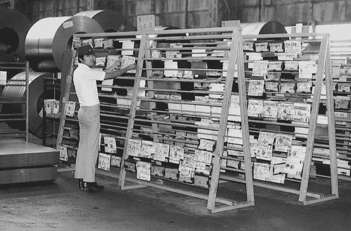
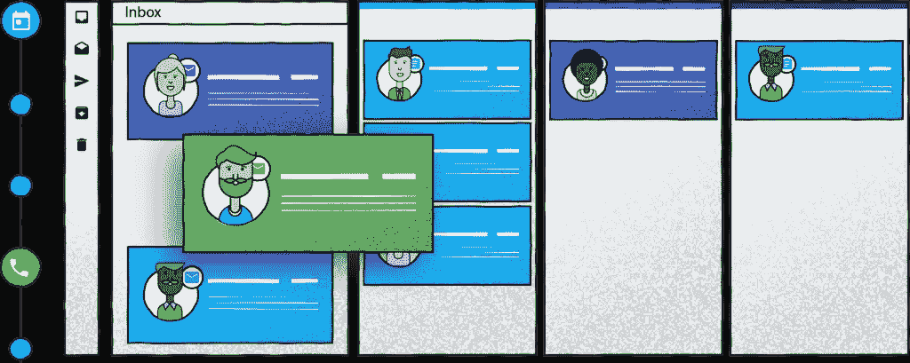
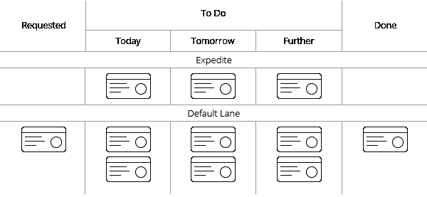
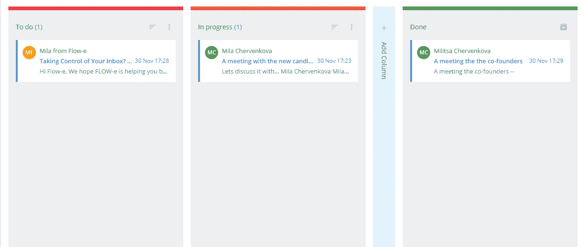

# 启动电子邮件破解:使用看板方法最终破解你的电子邮件收件箱

> 原文：<https://medium.com/swlh/startup-on-email-hacks-use-the-kanban-method-to-finally-hack-your-email-inbox-99ad51f32b6e>

我知道我们在谈论电子邮件超载方面有一些共同点。我们讨厌堆积如山的邮件、埋没重要邮件的邮件、没完没了的邮件。

Source: Toyota Global Website

电子邮件超载是一个常见的问题，但对于大多数企业和许多个人讨论来说，电子邮件仍然是最有效的沟通方式。

你收到的可操作的电子邮件中有多少是高效完成的，没有任何麻烦？你看。我的痛苦也是你的。我终于找到黑掉我的电子邮件收件箱的方法的喜悦也将属于你。

在这篇文章中，我将分享一个可行的指南，告诉你如何改变处理邮件的方式，以减少花在邮件管理上的时间。

# 首先要做的事。什么是看板？

看板源于丰田生产系统。这是一种工作管理方法。看板从日语翻译过来就是招牌。看板方法奠定了精益制造的基础，其核心目的是在不影响生产率的情况下最大限度地减少浪费活动。

最近，专业领域已经开始应用看板方法，尤其是在软件开发和项目管理领域。

# 什么是看板？

[看板可以让你看到](https://flow-e.com/blog/personal-kanban/personal-kanban-boards/)并绘制你的工作流程。过去，它是使用软木板/白板和纸质笔记构建的。

看板板的独特之处在于，它将工作流可视化为三个主要栏(默认情况下是三栏)，显示任务的状态——“已请求”、“进行中”和“完成”

**但是我们为什么需要这样一个可视化的工作流程呢？**

因为可视化您的工作流可以让您快速检测到可能会中断工作流的因素。

# 为什么你应该使用看板来可视化你的电子邮件工作流程的 3 个理由

**1)看板会显示你的邮件管理弱点**

通过看板可视化您的电子邮件工作流程将有助于您发现与您当前管理的任务或项目相关的潜在问题。例如，如果你的“待办事项”栏邮件到达的速度比它们移动到“进行中”栏的速度快，工作就会堆积起来，你会很快发现工作停滞在哪里。

一个“进行中”的栏目中塞满了邮件，应该被视为危险信号。问问你自己:

为什么我的电子邮件和任务没有离开“进行中”栏？

也许他们需要被授权？

也许你的时间被无效的会议占满了，导致邮件回复延迟？

一旦你注意到一个有问题的列，采取行动并防止它再次发生是很重要的。

Source: [https://flow-e.com](https://flow-e.com)

**2)看板帮助你关注重要的电子邮件**

提高生产率的方法之一是不要一心多用。看板是一种向你展示有多少任务和邮件在“进行中”，以及你何时应该停止从“待办事项”栏中提取更多邮件和任务的方法。

你只能通过标记完成来完成更多的邮件来实现零收件箱的梦想，而不是开始 100 个任务然后让它们没有完成。

看板可视化的力量就在这里。你会很容易注意到什么时候应该停止处理新邮件。

**3)不再浪费时间在不必要的会议上**

使用[个人看板](https://flow-e.com/personal-kanban/)电子邮件工具可以为你节省大量不必要的会议时间。

想知道怎么做？

通过可视化分配给同事的委派任务。委托是零收件箱概念的一个重要方面。当你给你的一个队友发邮件时，你可以在看板上看到那个人什么时候完成了任务。

这将减少您和您的队友之间同步会议所需的时间。

# 为什么想法和任务可视化有效

让我们承认这一点。

我们是人，不是机器，不是机器人。

当我们有目标要实现或期限要满足时，我们经常会感到恐惧；我们感到压力。

通常，要相信一个目标，我们首先要有一个目标可能是什么样子的想法。

“眼见为实。”—一句格言。

这就是可视化的用武之地。简单地说，它是一种创造未来事件的心理图像的技术。

当我们把它视觉化时，我们就看到了实现我们想要的结果的可能性。通过视觉化，我们瞥见这是什么，当它发生时，我们更有准备和动力去追求我们的目标。

值得注意的是，可视化是一种成熟的性能改进方法。它被不同领域的许多成功人士使用，并得到大量科学证据的支持。

Source: Kanbanize.com

根据哈佛大学进行的研究，[可视化之所以有效，是因为我们大脑中的神经元](http://sitn.hms.harvard.edu/flash/2016/new-technologies-visualize-the-power-of-the-brain/)。神经元是传递信息的细胞，有能力将图像解释为等同于现实生活中的行为。

当我们想象一个动作时，大脑会产生一个冲动，并告诉我们的神经元去执行那个动作。

**这正是看板如何影响我们处理电子邮件的方式。**

通过它强大的可视化工作流程的能力。

有一个问题我经常问。

“你知道为什么商店货架上的食物是水平放置的，而不是从商店顶部到底部的一排狭长的食物吗？”

因为商店使用相同的视觉化概念——一目了然地看到更多商品会让你在购买时做出更好、更明智的决定。

就在这里，看板方法证明了我们的视野越开阔，我们可以处理的信息就越多。

相反，想象你必须检查一排狭长的食物。你会失去视力，你会忘记你先看到的东西。

你最先发现的事情也将是最先忘记的。就像你忘记了在老式的窄行中收到的第一封邮件。

看板方法可以让你在更广阔的视野中看到你的大部分邮件。

你有能力发现关键的电子邮件(“待办事项”栏)，看到问题发生在哪里(太多的电子邮件卡在“进行中”栏)，并衡量你处理了多少电子邮件和任务(通过“完成”栏来衡量)。

然而，如果你的目标是将你的收件箱变成看板，体验零收件箱的梦想，你必须遵循良好的电子邮件实践来提高效率和优先级。

Source: Flow-e.com

# 实现零收件箱梦想的 7 个简单步骤

**1。删除或存档尽可能多的新邮件。立即删除任何不必要的电子邮件。这包括垃圾邮件、垃圾邮件和促销电子邮件。所有这些邮件应该尽快离开你的收件箱，因为它们会把你的收件箱弄得乱七八糟。如果它们毫无用处，对你来说毫无价值，把它们移到垃圾桶里。**

2.**停止自动检查邮件。**完全关闭自动检查，或者设置为大约每 30 分钟一次。我鼓励你考虑把你的电子邮件活动集中在每一两个小时。重要的是标记、处理、标记和回复紧急邮件，然后继续工作(工作不仅仅是回复邮件)。

**3。从简单的开始。如果是一个简单的任务——马上处理(不要因为任务容易处理就推迟)。如果邮件到达你的收件箱，并且回复时间不超过两分钟，你应该立即回复。但是不要让自己陷入不必要的 45 分钟小说的写作中。**

**4。没人看长邮件**。少写点——你的邮件不必是史诗文学。通过[快速回应和](http://tbyd.ca/shorten-emails-to-save-time-and-increase-productivity/)简短的回复，让对话继续进行。然而，记住写得少并不意味着你应该绕过标准的语法、大小写和标点符号(除非你是三岁小孩)。一封简单的电子邮件可以节省每个人的时间。

**5。** [**可视化电子邮件**](https://flow-e.com/blog/email-visualization/) **在类似看板的板上**——可视化是不会错过电子邮件的最佳方式。使用 Outlook/Gmail web 应用程序或插件创建专栏和公告板。最好的选择将是一个工具，它可以帮助你管理经常性电子邮件主题的答案，添加待办事项，管理你的日历和会议，将电子邮件委托给你的队友，并从一个应用程序中的电子邮件创建单独的任务。

**6。对自己诚实。如果你知道你永远不会回复一封邮件——把它存档，或者干脆删除它。内疚不会让你反应更快。你应该相信你的直觉，听从它们，不要试图变得完美。**

**7。退订你根本不读的时事通讯。简讯很烦人，你的游戏是删除无关的电子邮件，它们只是浪费时间。如果你错过了从发件人那里收到的邮件的价值，那么相信我，取消订阅就行了。**

# 外卖食品

生活在一个人工智能、机器学习和火星上的人类生活都是大话题的时代，很遗憾我们仍然不能有效地处理电子邮件。

毫无疑问，这些天我们收到的电子邮件比以往任何时候都多。这就需要使用新的手段和工具来有效地处理我们阅读、查看和消化电子邮件的方式。

如果我们不使用新的系统来实现更好的可视化，让我们能够对每天收到的电子邮件快速采取行动，那么实现零收件箱的梦想现在是不可能的。

如果零收件箱仍然是你的目标，那么把你的电子邮件收件箱转变成个人看板的能力是最好的方法。

*哪些工具可以帮助你在“收件箱维护”活动上花费更少的时间，而在重要的活动上花费更多的时间？请在下方留言评论。*

*最初发表于* [可视化的力量:用看板法最终黑掉你的邮箱收件箱](http://milach.kinja.com/the-power-of-visualization-use-the-kanban-method-to-fi-1820877430)*2017 年 11 月 30 日。*

## 这个故事发表在 [The Startup](https://medium.com/swlh) 上，这是 Medium 最大的企业家出版物，拥有 270，416+人。

## 在这里订阅接收[我们的头条新闻](http://growthsupply.com/the-startup-newsletter/)。

