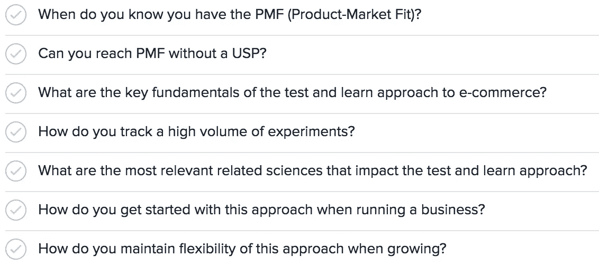
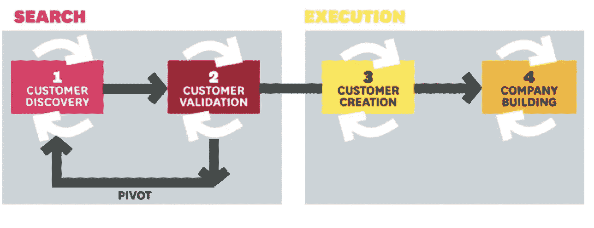
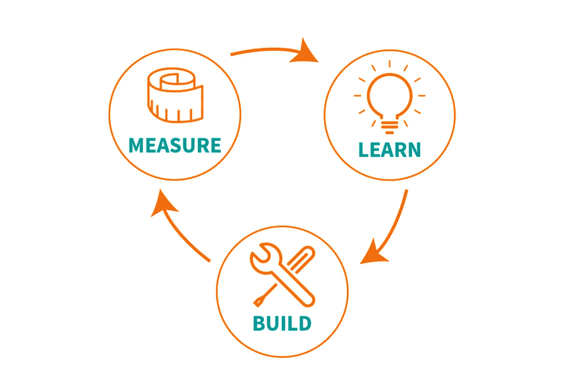
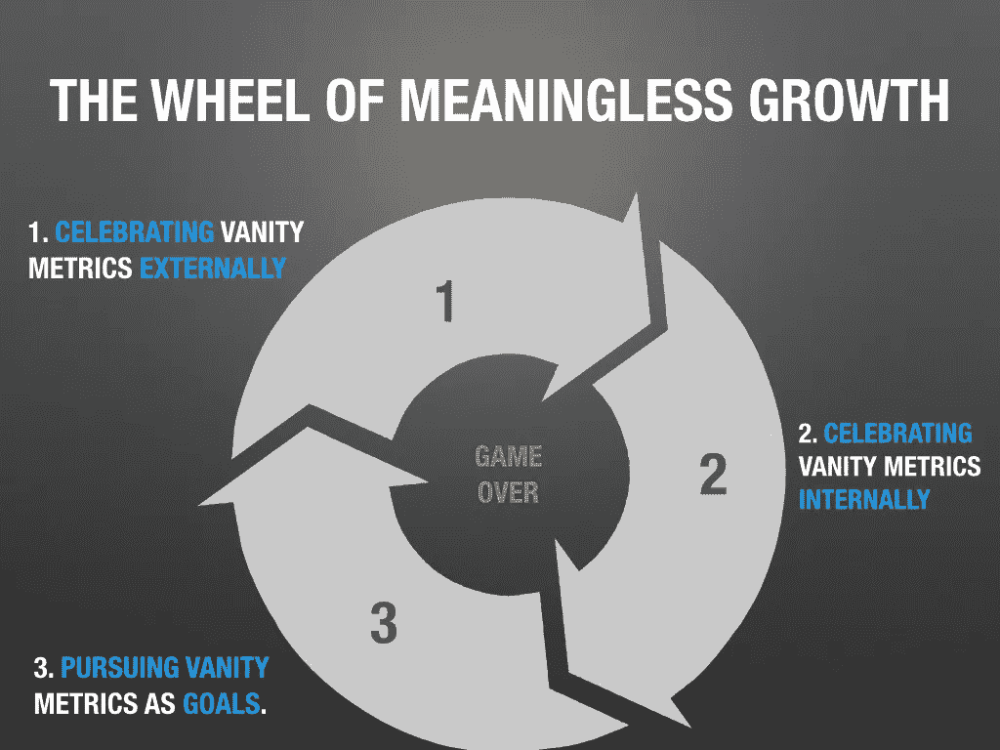
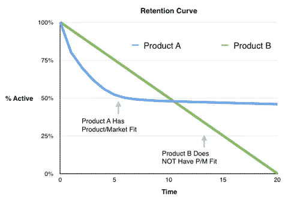
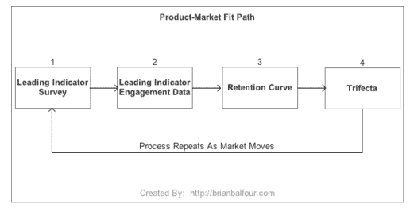
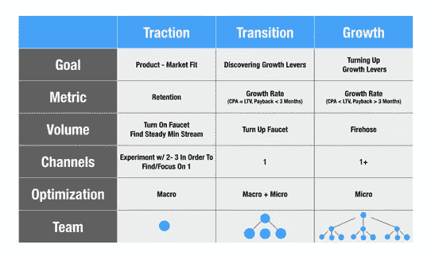

# 建立创业公司的科学方法:像在实验室一样进行实验。

> 原文：<https://medium.com/swlh/startup-science-applied-5d6ea13f6b5c>

作为 hotel quickly 的首席执行官，我希望能够自信地决定资助哪些项目和 MPV，以及削减哪些项目和 MPV。专注就是一切。

作为我每月掌握一个主题的[决心](https://tomaslaboutka.com/how-to-accelerate-your-learning-in-10-steps-a4b9dbe501d1)的一部分，我决定研究如何确定产品与市场的契合度(PMF ),并在产品准备就绪后对其进行扩展。

> 围绕增长黑客、自动化和 A/B 测试有很多混乱。

因此，我想深入研究这个问题，并能够应用我所学到的知识来推动公司进一步发展。

# **建立实验室**

首先，我采用了我在上一篇文章中强调的加速学习的 10 个步骤的框架。

*   我设置了约束条件:我有一个月的时间来掌握这门学科。
*   我明确了我的**动机**:我想了解将科学方法应用于初创公司的两个阶段——PMF 和打造增长引擎——的基本原则。
*   我设定了一个明确的**目标**，即在一个月内将所学应用到总部。
*   我会**效仿专家**，阅读至少一本书和五篇博文，听相关的播客，并参加 Udemy 课程。
*   我问自己**关于我想学什么的开放式问题**。

一些问题是:

# **学习-构建-测量**

创业公司最终有两个阶段:1) **【客户验证】**(搜索:前 PMF)和 2) **【规模化】**(执行:产品渠道契合和成长)。

与普遍的看法相反，广为人知的“照做”创业方式并不是通过这些阶段最有效的方法。

另一种选择？自 20 世纪初以来，科学方法已被应用于管理，并加速了今天的工业巨头的增长。正是应用了“构建-测量-学习”反馈循环的相同核心原则，开创了“精益-创业”思想学派。

[*“Lean start-up”*](https://blog.goyello.com/wp-content/uploads/2015/04/Lean-startup-image-Peter-post.jpg)approach

这种方法使过程变得清晰，同时摒弃了令人生厌的术语。你首先要形成你的业务主题，例如，你想解决什么问题，为谁解决。然后，您定义正确的度量标准，这些标准将表明论文是否正确。

接下来，你安排合适的团队通过一系列实验来验证这个理论。

> “一家公司的成功取决于它每年、每月、每周、每天做多少实验。”杰夫·贝佐斯

一旦你的基本商业假设是正确的，你就去 PMF，用同样的方法扩大公司规模。

这里不是给你一本关于精益创业方法的教科书纲要，而是给你一些我觉得有趣的知识:

# **最重要的事情:找到你的产品与市场的契合度**

在你开始考虑规模和增长之前，确保你有一个坚实的产品市场战略。

> 保持操作手册，直到你对你的客户有足够的了解。

特别是在创业的早期，你没有足够的数据来达到测试的统计意义，所以你要更多地关注测试和学习方法的定性元素。

## **1。预测方法**

从最终目标开始，将“构建-测量-学习”的顺序重新调整为“学习-测量-构建”首先弄清楚你需要学习什么来构建产品，然后需要度量什么，然后构建 MVP。

## **2。假设**

用可衡量的客户假设来验证创业想法。不要从构建产品开始。你要确保你创造的顾客假设是可证伪的(“没有人想要 XYZ”)。列出你所有的假设。

例如，对于不同市场的产品本地化，请考虑:

*   *“如果顾客不像你一样关心时尚简约的设计，该怎么办？如果设计不符合顾客行为怎么办？”*

## **3。指标**

组织中的每个人都应该围绕几个关键指标团结起来。在 PMF 阶段，这可能非常棘手。

> 有很多关于虚荣心指标的“牵引力”的噪音，这些虚荣心指标推动“增长”，但最终与你是否达到 PMF 无关。

你可以从驾驶“牵引力”中获得的虚假强化，使你很容易陷入蹩脚的单位经济和没有产品市场适应性的烧钱机器。

Source: [Coelevate](http://www.coelevate.com/essays/growth-principle-two-seek-authentic-growth)

最终，真正的产品-市场匹配归结为四个关键指标:

*   **转化时刻:**你的客户为你提供的产品/服务付费。理想情况下，第一笔交易你是盈利的。还有其他的“转化”时刻(如注册)，但没有什么比桌上的真钱更能打败获取和激活。
*   **参与度:**你的用户越热情越好。使用参与度和 NPS 调查。有争议没关系，不是每个人都要爱你。可能会更糟。人们根本不会关心你。

> 诋毁者让你有更高的机会把他们变成粉丝。他们订婚了，他们在乎。

*   **保持:**你的用户会回来使用你的服务，并以健康的频率再次使用它。[肖恩·埃利斯](https://www.linkedin.com/in/seanellis/)想让你知道，如果你一夜之间消失了，40%以上的用户会非常失望。这可能有点随机，但检查你的保留曲线不是。

Source: [Coelevate](http://www.coelevate.com/essays/product-market-fit)

*   **在大市场中增长:**在一个“足够大”的市场中，你每周都在增长

你的每个团队成员的个人目标都应该直接提升到至少其中一个指标。这里有一个方便的电子商务清单[这里](http://a16z.com/2015/09/23/16-more-metrics/)和[这里](http://a16z.com/2015/08/21/16-metrics/)。

有趣的是，我发现你的独特价值主张(UVP/USP)的可持续性是隐含的，但不是达到 PMF 的先决条件。如果消费者普遍对产品有需求，你可以通过生产质量稍高的产品来快速获得利润。再过半年，你的竞争对手就能赶上来了。如果你不进化，游戏就结束了，即使你在某个时候到达了 PMF。

## **4。实验**

在数据中寻找关键行为，或者在观察客户行为的同时，围绕这些行为设计实验。首先测试假设中风险最大的假设。设计实验的几点注意事项:

*   确保你能运行测试并反复确认你的发现。实验的设计应尽量减少质控品可能出现的错误。你可以拿走产品的哪些部分而不会失去客户？
*   建立一个中央学习系统，用于记录和共享来自测试和学习循环的数据。将所有团队的所有实验放在一个地方。
*   做同行评议。在 HotelQuickly，至少有一名额外的团队成员审查任何重要的项目或实验，以挑战他们的设计和假设。
*   进行实验，准备好根据结果改变事情。实验经常导致坏消息。没关系。即使最初的结果是失败的，也要坚持进行测试。
*   这里有一份[客户调查的问题清单](https://qualaroo.com/marketers-guide-surveys/killer-survey-questions/)和一篇关于[转化优化](/@matsutton/what-i-wish-i-knew-when-i-first-started-with-conversion-optimisation-57e69e51e3bf)的有趣文章。

## **5。团队**

在 PMF 阶段，你必须建立的第一个也是最重要的团队哲学是，一个组织应该学习和尝试，而不是执行和优化。

> 对于整个团队来说，PMF 阶段的一个重要规则是让他们每天与 10 个人交谈。

让他们使用丰田的 5 个为什么来发现你的客户到底在做什么。他们说的永远没有他们为什么这么说有趣。第二，用数据驱动团队决策。神话/自我为基础的陈述，如“我觉得客户想要这个”应该被扔出窗外。

# **增长规模**

重要的事情先来——在你考虑攀登之前，先到达 PMF。如果你的产品没有明确的可持续用户参与和价值创造的路径，不要分配资源给增长团队。

## **1。基础:**

成长是 90%的纪律、速度和节奏。剩下的 10%在框架里。掌握这些[四大核心技能](http://www.coelevate.com/essays/learn-growth-marketing)；它们将是你成长的基础:

*   **数据分析:**不仅仅是读取数据。这是你在建立业务时如何运用它来做决策。
*   **定量建模:**用你的历史数据来预测未来可能的情景。
*   **用户心理:**将数据转化为实际的消费者行为和情绪。客户同理心至关重要。如果不能感受到客户的感受，就无法有效地扩展产品。
*   **讲故事:**以一种有趣的方式将所有信息汇集在一起，吸引你的听众。

## **2。产品渠道契合度(** [PCF](http://www.coelevate.com/essays/5-steps-to-choose-your-customer-acquisition-channel) **)**

一旦你进入 PMF，围绕你的获取渠道和团队建立反馈回路。

> 专注于你的优势，把你的精力放在有效的渠道上。

扩展这些渠道会比试图“修复”那些表现平平的渠道产生更好的结果。这是你看到真正增长的地方，也是帮助你定义渠道策略和设计营销组合的地方。

确定您要优化的指标(例如学习、数量)并确定您的约束条件(例如时间、资金、目标受众)。

## **3。实验:**

当您进行规模试验时，您需要能够:

*   **进行** **高节奏测试**:清除速度测试的障碍，促进持续部署。瞄准速度。
*   区分优先级:建立一个你认为值得测试的所有东西的清单，以及你希望它移动的关键指标。根据努力、影响、成功和依赖性对其进行评级，或者使用 ICE(影响、信心、实施的容易程度)。

> “影响的优先级是关键。否则，你可能会因为做大量愚蠢的快速 A/B 测试而忘乎所以，比如仅仅为了增加实验次数而改变主题。” [Kiyan Foroughi](https://www.linkedin.com/in/kiyanforoughi/)

*   **关于 A/B 测试的注意事项**:首先把你的 PMF 做好。不要尝试 A/B 测试，直到你达到统计意义的最小量。

## **4。指标**

关注客户终身价值(CLV = LTV)，但定期重新计算 CLV，因为它不会永远不变。要特别小心早期的客户流失和盈利能力。

> 在规模上，CLV 应该包括几乎所有的东西，包括员工人数、直接营销支出、品牌推广支出、折扣和促销。

考虑公司管理费用，以获得你真正的毛利润 LTV。不同企业的健康 LTV/CAC 规模不同。

Source: [Coelevate](http://www.coelevate.com/essays/traction-vs-growth)

一旦你真正理解了你的客户的旅程，关注被确认为客户转化迹象的特定行为指标是有用的。例如，脸书的关键指标是让一个新用户邀请“10 天内 7 个朋友”

## **5。团队**

至关重要的是，增长努力要在整个组织中展开，产品、营销、工程和设计之间要有数据驱动的深度跨职能工作。不要通过像营销或产品这样的单一职能部门来独立实现增长。

一旦你有了你的团队结构，确保你的系统设置高效。

> 雇佣合适的技能组合，并确保会议不会破坏测试的速度。

区分试验想法的头脑风暴会议和优先化会议，优先化会议是为了消除障碍，回顾结果，鼓励行动。每个人都应该知道这个小时发生了什么，并检查报告是否是最新的，但不要太细，以免浪费时间。

# **寻找专家**

为了回答我的关键问题并了解总部此时的立场，我找到了专家，这样我就可以联系，获得反馈，以及对我目前所学的指导。研究导致良好的基础，但没有什么比与经验丰富的第一手经验丰富的专家互动更好的了。我推荐一些这方面的专家:

*   **全球:** [布莱恩·鲍尔弗](http://www.coelevate.com/essays/learn-growth-marketing)(Coe levate)[陈楚翔](http://andrewchen.co/)(优步)[希滕·沙阿](https://hitenism.com/) (Quick Sprout，KISSmetrics，crazy egg)[安迪·拉赫勒夫](https://www.linkedin.com/in/rachleff/)(wealth front)[凯西·温特斯](http://caseyaccidental.com/) (Pinterest)。
*   **在东南亚:** [Kiyan Foroughi](https://www.linkedin.com/in/kiyanforoughi/) ， [Kenrick Drijkoningen](https://www.linkedin.com/in/kenrick/) ， [You Teck](http://Lam You Teck) ， [Skyscanner 成长团队](/@Skyscanner)，[李北唐](https://www.linkedin.com/in/arvintang/)

# 付诸实践

带着对 PMF 和规模的全新认识，我投入到工作中，并迅速深入酒店团队。基于所学知识和与专家的交流，我们评估了总部的现状，建立了与可比公司的基准，并定义了:

*   PMF 在旅游领域很难定义，特别是由于低参与度和低重复率。
*   虽然一些参与者通过刺激增长来推动预期行为，但不断变化的客户期望和商业模式使得长期维持 PMF 变得非常困难。
*   运用科学的方法，我们概述了我们的基本原理并开始实验。我们邀请了专家来挑战我们的现状。我们回顾了我们的工具和中央知识库的使用情况，并跟踪了最大的挑战和问题。
*   在投资新工具之前，我们需要做好一些基础工作。我们需要重新制定我们的关键假设，并设计实验来快速测试最危险的假设。
*   作为一个团队，我们需要根据“构建-测量-学习”反馈循环重新思考我们的方法，以便我们可以利用新的机会来扩展这一方法。我们需要养成快速测试的习惯，我们需要在我们的人才中推广数据驱动的文化。我们方法的一致性(从测试到报告和实施)将是我们成功的关键因素。
*   我们启动了多项计划来重新装备我们的团队，并让一些真正令人兴奋的专家加入进来。

就我个人而言，随着我学习和应用测试和学习方法，我意识到我需要与更多的专家联系，以了解我所缺少的“我不知道我不知道的东西”我还想深入挖掘统计学、心理学和心理测量学以及决策等相关科学。

如果您对如何更好地检测 PMF 和电子秤有任何建议，或者我可以与之交谈的伟大专家，请 [**给我发电子邮件**](mailto:tomas.laboutka+medium@gmail.com?subject=Comments%20on%20your%20medium%20post) 。我和总部都致力于快速学习和成长。我们随时准备回顾我们的进展，对我们所处的位置进行快照，进行试验，并继续提高标准。

*建造-测量-学习。*