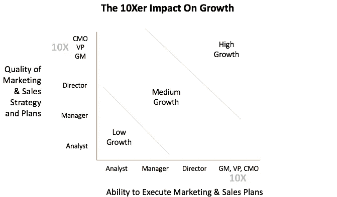

# 初创公司:获得 10 倍的成熟营销和销售人员来加速增长

> 原文：<https://medium.com/swlh/startups-get-proven-10x-marketing-and-sales-people-to-accelerate-growth-87c86ff9d7d1>

“low-angle photography of yellow concrete building” by [Trent Erwin](https://unsplash.com/@tjerwin?utm_source=medium&utm_medium=referral) on [Unsplash](https://unsplash.com?utm_source=medium&utm_medium=referral)

一旦你的产品/市场契合度建立起来，创业发展过程中最难的一步就是从发明阶段过渡到成长阶段，因为产品构建者的技能通常与成长技能相反。成功的创始团队的技能是发明家——识别客户需求、产品设计、快速产品适应和交付客户价值。另一方面，顶级成长专业人士的技能是沟通者和操作者——高度精细化的营销、销售和业务运营。

首席执行官的一个关键成功品质是成为如饥似渴的学习者，不断寻求扩展他们的能力，找到成功之路。新任首席执行官的主要失败点之一是，他们认为自己是学习者，但他们并不寻求顶尖的增长人才，并将增长阶段误认为是容易导致增长缓慢。

你可能会想，哦，伙计，这个 10 倍的东西已经过时了，但是不管你怎么看，任何职业中前 1%的人几乎总是比平均水平有效 10 倍。因此，当我提到 10 倍的营销人员和 10 倍的销售人员时，这意味着他们在同龄人中处于第 99 个百分点。

# 谁是成长 10 倍者？

*10 名高管是第 99 百分位的高管，他们会给你带来卓越而又毫不费力的洞察力和策略*

你要找的人有一个持续实现惊人增长和晋升的模式。

**高速成长的摇滚明星:**这些人已经在几家中小型公司取得了巨大的成就，并不断取得成功。他们通常拥有广泛的技能，在数字营销、增长黑客和创造性执行方面具有真正的深度。

**优秀企业快速通道:**要想获得营销和销售战略的深度以及执行力的广度，去寻找那些在最好的公司中已经升至总经理/副总裁或更高职位的人。其中一些是显而易见的，但你会发现来自网飞、易贝、通用食品、通用磨坊、宝洁、百事可乐、谷歌、Adobe、苹果……以及许多其他公司的营销人员。同样，电力销售公司包括 IBM、Oracle、Amazon、Microsoft、Salesforce、SAP 等等。在这些公司中，已经晋升到高级管理层的人已经在数千人之前被雇佣和提升到这些职位，他们只有通过创造巨大的业绩才能升职。

品牌专家:对于复杂的信息和品牌战略，可以向广告公司、品牌战略咨询公司和大公司的高级营销人员寻求帮助。

**数字专家:**这些人都是非常有成就的人，他们被提升到高级职位，处于数字营销和技术驱动的增长工具的最前沿。有数百种技术和方法可以带来巨大的效率和效果。

下图显示了总经理/副总裁/CMO 级别的 10 倍，高级经理级别为 1 倍，初级经理级别低于 1 倍，因为工作经验不足 3-4 年的人没有太多的成功和失败经验可供借鉴。

© 2018 Scott Langmack

1)上面的 Y 轴(纵轴)是营销/销售战略工作的质量。通过真正的 10 倍，你可以从许多成功和失败中获得更深刻的见解和策略，带来更高的影响概率。

2)上面的 X 轴(水平轴)正在创建具有最高效和最有效的营销和销售策略的执行计划。这一点非常重要，因为公司经常把所有的钱都花在低于标准的计划上，却得不到资金。

上图中战略和执行的交叉点是你未来成长的有力指标，这也是为什么让 10 倍成长的人参与其中是非常有价值的。

# 好吧，我被卖了，我怎么找到这些人？

先找技能，再找行业。你很难找到与你完全相同的人，所以你需要的是找到与你的需求和他们的优势相匹配的技能。

你想要的整体技能取决于你公司的目标客户和分销渠道:

-如果你的目标是消费者，你的重点是营销

-如果你的目标是企业，你的重点应该是销售和营销的品牌战略部分

-如果你的目标是中小型企业，我建议关注营销，因为这些人更像消费者而不是企业高管，根据你的分销策略，你可能还需要销售支持

这些人中的许多人可以从你的扩展网络中找到；与你网络中的人会面，与你现有的投资者交谈，在 LinkedIn 上发送联系请求。亲自与你认识的高管会面，问问他们是否认识可以介绍给你的人。小心头衔膨胀——小公司的副总裁/CMO 的技能水平通常等同于顶级大公司的董事水平，除非他们有创造惊人增长的记录。

如果你能找到 10 个想全职加入的人，那太好了！否则，找一个或三个从事你的业务的顾问。这些权力玩家也想做梦。他们不会去创业公司，但许多人都在工作中寻求更多的刺激，并受益于加入一家快速发展的公司。我甚至让财富 500 强公司的高管参与创业——你永远不知道谁会想加入。

# 我对他们有什么要求？

你需要提供战略领导的“积极顾问”，而不仅仅是喝咖啡时的建议。您要求他们与您的营销和销售主管以及高管团队一起制定战略和执行计划。他们知道没有针对任何产品或目标的千篇一律的策略，但他们可以通过与高管团队的深入会谈和客户拜访，为您提供令人惊叹的计划。

你将需要他们的承诺，在最初的几个月里进行一定程度的深度参与，也许每周 2-3 个小时，以获得基本的战略和计划，然后每 4-6 周与你和你的团队进行一次检查，以促进过程修正。一旦他们对公司、产品和目标有了感觉，他们几乎可以毫不费力地实现卓越。

你会发现一些表示有兴趣提供建议的人对投入你要求的时间不感兴趣。首先，你需要提供两倍于标准的 1/4%的股票期权。讨论更多奖金的潜在未来价值，以及他们认为什么是公平的。如果他们要求你公司 1%的股份来换取他们 30 个小时的时间，这是一个你可以放弃的交易。

如果不能达成一致，那也没关系，继续找就好。根据我的经验，喝咖啡时的建议很少有帮助，除非这些顾问有一个庞大的 10 人网络，并主动介绍。通常，那些将成为活跃顾问的人已经“到达”了他们的职业生涯和财务独立，并希望与最新的趋势保持联系。

# 《要么做大，要么呆在家》

**做一台学习机器！**承认只有少数人能达到成长型职业的最高水平是有原因的——他们是最棒的，并且能提供持续的结果。寻求吸引这些人，向他们学习。

**出售梦想！**让 10 倍者参与进来的唯一方法是让他们认同你对公司潜在规模和影响的愿景。准备好提供有意义的股票奖励，这是值得的。作为交换，获得制定战略和计划所需工作的承诺。

## 这篇文章发表在[的《创业](https://medium.com/swlh)，这是 Medium 最大的创业刊物，拥有+384，072 读者。

## 在这里订阅接收[我们的头条新闻](http://growthsupply.com/the-startup-newsletter/)。

