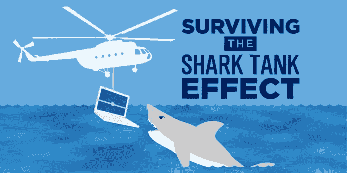

# 失败的创业公司:教训是什么？

> 原文：<https://medium.com/swlh/startups-that-failed-whats-the-lesson-1c22f2e093fa>

失败是获取知识的最有效途径之一。因此，企业的敏捷性和生存能力取决于从错误中恢复的速度。

Picture drawn from: [https://goo.gl/xPk7Rw](https://goo.gl/xPk7Rw)

此刻，我给你一个更仁慈的学习方法，那就是调查别人的失败。特别是，我想在提及对失败的企业创始人的采访时，重点谈谈**电子商务业务**的滑坡问题。

# 主要见解(如果你赶时间)

这篇小文章包含了对以下内容的思考:

1)从长远来看，如果没有专业人士的参与，市场研究、数字营销和 SEO 可能会从根本上破坏商业成功。

2)电子商务的物流和库存成本(如运输和采购)宁愿在你开始增长时首先考虑。

3)寻求合作伙伴关系，涵盖你的弱点，有足够的时间履行他们的职责，而不是“只投资”，并且真正对你的商业想法充满热情。

4)从小处着手，验证，然后扩大规模。MVP 对扩张至关重要。

每个要点都基于独特的失败故事。你可以在这里访问那 4 个[。](https://www.failory.com/)

# 失败的创业公司

**Vivalatina** 是在法国珠宝市场转售墨西哥纯银的电子商务。

***业务参数*:该商品的**低价。

***【hecks】*:**利用 OScommerce 平台对电子商务网站进行编码；SEO(搜索引擎优化)。

***解决方案* : Shopify** 使手动编码的拍摄成为可能。在内容的质量不得不被重新处理之前，创始人的 SEO 体验受到了重创。整个商业模式被重新构建，从珠宝转售业务转向其在 T21 的制造业务。为客户介绍珠宝设计 CAD 软件。针对**国际订单**的新 Viva Latina 电子商务已经启动。

**附加顶级洞察**

在“低价”理念下，风险相对较低的发展意图可能是最不利的成功方式。

**为什么？**

担心高价格、小客户流失和低收入预测是企业主偶然发现的。解决办法就是一个:[只数](https://finmodelslab.com/e-commerce-financial-model/)。你最终会有信心，你的模型足够灵活和有预见性，可以消除不重要的风险疑虑。

Picture drawn from: [https://goo.gl/TCcYoL](https://goo.gl/TCcYoL)

玩具总动员是“玩具界的网飞”。玩具行业的电子商务租赁业务。

***商业理由*** :美国家庭每年在玩具上花费 1200 美元，这太贵了，玩具租赁(订阅)是一种有益的出路。

***检查*** :运费定价和玩具采购；由于未调整的投资义务，与 USP 无关；去看鲨鱼坦克秀。

***失败的解决方案*** :我们的“鲨鱼池”投资者凯文·奥利里曾希望给我们带来**玩具采购**，因为他曾与玩具公司 Mantel 合作，但这一希望从未实现。我们的**免费送货模式**没有考虑到不同玩具的尺寸，并被强调为我们的 USP 似乎是我们的刽子手。这导致了**螺旋式上升的成本**。吸引人的是,“玩具的网飞”应该是有机建造的，而不是鲨鱼池。

**更多顶级洞察**:

投资者可能会强烈地希望看到你的企业为了他们的钱而成长，但通常你应该试着让方向盘避开他们建议的失败结果。

**如何避免这种情况？**

你可以参考财务模型来论证你认为可以实现更好采购的商业策略。你也可以驳回投资者的选择，用电子商务的财务安排来证明他们的不可行性。

Picture drawn from: [https://goo.gl/MhK7BM](https://goo.gl/MhK7BM)

豪厄尔市场是一个在线电子商务商店，个人卖家可以在这里出售自己的产品。

***业务理由* :** 价格比平时低(有些 t 恤通常卖 25 美元，但对于豪厄尔直接发货的商品，它们只需以折扣价卖 17.26 美元)。

***诘问* :** 脸书广告的徒劳；不情愿的伙伴。

***解决方案* :** 他们利用 **Instagram** 而不是脸书(他们 85%的销售额最终来自有机 Instagram)。他们也应该把 Pinterest 作为一个营销渠道。为了一个良好的营销开端，你可以利用**影响者**(在社交媒体中，例如)来激发人们对你的品牌的兴趣。战略和热情的合作伙伴修补弱点。仔细选择你的合作伙伴，考虑他们对你业务的影响。

**其他顶级洞察:**

留在一个利基市场，不要急于追求高利润率，这将保证低管理费用和你对业务的更多承诺。

**为什么？**

一步一步的策略不仅培养了你对市场和稳定的认知，也培养了你对如何使你当前的生意接近你想要的生意的洞察力。

Picture drawn from: [https://goo.gl/bXgoxj](https://goo.gl/bXgoxj)

**Ropero** (字面意思是衣柜)是一个在线电子商务，受 Threadless 启发的 t 恤市场。

***商业论点* :** 2005 年——电子商务日益流行的一年。

***检查* :** 单干；起步太大；没有得到客户对 Ropero 平台需求的确认；墨西哥人对电子商务缺乏信任；依靠第三方支付处理器(PayPal)。

***解决方案*** :新业务要求至少**一半时间专注**，而不是几个小时。你应该预先安排好你的**商业计划**以及[T21](https://finmodelslab.com/e-commerce-financial-model/)财务状况，以便估算出所需的库存数量，避免过量或不足。

**其他顶级洞察:**

如果你卖 B2C，你就很难让人信服，也很难做到盈亏平衡。如果你卖 B2B，你的客户会少一些，但是你会更好，也更容易知道他们的需求。虽然这并不意味着你应该更喜欢 B2B 的 B2C，但这是一个信息，不要不切实际地降低对每种业务类型的期望。

Picture drawn from: [https://goo.gl/XBzUem](https://goo.gl/XBzUem)

对于底线，电子商务业务可以是一个肉汁列车，也是一个苦药丸吞下。最常见的是，后者更有见识，也更有效。嗯，小的努力不能提供大的评价。

是**失败**让企业家**适应**。

不要忘记为这个故事鼓掌:)

加入我的[脸书](https://www.facebook.com/finmodelslab/) :) [媒体](/@finmodelslab) :) [推特](https://twitter.com/FinmodelsLab):)

## 这篇文章发表在 [The Startup](https://medium.com/swlh) 上，这是 Medium 最大的创业刊物，拥有+385，320 名读者。

## 在这里订阅接收[我们的头条新闻](http://growthsupply.com/the-startup-newsletter/)。

