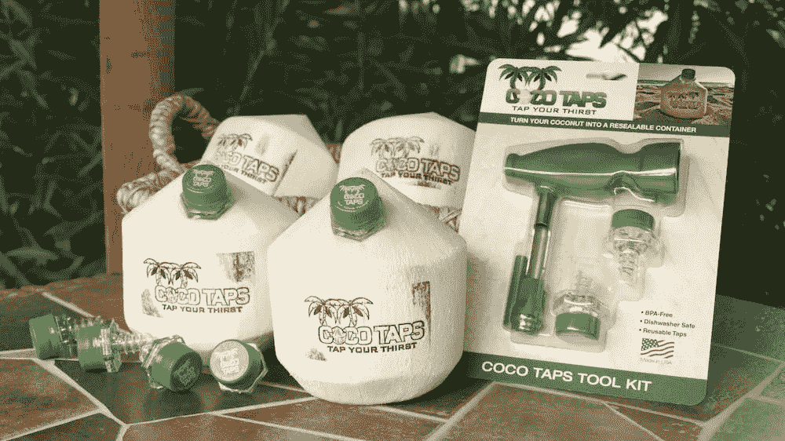

# 用一句话陈述你的策略

> 原文：<https://medium.com/swlh/state-your-strategy-in-a-sentence-554cafb2c0>

source: Bigstock Photo

在美国广播公司最近的一集《鲨鱼池》中，鲨鱼将一位企业家的推介撕成碎片，他伤痕累累，两手空空。当然，这是鲨鱼工作的一个重要部分，有助于吸引电视，并不是什么新鲜事。

但是这种特殊的粉碎方式的有趣之处在于，虽然他们喜欢这个产品，但他们就是不明白商业策略。

这位名叫文森特·萨尔迪瓦(Vincent Zaldivar，又名 CocoVinny)的企业家要求 15 万美元，以换取他在拉斯维加斯的公司 Coco Taps 的 10%的股份，该公司的特色是一个椰子水饮用系统，将新鲜的刨切和品牌椰子与单独包装的专利可重复使用的简单旋入式工具相结合，通过工具的喷嘴或吸管轻松地“敲击”椰子，以获得最新鲜的天然、未加工的椰子水。

source: Coco Taps

CocoVinny 的第一年销售额是可观的 25 万美元，他 2017 年的预测是这个数字的两倍。鲨鱼想知道来源。回答:两条产品线，水龙头套件，还有品牌椰子本身。收入分成是 80%饮料，20%水龙头套件。大部分销售额来自拉斯维加斯的酒店。

鲨鱼队挖得更深，想知道 CocoVinny 的成长策略。他开始谈论邮轮业的机会。鲨鱼努力理解马克·库班所说的本质上是“交付服务”的可伸缩性 CocoVinny 回答说，“世界各地的酒店都在给我们打电话……”

品牌大师 Rohan Oza 冷冷地阻止了他:“等等…他们打电话给你是要完整的椰子还是水龙头套件？”

“是的，”可可文尼回答说。

“好吧，我迷路了，”洛汗回答。

“我认为这是两项业务，”罗伯特·赫贾维克补充道。

“对，”科科文尼点点头。“我们只是让工具包在亚马逊上有机生存。萝莉(格雷纳)，我们可以做一个 QVC 的电视广告，震撼世界，让他们知道敲椰子有多简单，并提供“椰子清洗”"

“可可清洗？”马克·库班问道。

“是的，”可可文尼说。“这里有很多生意。芭芭拉[科克兰]，在你的帮助下…我们已经做了一些惊人的特许经营…可可塔小屋模式…”

“特许经营？”罗伯特问道。“你还有别的事？”

“是的，这是我们正在构建的整个可可梦想。”

马克·库班带着疲惫的眼神切入正题，“看，文尼，我们不能得到直接的答案，我不知道你是否能缩放…我出去了。”

罗伯特·赫贾维克也跟着说:“有一个术语，你淹没在机会中。每次我喝一小口，就有一个新的生意。我跟不上弹跳的椰子，我出局了。”

芭芭拉·科克兰认为文尼的策略“太复杂了”洛里·格雷纳认为椰子水空间对她来说“太小众了”。

Rohan Ozo 总结道:“你的产品味道棒极了。你有很多机会。但你要做的是专注。在推销过程中，我没有获得清晰的焦点，也没有获得清晰的运营计划……我出局了，兄弟。”

当科科文尼离开坦克，用他的尤克里里吉他弹奏一首歌时，我不禁想，“如果他只有一句有战略意义的话就好了。”

请允许我解释。

## **句子**

如果我问你你的公司/单位/团队战略是什么，你能用一句话回答吗？

这可能吗？即使是这样，你为什么要这样做呢(除了回应一些自以为是的媒体作者)？

我知道这是可能的，因为这是我工作的一部分。除了获得一笔*鲨鱼池*投资之外，在一句话中陈述战略至少还有两个有价值的理由。

首先，因为每次我问别人他们的策略是什么，我很少得到一个干脆、清晰的答案。我通常会得到各种各样的目标、愿景和类似使命的回应。很多时候，我得到的只是茫然的眼神、耸肩和抓头。有时我会得到类似于“我们有一个详细的战略计划”或“我们真的没有战略”的回答。

第二，因为一句话有真正的力量。

记者和先锋国会女议员克莱尔·布斯·卢斯曾经讲述了她在 1962 年和她的老朋友约翰·肯尼迪的一次谈话。根据她的故事，她告诉他，“一个伟大的人就是一句话。”

换句话说，一个伟大的领导者可以用一句话很好地概括，你不必听到他的名字就知道他在谈论谁。例如，“他维护了联邦，解放了奴隶。”如果你是美国人，你不需要被告知“亚伯拉罕·林肯”

卢斯要求 JFK 思考他的句子，敦促他了解他的时代的重大主题和要求，并关注它们，对它们有绝对的清晰。

这是一个传统的句子，一个未来的陈述，我相信同样的逻辑也可以应用于制定战略。那就是，借用克莱尔·布斯卢斯的话来说，一个伟大的战略就是一句话。

让我们试一试。但在此之前，让我们定义一下战略，因为战略对不同的人有不同的含义。我更喜欢的策略定义是我从罗杰·马丁那里学到的，正如他的书《T4:为胜利而战:

*“战略是一系列综合的选择，它使一家公司在市场中处于独特的地位，从而创造出相对于竞争对手的可持续优势和更高的价值。”*

“选择的综合级联”集中在五个关键问题上，这些问题的答案正是 Johan Ozo 建议的重点:

1.  ***我们的致胜志向是什么？***
2.  ***我们去哪里玩？***
3.  ***我们怎么会赢？***
4.  我们需要什么样的能力？
5.  ***我们必须有哪些管理体系？***

做出这些选择并采取行动会产生赢家。为什么？因为清晰、艰难的选择会迫使你采取行动，将你限制在一条道路上，但会让你专注于最重要的事情:*赢得*。

然而，用一句话来陈述你的策略，你只需要前三个部分:获胜的愿望，在哪里玩，以及如何获胜。这个简单的 madlib 类型的即插即用基本上是这种结构的一个定制的、更具体的版本:

**我们要***赢什么***在***哪里玩***靠***怎么赢***。**

你的*获胜愿望*需要清楚地说明获胜。它需要面向未来，雄心勃勃，具体(因此可以衡量)，包含竞争元素，并避免简单的内部目标，这可能会也可能不会导致胜利。考虑胜利是非常重要的，因为如果你没有处于胜利的位置，你就会受到那些处于胜利位置的人的摆布，他们会利用胜利者所拥有的资源来击败你。

你的*去哪里玩*需要一些细分元素。通常的疑点包括行业、市场、地理位置、客户、渠道、产品/服务和生产阶段。然而，关键是只关注你能支配的空间。(更好的问题可能是:*我们会在哪里赢？*

你的*如何取胜*需要抓住你独特的价值主张和可防御的优势，这简要概述了为什么你比竞争对手更好。获胜的唯一方法是持续提供比其他选择更好的价值等式，即使这个价值等式是一个感知问题。

以下是一些简单的例子:

*我们希望以三分之一的价格提供更高质量和更具竞争力的设计，从而引领美国豪华高性能轿车市场。*

我们希望在每个市场都拥有顶级的五星级酒店，通过提供宾至如归、办公室之外的体验来支持豪华酒店。

我们希望通过高频率的航班和到二级机场的高效服务，以可与驾驶竞争的价格占领短途航空旅行市场。

你可能不需要被告知“雷克萨斯”、“四季”或“西南航空”。

CocoVinny 需要用一句话来陈述他的策略。我坚信，如果他能够做到这一点，他会让鲨鱼吃了他的手，而不是撕裂他的球场。

## **挑战**

为你自己的企业、团队，甚至你自己的职业生涯尝试一下(用“我”代替“我们”，让它个人化)。用一句话陈述你的策略。如果做得好，它会提出这样的问题:你需要什么样的能力和系统才能在你选择的领域取得你渴望的成功。

与你负责的人或你服务的人分享你的判决。看着光滑的外表蒸发。看着人们靠过来。

然后，当一些自以为是的媒体作家问你你的策略是什么时，你可以直视他的眼睛，一口气回答，清晰得连鲨鱼缸都会嫉妒。

这才是胜利。

## 这篇文章发表在[《创业](https://medium.com/swlh)》上，这是 Medium 最大的创业刊物，有 274，559+人关注。

## 订阅接收[我们的头条新闻](http://growthsupply.com/the-startup-newsletter/)。

