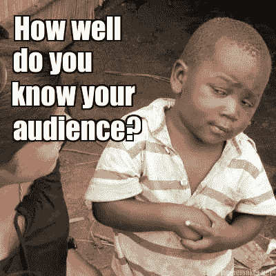

# 获得产品创意之前/之后的步骤🌟

> 原文：<https://medium.com/swlh/steps-before-after-getting-product-idea-aaa39ba9090d>

嗯（表示踌躇等）..猫用的火绒呢？😽😲👩🏽‍💻

# 创意阶段

希望打造下一个优步或推特？试着看看你周围的问题，你认为使用技术解决问题的最佳方案是什么。伟大的想法应该是 ***【有机】*** ，意思是从创始人的个人问题和视角上来的想法。当创始人发现他/她在日常生活中真正讨厌的特定问题时，他/她会做任何事情来解决这个特定问题，这意味着创始人对这个问题非常有热情。这是创建一个产品/创业公司之前最重要的一个方面。让我们举个简单的例子。

Snapchat 的创始人之一雷吉·布朗(Reggie Brown)向他的朋友发送了一张错误的照片。然后他开始抱怨，“我希望那张照片消失”。他和 Snapchat 的另外两位创始人谈完问题后，就开始打造 app (Snapchat v 0.01)。Snapchat 当时只是唯一一个在接收者打开照片后删除照片的消息应用。

另一个例子是 Airbnb。回到 2017 年，Brian Chesky 和 Joe Gebbia 联手成为一名企业家，但不确定他们要做什么，同时他们太穷了，付不起房租。因为他们迫切需要赚钱，而他们公寓里只有一张多余的气垫床，所以他们决定做一个网站，让人们住在他们的公寓里，并向他们收费。

> 想法确实会发展很多很多次，事实上，让 Snapchat 和 Airbnb 成为独角兽公司的原因并不是他们的第一个想法。只要你从一个你迫切想要解决的问题开始，并做出人们想要的东西，你就在正确的轨道上。

# 市场阶段

在你想出你要解决的问题后，是时候做市场调查了。**如果最终没人会乘坐飞机，那造飞机还有什么意义？**其中一个方法是询问你的潜在用户，他们是否同意你试图解决的问题。在这个阶段，**而不是**询问他们对你的整个应用想法/解决方案的看法也很重要，因为他们会说这很酷。这个目标是验证你对问题的假设。这里有一个链接，是 Twitch 创始人之一关于如何进行用户访谈的演讲: [**链接**](https://www.youtube.com/watch?v=qAws7eXItMk)

# 构建阶段

一旦市场得到验证，开始构建应用程序！如果你是一个相当好的工程师，那么你可能不会有这个问题，但如果不是，找到你认为有足够的技术来构建产品的人。一个你可以信任并有良好职业道德的人:)

这是另一个艾伦·列维(Box 首席执行官)关于如何打造伟大产品的精彩视频: [**链接**](https://www.startupschool.org/videos/6)

**感谢阅读！:)如果你喜欢这篇文章，请点击下面的❤来表达你的爱。这样，更多的人将能够找到这些资源并从中受益。**