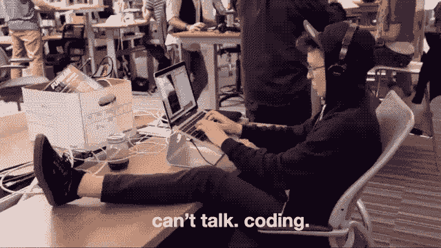

# 立即停止编码

> 原文：<https://medium.com/swlh/stop-coding-right-f-now-71d0c8514d2c>

> 如果你唯一的工具是锤子，那么每个问题看起来都像钉子

如果你唯一知道如何做的事情就是编码，那么你会尝试用编码来解决所有的问题。

如果你是大三学生，这很正常，但是学会如何停止这种行为会让你成为大四学生(不是你工作了多少年，这本身毫无意义)。

> 很少有人知道 10 年经验和 1 年经验 10 倍的区别。

虽然代码可以应用于许多事情，但它也可以**而不是**应用于许多其他事情，所以停止编码并学习其他技能可能是值得的。我保证他们会让你**编码更少，产生更大的影响。**

> 少编码会让你写的代码更有意义。

仅仅减少编码不会有什么不同，你需要学习**为什么**你需要减少编码。请继续阅读我是如何以最艰难的方式学习英语的个人故事。

# 我们走吧:

在我辞职去追求自己的公司后，我经历了最艰难的时刻。我的背景是软件开发，我从未做过与软件无关的工作。

*   我花了几个月编写网站代码
*   为自己制作内部工具
*   使用 mailchimp 和 google sheets 准备了一个招聘流程，根据兴趣、非语言智商测试的结果和性格特征自动对候选人进行分类
*   设计了一些很酷的销售线索磁铁测验
*   自动化许多流程

我也立即想到委派这些任务，并聘请一名自由职业者来做这些工作，但我认为我会做得更好，而我找到一个自由职业者所花的时间太多了。

我知道这不会给我带来更多的客户，但我还是做了，因为，嗯，我喜欢这样做。

> “我们都经常考虑容易想到的事情，而不是正确的事情。”
> ― **大卫·罗克**

该项目已准备就绪，可以大规模开展。但是通过我的网络形象，我得到了 0 条线索和 0 笔销售额。

因为，即使在这一点上，我可以半有效地销售，营销，广告，影响和谈判。我没有意识到调查和制造真正的最小利润产品(MPP)的全部影响。

如果我给我的个人时间加上一个小时值，我估计大约是每小时 100€，我每天工作大约 12 小时，每周 7 天，我计算出在这 4 个月里我“花”了 78，000€。

## 那么我做错了什么？

我觉得我遇到的每个问题都必须用代码来解决！而且既然我很了解它，想利用它，想滥用它也是很自然的。

我了解到，在*创业*阶段，如果你不能证明付钱给某人做你目前正在做的任务是合理的，这意味着**你正在做一个影响非常小的任务，而且可能不需要马上完成。**

这不仅适用于初创公司，但这是一个很受欢迎的例子，因为初创公司需要高效工作，将浪费降至最低。

# 一个人能做什么呢？

这个框架基于一些人所谓的懒惰，但我称之为*延迟生产力*。

你会毫不犹豫地推迟一个加载时不需要的大型 javascript 文件，但是**你为什么要同步“加载”40 多个小时的复杂工作来解决一个描述糟糕的问题呢？**

原理很简单，给定一个问题:

*   假设你不知道关于这个问题的一切，因为告诉你这个问题的人也不知道，知道这个问题的人也不知道。
*   先不要碰任何代码。只需花 5 分钟到 1 小时的时间深入研究问题
*   使用新的知识来重新制定解决问题的初始策略

> 作为一名软件开发人员，你的大脑以某种方式使你成为一个伟大的问题解决者，但你需要学会找到确切的问题，它并不总是代码。

这里最难的部分是深入挖掘，这总是涉及某种形式的沟通，不幸的是，人们会反对你的所有想法。

你的工作是学会问正确的问题，以及什么是正确的问题。

> “缺乏创造力的头脑可以发现错误的答案，但需要非常有创造力的头脑才能发现错误的问题。”—安东尼·杰伊

这正是你需要的地方。人比你将要工作的任何系统都要复杂，但是找出他们并不需要很难。

*如果你注册了* [*我的简讯*](https://upscri.be/a92952-2/) *你会自动收到一个小 pdf，里面有对我的生活和职业生涯影响最大的 4 本书。他们会教你如何有效地做到这一点。(它们不是附属链接)*

# 例子

基于现实生活的例子:

1.  有人为您创建了一个任务，为您公司的博客调试/修复或更换图像上传系统。
2.  你问为什么，他说“因为这对珍妮没用”
3.  你问珍妮发生了什么事，她说它不工作，上传总是失败
4.  你问她是否确定她在上传图片，她说是的
5.  你让她在你看的时候试一试
6.  您注意到她将图像从 Photoshop 导出为 PDF，而图像上传程序不接受 PDF。

以上所有步骤只需要 5 分钟，在这 5 分钟里，你发现问题甚至不在于代码，而是在于第 8 层。

然后你把这个告诉你的经理/产品人员，让他写一份关于内容提交指南的文档。

非技术人员责怪代码/技术问题的原因是因为**他们不理解它**，就是这样。

这和你妈妈曾经因为你玩电子游戏网速慢而责怪你是一个道理。

这也是你有时会小声说“人们都是白痴”的原因。**你需要了解人们**。这样做可以改善你所有的关系，包括和你自己的关系。

现在你可以回去读《T4》和《呆伯特》。

## 这篇文章发表在 [The Startup](https://medium.com/swlh) 上，这是 Medium 最大的创业刊物，有 317，238 人关注。

## 订阅接收[我们的头条新闻](http://growthsupply.com/the-startup-newsletter/)。

