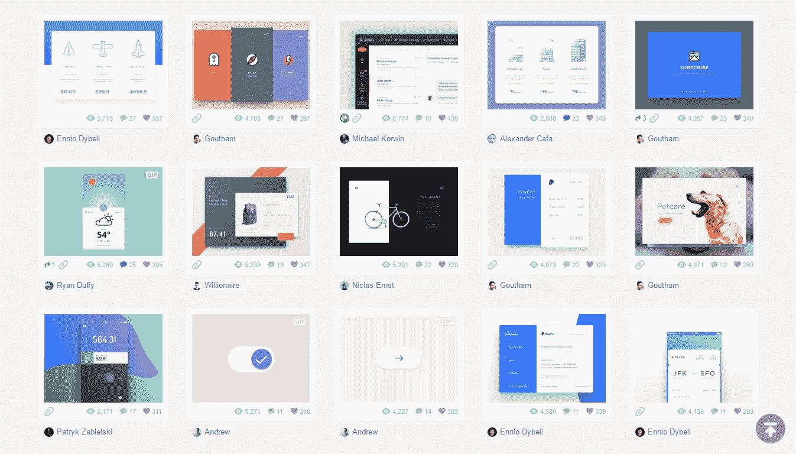
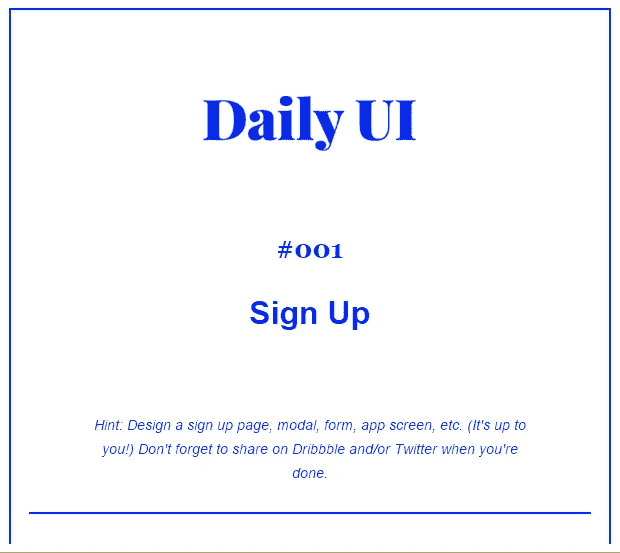
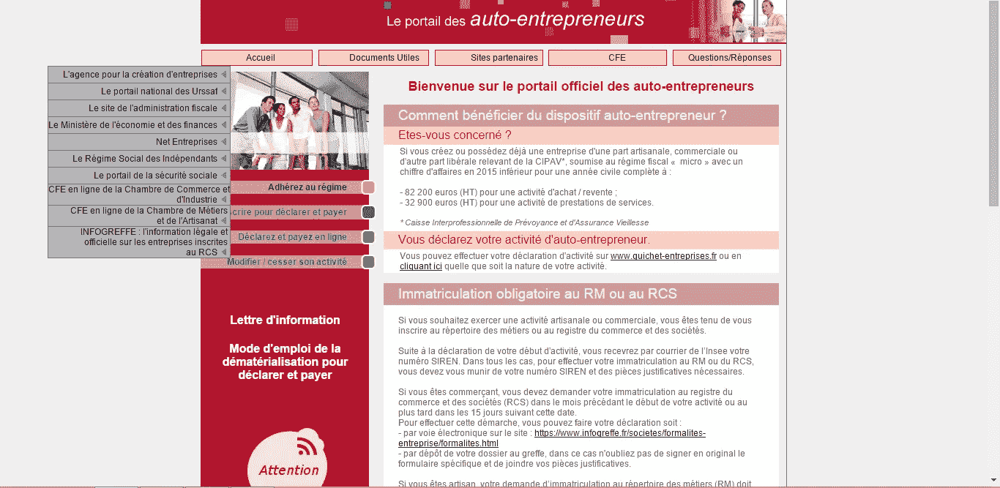
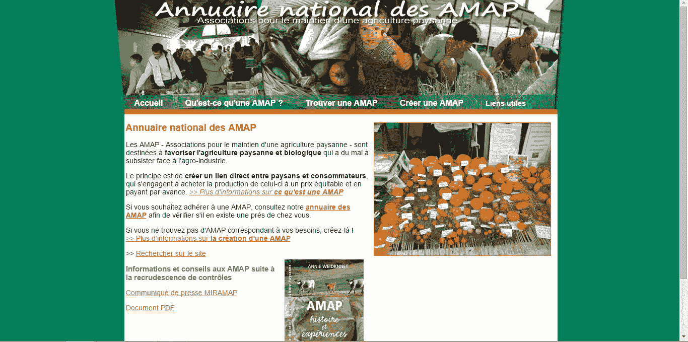
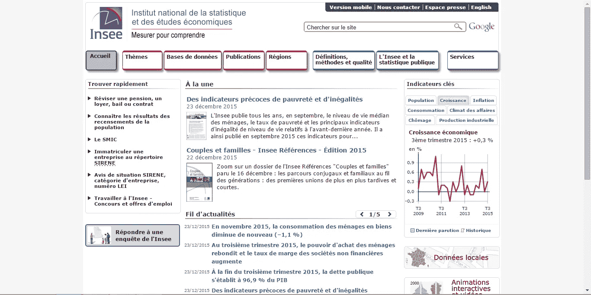

# 停止#DailyUi 开始#FixUi

> 原文：<https://medium.com/swlh/stop-dailyui-start-fixui-e685acc6858f>

Screenshot of the dribbble search “Dailyui”

在 Dribbble 的小世界里，每个人都是你的伴侣。一切都很棒，每个帖子都很干净(*和浮动*)。

这对设计师来说是好事。我们需要一个社区来认识我们的同行并分享我们的工作。
当我们不确定如何开始一个界面时，我们需要寻找灵感和例子。

## **然而**，

谈到可用性，Dribbble 不是一个参考。好多帖子都是**乌托邦**。

这没什么大不了的，但是当我们浏览时，我们需要记住 Dribbble 是用户界面的“艺术”平台。
这是一个合乎逻辑的演变，它不是为了共享一个设计过程，而是一个 800*600px 的图像。产品主要依靠社会认可，它是“设计师的 Instagram”。

我们在那里看到的大多数界面都是不现实的，因为我们都喜欢在周日下午发挥我们的创造力。
我们日常生产的大部分工作都是不可共享的。我们在有约束的情况下工作，并受到隐私限制。因此，偶尔，我们喜欢不受任何限制地设计一个假仪表板。

但是几个星期以来，我的 dribbble feed 被 daily ui post 垃圾邮件发送。

# DailyUi 是怎么回事？

如果你不熟悉 DailyUi，这是一个用户界面设计的挑战。

在 100 天内，您将收到一封电子邮件，其中包含要设计的界面元素。然后用#dailyui 这个标签在 dribbble 或者 twitter 上分享。

This is the first challenge you will receive

*看到这封邮件的问题了吗？没有用户解释，没有上下文，没有设备。*

目标是提高你的设计技能。

**而事实上却完全相反。**

这个挑战将训练你在 100 天内设计出理想的界面。没有最终用户的虚拟用户界面。没有可达性的意识。这个挑战让设计师去寻找美和美感，而不是训练他们的思维去解决问题。

你可能会在 Dribbble 上得到成千上万个赞，但不会培养你的设计意识和学会穿上用户的靴子。

创建界面时最大的挑战是以最有效的方式提出一个适合用户的解决方案。你需要进行研究，以了解他们的习惯、背景和对技术的熟悉程度。

如果你举上面的例子，当我读“注册”的时候，大约有一百个问题浮现在我的脑海里。

*   我们是在谈论社交网络用户吗？
*   是在街上的手机上？
*   是为了一个 Saas profesional app？
*   我需要从以前的产品导入数据吗？
*   网络呢，wifi，3G，低上网？
*   安全呢？
*   是给我妈妈的吗？
*   等等。

是我想多了吗？有点，证明我的观点。

但是，在我想到启动 Sketch 之前，我每天都在训练自己牢记这些问题。所以有一天它变成了完全的反射。就像我见过的每一位伟大的设计师一样。

# 新挑战:#FixUi

那么，你能做些什么来提高你的技能呢？有时候我有创作的冲动。但是没有主题很难开始。

嗯，幸运的是，有大量的网站和应用程序需要我们的爱。它需要一个更好的 UX 和界面，成千上万的人每天都在使用它，但是它的设计非常糟糕。有时是因为组织缺乏预算，或者他们甚至不明白互联网现在是个东西。

Right : lautoentrepreneur.fr

这些网站是法国人用来注册和管理他们的自由职业者身份的。法国大约有 98 万名自由职业者，这个网站的用户界面还停留在 21 世纪初。

[http://www.reseau-amap.org/](http://www.reseau-amap.org/)

这是一个将法国当地农产品与市民联系起来的协会的网站。这是一个非常著名的组织，在互联网上的知名度很低。

[http://www.insee.fr/fr/default.asp](http://www.insee.fr/fr/default.asp)

这是法国国家统计和经济研究所的网站，在这里你可以找到大量的数据和出版物。

# 选择一个，设计一些重要的东西

我很确定我们每天都会遇到这样的网站。正如 Christoph Ono 两年前在他的文章[中写的那样](/@gbks/interfaces-in-need-fa21105102c6#.nypo0ul8k)，我们可以做更好的设计工作。
与其重新设计一个著名的产品或创建一个无用的 UI 来获得一些喜欢，不如让我们找到一个真正的设计案例。

走出这一步，你将获得真正的设计技能，并在你的投资组合中有意义的项目。

你甚至可以联系组织并提交你的项目。想办法让它成真。从中赚钱。或者为了荣耀去做，反正你愿意花 100 个晚上去设计一个挑战。
与开发人员取得联系并开展合作。

作为一名设计师，我最喜欢的部分是，在一天结束时，我创造了一些东西。所以让我们试着让它变得有用，改进互联网。

## 感谢阅读！

***你大概有自己的看法吧？
随时评论或者 ping 我！***

*我的信息*

[*推特*](https://twitter.com/benjamin_berger)*——*[*滴溜溜*](https://dribbble.com/benjaminberger)*——*[*投资组合*](http://b-berger.com)*——*[*行为*](https://www.behance.net/lalalalalalala)