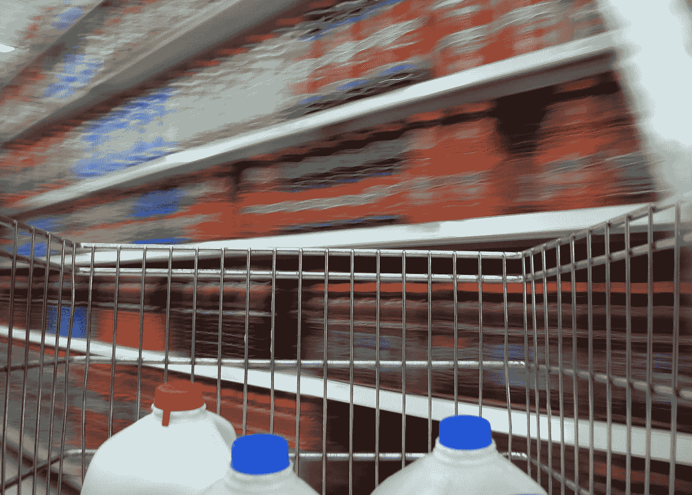
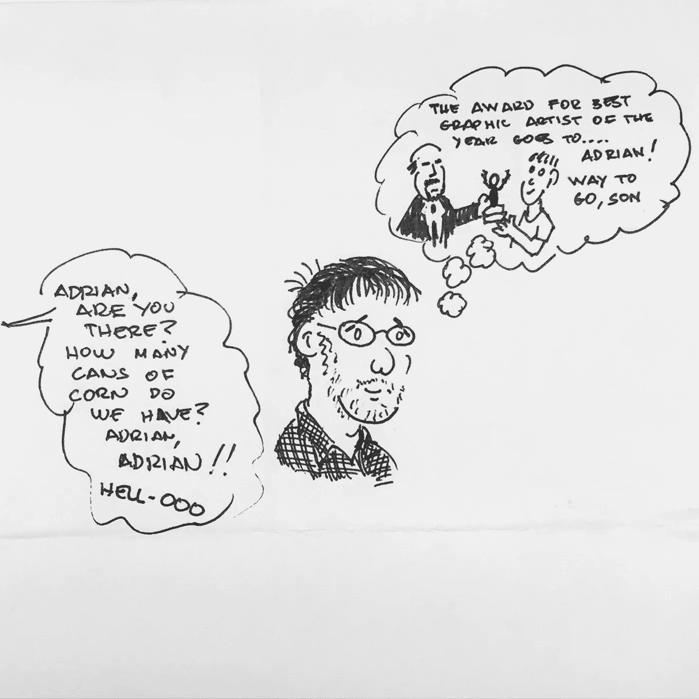
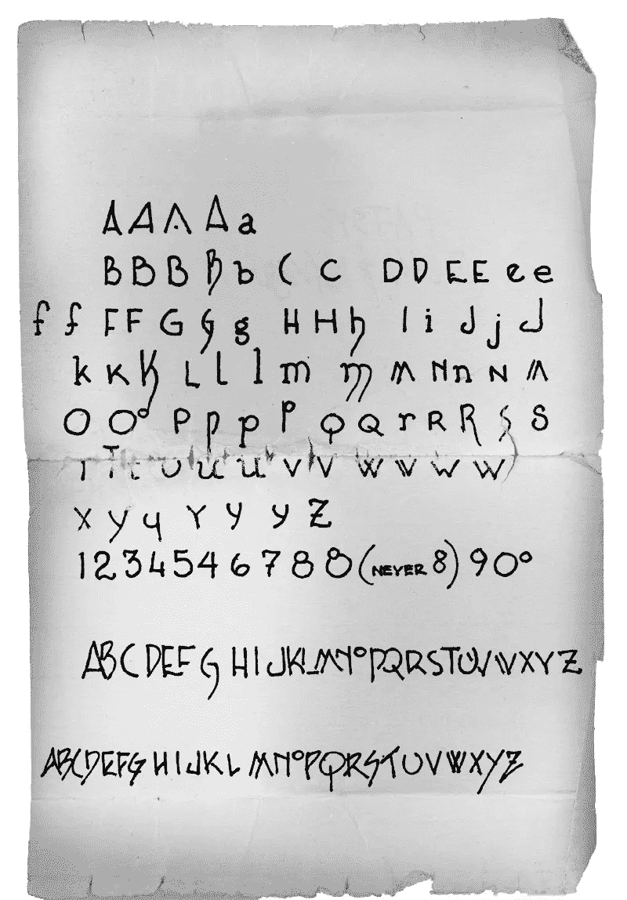
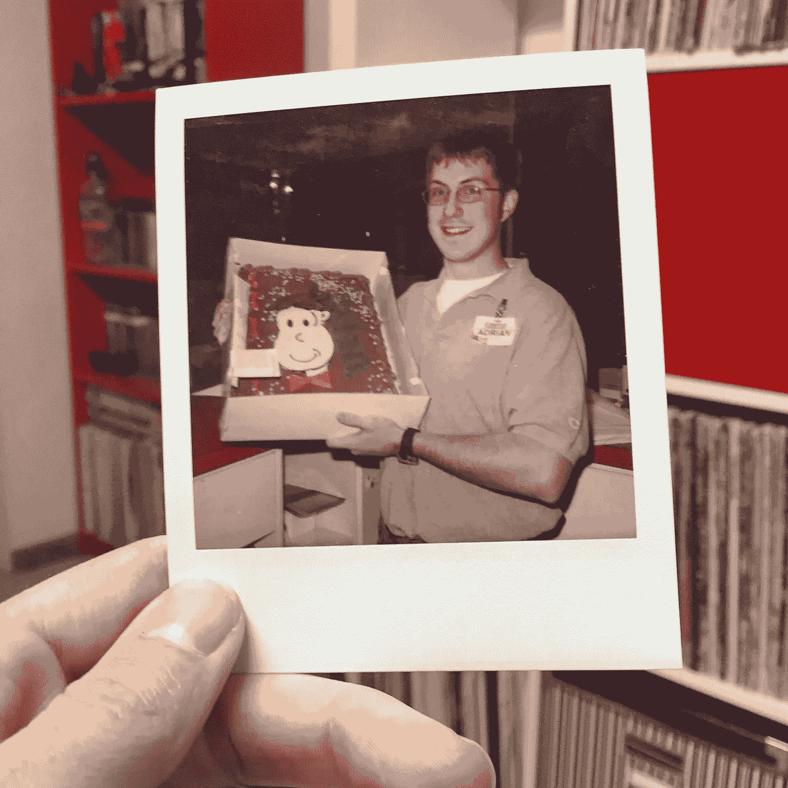

# 停止唠叨，在好市多接受设计教育

> 原文：<https://medium.com/swlh/stop-dribbbling-get-a-design-education-at-costco-2021f2dd704b>

## 像我这样的设计师的特殊地狱(第 4 部分)

在计算机出现之前的时代，保罗是芝加哥的一名商业艺术家，那时他还是一名设计师，还需要用沾有墨水的手指画画。不可预测的生活旋风将他从《广告狂人》中抽离出来，投入到执法部门的第二职业中。最终龙卷风把他从警车里吸了出来，扔在了好市多。

好市多是我们相遇的地方。我是一个非常想要我的第一份设计工作的人。保罗是世界上最有趣的人。我们一起是丹佛郊区零售仓库俱乐部的库存审计员。

日出之前，我和我的设计导师会拿着我们的写字板在洞穴般的过道里数着东西。这听起来令人难以置信的枯燥，但是想想这对一个设计专业的学生来说是多么令人惊奇的机会。

我可以无限制地接触到数以千计的产品，这些产品包含了来自世界各地的设计师的指纹。纯属巧合，我能够每天在一位设计行业资深人士的一对一指导下研究这个设计档案。

Paul drew this cartoon, teasing me for dreaming of a different life.

当我们不数玉米罐头的时候，保罗会从货架上拿一个产品来测试我。这个设计的优点是什么？为什么有些包装让人觉得高档，而有些却很普通？这是一件艺术完整性的艺术品，还是一架无人驾驶飞机的轻率之作？他给了我第二次教育。

忘记那些设计杂志、颁奖典礼、标志书籍和设计色情汇编。*那不是真的。如果你想学习设计，就去大卖场找份工作。在安静的时候上夜班，你的时间不会被雄心勃勃的经理审查。花时间研究产品。作为消费者，我们对这些东西不屑一顾，但很少思考。但这是真正理解设计的地方，而不是在 [Dribbble](https://dribbble.com/adrian3) 上。*

保罗和我喜欢研究标识。偶尔，我们会发现一个盒子上的所有标志集合在一起，纳斯卡风格。我们就每个标记的优点展开辩论，就好像它是一项竞赛的参赛作品，在这项竞赛中，我们是受人尊敬的裁判。经过仔细的讨论后，我们授予该标志业内最负盛名的荣誉。祝贺你，某个地方的某个无名仓库工人认为你的标志是热鼻涕。

Paul drew me this guide to help me improve my handwriting. I carried it in my wallet for years, which is why it is so ragged.

当我们不在车间清点产品时，保罗和我就做文书工作。保罗利用每一种琐碎的形式作为练习他完美书法的机会。

糟糕的设计形式与他优美的笔迹和精心选择的词语之间的对比令人震惊。当一个工人用这样的手艺完成一项卑微的工作时，这种不和谐是令人不舒服的。保罗喜欢玩弄这种社会规范。当他递给经理例行的库存修正文件时，它们非常漂亮。

他向老板挑战，骂他关心他人。他希望他们批评他在普通任务上投入太多精力。

如果你被要求做一份非人的工作，而你倾注了你的人性，那么你的老板就陷入了谎言。他被迫承认他提出的非人化的要求，以及你作品中表现的诗意。否则，你会因为固执而被解雇。保罗走在那条线上，我敬畏地看着。

保罗知道一些我不知道的事。不管你在哪里工作，好事多，五角星，还是警察。你完成的每一项任务都有可能成为创造性的贡献，让事情变得更好。设计不是少数专家在与普通人隔绝的原始真空中做的事情。我们可以选择诚实地工作，或者[走捷径](/@ade3/shortcut-addiction-9e7e8c622371#.3btyui4ft)。

事后看来，我很容易意识到，在从事设计工作之前，我有一个设计导师是多么幸运。当然，那时，我讨厌我的工作。好市多似乎与我的设计抱负相去甚远。当我最终找到一份平面设计工作时，我欣喜若狂。我工作了最后两周，切了告别蛋糕，和保罗说了再见。*殊不知* [*僵尸启示录*](/@ade3/art-of-the-living-dead-e5ecd9093ae7#.1llsndo53) *我正要进入…*

My last day on the job. Goodbye Costco, hello design career.

[第 5 部分:广告](/@ade3/special-hell-5-ad-diction-d14ed38cb9b5#.3n2l6v12b)

感谢阅读。如果你错过了我的*设计师地狱*系列的[第一部分](https://medium.freecodecamp.com/a-special-hell-for-designers-like-me-5c55bd855613#.xpgexsg0n)、[第二部分](/swlh/got-a-brand-problem-put-a-bird-on-it-4e99ec94af37#.z21yevwoy)或[第三部分](/@ade3/death-by-toothbrush-80496d19eab2#.udmrkncel)，请检查它们。一如既往，您的♥s、分享和关注是我一天中的亮点。保持创造力。