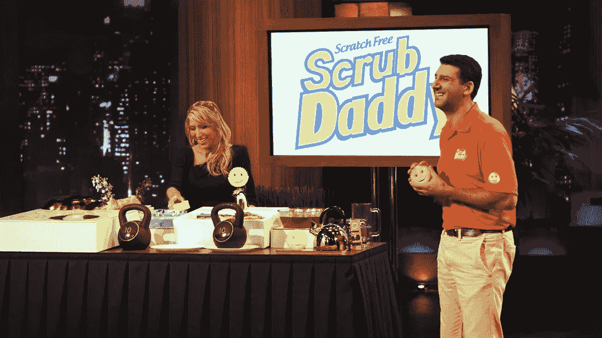

# 停止扼杀你的商业想法

> 原文：<https://medium.com/swlh/stop-killing-your-business-ideas-5cb89546fb35>

[](https://www.instagram.com/ramidheine/)

原始#5

在过去的几年里，我有很多商业想法。为了打造下一个优步，我一直在寻找这个想法。想着我需要找到以前从未被创造过的东西。

我的意思是，我有很大的抱负，如果我没有最独特和原创的想法，我怎么去实现它们，对吗？

不对。

那种认为你需要找到**这个想法**才能成就大事比如建立一个大而有利可图的企业的想法是不正确的。

这完全是视角的问题。从你这个雄心勃勃的人的角度来看，你会仰望脸书、优步和 Airbnb 这样的公司，认为建立类似的东西是获得高度成功的唯一途径。

但是你忘记了所有这些每年都有数百万销售额的公司。你甚至不会认为他们有任何销售的公司。

很长一段时间，我都不相信简单的想法能创造伟大的公司。有时它甚至不是一个想法，而是一个简单的产品，一些非常基本的东西。我经常说，*“没人会买那个”*或*“谁会看这家店？”*

我是个傻瓜。

当我开始看鲨鱼池的时候，我意识到我是多么的愚蠢。看到数以百计的业务建立在简单的想法或产品之上，并取得数百万的销售额。

一个很好的例子是 Scrub Daddy，鲨鱼池最成功的企业之一。自 2012 年以来，他的销售额已经超过 5000 万美元。



On the right Scrub Daddy CEO — Pitching his product on Shark Tank.

就在那时，我的视角发生了转变，我开始允许自己的头脑中有其他想法。我不再说*“没人会买这个。”*

最好的想法不一定是原创的或独特的。你只需要与众不同，正如我喜欢说的，你不必重新发明轮子。

有时候你甚至不需要与众不同。有些商家只卖花、玻璃或刀。然而，他们通过出售一些基本的东西来盈利。

重点是，不要低估企业。我们生活在一个大经济体中，每个人都可以从中分一杯羹。有些人会买一些你甚至不知道存在的东西，这是否意味着它是一个坏产品？不，这只是一个利基业务。

你有没有见过一个成功的企业，说我本可以想到这一点？我也是。

但我敢打赌，如果你想到了这一点，你就不会创建这个企业。不是因为你懒，而是因为你认为你的想法不会引起别人的兴趣。

我请求你，每当你有一个新的想法，不要说没有人会买它，只是因为你“认为”。

你怎么想并不重要。

市场很重要。

它由许多不同的人组成，他们购买非常不同的东西。

所以下一次，与其扼杀你的想法，不如尝试一下，测试一下市场，看看它的反应如何。

```
Thank you for taking the time to read. This post is part of a serie of daily post called "RAW"; I started writing daily posts to expose my content and receive feedback, so feel free to comment if you think anything is wrong. These daily posts are just my feeling at the moment, raw ideas fresh out of my mind.
```

[](https://www.instagram.com/ramidheine/)[](https://medium.com/swlh)

## 这篇文章发表在 [The Startup](https://medium.com/swlh) 上，这是 Medium 最大的创业刊物，拥有 318，120 多名读者。

## 在这里订阅接收[我们的头条新闻](http://growthsupply.com/the-startup-newsletter/)。

[](https://medium.com/swlh)