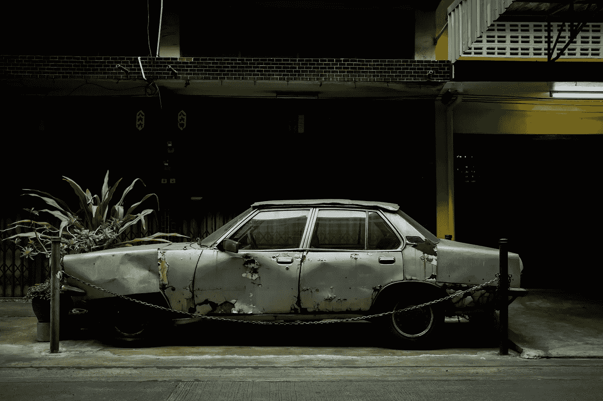

# 不要让仇恨者毁掉你的作品

> 原文：<https://medium.com/swlh/stop-letting-haters-ruin-your-writing-7231157a6f53>

一起肇事逃逸事故如何改变了我的想法

Photo by [Bob Jansen](https://unsplash.com/photos/uStq1x3_Pbk?utm_source=unsplash&utm_medium=referral&utm_content=creditCopyText) on [Unsplash](https://unsplash.com/search/photos/wreck?utm_source=unsplash&utm_medium=referral&utm_content=creditCopyText)

7 月 4 日对我的家庭来说是一个复杂的日子。

我们在房子周围享受了一个慵懒的早晨。我们玩游戏，吃午饭，准备去拜访我的父母，享受乐趣、美食和烟火。

我父母有一个游泳池，在佐治亚州 90 多度的烈日下感觉像天堂一样。当然，它不会…