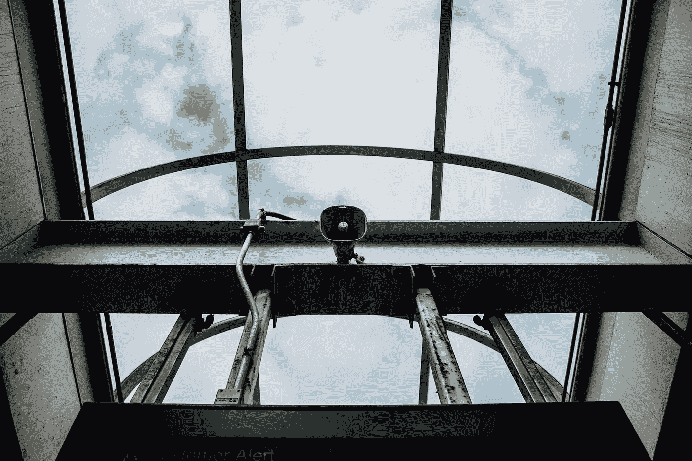

# 别再看那么多通知了

> 原文：<https://medium.com/swlh/stop-looking-at-so-many-notifications-74ad753471fc>

你的电话可能正在响。有什么新鲜事？你的银行发来的一条短信，一些你可能应该退订的随机简讯，你的天气应用试图向你推销一些东西，你最喜欢的免费增值游戏说一些城堡建设终于完成了。日复一日，你会在手机和电脑上收到成百上千这样的通知。当一个应用程序请求你允许发送通知时，我们都盲目地倾向于同意。

这些通知显然会分散注意力，它们大多是不需要的，但更多时候，我们只是把它们扫走，不去想其他任何事情。为什么不呢？毕竟，刷卡不到一秒钟。但是类似于越来越多的电子邮件简讯，我们每个人都没有时间退订，这是一个小时间投资将使你更有效率，并从长远来看腾出时间的情况。

即使解锁手机、阅读通知、刷走都需要 5 秒，浪费的时间也不是 5 秒。你还需要回到你以前做过的事情的最佳状态和思路(尤其是在工作中)，这可能需要更多的时间。即使只有几分钟，如果这种情况一天发生几次，你就会发现一年浪费了几个小时。没有好的理由。当然，如果你真的打开有问题的应用程序并开始做一些事情(例如，阅读你刚刚收到的活动邀请)，情况会更糟。

除此之外，我发现当我处于“最佳状态”时效率最高，可以这么说。这种情况在每小时和每天都会发生。如果我有一段连续不间断的时间，比如两个小时，这比中间有一个会议的两个一小时时间段的总和更有效率。好的工作周也是如此。如果我以某种非生产性或分散注意力的方式度过周末(或任何工作日)(例如，旅行日)，那么我会失去动力。自然，你不能期望所有的时间都是完美的连续和不受干扰的，但是你可以也应该尽你所能来减少你能控制的干扰。

所以现在就这么做:进入你手机的通知中心，一个一个地浏览所有的应用程序。我相信你会(像我一样)发现一大堆你根本不应该再拥有的应用程序。当然删掉那些。然后确保只有你想要的应用程序才会通知你。此外——进入你的“请勿打扰”设置，考虑为你的工作时间和晚上设置日程安排。

持续发生的分心和浪费时间的事情，即使每个单独的事件都非常短暂，也会随着时间的推移累积起来，额外扰乱心流。提前投入一点时间是很重要的，确保你可以随时摆脱这些。

我是住在纽约市的数码战略家和偶尔的摄影师。在 Instagram 上通过 **@andreikorchagin** 关注我，或者在 andreikorchagin.com[访问我](http://andreikorchagin.com)。

## 这篇文章发表在[《创业](https://medium.com/swlh)》上，这是 Medium 最大的创业刊物，有 293，189+人关注。

## 在这里订阅接收[我们的头条新闻](http://growthsupply.com/the-startup-newsletter/)。

