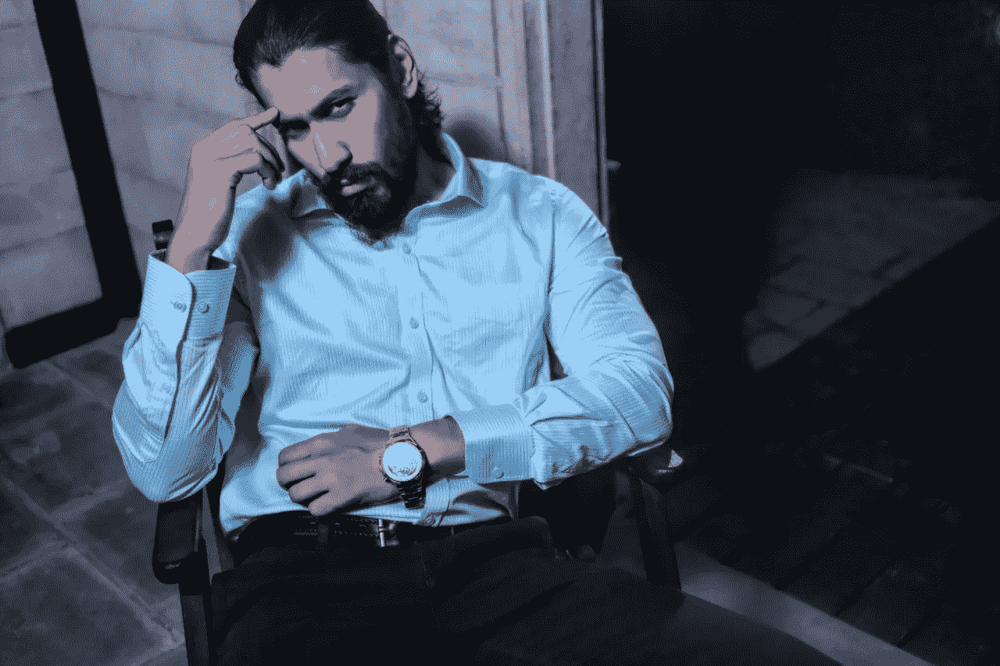

# 停止过度思考，开始行动

> 原文：<https://medium.com/swlh/stop-overthinking-and-start-doing-6105a42cbe>

几个月前，在一次包括大量航班延误和取消的国外旅行后，我有机会要求一笔巨额赔偿。

我所需要做的就是填写一份赔偿表格，然后寄给航空公司。

这份表格被立即打印出来，但在我们休假回来后的几个星期里，它一直放在我的办公室里，我有很多关于完成它的想法。

## 随之而来的思想风暴包括我的播放列表中的以下最爱；

他们永远不会认真对待我的要求。

我凭什么向一家全球航空公司索赔。

我的话与他们的相反(我必须证明延误的程度)。

你明白了。

我敢肯定，你有自己最喜欢的想法，这些想法会突然冒出来，破坏你可能要采取的任何行动。

我个人的想法如此令人信服，以至于我犯了一个错误，在网上搜索了从航空公司获得赔偿的人的百分比，这些数字相当可怕，所以我的决心没有改变。这些天来，我告诉自己，当我有时间或者不太忙的时候，我会去做的。

## 我花了整整六个星期才完成(一项最多花了一个小时的活动)。

在我寄出所有文件后不到十个小时，一则新闻报道宣布我刚刚写信的航空公司破产了。

那家航空公司是君主航空公司，确切地说，欠我的费用是一千二百英镑。

如果我早点填好表格，这笔费用就会安全地进入我的账户，就像许多其他乘客在之后立即提出索赔一样。

过多的思考和自我质疑是一项耗时的工作，除了拖延时间和不去关注当下之外，没有其他的好处。

## 《现在的力量》的作者艾克哈特·托尔说:

> 将当下作为朋友的决定是自我的终结。

我从未想过，在这家航空公司飞行了 20 多年后，它会倒闭。但确实如此。

它给我上了宝贵的一课；今天是我们所拥有的一切，把事情推掉，把事情留到以后，某一天，某一天，是毫无意义的，因为它就是做不完。

更重要的是，没有什么是永远存在的(即使是君主航空)。我们需要用双手抓住每一刻。

我们有一个机会去行动、执行和处理一个问题，但是我们经常太忙了，忙得什么也没有。忙碌的头脑常常是逃避的面具。我们等待自信的那一刻，等待自尊上升的那一刻，等待感觉更好的那一刻。

## 我们都有“待办事项”清单，对吗？

不如列一个“不要做”的清单——我必须感谢我的前任教练，他创造了这个短语，并让它为我而活。

如果我的“不要做”清单包括不怀疑自己，不等待合适的时机，不拖延，不被取悦的人摆布，那么现在肯定有时间完全专注地完成我的“要做”清单。

有多少次你想做某件事，但它被推迟了，没有真正衡量它什么时候会完成？为了那个完美的时刻，它被简单地推到了一边。

## 如果你只剩下今天，你会做什么？

更重要的是，通常困扰你一天的过度思考会发生什么？我想它会被推到一边。没有时间去培养它，所以你最好为重要的事情腾出时间。

我们需要找到阻止你做你想做的事情的核心，把它剥离到核心，而不是在裂开的伤口上再贴一层膏药。

## 那你想多了什么？

在你过度思考的播放列表中，总有一个想法凌驾于所有的想法之上，就像一群饿狼中的领袖。总有一个比其他人喊得更响。你知道它是哪一个，因为它是继续成为你和你想要的之间的绊脚石的一个想法。

慢下来，反思这一个想法。

《热爱现状》一书的作者拜伦·凯蒂提出了一个非常简单却有力的问题，这是我在指导客户时经常问他们的问题。

## 如果没有这种想法，你会是谁？

这种想法可能是“我还不够”，这意味着你在努力证明自己，或者像“我必须保持形象”和“没人喜欢我”这样的老话。

就像把蜘蛛网从阁楼里拖出来一样，这是清理你头脑中正在发生的事情的时候了。

大多数人认为分析这些想法就是答案，然而这种方法的作用是将想法保持在适当的位置，并使它们成为现实。仅仅因为一个消极的想法进入你的脑海，并不意味着你必须坐下来给它沏杯茶。

## 记住，你把茶包放在里面的时间越长，它就变得越浓。思考也是一样。

然而，你总是想以不同的方式体验生活。

教育家和心理学家迪肯·贝廷格博士指出:

> 我们对思想游戏的理解让我们在面对任何思想时，不管是爱还是悲伤，都能保持开放和接受。它自然地流过我们，然后一种更深的无条件的爱升起，拥抱所有的生命，它从我们身上流出，去感动我们周围的人。

我记得不久前指导过一个成功的女商人。在她的生意中，她有一个模式，在最开始取得惊人的成功，然后她会停下来。这意味着她最初达到了目标，但完成得很快，当她到达第一个障碍时，她已经完全筋疲力尽了。

她对待工作和工作进展的方式没有真正的流畅。虽然她的所有同事都会以更一致的速度继续职业生涯，但她最初会超过他们，然后陷入困境。

这就像开始 5 公里马拉松，在比赛的第一阶段投入所有的精力，然后感到筋疲力尽，无法再向前迈出一步。

这种模式在她的生活中一直存在，原因很简单，她运行的引擎是“我还不够”和“我需要证明自己”。这意味着她确实在做，但这一切都是由压力和焦虑驱使的。

她想太多了，这不仅不起作用，而且也不令人愉快。

我问她这个问题，

## 在这种想法出现之前你是谁？

她的脸变得柔和了，她嬉皮笑脸地笑着，开始告诉我她曾经是一个多么有趣的人，几乎就像她在说一个她曾经认识但现在已经消失在远处的人。

我的任务是把这个人引出来；也就是说，她真实的自己，在“我不够”的过度思考渗透进来之前的那个自己。

我们探索了给她的业务增加 1%的乐趣会是什么样。事实上，把更多真实的自己带入等式。她笑了，这是一个令人兴奋的前景。

她住在马耳他，所以我请她休息几个小时，去玩水上摩托，跳舞，甚至可能去上一堂冲浪课。重新发现并梳理出她隐藏在大量过度思考背后的有趣部分。

## 如果她要以有趣、轻松和放松的状态出现，她也会向她的团队展示这一点。

随着时间的推移，她开始将更多的乐趣融入到生活中，她注意到自己感觉更放松了，并且使用了不同的引擎(她甚至参加了桨式冲浪课程)。过度思考已经被过度放纵的娱乐时刻所取代，轻松带来了更多的创造力、可能性和笑声。成功商业思维的一大秘诀。

没有比这更复杂的了，它为她必须管理和激励的团队树立了一个伟大的榜样。

## 不知道为什么人们认为工作必须严肃、黑暗、复杂。

难怪人们在早上 8:30 在伦敦地铁站看起来如此痛苦。看看那些阴沉的脸，要么躲在地铁报纸后面，要么在打电话，玩各种游戏，让他们的思想触及一些东西，任何东西。

以谷歌为例，它是美国最成功的跨国科技公司之一。你可能会想象他们的工作空间很闷，因为技术不会带来乐趣、笑声或玩耍。

然而，谷歌在世界各地的办公室反映了它的理念，那就是“创造世界上最快乐、最有效率的工作场所”。

当走过谷歌办公室或校园时，你会发现一个令人眼花缭乱的游览区，包括游戏区、咖啡店、开放式厨房、带躺椅的露台，以及设计得像老爷车的交谈区。

世界上最成功的公司之一使用乐趣，而不是让他们的员工严肃或过度思考他们的成功之路。

这不是在精神上推行积极的心理或者总是快乐的，这只是简单地拥有这样一个事实，即我们一直生活在影响我们所做的一切以及我们如何与世界互动的思想中。

无论是要求航空公司赔偿，还是更严重的事情，我们的反应总是由我们的想法解释情况的方式决定，然后引导我们采取下一步行动。

## 你呢，过度思考在你的生活中是如何进行的？

## 如果这篇文章引起了你的共鸣，看看我的新书[看看里面:停止寻求开始生活](https://www.amazon.co.uk/Look-Inside-Seeking-Start-Living/dp/1781332959)。

## 如果你想和米歇尔预约 30 分钟的免费战略会议，以获得如何应对你面临的最大挑战的见解，[点击此链接。](https://calendly.com/micheleattiascoaching/30-minute-diagnostic-call/03-05-2018)

 [## 首页|米歇尔·阿提亚斯生活蔻驰&演讲者

### 你非常热衷于帮助他人。也许达到你的目标或成为一个人需要的时间比你想象的要长…

micheleattiascoaching.com](http://micheleattiascoaching.com/) 

## 这篇文章发表在[《创业](https://medium.com/swlh)》上，这是 Medium 最大的创业刊物，有 297，332+人关注。

## 在这里订阅接收[我们的头条新闻](http://growthsupply.com/the-startup-newsletter/)。

