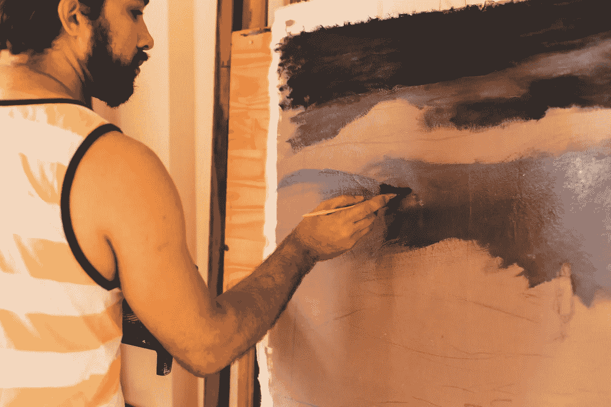

# 停止停顿，开始创造不可阻挡的动力

> 原文：<https://medium.com/swlh/stop-pausing-and-start-creating-unstoppable-momentum-fe17e4bb151a>

有一次，我很不情愿地被带到一位美国笔迹学家那里，让他分析我的笔迹。

我十几岁的时候一直住在国外，经常感觉不舒服，没有任何传统医生能找到真正的解释。血液测试和检查，导致我们没有进一步发现我的病源。

我的一个哥哥建议我去看一个叫做“Baruk”的笔迹学专家，而不是去另一个传统医生那里。

## 这令人难以置信，但我相信他，跟着他走了。

几天后，我发现自己走在一条狭窄的鹅卵石小巷里，当我抬头看时，挂着的洗手绳就像盘旋在我头上的云。我可以向你保证，那绝对不是哈利街。

我当时对这次相遇的期待是负零。

我把自己交给了一个我几乎不认识的人，对他的专业背景一无所知，但我对尝试新事物感到一丝兴奋。我们到达了街道的尽头，那是他的地址，敲了敲他的前门。

当我走进去的时候，感觉就像一只待宰的羔羊，我走进了我见过的最小的底层公寓。我哥哥选择在破旧的木制前门的另一边耐心地等待，因为多年的雨水，磨损和撕裂已经刮擦和磨损。

我记得这次相遇，仿佛就在昨天。巴鲁克是一个聪明、温和、非常自信的人，他仔细而有条理地分析了我的作品。令人难以置信的是，在接下来的几年里，他对我将如何出现在生活中的每一件事的预测都非常有意义。

## 对此我还是百思不得其解。

他当时告诉我，我的生活经历了停停走走。他邀请我想象自己坐在车里，一只脚踩油门，另一只脚踩刹车；来来回回，暗示着我似乎永远也到不了任何地方。

当时，由于年轻、缺乏经验和天真，这个预测毫无意义。我对生活了解多少？然而，我完全信任他，在我准备离开时，他扔给我的第二份重要声明改变了我的人生轨迹。

## “你需要离开你生活的环境，离开这个国家，它让你生病了。”

不要问我为什么，但在几天之内，我带着坚定和果断，收拾好行李，离开了中东，前往伦敦定居。

我当时得的病再也没有复发。

我不相信世界上最好的医院里有哪个医生能给我更准确的诊断或建议。

我提到这次与笔迹学专家的相遇，因为今天外面风在呼啸，雨在下，黑暗而寒冷，预示着伦敦一个典型的早晨。充满可能性的一周在等着我，但今天的动力让我想起了他的话，用汽车来比喻“启动和停止”。

我们都经历过一周中陷入僵局的时刻，当我们感到心不在焉，没有什么能让我们采取行动时，似乎没有什么能重新唤起我们的兴趣。一步接一步，这构成了一个运动，但仍然不确定方向，即使我们开始导航，覆盖地形，从一个地方到下一个地方。

## 这就是今天早上开始写作的感觉，我希望 Baruk 在这里分享一些智慧的话。

在我的日常写作习惯中，我会在辅导客户之前花一个小时写作。通常我坐在笔记本电脑的对面，毫不费力地埋头苦读，但尽管我努力想出正确的文章或开始的正确方式，文字还是没有涌出来，弄脏了页面。

相反，我的思绪回到了笔迹学家巴鲁克，所以今天的文章从他开始。

## 我决定写一篇完美的文章，只是简单地在开头写了一个小故事，是自发的，实时的。

作为一名生活教练，我已经和成百上千的客户打过交道，但我仍然缺乏自我激励。现在不同的是，我不再试图强迫自己摆脱它，也不再试图抗拒它。我只是顺其自然，并且明白有时候我太激动了，以至于我在 24 小时内做了相当于一周的工作。而在其他时候，推进一天的工作就像走在糖浆上。

## 艰难，粘粘的，让人精疲力尽。

所以我不会试图去对抗它，我只知道最终我的系统会重新校准，重新弹出，我会注意到它，因为事情会再次变得不费力。生活中有些时候，我们不得不停止抵抗，因为我们的内在系统会在一毫秒内自动纠正。除了见证它的展开，别无选择。

让我们面对现实吧，当一些感觉和情绪进入我们的世界时，我们会害怕。这让我们感到恶心和不舒服。像悲伤、沮丧、愤怒或挫折这样的情绪。我们一般不会用这些铺开红地毯，而是把它们推到侧门。我们花在抗争和摆脱这件事上的精力会让人筋疲力尽。

## 因此，它可能会停止和暂停我们的工作流程，就像它今天试图对我的工作流程所做的那样。

我的一位导师曾经告诉我，我们进入感情就像我们进入不同的房间。

理所当然，它们感觉不太好，所以为了避免它们，我们服药、饮酒并创造真正忙碌的生活，这样我们就不必直面这些感觉。我们认为他们是阴影，黑暗的一面，我们不想让他们进来。

## 《哈利·波特》、《指环王》和《霍比特人》都提到了这些。

我们不介意坐在电影中，购买他们的宣传材料，并前往这些电影创作的现场。但是面对我们自己的情绪完全是另一回事。

反思自己的人生。

哪些想法、感觉或信念阻碍了建立持续的动力？

找出并把他们带出去。

它们可能是“它需要完美”“它不够好”“它永远不会工作”，或者你的心态可能有一个更有创造性的对话。

因为我在写作时有一个计时器，为了确保我不会超时，我对那些试图破坏我写作流程的情绪和想法也这样做。我放置了一个计时器，发出信号只有三十分钟，那时我将会接受破坏性的想法/感觉，并练习完全投降。

我给它设定了一个时间框架，因为尽管我觉得投降很重要，但必须有一个时间限制。否则，我不仅会铺开红地毯，还会为他们提供欧式早餐和下午茶。这不利于任何像我一样想在事业上蒸蒸日上的人。

就像笔迹学家巴鲁克预测的那样，直到几年前，我都是走走停停，一只脚踩刹车，另一只脚踩油门。

学会理解我的心态，识别那些破坏我工作流程的想法和情绪，从而继续踩下油门。只有当我需要做一个比喻，呼吸一些空气，找到自己的方向时，才踩刹车。

## 加速器是我的工作模式，刹车是我思考时间的信号，这两种模式现在相互支持。

不久前，我有一个客户，他的生意陷入了财务困境，因为他没有建立起任何动力。我让他慢下来，并让激光聚焦在挡路的东西上。

我观察他如何行动起来，变得富有成效，但是当他有一个困难的想法、信念或感觉时，他开始消沉，没有动力，处于抑郁的边缘。他会经历这样一种自我怀疑的浪潮，以至于他会停止他正在做的事情。

## 这导致了不完整的提案，未完成的项目，以及一家慢慢倒闭的企业。

他觉得自己受到这些感觉的支配，会完全被吸进去，要么试图抵抗它们，要么被其影响吸进去，这耗尽了他所有的精力，没有剩下任何精力来变得有创造力或采取行动。

我让他给这种感觉起一个名字——他认为这是一个男性角色，就叫他“Mog”从那时起，每当这种感觉犁在他积极从事他的业务，他会告诉“莫格”他必须离开；他可以晚点回来，但现在不是时候。

和他一起创作很有趣，也很成功。

在认识到罪魁祸首的过程中，他开始创造一种有趣的元素，让自己在互动中发挥更大的领导力，而不是被动地被卷入其中。

## 我们不需要将这种感觉转化为积极的感觉，或者抵制它。

我们只是简单地识别它，给它一个名字，然后开始互动。不同的是，我的客户当时可以控制何时让“Mog”进出，而不是被它的影响所催眠，并因此失去一整天的工作。

这对他产生了巨大的影响，因为他开始启动一个项目，建立势头，继续，贯彻和完成他的项目，而不是受“Mog”的摆布。

作为一个多维度的人(而不是一个充气娃娃)，我们被赋予了许多不同的方面，思想，情感和感觉，它们会在一天中进进出出。它们没有错，没有坏，没有邪恶，但是完整生活的一部分就是体验这些感受。几年前，今天会是浪费的一天，我会停下来，放弃，留下一个不完整的工作。相反，我经历了阻力，克服了阻力，完成了任务。我相信笔迹学家 Baruk 会为我如何从开始和停止，到开始、继续和完成而感到自豪。

# 行动步骤:

找出妨碍你工作流程的想法/感觉或信念？如果你能改变这一点，而不是对感觉做出反应，你的生活会有什么不同呢？在 micheleattiascoaching@gmail.com 和我联系，让我知道。

## 如果这篇文章引起了你的共鸣，看看我的新书[看看里面:停止寻求开始生活](https://www.amazon.co.uk/Look-Inside-Seeking-Start-Living/dp/1781332959)，现在亚马逊上有售。

 [## 首页|米歇尔·阿提亚斯生活蔻驰&演讲者

### 我的方法是量身定制的，以结合教练，深入的心态工作和生活设计，出生…

www.micheleattiascoaching.com](http://www.micheleattiascoaching.com/) 

## 这篇文章发表在《T4》杂志《创业》(The Startup)上，这是 Medium 最大的创业刊物，有 320，924+人关注。

## 在这里订阅接收[我们的头条新闻](http://growthsupply.com/the-startup-newsletter/)。

