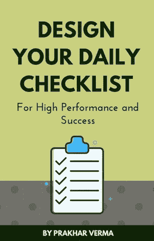

# 停止依赖外部动机。以下是如何成为每天忙碌的内在动力。

> 原文：<https://medium.com/swlh/stop-relying-on-external-motivation-become-intrinsically-motivated-to-hustle-every-day-f79be0e9552f>

五年前，我想健身。

所以，我加入了一家健身房。我付了会员价，准备好去摇滚了。

> 我很兴奋。我想象着几个月后我的身体会发生怎样的变化。

第一天很有趣。我全力以赴，感觉自己像个超级英雄。

第二天很痛苦。我身体酸痛，不想去健身房。但是我还是用我的意志力去了健身房。

第二天更加痛苦。所以，我在又一天的训练前休息了一下。

当我下次去健身房的时候，事情就不一样了。

> 它不再那么“有趣”了。我不觉得自己是超级英雄。

> 我讨厌健身。我甚至讨厌去健身房的想法。几周后，我退出了健身房。

这是很多人的故事，他们满怀热情地想要开始新的生活，但在失去动力后又放弃了。

今天，我比以往任何时候都更健康。我已经健身四年了。锻炼身体是我生活的一部分，我真的很享受。

> 我相信你至少有一件喜欢做的事。它可以是任何东西——写作、编程、设计、营销、绘画、唱歌、演奏乐器、烹饪等等。

其他人可能会觉得这很难或很无聊，但你无法想象没有它的生活。

**那么，这里有什么不同呢？**

> 不同之处在于，当你从本质上开始享受某件事时，你就很容易继续做下去。你不必用意志力去坚持做你喜欢做的事情。

当你开始一件新的事情时，你可能不会立刻喜欢上它。你会经历困难的部分，你可能会有放弃的冲动。

**在这个阶段，你需要胡萝卜加大棒。这意味着你可以用奖励(胡萝卜)或惩罚(大棒)来维持纪律。如果有人或一个团体能让你负责任，即使你讨厌这个过程，它也会帮助你继续努力。**

这是所有的教练，挑战，奖励系统或花哨的应用程序可以帮助你在艰难的时候磨。

> 但是你不能永远依赖这些系统。你必须爱上这些行为，让它成为你生活的一部分。当你出于爱去做事时，你会享受生活，同时也会有所提高。

所以，以下是你如何成为生活中任何你想做的事情的内在动力。

Edward Deci 和 Richard Ryan 创建了一个内在动机系统，并称之为自我决定理论。它有三个部分——自主性、能力和关联性。

丹尼尔·平克在他的《驱力》一书中谈到了类似的理论。他称驱动力为——自主、精通和目标。

这两种理论是相似的。将这两者结合起来，我们就有了内在动机的四个关键驱动因素:

1.  自治
2.  精通
3.  目的
4.  关联性

# 自治

自主就是自由。这是你可以自由地用自己的方式做事的时候。

在了解了健身的基本要素后，我设计了自己的健身计划。我喜欢计划我的训练，因为它给了我以自己的方式训练的自由。

现在，我也在写东西。我在写我想写的话题。我正在学习如何写出精彩、吸引人的内容，但同时，在写作过程中，我也在为自己写作。编辑过程就是我想你(读者)的时候。

允许工作中的自由。掌握主动权，打破常规，用自己的方式做事。

# 精通

我们都喜欢做出色的工作。当我们注意到进步，看到积极的结果，我们不想失去它。

健身几个月后，我不仅仅是为了增肌或减脂。我从做健美操的人那里得到了灵感。他们能控制自己的身体，所以我的目标是控制自己的体重。后来，我还参加了重量训练和其他类型的健身掌握(平衡，速度，机动性，灵活性等。)

你得有自己的目标。如果你不喜欢在跑步机上跑步，找一项你能掌握的体育活动来看看你的进步。

当我在提高写作技巧时，我会定期写作和学习。我不想成为一个普通的作家。我想掌握这门手艺。每次我写作，我都和我以前的作品竞争。

因此，跟踪你的行为或技能，让你的进步引人注目，并以精通为目标。

# 目的

目标是你灵魂的燃料。当你有一个强烈的目标时，放弃不是一个选项。你为什么要这么做？

我锻炼的原因是我想让我的身体看起来感觉良好。我想尽我所能使用我的身体。我想在避免疾病的同时，活得又长又活泼。

我写作的原因是我想表达自己，并对你的生活产生积极的影响。我想让世界变得更美好，因为我在这里。为了找到你，我必须掌握我的手艺。

你的目标背后的目的可以是有意义的，也可以纯粹是为了快乐和内心的平静。挖掘你的深层目的，尽可能多的问自己“为什么”，直到找到核心意义。一旦你找到你的目标，定期提醒自己保持动力。

# 关联性

人类是群居动物。我们都知道。然而，我们常常试图成为一只孤独的狼。我们都需要联系感和归属感。一个社区或几个朋友可以提供你实现目标所需的爱和支持。

在一个网络时代，为你想要实现的任何目标找到一个志同道合的人的社区要容易得多。如果你在周围找不到志同道合的密友，那就通过社区交网友。追随你所在地区的领导者。他们可以充当你的虚拟导师。每个利基市场都有一个博客。

与人交流，提供帮助，寻求帮助，获得灵感，给予和接受反馈。尽一切努力找到志同道合的人，但不要一个人去。

> 如果你想走得快，就一个人走。想走远，就一起走。—非洲谚语

当你与其他人一起完成目标时，你不仅会享受这个过程，还会创造一个持续成长的环境。

## 结论

如果你想成功并享受这个过程，你需要的不仅仅是胡萝卜或大棒。自主性、掌控力、目的性和关联性将帮助你发展内在动力。爱上日常琐事，享受生活中的每一天。

# 成功是日常行动的结果…

为**高绩效和成功**设计你的每日清单。[点击这里下载](http://bit.ly/daily-success-list)你的免费拷贝。

[Get Your FREE Cheatsheet](http://bit.ly/daily-success-list)

## 这篇文章发表在 [The Startup](https://medium.com/swlh) 上，这是 Medium 最大的创业刊物，有 317，629 人关注。

## 订阅接收[我们的头条新闻](http://growthsupply.com/the-startup-newsletter/)。

