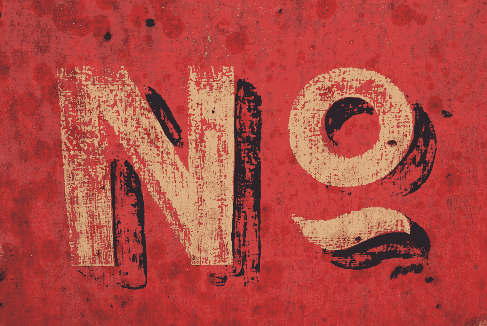

# 不要只是为了表示友好而说“是”

> 原文：<https://medium.com/swlh/stop-saying-yes-just-to-be-nice-1c5d02f4c405>

前几天，我的朋友向我借了 1500 美元的照相机。

我还没有回复她的信息，但这将是一个*不*。我不想做个混蛋，但我不想冒这个险。

我曾经对几乎所有的事情都说好。除非我觉得我有一个“合法的”借口来逃避某事，否则就是“是”。当我想说不的时候，我总是感到内疚。

*“他们会认为我很卑鄙。”，或*

*“他们不会想成为朋友”，或者*

“就破例这一次吧，”我对自己说。

在我同意了不管是什么之后，我会感到虚弱，给自己打气，以建立拒绝下一个请求的勇气。

我会对各种不便说“是”,比如……凌晨 3 点开车送朋友去机场，明知前一天晚上我必须工作到很晚。

有一次，我答应了一个室友，她让我带她的宠物狗进我的公寓。我不希望那里有任何宠物，后来当地毯上满是她从未用吸尘器清理过的狗毛时，我不得不把脚放下。

开始变得有压力了- *说好，当我想说不的时候*。我与朋友和家人的关系受到了影响。我觉得他们在占我的便宜，事实也的确如此，但这是我的错。

我决心改变我的行为。

所以…

我“升级”到先说“是”，但后来我会说“没关系，这实际上是一个不”来收回这句话。“不”就在我嘴边，但我第一次没说出口。这和说“是”一样糟糕，如果不是更糟糕的话，因为这会让我看起来不可靠。

**谢天谢地，挣扎了这么久，我*终于*搞定了。**

不，抱歉，我今晚不能出去。我已经筋疲力尽了，但我希望你玩得开心。”

“不，我不能免费为你写那篇论文，但我可以为你写，只要 XXX 美元。”

**或者仅仅是**

“不，抱歉，我去不了。”

不一定要复杂。

我仍然会帮助别人，但现在只是偶尔为之，而且绝对不会妨碍我的优先事项。

我明白了当我说不的时候…

# 他们会找到另一种方法。

## 我从来都不是最后的选择。

我的朋友通常会先来找我，因为他们已经认为我会答应。我让他们轻松了。但是，让他们另辟蹊径也没什么。有些人需要一个“不”。通过总是说“是”,你可能实际上是在帮助那些只需要“弄明白”的人。

相信我，他们会没事的。

# 他们不愿问我同样多的问题。

一旦我开始说不，我的朋友来找我帮忙时就更加小心了。他们会把它隔开更多。

如果你一直说“是”,你会不断地被炮轰，而且会变得势不可挡。

# 现在我可以专注于我自己的优先事项。

我朋友的优先事项不断成为我的优先事项，这意味着我真正需要做的事情受到了影响。

既然我知道了何时以及如何说不，我就可以专注于我需要做的事情。

# 令我惊讶的是，我没有失去任何友谊。

当我说不的时候，我脑子里的想法比实际要大得多。大多数时候，朋友会说，“好的，我明白了”。

*——*有道理。如果有人因为你拒绝帮忙而大发脾气，他们可能不需要成为你圈子的一部分。

每段关系都需要边界，而建立边界取决于你。

*是时候停止给自己增加负担了。*

当你能帮忙的时候就帮忙，但是如果你不能，就说“不”。

感谢您的阅读！❤

如果你喜欢这个帖子，请不要忘记**鼓掌。**

你想要我为你写作吗？

访问我 [**这里:**](http://www.aleeshalauray.com)

想看看我还在做什么吗？？

打招呼:

[**insta gram**](http://www.instagram.com/aleeshalauray)**|**[**推特**](https://twitter.com/aleeshalauray) **|** [**脸书**](https://www.facebook.com/AleeshaLauray/)**|**[**YouTube**](https://www.youtube.com/channel/UC-Pz9gmpYAH0sMExmiC628w?view_as=subscriber)

## 这个故事发表在 [The Startup](https://medium.com/swlh) 上，这是 Medium 最大的创业刊物，拥有 295，232+人关注。

## 在这里订阅接收[我们的头条新闻](http://growthsupply.com/the-startup-newsletter/)。

