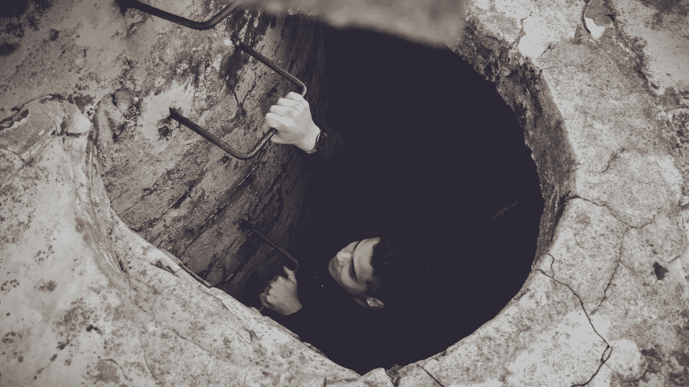

# 阻止高级雇员出错。

> 原文：<https://medium.com/swlh/stop-senior-hires-going-wrong-571b01a02e3d>

在商业中，有两种类型的灾难；

1/你正走着，突然毫无征兆地掉进了下水道。

或者；

2/你有点迷路了，发现了一些火车轨道，你知道这些轨道最终会把你带到文明世界。你走了好几天。有一天，你听到一种隆隆的声音，但什么也看不见。过了一会儿，铁轨开始唱歌，你想，最好小心火车。第二天你转过一个拐角，发现一个隧道，看到火车从隧道里出来，你被抓住了。

错误地聘用高管无疑是第二种灾难。

高级雇员是探路者。他们用自己的经验、学识和智慧来补充你现有的知识。你雇佣他们是因为你需要比你更了解这个主题的人，来帮助你做出更好的决定和塑造企业。

高层招聘关乎战略和执行；没有战略你就无法执行，因为这是第一位的；对你应该前进的方向有一个长远的看法。

这通常(或者应该)是对一个简洁的业务目标或者至多是一个(小的)目标集合的响应。这是一个商业目标的例子。

“我想降低我的产品的(每月)运营成本，这样我就能接触到更多的客户。”

> 战略包括深入了解**你在哪里**和**你需要去哪里**。

对和你在一起的人应该寻找任何误会，由你的学长雇佣，关于**你在 的地方；无论是做了什么，还是做这件事的人的能力。换句话说，拟议战略的基础是否牢固。**

***你需要到达的地方*** 是由许多小步骤组成的，这些小步骤一起带你到达你的目标。

确保你理解整体的努力，以及实现每一步的渐进努力。这是你的预算，这个策略符合你的预算吗？

最重要的是，您如何衡量执行风险，并在处理意外事故、灾难和失误的过程中提供额外的灵活性。

这种执行风险，以及衡量进展的能力，是你对第二类风险的防御，也就是对身体的快速训练。

不要低估前瞻性规划的重要性，不要让自己被诱惑去把这件事委托给你的高级雇员。如果你对增量目标没有某种程度的敏感、感性、亲密的了解，你怎么能询问进展并感到舒服呢？

根据我的经验，任何形式的非平凡策略都充满了可变性。外部事件(例如，您的高级架构师在工作开始时离开)将会被指责为进展缓慢、没有进展、估计的努力不足等等。

你需要了解什么是真正不可预见的问题(掉进一个本应被盖住的人孔)，以及在一个深思熟虑的计划中应该有什么意外情况(预计在这段路上必须缓慢移动，以防丢失人孔盖)。你不应该代表你的高级雇员四处张望。

简而言之，在你熟知的计划的执行过程中，强制执行有形的、可测量的进度检查点。

把你的眼睛放在球上，责任和义务应该很容易被发现，但是有时候在一个能言善辩的高级职员身上很难发现这些的缺乏。

从根本上说，这是一种平衡行为；一方面，你希望将责任、努力和执行委派出去，这样你就可以继续做你能增加更多价值的工作。另一方面，你需要足够接近细节，这样你就可以在计划中的问题变得严重之前发现它们。

总而言之，确保你的雇员有一个从正确的当前环境开始的策略。它具有处理某种程度的可变性的灵活性。

你可以衡量它，并对细节有足够的了解，以建立有意义的检查点(你是在授权，而不是推卸责任)。

最后，要小心缺少执行的所有权。具体来说，你在寻找可论证的横向思维，以及解决问题的能力，而不仅仅是向上升级。

## 这篇文章发表在《初创企业》杂志上，这是 Medium 最大的创业刊物，有 355，974 人关注。

## 订阅接收[我们的头条新闻](http://growthsupply.com/the-startup-newsletter/)。

