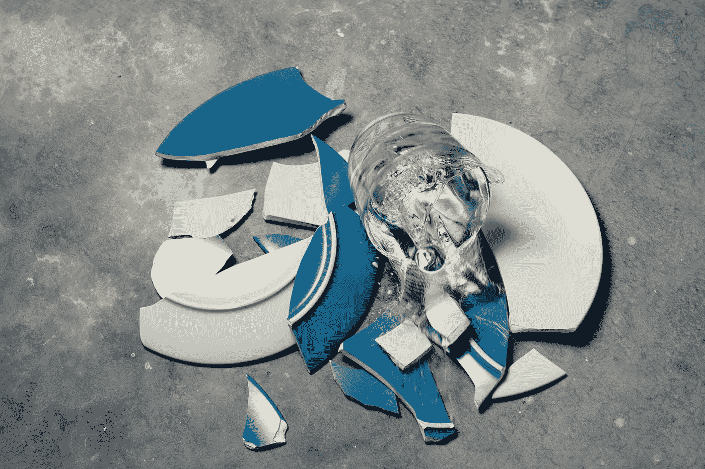

# 不要认为错误是成功的障碍

> 原文：<https://medium.com/swlh/stop-thinking-of-mistakes-as-barriers-to-success-907a0ccc8bc5>

## 这里有 3 种利用错误推动你前进的方法

Photo by [chuttersnap](https://unsplash.com/photos/5jqSxgQ6TD4?utm_source=unsplash&utm_medium=referral&utm_content=creditCopyText) on [Unsplash](https://unsplash.com/search/photos/mistakes?utm_source=unsplash&utm_medium=referral&utm_content=creditCopyText)

你犯过错误吗？

如果你说不，你在撒谎。

> 没有人能一直做好。这完全没问题。这是人类的一部分。

活得好的关键是看清错误的本质。

但是首先，让我们看看是什么阻碍了你。

# 你把失败从一个事件变成了一个人。

当你在学校的时候，你必须偶尔参加一次考试来证明你在听和学。

如果你错过了超过 50%的答案会怎样？你怎么看出来的？那次考试分数会失败还是你会失败？

**那个测试不应该有能力定义你的整个人生，不是吗？**

一个错误也不应该。

最有可能发生的事情就是人们把你和那个不幸的事件联系在一起。但事件仍然不是你。你可以做其他事情，你可以在这些事情上取得成功。

# 你关注的是不该做什么，而不是该做什么。

当你专注于你想要避免的事情时，你会一直感到害怕。

*如果我搞砸了怎么办？*

如果我违反了规则怎么办？

如果有人不喜欢我做的事情怎么办？

而这仅仅是开始。

> 你最好去发现需要做什么，然后去做。你可能会遇到问题，但你不必在问题发生前就做出反应。

# 错误是老师。

如果你这样看，生活中的任何事情都可以成为学习的经历。

当你上学的时候，老师的目的是教你正确的做事方法。他们可能会允许你在尝试的时候犯错误。为什么？因为他们知道你会从错误中学到比教科书更多的东西。

你从实践中学到的总是比从阅读中学到的多。

> 测试你所知道的，自己去看。你可能会发现你的老师是对的。但是你也可能知道他们并没有告诉你整个故事。

把自己的错误当成老师，而不是折磨者。

# 错误是反馈。

成功和失败是一样的。

两者都是结果。

> 仔细看看你的结果。他们告诉你你的方法有多有效。你达到目标了吗？太好了！你是怎么做到的？你能用同样的方法再做一次吗？

错误给你同样的信息。什么不太管用？我怎样才能改变它，让它下次还能工作？我能和经历过成功的人交谈吗？那个人能告诉我什么能帮助我对我的流程做出正确的改变？

当你收集完数据后，开始用它来前进。

# 错误不一定要成为情绪上的噩梦。

让我们面对现实吧。处理一个错误需要几分钟时间。

当羞愧伴随着错误而来时，你会变得情绪化。没关系。你是人类。当你被生活或被另一个人刺伤时，你会很痛。

> 帮你自己一个忙。限制你花在思考错误上的时间。如果有必要，你可以考虑一会儿。分析一下。从中吸取教训。然后带着你学到的东西继续前进。

当你这么做的时候，你并没有否认你的感觉。你给了他们发泄的自由。有一个可以倾诉、交谈和思考的朋友会有所帮助。如果你没有，现在就去找一个。

之后，你会感觉更好，可以勇敢地向前迈进。

# 错误是生活的一部分。

当你计划一次旅行时，你必须走完每一英里才能从你所在的地方到达你想去的地方。

> 错误是你在任何旅途中都会犯的错误。你可能会看错路标，在转弯时偏离了方向。你可能不得不停下来上厕所，浪费时间。你可能会认为你比实际上走得更远，当你发现你还有 4 个小时的车程时，你会感到失望。

当你走捷径时，你可能会节省时间。话又说回来，你可能会因为错过太多步骤而花费比你想象的更长的时间。

错误是生活和成长的一部分。接受吧。不要害怕它。当他们来的时候处理他们。

这是每个人——无论大小——在生活中必须做的事情。

**所以，勇往直前，全力以赴。你会前进的。挫折过后你会很快反弹。你总会找到一些你可以用来实现目标和梦想的东西。**

Get started now. Your future is waiting.

## 这篇文章发表在《T4》杂志《创业》(The Startup)上，这是 Medium 最大的创业刊物，拥有 337，320 多名读者。

## 在这里订阅接收[我们的头条新闻](http://growthsupply.com/the-startup-newsletter/)。

