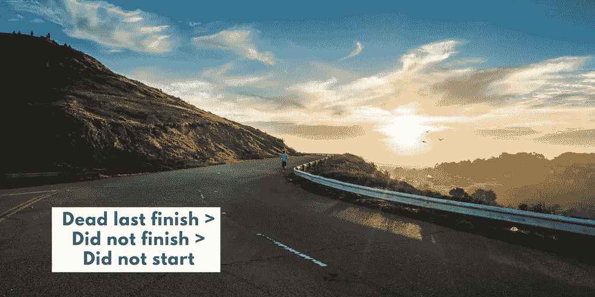

# 停止思考，开始行动，打破思维僵局

> 原文：<https://medium.com/swlh/stop-thinking-start-moving-and-zap-the-mental-gridlock-312dd801fb83>

我给这张照片的标题是:本周关注床垫。开始吧。开始任何事。动起来。

开始和移动不是懒惰的补救措施。它们是被卡住的补救措施。

太多时候，我们用几种方法来解决我们头脑中的问题。首先，我们没有在真正的问题上努力；我们在研究一种症状。第二，我们相信我们应该能够独自做到这一点。那就是我们的头脑是有益无益的。我们的华尼拉·艾斯自我尖叫道:“如果有问题，我会解决它。”(是的，我知道这是一个 28 岁的文化参考)。结果，我们陷入了优柔寡断的循环，质疑我们的智力、解决问题的技能和足智多谋。

排除一切干扰，自己解决问题是有价值的。它可以增强我们的毅力、批判性推理和学习的灵活性。然而，当我们的大部分想法转向反对我们的时候，我们就越过了极限，我们把它变成了个人的。为什么我不够聪明？够快吗？够好吗？够创意？够敏捷吗？在这一点上，休息一下，稍后再回到这个问题上来。

当这还不足以打破僵局时，可以考虑以下想法:

1.改变你的环境。调灯光，换音乐，开/关百叶窗，搬到另一个房间，去图书馆，坐在外面。简单的场地调整往往会有所不同。

2.**保持身体活力。做一些对你身体有一点或很多推动的事情。千斤顶就位。带着笔记本走路。去停车场散散步。沿着这条街走一英里。找一个有长椅的公园。去跑步。**移动你的身体**。**

3.保持精神上的活力。问不同的问题。你会告诉你的孩子或伴侣如何处理这个问题？删除列表中的所有选项，并创建新的选项。练习放大和缩小你的问题。如果你把注意力放在树叶上，看不到更大的背景，那就缩小到森林里。如果你对森林的关注阻止你用可解决的术语定义问题，放大树。改变视角有助于打破虚构的界限，创造新的可能性。如果一个局外人做了你的工作，他会怎么做？如果他们不是来自你的行业呢？**动动脑子**。

4.不要执着于一个答案。我们生来就喜欢确认我们认为正确的事情，而不会问一些不确定的问题来挑战这些信念。我们的确认偏见阻碍了做出有效的决定。例如，许多组织衡量员工和客户的满意度，并花费 90%的时间试图提高前两个框中的满意度。越来越少的公司花时间去研究到底是什么驱动了底层——这是不满意的一个重要指标。

5.设定、写下并分享一个目标。当我需要跑步而日历上没有比赛时，我很可能会推迟。当我在未来三个月参加半程马拉松时，我会在 99%的时间里跑步，因为我知道每周英里数是我有机会享受无损伤赛事的唯一途径。作为奖励，我从来没有完成过跑步，很抱歉我选择了它而不是沙发。一个书面的目标，尤其是与他人分享的，会让我们前进。势头紧随其后。

顺便说一下，这些想法对团队和我们每个人都适用。但是如果你的徒步旅行在一家 Philz 咖啡店结束，领队会买单。

**外卖:**我们都卡住了。当我们注意到我们内心的声音开始反对我们时，这是一个移动我们思想和身体的信号。每一个动作都有力量帮助我们改变焦点，摆脱困境。

## 行动呼吁

*您可以访问我们的网站* [*这里*](https://davidporteradvisors.com) *了解更多关于戴维·波特顾问的信息。你准备好了我们就可以谈了。*

## 这个故事发表在 [The Startup](https://medium.com/swlh) 上，这是 Medium 最大的企业家出版物，拥有 296，127+人。

## 在此订阅接收[我们的头条新闻](http://growthsupply.com/the-startup-newsletter/)。

