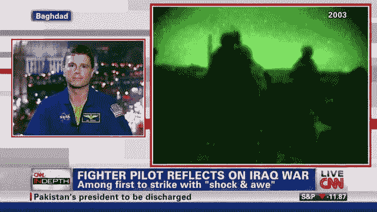

# 别再相信媒体了！

> 原文：<https://medium.com/swlh/stop-trusting-the-media-549784beed48>

广告业是一个年收入十亿美元的行业。毫无疑问，钱赚了，人们被洗脑了。让我们通过传播基于真正的好奇心和倾听意愿的积极开放的话语来阻止它。

[world-visits.blogspot.com](http://world-visits.blogspot.com/2013/12/christmas-times-square-in-new-york-city.html)

# 关于广告的统计

*   普通人每天会看到大约 3000 个广告(包括广播、Instagram、脸书、YouTube、新闻、电视等)。)
*   到 25 岁时，普通人会看到 200 万个广告
*   1 小时的电视节目有 25-30%是广告

[boston.com](http://boston.com/news/globe/obituaries/articles/2006/04/30/john_kenneth_galbraith_writer_economist_dies)

加拿大出生的经济学家约翰·肯尼思·加尔布雷思说，从理论上讲，民主国家应该可以自由创作广告，因为法律自由允许言论自由。

然而，在实践中，和大多数情况一样，商业垄断了媒体和广告，因为这是高收入来源。

如果人们购买某些产品，他们会得到幸福的承诺；如果他们努力工作，购买“正确”的东西，他们会得到“美国梦”的承诺。

# 说服与操纵

公司发现说服人们购买他们的产品是一种无效的方法。看起来更有效的方法是通过让你受到**有意的潜意识操控**来迫使人们购买你的产品。

想想可口可乐以及他们如何开始在所有的瓶子、易拉罐和卡车上使用“热情”的红色。或者当非裔美国人因受到美国执法部门的虐待而成为公众关注的焦点时，百事可乐如何在广告中使用肯达尔·詹娜。或者考虑在广告中使用性。你明白了。这太明显了。

加尔布雷斯的结论是，媒体正在扭曲人们的需求。他们在创造它们，而不是满足我们的自然欲望。

> 自由市场+广告=一个不再与民主同步的经济体系。

# 为什么说服是一种困难的广告方法

[www.signkick.co.uk](https://www.signkick.co.uk/blog/beginners-guide-to-outdoor-advertising/)

在我们的一生中，我们都以不同的形式经历过这种情况。

最近，我因为在推特上为山姆·哈里斯辩护而被称为种族主义者，因为他因为批评伊斯兰教和其他事情而被指控为种族主义者。

人们意识到说服一个人接受一种观点是多么困难，尤其是当你无法看到这个人或与他们面对面交流的时候。

想象一下，如果销售者不知道你是否看过广告，那么向你销售产品会有多困难。

CNN 和福克斯新闻频道出于类似的原因，多年来一直在打意识形态战。他们正在与一个人面对的问题作斗争，这个人面对的观众是看不见的，比我们人类历史上任何人遇到的都要多。

# 新闻如何赚钱并留住观众

新闻媒体有两种明显的方式来吸引观众:

1.  舒适
2.  兴奋

## 舒适

如果你很自然地同意一个观点(乔纳森·海特等认知心理学家在其他地方有益地讨论了原因)，你不必运用任何批判性思维来反驳你的观点。

另一方面，如果你在听新闻，遇到你不同意的观点，那就需要努力找到答案和被采访者不正确的原因。

> 对于我们同意的观点，我们需要“低级”证据，对于我们不同意的观点，我们需要“高级”证据。

## 兴奋

[www.cnn.com](http://www.cnn.com/2016/07/05/europe/chilcot-report-iraq-war-families/index.html)

在 CNN 报道伊拉克战争期间，CNN 获得了数百万的浏览量，因此从广告和赞助商那里获得了令人难以置信的巨额资金。

这同样适用于特朗普的总统任期。CNN 报道特朗普越多，他们的观众就越多。他们不能报道重要的事情，因为那些不一定是被关注的事情。

想想 *YouTube* 上的 *Beme 新闻*。

 [## Beme 新闻

### BEME 还活着！2018 年 2 月 22 日更新。

www.youtube.com](https://www.youtube.com/channel/UCY0YIply-je0EhSWLgpftVw/featured) 

这是他们制作的最后 4 个视频:

*   *在巴尔的摩最危险的地方长大*(关于种族主义)
*   *大家对大麻的看法都不对*
*   这些药片会让你变得更聪明吗？
*   *美国与中国的 AI(人工智能)战争*

他们的报道实际上是体面的，不包括骂人和公开关注特朗普(或歇斯底里的新闻)。普通人正转向这些类型的新闻媒体，因为它们的脚踏实地的性质和不偏不倚的吸引力(在缺乏政治赞助商和政党的意义上不偏不倚)。 *Beme* 是一个例外，因为我相信他们目前仍然归 CNN 所有，但生产似乎几乎不受公司主要管理层的控制。

# 小型媒体公司与大型媒体公司

CNN 和福克斯新闻频道是大型媒体机构，雇佣了很多人。实际上，他们是大公司。

大公司有责任将利润最大化，以便向赞助商、股东提供回报，并实现公司首席执行官和首席运营官的美国梦。

**因此，**

> 假设大多数大型媒体公司认为利润重于真相是完全合理的。

在这个过程中，他们正在对普通人进行洗脑，让他们不那么批判性地思考，确认偏见，促进偏执，并继续分化这个国家(间接地分化这个世界)。

这只会导致进一步的种族主义、无知和缺乏开明的言论，而这正是我们 T21 在民主社会中迫切需要的。

不要看新闻了。如果你让我知道你在听什么播客，或者 YouTube 频道提供了替代资源。顺便说一句，警惕这些也是好的；)—那是另一篇博文。

由于期末考试，我已经离开媒体一段时间了。很顺利！它从明天(星期五)开始，持续到星期二。五天四场决赛。我计划以后几乎每天都发表故事！

**祝我好运吧！**

## 在你走之前…

**🗣Connect 跟我上** [**推特**](https://twitter.com/JakubFerencik) **，或者**[**insta gram**](https://www.instagram.com/jejjejfercak/)**。**

*如果您觉得这篇文章有帮助，请点击*

下面的按钮 ( *记住它可以达到 50 次鼓掌——如果你慷慨地使用那个鼓掌按钮，那就帮了我大忙了；)* ) *或者分享一下脸书/* [***推特***](https://twitter.com/JakubFerencik) *上的文章，如果你想让你的朋友们从某种程度上受益的话。*

我写这封信是为了让你继续思考，让我感恩和反思。干杯干杯干杯，下次见，

继续反思。

## 这篇文章发表在 [The Startup](https://medium.com/swlh) 上，这是 Medium 最大的创业刊物，拥有 318，120 多名读者。

## 在这里订阅接收[我们的头条新闻](http://growthsupply.com/the-startup-newsletter/)。

