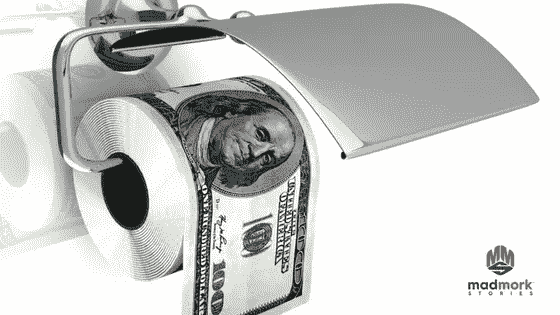
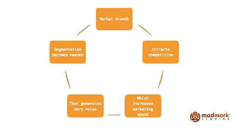
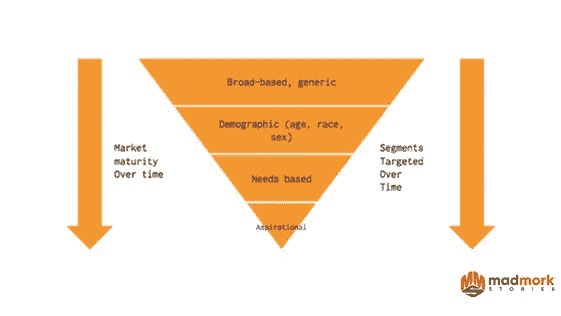
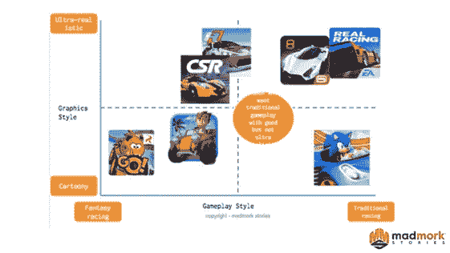

# 停止浪费营销资金！

> 原文：<https://medium.com/swlh/stop-wasting-marketing-dollars-4e3254e0c55a>

在硅谷，人们常说产品为王。作为传统营销的四个 P 之一，那当然是真的。但如果产品为王，营销就是女王，我不止一次看到最令人沮丧的事情是，拥有伟大产品的公司因为营销糟糕而惨败。我也不是在谈论他们的产品视频、网站或手机应用的质量。我说的是他们无法与正确的人交谈，或者告诉那些人他们真正需要听到的。

作为一个在创业公司工作并指导创业公司 CEO 超过 10 年的人，我经常看到营销预算被浪费和公司失败的原因可以归结为缺少三个简单的字母:

**S**

**T**

**P**

不要与性病混淆，它可以影响任何人，无论他们是否从事营销工作；)STP 代表**细分、目标和定位。(** [**推特本**](https://ctt.ec/6PZH0) **)**

要在当今竞争激烈的 24–7 全天候在线数字营销、病毒式视频和社交媒体的世界中竞争，公司将很难取得成功，除非他们能够成功掌握这一框架。

**什么是 STP？**

**S =分段**

为了正确识别你的目标受众，你首先要细分你的市场。这包括将你的市场分成可识别的群体或目标人群。细分的关键是选择与你的目标客户最相关的变量，更重要的是，选择你可以竞争并赢得**(**[**)Tweet this**](https://ctt.ec/d76a7)**)**。

例如，对于企业对消费者的产品，这些变量可以是:

表示“作用”

-种族

-位置(例如，城市与农村)

-教育

-家庭收入

-一些其他行业特定变量(例如，在移动电话中，可能是屏幕尺寸或相机质量)

细分很重要，因为随着市场的增长，它们变得更具竞争力。在任何新的市场周期开始时，参与者都很少。然而，一旦一些玩家开始开发市场，抓住消费者并创造价值，市场将吸引新的玩家，反过来，这些玩家将争夺这些用户并试图占据市场份额。随着新玩家的加入，营销成本增加，每名客户的盈利能力下降。

**你细分工作的目标和产出应该是:**

1.建立划分市场的标准。将市场分成不同的小组，了解每个小组的规模、价值、增长和动态。

2.确定每个细分市场的重要性，并了解竞争对手正在应对哪些细分市场。这将有助于你确定他们的弱点，以及你的业务是否有机会。

3.确定某个细分市场是否有未满足的需求，您可以用现有产品或新产品来瞄准这些需求。您还需要评估您是否有足够的资源(产品、人力、资本)来满足该细分市场的需求。

如果你想了解更多关于细分市场的信息(例如，你需要哪些信息来开始，或者哪些公司可以帮助你进行市场调查以获得这些数据，请查看我的幻灯片 [**这里**](https://www.slideshare.net/pmork/mms-stp-framework-how-to-reach-the-right-customer) )。

**T =瞄准**

既然你已经对你的受众进行了细分，那么是时候找出你可以服务的需求未得到满足的最佳细分市场了。

在考虑关注哪个目标受众时，请记住以下标准:

1.市场上已有的产品真的不能满足目标市场吗？更重要的是，这种需求是他们愿意为之买单的严重痛点吗？

2.目标市场是否足够大或增长足够快以提供可持续的收入流？这个目标市场能盈利吗？

3.服务这些目标受众是否符合贵公司的愿景、使命和品牌价值观(见我的 [**关于打造品牌圣经的帖子**](https://www.madmork.com/single-post/2017/05/11/Why-every-startup-needs-a-Brand-Bible) **)** ？

4.如果有的话，你需要对你的产品/服务做什么样的改变来服务这个市场？做出这些改变的代价是什么？

5.为了服务这个市场，你需要进行什么样的组织变革(例如，雇佣更多的销售人员，增加更多的客户支持)？你的公司能承受这些变化吗？

6.您对这一目标市场有多了解？你还需要做哪些额外的研究来成功地向他们推销产品？(希望你在细分市场时已经做到了这一点)

7.竞争对手转向服务这个市场的难易程度如何？进入的障碍是什么，它们是否可持续？

重要的是要记住，目标市场会随着时间的推移而变化。你在公司旅程开始时追求的受众可能在 3-5 年后就不一样了。有一种方法可以考虑这个问题:

在新的市场中，你需要广泛定位你的产品，以获取尽可能多的客户并收集客户数据。然而，随着市场的成熟，你需要开始细分你的市场，你的目标必须更加集中。最初，您可能会根据某些人口统计因素(如年龄、种族和位置)来确定目标，但随着市场的不断发展，您将会寻找某些更具体的需求。最后，在竞争激烈的市场中，你将更加注重与客户建立情感联系，并试图让他们在使用你的产品/服务时思考和感受某些事情。最强大的品牌与消费者有着如此强烈的情感纽带，以至于消费者甚至不会考虑替代品，即使它们的价格明显更低(比如苹果、耐克、可口可乐和亚马逊)。

因此，下面的例子可以很好地概括您的细分工作和目标确定的结果:

在这个例子中，芬兰手机游戏制造商 Rovio 决定进入竞争激烈的手机赛车游戏市场。他们决定利用《愤怒的小鸟》的特许经营权，以一种更加独特和差异化的方式进入市场。传统上，手机赛车游戏侧重于图形和游戏性。市场上的顶级玩家试图制作既超逼真的图形，包括所有顶级，高端汽车品牌，也具有复杂和现实的游戏。相反，Rovio 采取的方法是设计一款本质上更卡通、更有趣、更真实的游戏。他们选择使控制更简单，而不是像 CSR 和 Real Racing 等其他游戏那样专注于特许汽车。它们还包括一些功能，例如一种独特的游戏模式，允许拥有实物愤怒的小鸟雕像的用户通过将这些雕像放在手机的摄像头上来解锁游戏中的角色。结果是一个古怪、有趣、简单的游戏。虽然像 CSR 和 Real Racing 这样的游戏追求的是传统的核心玩家，即 18-24 岁的男性，他们寻求图形和现实的游戏，但 Rovio 专注于更年轻(8-13 岁)的年轻男性/女性玩家群体，他们想要一些有趣、简单和独特的东西。

结果:仅在安卓系统上,《愤怒的小鸟 Go》迄今已有超过 5000 万次下载，超过 EA 的真实赛车 5 倍，与市场领导者 CSR racing 不相上下。

**P =定位**

我们框架的最后一部分是定位。一旦我们确定了我们的目标受众，我们需要制定一个定位声明，给消费者一个令人信服的理由来尝试或购买我们的产品。

定位是:“营销人员试图在消费者心目中建立鲜明印象的方式。"( [**鸣叫本**](https://ctt.ec/8fa7h) )

康奈尔大学的道格·斯泰曼认为，理想的定位陈述是:

1.简单易记，专为您的特定目标受众设计

2.清晰、明白无误地展示你的产品是独一无二的

3.可信；即。它能兑现对用户的产品承诺

4.是独一无二的，可以拥有的

5.充当未来营销计划/产品的路标

6.是开放式的。也就是说，它给你留下了成长的空间，不会限制你的未来。

那么，你如何将这一点应用于竞争激烈的摩托车市场呢？例如，只要看看哈雷戴维森的“生而为美国人，选择叛逆”定位就知道了。这句话完美地抓住了哈雷戴维森的精髓，同时也遵守了上述 6 条关键规则。此外，看一眼哈雷，他们只是尖叫“反叛”的核心。

其他一些著名的定位陈述包括:

*   目标:符合预算的风格
*   沃尔沃:对于高档美国家庭来说，沃尔沃是提供最大安全性的家用汽车
*   家得宝:自助者的五金百货商店

最后一点要考虑的是，定位声明也可以从负面重新定位你的竞争对手，同时让你的产品看起来更优秀。例如，“终极驾驶机器”不仅将宝马定位在一个优越的位置，而且间接让消费者认为竞争对手根本没有那么好。沃尔沃的定位声明也是如此。通过宣称他们是最安全的，他们也暗示其他人不那么安全。

作为创始人、首席执行官或营销主管，从来没有比现在更好的时机、更好的工具、更多样的渠道来以独特、个性化和强大的方式接触客户。但是，如果你一开始就瞄准了错误的受众，或者即使找到了正确的受众，但却给了他们错误的信息，你只会继续做今天许多营销人员可悲地做的事情:把营销资金冲进马桶。

所以，为了你的员工、股东和像我一样厌倦了在错误的时间被错误的产品和错误的信息瞄准的消费者，给自己一些 STP，并把它做好。你会卖出更多的产品，取悦更多的顾客，甚至可能为地球节约一些水资源。

如果你喜欢这篇文章，别忘了注册获取更多关于市场营销、创业和如何拥有强大职业生涯的有价值的内容。也可以随意点赞，分享，评论。谢谢！

疯狂默克

首席说书人

## 这篇文章发表在《T4》杂志《创业》(The Startup)上，这是 Medium 最大的创业刊物，有 303，461+人关注。

## 在这里订阅接收[我们的头条新闻](http://growthsupply.com/the-startup-newsletter/)。

