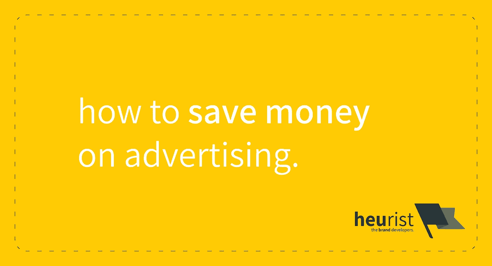

# 不要在广告上浪费你的钱

> 原文：<https://medium.com/swlh/stop-wasting-your-money-on-advertising-1bade7e64e26>

*本文出现于 2018 年 9 月 17 日*[*【www.heurist.com.au】*](https://www.heurist.com.au/2018/09/stop-wasting-money-on-advertising/)*。*

我最近问了一个脸书的小企业团体，他们是否积极地为他们的企业做广告。而一般的回答是——***是的*** 。人们会的。他们当然知道。事实上，一个人的答案是:

> “…除非我想依靠客户推荐，否则我必须积极推销我的业务以赢得新客户。”

别误会，我不反对 ***营销*** 人民企业。我甚至不反对 ***广告*** 。我反对 T21 在广告上浪费金钱。

# **有什么区别？**

你看，科特勒等人[1]将“营销”定义为:

> **营销**:'[盈利地]识别和满足人类和社会需求的[行为]'。

相比之下，广告的定义(再次由科特勒等人)是:

> **广告**:“由特定赞助商对理念、商品或服务的任何非个人展示和推广的付费形式”。

因此，根据这些定义，很明显营销和广告是密切相关的。广告的存在是为了帮助促进满足人类或社会需求的行为。因此，我将“在广告上浪费金钱”定义为:

> **在广告上浪费金钱**:“在没有正确确定适当的人类需求来满足的情况下，为推广想法、商品或服务付费的行为”。

在下一节中，我将详细介绍 ***人们是如何在广告上犯下*的错误的。****

**

# ***广告是如何浪费你的钱的。***

*想想看——当你投放广告时，你是在为聚光灯付费。你在引起别人的注意。你支付 ***而不管*** 你投放的广告是否能让你得到你想要的结果。*

*我的《脸书邮报》告诉我，大多数评论 ***的人通常会做数字广告***——通过脸书广告、Instagram 广告、Twitter 广告和其他点击付费(例如 Adwords)广告。就使用这些媒体的成功率而言，经历过成功的人之间有着明显的差异:*

> *"脸书广告帮助我们达到了 6 位数的百万分率."*

*还有那些，嗯， ***没了*** :*

> *"实际上，我尝试了一会儿 FB 广告，但没有得到足够的关注."*

# ***什么给出？***

*这些数字广告平台非常吸引人。截至 2017 年(在美国)，脸书的平均每次点击成本(CPC)约为 1.10 美元，开展一场数字广告活动并不需要花费太多。*

*总之，看起来是这样。*

*现在，这引发了以下问题——至少在脸书，你是在为你做广告或试图推广的页面的每次点击付费。提示产生的问题:*

> *“当然，我得到了一些喜欢，但喜欢并不总是产生投资回报*【投资回报】*。”*

*这就是问题所在。有多少人喜欢并忘记了一页？或者更糟的是，喜欢它，但将页面通知完全静音？*

*你付钱让人们浏览你的网页。你甚至不能保证得到一个喜欢的，更不用说倾向于 ***购买你卖的*** 或者甚至***与你*** 交往。*

*看到问题了吗？*

*当你做广告时，你付钱是为了让别人看到你。 但是你不能确定人们 ***看到的*** 一定会转化为更多的销售或更多的参与(或者你衡量成功的标准是什么)。换句话说， ***你无法确定*** 你的广告会有任何正的投资回报。你唯一可以确定的是，如果你的广告没有达到你想要的效果，你就在赔钱。*

*不幸的是，在广告上赔钱很容易，而让你的广告有效却很难——事实上，无论你做什么，你都不能保证你的广告有正的投资回报。你能做的最好的事情是最大化你获得正投资回报的可能性。在下一节中，我将向您展示如何做到这一点。*

# *如何在不浪费金钱的情况下做广告*

*一个词。**策略**。有了适合你的业务和你的受众的战略(和计划)，你就会变得 ***【花费更少】******收入更多*** 。*

## *用策略帮你省钱。*

*我们 Heurist 遵循一些原则，让营销变得简单。其中最主要的是:营销的过程可以分为三个步骤(假设你已经确定了一个需求并开发了一个产品或服务来解决它):*

1.  *确定 ***与谁*** 交谈(即你的目标受众)。*
2.  *确定 ***要告诉他们什么*** (即你的消息)。*
3.  *识别 ***在*** 哪里找到他们(这样你就可以 ***向他们宣传你的消息*** )。*

*有了这三个步骤，你就会确切地知道你投放的任何 ***广告*** 应该说些什么，以及你应该把它放在哪里，这样你就有最大的机会获得你想要的结果。*

## *让我们来分解一下。*

*解决*与谁交谈基本上是一个挑战，即确定*是你还是你的产品 ***解决了******谁*** 能从中受益。我的意思是，谁是特定的年龄、性别群体？某个社会文化群体？一个经济集团？然后这些受益者就是 ***【谁】*** 。***

**现在， ***有什么消息*** ？你需要传达以客户为中心的 ***利益*** 的信息，以便人们与你接触[1]。这决定了你如何展示你的想法、产品或你正在宣传的任何东西——你将告诉他们的*“什么”。必须向观众展示，使用你的产品，他们可以获得利益，他们可以 ***联系*** 并因此 ***渴望*** 。***

**既然已经有了 ***【谁】******【什么】*** ，那么就可以定义 ***【哪里】*** 。这可以说是最难的部分。然后你需要找出你的信息在哪里会被你的听众最好的听到，这样你就能产生最大的影响。对于大多数预算紧张的企业来说，广告的主要位置通常是在数字平台上，如脸书、Instagram、Twitter 或谷歌。为了找出你广告努力的重点，我恳请你访问并在 Statista 上创建一个免费账户。Statista 提供了许多方面的统计数据，但与数字广告最相关的是各种社交媒体平台上的人口统计和使用数据。例如，[这是美国脸书用户的年龄和性别分布](https://www.statista.com/statistics/187041/us-user-age-distribution-on-facebook/)。或者更有趣的是，[美国青少年对社交媒体的使用](https://www.statista.com/statistics/250172/social-network-usage-of-us-teens-and-young-adults/)。有了这些唾手可得的信息，你现在对 ***有了一个大致的了解，在那里*** 你可以做广告，以便能够接触到你的信息所针对的*。***

***有了这三个步骤，你的广告工作现在有了 ***策略*** 它需要 ***最大化*** 它的能力来让你获得正的投资回报。***

# **那么，你应该从这篇文章中学到什么呢？**

**如果你在做生意，你可能已经有了解决需求的产品或服务。如果你正在读这篇文章，你可能想知道你是否在广告上浪费钱，或者你正在寻找如何更有效地做广告的技巧。我的建议如下:**

*****检查你的目标受众。*** 你有明确的定义吗？如果没有，那就想一个——你需要确切地知道你在和谁说话，任何广告努力才能成功。**

*****查看您的消息。*** 是否以客户为中心？目标受众能认同吗？你需要确保无论你做什么广告都对你的目标受众有内在的吸引力。**

**继续做广告，但要挑出“在哪里”。数字平台的伟大之处在于它们允许极高水平的[观众选择性](https://en.wikipedia.org/wiki/Targeted_advertising)。 ***用它*** 。《社交媒体考官》提供了一个关于如何使用脸书受众细化工具的优秀教程。同样，[这里有一篇文章](https://www.forbes.com/sites/forbescommunicationscouncil/2018/01/29/seven-steps-to-ad-targeting-perfection-on-the-google-display-network/)是关于如何在谷歌上更有效地定位你的广告。你使用这些工具越多，越熟悉它们，你就越能控制合适的人是否能听到你的信息。**

**基本上，如果你遵循这些步骤，你将极大地增加从广告中获得你想要的结果的机会，而且你在广告上浪费金钱的可能性也越小。**

# **参考**

**[1] P .科特勒，K. L .凯勒，s .伯顿，*营销管理*，第 1 版。法国森林:澳大利亚培生教育，2009 年。**

**[2] H. Jack Rotfeld，“购买广告时间和空间的背后是否有策略？，" *J. Consum。马克。*，第 24 卷，第 3 期，第 131-132 页，2007 年。**

**[3] S. T. Cavusgil 和 S. Zou，“营销战略——绩效关系:出口市场风险企业的实证联系研究”， *J. Mark。*，第 58 卷，第 1-21 页，1994 年。**

**[4] S .邹和 S. T. Cavusgil，“GMS:全球营销战略的广义概念及其对企业绩效的影响”， *J. Mark。*，第 66 卷，第 40-56 页，2002 年。**

****

## **这篇文章发表在 [The Startup](https://medium.com/swlh) 上，这是 Medium 最大的创业刊物，拥有+369，262 人关注。**

## **在这里订阅接收[我们的头条新闻](http://growthsupply.com/the-startup-newsletter/)。**

****